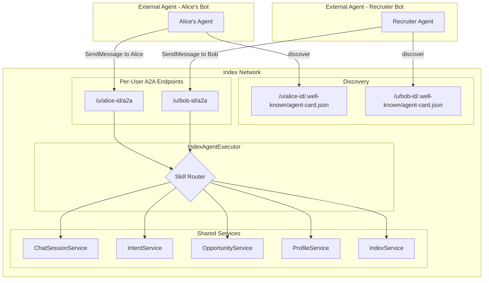
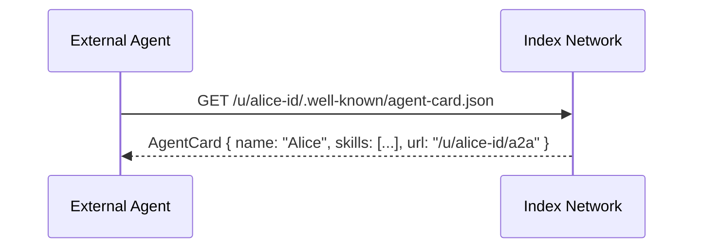
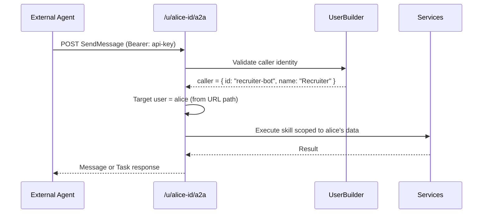

# A2A External Gateway -- Per-User Agents

## Core Idea

Every Index Network user IS a discoverable A2A agent. External agents find a user's Agent Card, learn their skills (intents, expertise, interests), and interact with them -- negotiate opportunities, exchange intents, or chat.

This is peer-to-peer agent communication mediated by Index Network.

## Architecture




## Per-User Agent Card

Each user's agent is discoverable at:

```
GET /u/{userId}/.well-known/agent-card.json
```

The Agent Card is **dynamically generated** from the user's profile and data:

```typescript
function generateAgentCard(user: User, profile: UserProfile | null): AgentCard {
  return {
    name: user.name,
    description: profile?.narrative?.context || `${user.name} on Index Network`,
    version: "1.0.0",
    supportedInterfaces: [{
      url: `${BASE_URL}/u/${user.id}/a2a`,
      protocolBinding: "JSONRPC",
      protocolVersion: "0.3",
    }],
    capabilities: { streaming: true },
    defaultInputModes: ["text/plain", "application/json"],
    defaultOutputModes: ["text/plain", "application/json"],
    securitySchemes: {
      bearerAuth: { type: "http", scheme: "bearer" },
    },
    securityRequirements: [{ bearerAuth: [] }],
    skills: [
      {
        id: "chat",
        name: `Chat with ${user.name}`,
        description: "Have a conversation, ask questions, explore shared interests",
        tags: ["chat", "conversation"],
      },
      {
        id: "intents",
        name: "Explore Intents",
        description: `Discover what ${user.name} is looking for and offering`,
        tags: ["intents", "interests", "needs"],
      },
      {
        id: "opportunities",
        name: "Propose Opportunities",
        description: `Suggest collaboration opportunities with ${user.name}`,
        tags: ["opportunities", "collaboration", "matching"],
      },
      {
        id: "profile",
        name: "View Profile",
        description: `Learn about ${user.name}'s background and expertise`,
        tags: ["profile", "identity", "bio"],
      },
    ],
  };
}
```

The skills are **user-scoped**. When you interact with Alice's agent, you see Alice's intents, propose opportunities TO Alice, chat WITH Alice.

## Request Flow

### Discovery: Finding a User's Agent




Agent Cards are public (no auth needed for discovery). This is how agents find each other.

### Interaction: Talking to a User's Agent




Key distinction: **caller** (who's making the request) and **target** (whose agent is being called) are different.

## Skill Map (Per-User Scoped)

### Skill: `chat` (streaming)

Conversational interaction with the user's agent. The chat graph has context about the target user's profile, intents, and community memberships.


| Action          | What happens                                 | Response           |
| --------------- | -------------------------------------------- | ------------------ |
| `send`          | ChatGraph invoked with target user's context | Task (streaming)   |
| `list-sessions` | List chat sessions between caller and target | Message (DataPart) |


### Skill: `intents`

Explore what the target user is looking for or offering.


| Action    | What happens                                           | Response           |
| --------- | ------------------------------------------------------ | ------------------ |
| `list`    | List target user's public intents                      | Message (DataPart) |
| `get`     | Get specific intent details                            | Message (DataPart) |
| `suggest` | Suggest a new intent to the user (input-required flow) | Task               |


### Skill: `opportunities`

Propose or discover mutual opportunities.


| Action     | What happens                                   | Response            |
| ---------- | ---------------------------------------------- | ------------------- |
| `discover` | Run OpportunityGraph between caller and target | Task (long-running) |
| `list`     | List opportunities involving the target user   | Message (DataPart)  |
| `propose`  | Create a manual opportunity proposal           | Message (DataPart)  |
| `get`      | Get specific opportunity with presentation     | Message (DataPart)  |


### Skill: `profile`

View the target user's public profile.


| Action | What happens                        | Response           |
| ------ | ----------------------------------- | ------------------ |
| `get`  | Return user profile, bio, interests | Message (DataPart) |


### Skill: `indexes` (optional, may not expose per-user)

View which communities the user belongs to.


| Action | What happens                                | Response           |
| ------ | ------------------------------------------- | ------------------ |
| `list` | List public indexes the user is a member of | Message (DataPart) |


## Auth Model

Two identities per request:

```
Caller:  The external agent making the request (authenticated via Bearer API key)
Target:  The user whose agent is being called (determined from URL: /u/{userId}/a2a)
```

The `UserBuilder` resolves the **caller**. The **target** is extracted from the URL path.

Permissions:

- `profile.get` -- public, any caller can view
- `intents.list` -- public intents visible to any authenticated caller
- `chat.send` -- any authenticated caller can initiate chat
- `opportunities.propose` -- any authenticated caller can propose
- `opportunities.list` -- only opportunities the caller is part of

```typescript
interface A2ARequestContext {
  caller: { id: string; name: string };  // who's calling
  target: { id: string; name: string };  // whose agent
  skill: string;
  action: string;
  params: Record<string, unknown>;
}
```

## New Files


| File                             | Purpose                                                               |
| -------------------------------- | --------------------------------------------------------------------- |
| `protocol/src/a2a/agent-card.ts` | Dynamic per-user Agent Card generator                                 |
| `protocol/src/a2a/executor.ts`   | `IndexAgentExecutor` -- routes by skill+action, scoped to target user |
| `protocol/src/a2a/task-store.ts` | PostgreSQL-backed `TaskStore`                                         |
| `protocol/src/a2a/auth.ts`       | `UserBuilder` -- validates caller via Better Auth or API key          |
| `protocol/src/a2a/index.ts`      | Wires handler, extracts target user from URL                          |
| `protocol/src/a2a/types.ts`      | `A2ARequestContext`, skill/action type maps                           |


## Existing Files Modified


| File                                      | Change                                                              |
| ----------------------------------------- | ------------------------------------------------------------------- |
| `protocol/src/main.ts`                    | Mount `/u/:userId/.well-known/agent-card.json` and `/u/:userId/a2a` |
| `protocol/src/schemas/database.schema.ts` | Add `a2aTasks` table (and optionally `apiKeys` table)               |


## URL Structure

```
GET  /u/{userId}/.well-known/agent-card.json   -- discover user's agent (public)
POST /u/{userId}/a2a                           -- SendMessage / SendStreamingMessage (authenticated)
GET  /u/{userId}/a2a/tasks/{taskId}            -- GetTask (authenticated)
```

## What This Enables

1. **Agent-to-agent discovery**: An external agent finds Alice's Agent Card, sees she's interested in "AI/ML co-founders"
2. **Cross-platform collaboration**: A recruiter agent on CrewAI discovers Bob's agent on Index Network, proposes an opportunity
3. **Automated matching**: Agent A representing User A discovers Agent B, runs OpportunityGraph to find mutual value
4. **Conversational negotiation**: Two agents chat through the chat skill to negotiate before committing to an opportunity
5. **Federation ready**: Each user's agent could eventually run on a separate server (the Agent Card URL is the only coupling)

