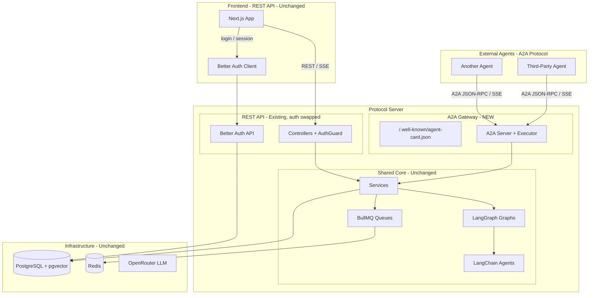

# A2A Protocol Migration Plan

## Architecture Overview

Two independent changes:

1. **Auth swap**: Replace Privy with Better Auth (affects protocol + frontend)
2. **A2A gateway**: Add A2A as an external interoperability layer (protocol only, additive)




### What Changes vs What Stays

**Stays the same:**

- All LangGraph graphs and LangChain agents
- All services (business logic layer)
- All controllers (REST API for frontend) -- only auth mechanism changes
- Database core schema (PostgreSQL, Drizzle ORM, pgvector)
- BullMQ queue system
- Adapter pattern (database, embedder, cache, queue adapters)
- Frontend components, services, context providers (except auth)
- Chat SSE streaming (frontend keeps current approach)

**Changes:**

- **Auth**: Privy removed, Better Auth added (protocol + frontend)
- **AuthGuard**: Implementation swaps from Privy JWT to Better Auth session
- **User schema**: `privy_id` replaced with Better Auth user table linkage

**New additions:**

- **A2A gateway**: Agent Card, AgentExecutor, TaskStore, A2A route handlers
- External agents can discover and interact with Index Network via A2A protocol

### Open Decision (to discuss with @yanekyuk)

Should the frontend also communicate via A2A instead of REST? Current plan keeps REST for frontend. Options:

- **(A) REST for frontend, A2A for external** -- current plan, simpler
- **(B) A2A for everything** -- unified protocol, more complex frontend migration
- **(C) Both** -- frontend can use either, A2A optional

---

## Phase 0: Remove Privy + Add Better Auth

### 0.1 Privy Removal Scope

**~50+ files** reference Privy. Key removals:

**Protocol (backend) -- 15+ files:**

- `[protocol/src/lib/privy.ts](protocol/src/lib/privy.ts)` -- delete entirely
- `[protocol/src/guards/auth.guard.ts](protocol/src/guards/auth.guard.ts)` -- rewrite
- `[protocol/src/services/auth.service.ts](protocol/src/services/auth.service.ts)` -- remove `findOrCreateByPrivyId()`, `getPrivyUser()`
- `[protocol/src/adapters/database.adapter.ts](protocol/src/adapters/database.adapter.ts)` -- remove `findByPrivyId()`
- `[protocol/src/schemas/database.schema.ts](protocol/src/schemas/database.schema.ts)` -- remove `privy_id` column
- `[protocol/src/types/users.types.ts](protocol/src/types/users.types.ts)` -- remove `privyId`
- `[protocol/src/lib/user-utils.ts](protocol/src/lib/user-utils.ts)` -- update user resolution
- `[protocol/src/cli/db-seed.ts](protocol/src/cli/db-seed.ts)` -- remove `ensurePrivyIdentity()`
- All controllers with `@UseGuards(AuthGuard)` -- guard interface stays, implementation swaps
- `protocol/package.json` -- remove `@privy-io/server-auth`

**Frontend -- 12+ files:**

- `[frontend/src/contexts/AuthContext.tsx](frontend/src/contexts/AuthContext.tsx)` -- rewrite with Better Auth
- `[frontend/src/lib/api.ts](frontend/src/lib/api.ts)` -- replace `usePrivy().getAccessToken()`
- `[frontend/src/components/Header.tsx](frontend/src/components/Header.tsx)` -- replace `usePrivy()`
- `[frontend/src/components/Sidebar.tsx](frontend/src/components/Sidebar.tsx)` -- replace `usePrivy()`
- `[frontend/src/components/FeedbackWidget.tsx](frontend/src/components/FeedbackWidget.tsx)` -- replace token fetching
- `[frontend/src/contexts/AIChatContext.tsx](frontend/src/contexts/AIChatContext.tsx)` -- replace token fetching
- `[frontend/src/services/v2/indexes.service.ts](frontend/src/services/v2/indexes.service.ts)` -- replace token
- `[frontend/src/services/v2/upload.service.ts](frontend/src/services/v2/upload.service.ts)` -- replace token
- `[frontend/src/app/index/[indexId]/page.tsx](frontend/src/app/index/[indexId]/page.tsx)` -- replace auth check
- `[frontend/src/app/l/[code]/page.tsx](frontend/src/app/l/[code]/page.tsx)` -- replace auth check
- `[frontend/src/app/globals.css](frontend/src/app/globals.css)` -- remove Privy modal styles
- `frontend/package.json` -- remove `@privy-io/react-auth`

**Evaluator -- 3+ files:**

- `[evaluator/lib/auth.ts](evaluator/lib/auth.ts)`, `[evaluator/app/PrivyProviderWrapper.tsx](evaluator/app/PrivyProviderWrapper.tsx)`, `evaluator/package.json`

### 0.2 Set Up Better Auth -- Protocol

Better Auth uses a Drizzle adapter that works with the existing PostgreSQL setup.

**Create `[protocol/src/lib/auth.ts](protocol/src/lib/auth.ts)`:**

```typescript
import { betterAuth } from "better-auth";
import { drizzleAdapter } from "better-auth/adapters/drizzle";
import { db } from "./drizzle/drizzle";

export const auth = betterAuth({
  database: drizzleAdapter(db, { provider: "pg" }),
  emailAndPassword: { enabled: true },
  socialProviders: {
    google: {
      clientId: process.env.GOOGLE_CLIENT_ID!,
      clientSecret: process.env.GOOGLE_CLIENT_SECRET!,
    },
  },
});
```

**Generate Better Auth schema** (user, session, account, verification tables):

```bash
npx @better-auth/cli@latest generate
bun run db:generate
bun run db:migrate
```

**User table strategy:** Let Better Auth manage its own `user` table. Link our existing domain tables (intents, profiles, etc.) to Better Auth's user ID via foreign key.

### 0.3 Set Up Better Auth -- Frontend

**Create `[frontend/src/lib/auth-client.ts](frontend/src/lib/auth-client.ts)`:**

```typescript
import { createAuthClient } from "better-auth/react";

export const authClient = createAuthClient({
  baseURL: process.env.NEXT_PUBLIC_API_URL,
});
```

**Create `[frontend/src/app/api/auth/[...all]/route.ts](frontend/src/app/api/auth/[...all]/route.ts)`** for Better Auth API route.

**Rewrite `[frontend/src/contexts/AuthContext.tsx](frontend/src/contexts/AuthContext.tsx)`:**

- Replace `PrivyProvider` with Better Auth session provider
- Replace `usePrivy()` with `authClient.useSession()`
- Expose `signIn`, `signOut`, `user`, `isAuthenticated`

### 0.4 Rewrite AuthGuard

`[protocol/src/guards/auth.guard.ts](protocol/src/guards/auth.guard.ts)`:

- Replace `privyClient.verifyAuthToken()` with `auth.api.getSession({ headers })`
- Return `AuthenticatedUser` with Better Auth user ID
- All controllers continue working unchanged (guard interface is the same)

### 0.5 Database Migration

- Remove `privy_id` column from `users` table
- Add foreign key to Better Auth `user` table (or merge tables)
- Generate and apply migration

### 0.6 Environment Variables

**Remove:** `PRIVY_APP_ID`, `PRIVY_APP_SECRET`, `NEXT_PUBLIC_PRIVY_APP_ID`, `NEXT_PUBLIC_PRIVY_CLIENT_ID`

**Add:** `BETTER_AUTH_SECRET`, `BETTER_AUTH_URL`, `GOOGLE_CLIENT_ID` (optional), `GOOGLE_CLIENT_SECRET` (optional)

---

## Phase 1: Add A2A External Gateway

This is purely additive -- no existing code is modified except `main.ts` to mount new routes.

### 1.1 Install SDK

Add `@a2a-js/sdk` and `express` (peer dependency) to `protocol/package.json`.

### 1.2 Define Agent Card

Create `[protocol/src/a2a/agent-card.ts](protocol/src/a2a/agent-card.ts)`:

```typescript
import { AgentCard } from '@a2a-js/sdk';

export const indexAgentCard: AgentCard = {
  name: 'Index Network Agent',
  description: 'Intent-driven discovery agent. Processes intents, discovers opportunities, manages profiles, and provides conversational AI.',
  version: '1.0.0',
  url: `${process.env.API_URL || 'http://localhost:3001'}/a2a/jsonrpc`,
  skills: [
    {
      id: 'chat',
      name: 'Conversational Discovery',
      description: 'Multi-turn AI chat with discovery and opportunity presentation.',
      tags: ['chat', 'discovery', 'conversation'],
      examples: ['Find people interested in AI', 'Show my opportunities'],
    },
    {
      id: 'process-intents',
      name: 'Intent Processing',
      description: 'Extract and reconcile intents from content.',
      tags: ['intents', 'inference'],
    },
    {
      id: 'discover-opportunities',
      name: 'Opportunity Discovery',
      description: 'Find matching opportunities between users.',
      tags: ['opportunities', 'matching'],
    },
    {
      id: 'manage-profile',
      name: 'Profile Management',
      description: 'Generate and update user profiles.',
      tags: ['profile'],
    },
    {
      id: 'manage-indexes',
      name: 'Index Management',
      description: 'Manage indexes (communities) and memberships.',
      tags: ['indexes', 'communities'],
    },
  ],
  capabilities: { streaming: true, pushNotifications: false },
  defaultInputModes: ['text/plain', 'application/json'],
  defaultOutputModes: ['text/plain', 'application/json'],
};
```

### 1.3 Implement IndexAgentExecutor

Create `[protocol/src/a2a/executor.ts](protocol/src/a2a/executor.ts)`:

- Implements `AgentExecutor` from `@a2a-js/sdk/server`
- Inspects incoming `Message.parts` to determine skill:
  - `DataPart` with `{ skill: "..." }` --> explicit skill routing
  - `TextPart` --> defaults to `chat` skill
- Routes to existing services/graph factories (same code controllers use)
- For `chat`: invokes `ChatGraphFactory`, streams via `eventBus.publish()`
- For CRUD-like skills: calls services directly, returns `Message` with `DataPart` results
- For long-running skills (intent processing, opportunity discovery): creates `Task`, publishes status updates

### 1.4 Implement TaskStore

Create `[protocol/src/a2a/task-store.ts](protocol/src/a2a/task-store.ts)`:

- Implements `TaskStore` interface from `@a2a-js/sdk/server`
- Backed by new `a2a_tasks` Drizzle table:

```typescript
export const a2aTasks = pgTable('a2a_tasks', {
  id: text('id').primaryKey(),
  contextId: text('context_id').notNull(),
  userId: text('user_id'),
  status: jsonb('status').notNull(),
  artifacts: jsonb('artifacts'),
  history: jsonb('history'),
  metadata: jsonb('metadata'),
  createdAt: timestamp('created_at').defaultNow(),
  updatedAt: timestamp('updated_at').defaultNow(),
});
```

### 1.5 A2A Auth

Create `[protocol/src/a2a/auth.ts](protocol/src/a2a/auth.ts)`:

- Custom `UserBuilder` for the A2A server
- Validates Bearer tokens via Better Auth `auth.api.getSession()`
- Can also accept API keys for machine-to-machine agent communication

### 1.6 Mount in Server

Add to `[protocol/src/main.ts](protocol/src/main.ts)`:

- Serve Agent Card at `/.well-known/agent-card.json`
- Mount A2A JSON-RPC handler at `/a2a/jsonrpc`
- Mount A2A REST handler at `/a2a/rest`
- All existing REST routes remain unchanged
- Thin Bun-to-Express adapter for the A2A paths (since `@a2a-js/sdk/server/express` expects Express middleware)

---

## Phase 2: Testing and Documentation

### 2.1 Tests

- Update all test mocks from `privyId` to Better Auth user ID
- Add A2A protocol tests: send message, streaming, task lifecycle, skill routing
- Test that existing REST API still works after auth swap

### 2.2 Documentation

- Update `CLAUDE.md` to reflect new auth and A2A setup
- Update `.env.example` files
- Document Agent Card for external consumers
- Add A2A integration guide for third-party agents

---

## Summary of Scope


| Area                           | What happens                                         |
| ------------------------------ | ---------------------------------------------------- |
| **Auth**                       | Privy removed, Better Auth added (~50 files touched) |
| **Controllers**                | Stay, only auth mechanism changes                    |
| **Services / Graphs / Agents** | Unchanged                                            |
| **Queues**                     | Unchanged                                            |
| **Frontend components**        | Auth hooks swapped, everything else stays            |
| **Frontend API services**      | Token fetching mechanism swapped                     |
| **A2A gateway**                | New addition (~5 new files in `protocol/src/a2a/`)   |
| **Database**                   | Migration for auth tables + `a2a_tasks` table        |


