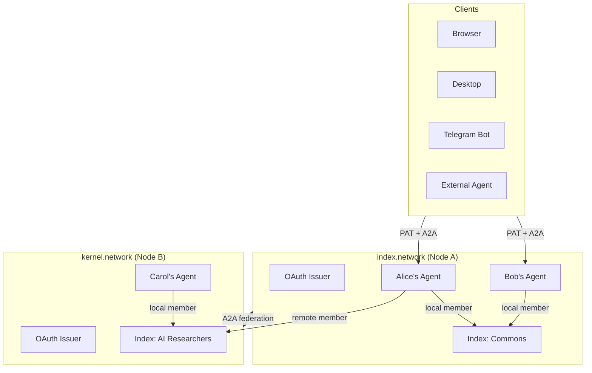

# Index Network Architecture Brief

## Vision

Index Network is a federated, intent-driven discovery protocol. Users express intents -- what they're seeking, offering, exploring. AI agents match intents across communities (indexes) to surface collaboration opportunities. Users own their data, choose what to share, and can participate in indexes hosted on any server in the federation.

Every user is a discoverable A2A agent. Every server is an OAuth issuer. Every index can span multiple servers.

---

## System Model




### Core Entities

- **User = Agent**: Each user has a personal A2A agent with a discoverable Agent Card. The agent acts on behalf of the user across all their indexes.
- **Intent**: What a user is seeking, offering, or exploring. Stored as text + 2000-dim vector embedding. The atomic unit of discovery.
- **Index**: A community/context where intents are shared. Can be local (same server) or remote (different server). Users choose which intents to share with which index.
- **Opportunity**: A match between users discovered by AI agents analyzing intent compatibility within an index.
- **Node/Server**: A deployment of the Index Network protocol. Each node is an OAuth issuer, hosts users, hosts indexes, and participates in federation.

---

## Layer 1: Identity and Auth

Each node is an **OAuth issuer** (`issuer: index.network`, `issuer: kernel.network`). Users authenticate to their home node and receive **Personal Access Tokens (PATs)**.

```
POST /oauth/token { email, password } --> { pat: "ixn_pat_abc123..." }
```

PATs are the single auth mechanism for all clients and interactions:


| Client                  | Auth                                                     |
| ----------------------- | -------------------------------------------------------- |
| Browser                 | PAT (stored in memory/localStorage)                      |
| Desktop app             | PAT (stored in config)                                   |
| Telegram bot            | PAT (stored in bot config)                               |
| External A2A agent      | PAT (in Authorization header)                            |
| Remote federated server | OAuth token exchange / Agent Card signature verification |


**Better Auth** handles user management (email/password, social login, future SIWE for wallet-based identity). PATs are an additional token layer on top for client-agnostic authentication.

Cross-server trust: when a user from `index.network` interacts with `kernel.network`, the remote server verifies the user's identity via standard OAuth discovery (JWKS) or A2A Agent Card signatures.

---

## Layer 2: Per-User A2A Agents

Every user IS a discoverable agent:

```
GET  /u/{userId}/.well-known/agent-card.json   --> Agent Card (public)
POST /u/{userId}/a2a                           --> A2A endpoint (authenticated)
```

The Agent Card is dynamically generated from the user's profile and contains:

- Name, description (from profile narrative)
- Skills: chat, intents, opportunities, profile
- Endpoint URL
- Security scheme (Bearer PAT)

### Skills


| Skill           | Purpose                                            | Response Pattern                           |
| --------------- | -------------------------------------------------- | ------------------------------------------ |
| `chat`          | Multi-turn conversational AI with the user's agent | Streaming (SSE)                            |
| `intents`       | List, get, process user intents                    | Instant (Message) or Task (for processing) |
| `opportunities` | Discover, list, propose opportunities              | Instant or Task (for discovery)            |
| `profile`       | View user profile                                  | Instant (Message)                          |
| `indexes`       | List user's public index memberships               | Instant (Message)                          |
| `federation`    | Sync shared intents to remote indexes              | Push Notifications                         |


### Request Model

Every A2A request has two identities:

- **Caller**: The agent/user making the request (resolved from PAT)
- **Target**: The user whose agent is being addressed (resolved from URL path)

---

## Layer 3: Discovery Engine (Unchanged)

The existing LangGraph-based AI pipeline:

- **IntentGraph**: Extract, infer, verify, reconcile intents from content
- **OpportunityGraph**: Match intents across users within an index, score compatibility
- **HyDE Generator**: Create hypothetical document embeddings for multi-strategy semantic search
- **ChatGraph**: ReAct-style conversational agent with tool use
- **ProfileGraph**: Generate user profiles from identity signals

These graphs are the core intelligence. A2A wraps them -- it doesn't replace them.

---

## Layer 4: Federation

Users can join indexes on remote servers. When they do, they choose which intents to share with that index.

### Data Replication

Shared intents + embeddings are replicated to the remote index:


| Data                         | Replicated       | Reason                         |
| ---------------------------- | ---------------- | ------------------------------ |
| Selected intent payloads     | Yes              | Needed for opportunity context |
| Intent embeddings (2000-dim) | Yes              | Needed for vector search       |
| Profile summary              | Yes (Agent Card) | Display in member list         |
| Unshared intents             | No               | User didn't opt in             |
| Full profile details         | No               | Query via A2A on demand        |
| Chat history                 | No               | Private to home server         |


### Sync Protocol

**Primary: A2A Push Notifications (webhooks)**

The home server pushes events to the remote index server when shared data changes:

```
intent-shared      --> User shares a new intent with remote index
intent-updated     --> User edits a shared intent
intent-revoked     --> User un-shares an intent
member-left        --> User leaves the remote index
```

**Direction**: Index owner registers a webhook. Home server posts events to it. One webhook per server pair per index (not per user).

**Fallback: Bulk pull**

For recovery after downtime or initial sync:

```
Remote --> Home: "Give me all shared intents for members of index X from your server, since timestamp Y"
```

### Sync Topology

The **index owner pulls** (or receives pushes), not individual users:

```
kernel.network owns "AI Researchers" index
  - 3 members from index.network
  - 2 members from dao.network
  - 5 local members

Sync channels: 2 (one per remote server), not 5 (one per remote user)
```

---

## Layer 5: Human Messaging (XMTP)

Replace Stream Chat with XMTP for human-to-human messaging:

- End-to-end encrypted (users own their messages)
- Decentralized network (no messaging infrastructure to host)
- SIWE via Better Auth provides shared wallet identity
- Index Bot agent sends opportunity introductions via XMTP
- Message consent built into the protocol (replaces unfinished message request flow)

Independent from A2A. XMTP handles human conversations. A2A handles agent interactions.

---

## Layer 6: Multi-Client

PATs + A2A make every client surface equal:

```
Browser     --> PAT --> user's A2A agent --> services
Desktop     --> PAT --> user's A2A agent --> services
Telegram    --> PAT --> user's A2A agent --> services
CLI         --> PAT --> user's A2A agent --> services
Ext Agent   --> PAT --> user's A2A agent --> services (A2A protocol)
```

The frontend (Next.js) is one client among many. Over time, it migrates from REST to A2A (hybrid approach -- one service at a time, REST deprecated gradually).

---

## Implementation Phases

### Phase 1: Foundation (Done)

- Better Auth replaces Privy (email/password, social login)
- Unified user table (text IDs, Better Auth manages it)
- Cookie-based auth for existing frontend (temporary, until PATs)

### Phase 2: PAT System

- `personal_access_tokens` table
- Token generation, revocation, scoping
- Replace cookie-based frontend auth with PAT
- All clients authenticate the same way

### Phase 3: Per-User A2A Agents

- Install `@a2a-js/sdk`
- Dynamic Agent Card generation per user
- IndexAgentExecutor with skill routing
- Mount at `/u/:userId/.well-known/agent-card.json` and `/u/:userId/a2a`
- TaskStore for stateful operations

### Phase 4: OAuth Issuer

- Node publishes `.well-known/openid-configuration` and JWKS
- PATs are JWT-based, verifiable by remote servers
- Cross-server identity verification

### Phase 5: Federation

- Users join remote indexes, select intents to share
- `federatedMembers` and `federatedIntents` tables on receiving server
- A2A Push Notification webhooks for real-time sync
- Bulk pull for recovery
- OpportunityGraph queries local + federated intents

### Phase 6: XMTP Messaging

- Add SIWE plugin to Better Auth
- Replace Stream Chat with XMTP
- Index Bot as XMTP agent for opportunity introductions
- E2E encrypted human-to-human messaging

### Phase 7: Multi-Client + Frontend Migration

- Frontend migrates from REST to A2A (one service at a time)
- Telegram bot client
- Desktop client
- Delete REST controllers when frontend migration complete

---

## Standards Used


| Concern          | Standard                                      | Why                                                                          |
| ---------------- | --------------------------------------------- | ---------------------------------------------------------------------------- |
| Agent interop    | A2A Protocol (Google/Linux Foundation)        | Agent discovery, messaging, streaming, push notifications -- all in one spec |
| Auth             | OAuth 2.0 + PATs                              | Industry standard, works across servers                                      |
| Identity         | Better Auth + SIWE (ERC-4361)                 | Self-hosted, wallet-compatible                                               |
| Messaging        | XMTP (MLS)                                    | E2E encrypted, decentralized, agent-compatible                               |
| AI orchestration | LangGraph / LangChain                         | Existing, proven, stays as-is                                                |
| Database         | PostgreSQL + pgvector + Drizzle ORM           | Existing, stays as-is                                                        |
| Embeddings       | OpenRouter (text-embedding-3-large, 2000-dim) | Existing, stays as-is                                                        |


No custom protocols. Every layer uses an existing standard. The value is in the composition: intent-driven discovery across a federated agent network.