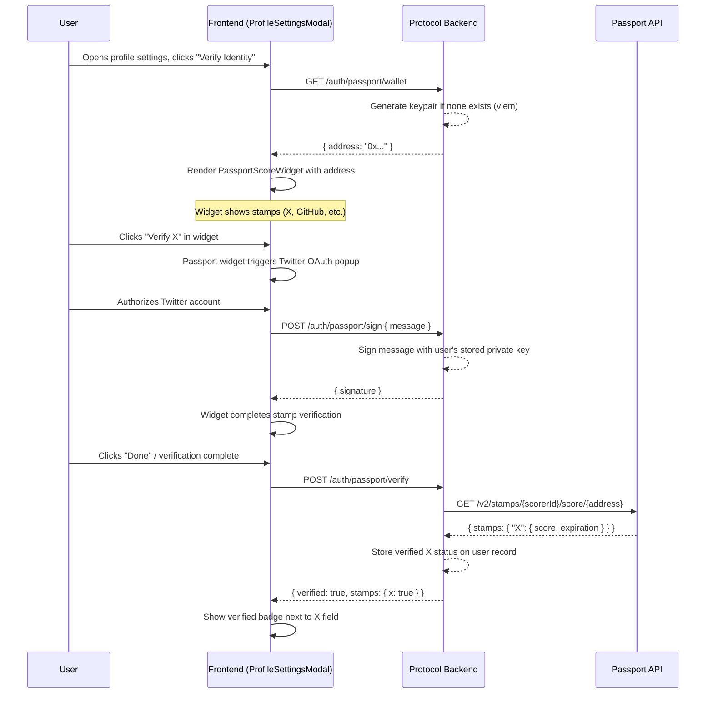

# Passport Twitter/X Verification in Profile Settings

## Architecture

Users don't have wallets, so the backend generates and manages an Ethereum keypair per user. The frontend renders Passport's `PassportScoreWidget` using this server-managed address, and delegates message signing to a backend endpoint. After the user verifies their X account through the widget's OAuth flow, the backend confirms the stamp via the Stamps API.




## Changes Required

### 1. Database Schema ([protocol/src/schemas/database.schema.ts](protocol/src/schemas/database.schema.ts))

Add fields to the `users` table:

```typescript
walletAddress: text('wallet_address'),
walletPrivateKey: text('wallet_private_key'), // encrypted
passportVerifications: json('passport_verifications').$type<{
  x?: { verified: boolean; score: string; expiresAt: string };
}>(),
```

Generate a migration with `bun run db:generate` and apply with `bun run db:migrate`.

### 2. Install Backend Dependencies

- `viem` -- for Ethereum wallet generation and message signing (lighter than ethers.js, better TS support, already a transitive dep via Privy)

### 3. Passport Service ([protocol/src/services/passport.service.ts](protocol/src/services/passport.service.ts))

New service following the [service template](protocol/src/services/service-template.md):

- `getOrCreateWallet(userId)` -- generates a keypair via `viem/accounts` (`generatePrivateKey()` + `privateKeyToAccount()`), stores encrypted private key and address on user record, returns address
- `signMessage(userId, message)` -- loads stored private key, signs message using viem's `account.signMessage()`, returns signature
- `verifyStamps(userId)` -- calls Passport Stamps API `GET /v2/stamps/{SCORER_ID}/score/{address}` with the server-side `PASSPORT_STAMPS_API_KEY`, checks for the `X` stamp in the response, updates `passportVerifications` on user record
- Encryption: use a `PASSPORT_WALLET_ENCRYPTION_KEY` env var to encrypt/decrypt private keys at rest (AES-256-GCM via Node crypto)

### 4. Passport Controller ([protocol/src/controllers/passport.controller.ts](protocol/src/controllers/passport.controller.ts))

New controller following the [controller template](protocol/src/controllers/controller.template.md):

- `@Controller('/auth/passport')`
- `GET /wallet` (guarded by `AuthGuard`) -- returns the user's server-managed wallet address (creates one if needed)
- `POST /sign` (guarded by `AuthGuard`) -- accepts `{ message: string }`, returns `{ signature: string }`
- `POST /verify` (guarded by `AuthGuard`) -- calls Stamps API, stores X verification status, returns result

Register controller in [protocol/src/main.ts](protocol/src/main.ts).

### 5. Environment Variables

Add to [protocol/.env.example](protocol/.env.example) and `.env.development`:

```
PASSPORT_EMBED_API_KEY=       # From developer.passport.xyz (for frontend widget)
PASSPORT_STAMPS_API_KEY=      # From developer.passport.xyz (for backend verification)
PASSPORT_SCORER_ID=           # From developer.passport.xyz
PASSPORT_WALLET_ENCRYPTION_KEY=  # 32-byte hex key for encrypting stored wallet keys
```

### 6. Install Frontend Dependency

- `@human.tech/passport-embed` -- Passport Embed React component

### 7. Frontend: Profile Settings Modal ([frontend/src/components/modals/ProfileSettingsModal.tsx](frontend/src/components/modals/ProfileSettingsModal.tsx))

Add a "Verify Identity" section below the existing Socials section:

- Fetch wallet address from `GET /auth/passport/wallet` when user wants to verify
- Render `PassportScoreWidget` with:
  - `apiKey={NEXT_PUBLIC_PASSPORT_EMBED_API_KEY}` (env var)
  - `scorerId={NEXT_PUBLIC_PASSPORT_SCORER_ID}` (env var)
  - `address={walletAddress}` (from backend)
  - `generateSignatureCallback` -- calls `POST /auth/passport/sign` on the backend
  - `theme={LightTheme}` (matches the white modal)
  - `collapseMode="off"` (always expanded in settings context)
- After widget interaction, call `POST /auth/passport/verify` to confirm and store
- Show a verified checkmark badge next to the X (Twitter) input field when `passportVerifications.x.verified` is true

### 8. Frontend: Environment Variables

Add to [frontend/.env.local](frontend/.env.local):

```
NEXT_PUBLIC_PASSPORT_EMBED_API_KEY=   # Embed API key (safe for frontend)
NEXT_PUBLIC_PASSPORT_SCORER_ID=       # Scorer ID
```

### 9. Auth Service Update ([frontend/src/services/auth.ts](frontend/src/services/auth.ts))

Add methods:

- `getPassportWallet()` -- `GET /auth/passport/wallet`
- `signPassportMessage(message)` -- `POST /auth/passport/sign`
- `verifyPassportStamps()` -- `POST /auth/passport/verify`

## Important Notes

- **X Stamp Requirements**: The X stamp requires: Premium/verified account, 100+ followers, 365+ day old account. Not all users will qualify.
- **Passport Access**: You need to register at [developer.passport.xyz](https://developer.passport.xyz) and create two API keys (one for Embed, one for Stamps API) plus a Scorer with a threshold.
- **Private Key Security**: Server-managed private keys should be encrypted at rest. For production, consider using a KMS (AWS KMS, GCP KMS) instead of a local encryption key.
- **Passport Embed is Premium**: Passport Embed is described as a "premium offering" in the docs. Verify access and pricing at the developer portal.

