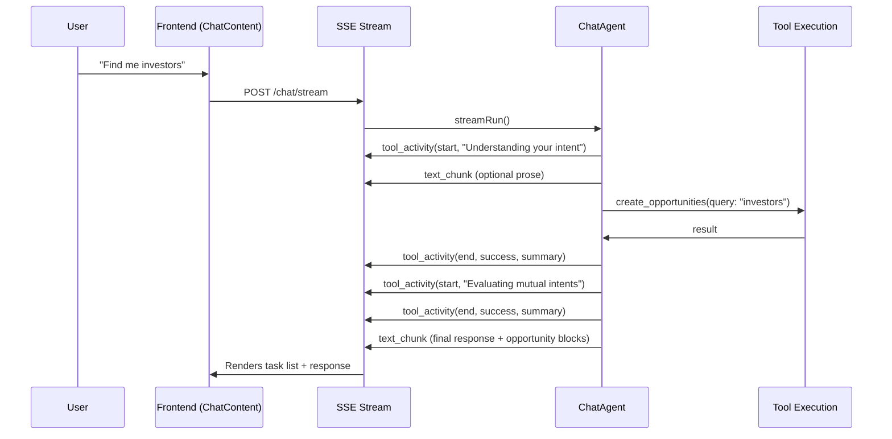

# Reasoning UI Implementation Plan

## Current State

Today the chat agent uses a **ReAct loop** (single `agent_loop` node in `chat.graph.ts`) where:

1. The LLM streams text tokens as prose narration (e.g. "> Looking up your profile...")
2. Tool calls happen behind the scenes
3. `tool_activity` events **are emitted** by `chat.agent.ts` but **intentionally dropped** in two places:
  - **Backend**: `[chat.streamer.ts:163-170](protocol/src/lib/protocol/streamers/chat.streamer.ts)` — logged but not yielded
  - **Frontend**: `[AIChatContext.tsx:229-230](frontend/src/contexts/AIChatContext.tsx)` — case not handled in switch

The plumbing already exists end-to-end but is intentionally disconnected. The `ToolActivityEvent` type is already defined in `[chat-streaming.types.ts:219-231](protocol/src/types/chat-streaming.types.ts)` with `toolName`, `description`, `phase` (start/end), `success`, and `summary`.

A legacy `[ThinkingDropdown.tsx](frontend/src/components/chat/ThinkingDropdown.tsx)` exists but renders simple bullet points — not the task-list UX you described.

## Architecture: What Needs to Change




## Step-by-step Changes

### 1. Backend: Emit richer `tool_activity` events (start + end)

**File**: `[protocol/src/lib/protocol/agents/chat.agent.ts](protocol/src/lib/protocol/agents/chat.agent.ts)`

Currently only `phase: "end"` events are emitted after tool execution. We need to also emit `phase: "start"` **before** each tool call, and include a user-friendly `description` derived from a mapping of tool names to human-readable labels:


| toolName               | start description                                   | category        |
| ---------------------- | --------------------------------------------------- | --------------- |
| `read_user_profiles`   | "Looking up {name}" or "Loading your profile"       | Person Lookup   |
| `read_intents`         | "Finding intents"                                   | Understanding   |
| `create_opportunities` | "Finding mutual intents" or "Evaluating candidates" | Opportunity     |
| `scrape_url`           | "Browsing: {url}"                                   | Browsing        |
| `create_intent`        | "Creating intent"                                   | Intent Creation |
| `list_opportunities`   | "Loading opportunities"                             | Opportunity     |
| `read_indexes`         | "Checking your networks"                            | Understanding   |


A simple `getToolDescription(toolName, toolArgs)` helper function will generate these labels from the tool name and args.

### 2. Backend: Forward `tool_activity` events through the streamer

**File**: `[protocol/src/lib/protocol/streamers/chat.streamer.ts](protocol/src/lib/protocol/streamers/chat.streamer.ts)`

Change from dropping `tool_activity` events to yielding them as SSE events. Convert the `AgentStreamEvent` shape to the `ToolActivityEvent` SSE shape with `createToolActivityEvent()`.

### 3. Frontend: Handle `tool_activity` in AIChatContext

**File**: `[frontend/src/contexts/AIChatContext.tsx](frontend/src/contexts/AIChatContext.tsx)`

- Add a `tool_activity` case to the SSE event switch
- Store activities in the `ChatMessage` as a new `activities: ToolActivity[]` field (replacing `thinking`)
- Each activity: `{ toolName, description, phase, success?, summary?, timestamp }`
- On `start` event: push a new activity with `status: "in_progress"`
- On `end` event: update the matching activity to `status: "completed"` or `"failed"`

### 4. Frontend: Build the Reasoning Task List component

**File**: New component `frontend/src/components/chat/ReasoningSteps.tsx` (replaces `ThinkingDropdown`)

Design:

- Collapsible section above the assistant message text
- Each step is a row with: status indicator (spinner/check/x) + description text
- Active step shows a subtle pulse/spinner animation
- Completed steps show a checkmark
- Collapsed by default after streaming ends, expanded during streaming
- Steps group visually by category (Understanding, Lookup, Opportunity, Browsing) but render as a flat list

Example rendering during an opportunity flow:

```
[check] Understanding your intent
[spinner] Finding mutual intents
[ ] Evaluating candidates
```

### 5. Frontend: Integrate into ChatContent message rendering

**File**: `[frontend/src/components/ChatContent.tsx](frontend/src/components/ChatContent.tsx)`

- Replace `ThinkingDropdown` usage with the new `ReasoningSteps` component
- Pass `msg.activities` instead of `msg.thinking`
- Render it above the `AssistantMessageContent` block

## What is NOT in scope (per your "Skip for now" notes)

- "Making sure this is appropriate" / "Ensuring there's value" / "Ensuring trusted party" — hidden evaluation steps
- Connector opportunity throttling (the 33% rule)
- "Let me refresh my memory" expiration logic
- Intent creation flow changes (the reasoning UI just shows steps; the agent behavior stays the same)

## Key decisions to confirm

The plan preserves the LLM's ability to also write prose narration text alongside the structured steps. The task list is **additive** — it appears above the streamed text, not replacing it. The LLM can still write contextual prose between tool calls.

---

## Appendix: Reasoning Chain Examples

### 1. Opportunity Discovery — "Find me investors"


| Turn | Tool Call                                        | Reasoning Step (visible)              |
| ---- | ------------------------------------------------ | ------------------------------------- |
| 1    | *(preloaded context — no tool)*                  | Understanding what you're looking for |
| 2    | `read_intents()`                                 | Checking your current priorities      |
| 3    | `create_opportunities(searchQuery: "investors")` | Finding relevant people               |
| 4    | *(response with opportunity cards)*              | *(final text + cards)*                |


If no results and the agent suggests creating a priority:


| Turn | Tool Call                                                   | Reasoning Step (visible)                     |
| ---- | ----------------------------------------------------------- | -------------------------------------------- |
| 4    | `create_intent(description: "Looking for investors in...")` | Tracking this as a priority                  |
| 5    | *(response)*                                                | *(explains will notify when matches appear)* |


### 2. Person Lookup — "Look up Seref Sandikci"


| Turn | Tool Call                                                    | Reasoning Step (visible)       |
| ---- | ------------------------------------------------------------ | ------------------------------ |
| 1    | `read_index_memberships(userId: currentUser)`                | Checking your communities      |
| 2    | `read_user_profiles(userId: serefId)`                        | Looking up Seref Sandikci      |
| 3    | `read_intents(userId: serefId, indexId: sharedIdx)`          | Finding what she's looking for |
| 4    | `create_opportunities(searchQuery: ..., indexId: sharedIdx)` | Checking for overlap           |
| 5    | *(response with profile summary + opportunity cards)*        | *(final text)*                 |


With a URL instead of a name:


| Turn | Tool Call                                  | Reasoning Step (visible)       |
| ---- | ------------------------------------------ | ------------------------------ |
| 1    | `scrape_url(url: "linkedin.com/in/seref")` | Browsing linkedin.com/in/seref |
| 2+   | *(same as above)*                          | *(same as above)*              |


### 3. Connector Opportunity — "Connect Alice and Bob"


| Turn | Tool Call                                                               | Reasoning Step (visible)       |
| ---- | ----------------------------------------------------------------------- | ------------------------------ |
| 1    | `read_index_memberships(userId: aliceId)`                               | Looking up Alice's communities |
| 2    | `read_index_memberships(userId: bobId)`                                 | Looking up Bob's communities   |
| 3    | `read_user_profiles(userId: aliceId)`                                   | Reading Alice's background     |
| 4    | `read_user_profiles(userId: bobId)`                                     | Reading Bob's background       |
| 5    | `read_intents(indexId: sharedIdx, userId: aliceId)`                     | Finding Alice's priorities     |
| 6    | `read_intents(indexId: sharedIdx, userId: bobId)`                       | Finding Bob's priorities       |
| 7    | `create_opportunities(partyUserIds: [A,B], entities: [...], hint: ...)` | Evaluating mutual fit          |
| 8    | *(response with opportunity card)*                                      | *(final text)*                 |


### 4. Intent Creation — "I'm looking for a technical co-founder"

**Specific enough:**


| Turn | Tool Call                           | Reasoning Step (visible)      |
| ---- | ----------------------------------- | ----------------------------- |
| 1    | *(preloaded context, no tool)*      | Understanding what you need   |
| 2    | `create_intent(description: "...")` | Setting this up as a priority |
| 3    | *(response)*                        | *(final text)*                |


**Vague — "I want to meet people":**


| Turn | Tool Call                              | Reasoning Step (visible)          |
| ---- | -------------------------------------- | --------------------------------- |
| 1    | `read_intents()`                       | Checking your existing priorities |
| 2    | *(no tool — asks clarifying question)* | *(text only)*                     |
| 3    | *(user responds with refinement)*      |                                   |
| 4    | `create_intent(description: refined)`  | Setting this up as a priority     |


### 5. Intent from URL — "[https://github.com/some/project](https://github.com/some/project)"


| Turn | Tool Call                                 | Reasoning Step (visible)         |
| ---- | ----------------------------------------- | -------------------------------- |
| 1    | `scrape_url(url, objective: "...")`       | Browsing github.com/some/project |
| 2    | *(synthesizes description)*               | Understanding the project        |
| 3    | `create_intent(description: synthesized)` | Tracking this as a priority      |
| 4    | *(response)*                              | *(final text)*                   |


### 6. No Results — "Find me investors" (none available)


| Turn | Tool Call                                                | Reasoning Step (visible)              |
| ---- | -------------------------------------------------------- | ------------------------------------- |
| 1    | *(preloaded context)*                                    | Understanding what you're looking for |
| 2    | `create_opportunities(searchQuery: "investors")`         | Finding relevant people               |
| 3    | *(tool returns empty / createIntentSuggested)*           | No matches right now                  |
| 4    | `create_intent(description: "Looking for investors...")` | Tracking this so you'll be notified   |
| 5    | *(response)*                                             | *(final text)*                        |


### 7. Community Exploration — "What's happening in AI Builders?"


| Turn | Tool Call                                       | Reasoning Step (visible)              |
| ---- | ----------------------------------------------- | ------------------------------------- |
| 1    | `read_intents(indexId: aiBuildersId)`           | Checking what members are looking for |
| 2    | `read_index_memberships(indexId: aiBuildersId)` | Seeing who's in the group             |
| 3    | *(response — synthesis)*                        | *(final text)*                        |


### 8. Profile Creation — "Here's my LinkedIn: linkedin.com/in/seref"


| Turn | Tool Call                                 | Reasoning Step (visible)            |
| ---- | ----------------------------------------- | ----------------------------------- |
| 1    | `create_user_profile(linkedinUrl: "...")` | Building your profile from LinkedIn |
| 2    | *(response — profile summary)*            | *(final text)*                      |


### 9. Show My Opportunities — "What connections do I have?"


| Turn | Tool Call                           | Reasoning Step (visible)   |
| ---- | ----------------------------------- | -------------------------- |
| 1    | `list_opportunities()`              | Loading your opportunities |
| 2    | *(response with opportunity cards)* | *(final text + cards)*     |


### Tool Description Label Reference


| Tool                      | Context          | Label                                   |
| ------------------------- | ---------------- | --------------------------------------- |
| `read_user_profiles`      | no args (self)   | "Loading your background"               |
| `read_user_profiles`      | userId           | "Looking up {name}"                     |
| `read_user_profiles`      | indexId          | "Loading member profiles"               |
| `read_intents`            | no args (self)   | "Checking your current priorities"      |
| `read_intents`            | userId + indexId | "Finding what {name} is looking for"    |
| `read_intents`            | indexId only     | "Checking what members are looking for" |
| `create_opportunities`    | searchQuery      | "Finding relevant people"               |
| `create_opportunities`    | partyUserIds     | "Evaluating mutual fit"                 |
| `list_opportunities`      | —                | "Loading your opportunities"            |
| `update_opportunity`      | status=pending   | "Sending this connection"               |
| `update_opportunity`      | status=accepted  | "Accepting this connection"             |
| `update_opportunity`      | status=rejected  | "Declining this connection"             |
| `create_intent`           | —                | "Tracking this as a priority"           |
| `update_intent`           | —                | "Updating your priority"                |
| `delete_intent`           | —                | "Removing this priority"                |
| `scrape_url`              | —                | "Browsing {domain}"                     |
| `read_indexes`            | —                | "Checking your communities"             |
| `read_index_memberships`  | indexId          | "Seeing who's in the group"             |
| `read_index_memberships`  | userId           | "Checking {name}'s communities"         |
| `create_index`            | —                | "Creating your community"               |
| `create_index_membership` | —                | "Adding {name} to the group"            |
| `create_user_profile`     | —                | "Building your profile"                 |
| `update_user_profile`     | —                | "Updating your profile"                 |
| `read_docs`               | —                | "Reading documentation"                 |


