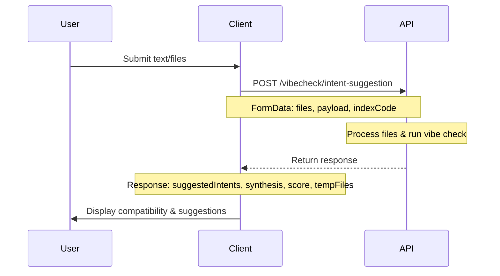
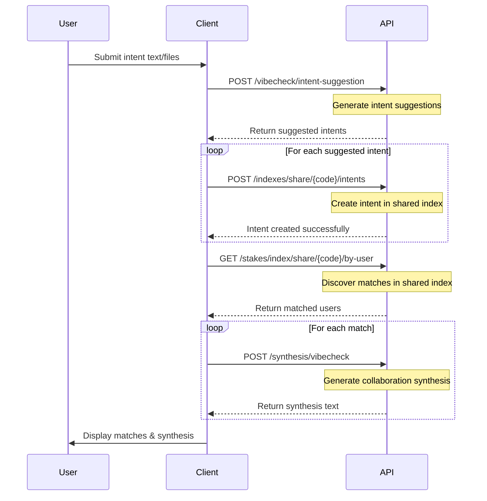

# Index Protocol Integration Guide

## Overview

Index Protocol provides two main integration patterns for discovering and matching users based on their intents and context:

1.  **VibeCheck**: Analyze compatibility between a user and an existing index
2.  **MatchList**: Create intents and discover matches within a shared index  

Both integrations use share codes for access control and support file uploads for context.

### Key Terms
-  **Share Code**: UUID used to access shared indexes with specific permissions
-  **Synthesis**: AI-generated text describing potential collaboration opportunities between users

## VibeCheck Integration

### Use Case

Analyze how well a user's content/intent fits with an existing index's community and generate an unified collaboration synthesis.

### API Flow



### API Endpoints

#### Intent Suggestion with VibeCheck

```http
POST /vibecheck/intent-suggestion
Content-Type: multipart/form-data
{
"files": [File], // Optional: Files to analyze
"payload": "string", // Optional: Intent text (what user wants/seeks/offers)
"indexCode": "uuid" // Optional: Share code for vibe check
}

```
**Response:**
```json
{
  "success": true,
  "suggestedIntents": [
    {
      "payload": "Looking for ML researchers to collaborate on neural networks",
      "confidence": 0.95
    }
  ],
  "synthesis": "Based on your work on neural networks and distributed systems, collaboration opportunities include...",
  "score": 0.87,
  "targetUser": {
    "id": "user-123",
    "name": "Dr. Jane Smith"
  },
  "tempFiles": [
    {
      "id": "temp-abc123",
      "name": "research-paper.pdf",
      "size": 2048576,
      "type": "application/pdf"
    }
  ]
}

```
#### Get Index by Share Code

```http

GET /indexes/share/{code}

```
**Response:**
```json
{
  "index": {
    "id": "idx-789abc",
    "title": "AI Research Network",
    "user": {
      "id": "user-456",
      "name": "Prof. Alex Chen",
      "avatar": "https://example.com/avatars/alex.jpg"
    },
    "files": [
      {
        "id": "file-def456",
        "name": "research-proposal.pdf",
        "size": "1048576",
        "createdAt": "2024-01-15T09:30:00Z"
      }
    ],
    "linkPermissions": {
      "permissions": [
        "can-discover",
        "can-view-files"
      ]
    }
  }
}
```
### Implementation Example

```typescript

// VibeCheck integration

const  runVibeCheck  =  async (content:  string, files:  File[], shareCode:  string) => {

	const  formData  =  new  FormData();
	if (content) formData.append('payload', content); // Intent text: what user wants/seeks/offers
	if (shareCode) formData.append('indexCode', shareCode);

	files.forEach(file  =>  formData.append('files', file));

	const  response  =  await  fetch('/vibecheck/intent-suggestion', {
		method:  'POST',
		body:  formData
	});

	const  result  =  await  response.json();
	return {
		compatibility:  result.score,
		synthesis:  result.synthesis,
		suggestions:  result.suggestedIntents
	};
};

```
## MatchList Integration

### Use Case

Create intents within a shared index and discover matches with other users who have created intents in the same index.

### API Flow



### API Endpoints

#### Create Intent via Share Code

```http

POST /indexes/share/{code}/intents
Authorization: Bearer {token}
Content-Type: application/json

{
	"payload": "Seeking collaboration on distributed ML algorithms for real-time inference",
	"isIncognito": false
}

```


**Response:**

```json
{
  "message": "Intent created successfully via shared index",
  "intent": {
    "id": "intent-xyz789",
    "payload": "Seeking collaboration on distributed ML algorithms for real-time inference",
    "summary": "Machine learning algorithm collaboration",
    "isIncognito": false,
    "createdAt": "2024-01-20T14:30:00Z",
    "userId": "user-abc123"
  }
}
``` 

#### Get Stakes by Index Share Code

```http
GET /stakes/index/share/{code}/by-user
Authorization: Bearer {token}
```

**Response:**

```json
[
  {
    "user": {
      "id": "user-def456",
      "name": "Dr. Sarah Kim",
      "avatar": "https://example.com/avatars/sarah.jpg"
    },
    "stakes": [
      {
        "id": "stake-ghi789",
        "matchScore": 0.92,
        "matchReason": "Both focused on distributed ML systems and real-time inference optimization"
      }
    ]
  }
]
```

#### Generate Collaboration Synthesis

```http

POST /synthesis/vibecheck
Authorization: Bearer {token}
Content-Type: application/json

{
	"targetUserId": "user-def456"
}

```

**Response:**

```json
{
	"synthesis": "Your focus on distributed ML algorithms perfectly complements Dr. Kim's work on real-time inference optimization. Together, you could develop a unified framework that addresses both distributed training and low-latency deployment challenges.",
	"targetUserId": "user-def456"
}
```
### Implementation Example

```typescript
// MatchList integration

const createMatchlist = async (content: string, files: File[], shareCode: string) => {
  // 1. Generate intent suggestions
  const suggestions = await generateSuggestions(content, files);

  // 2. Create intents in shared index
  const createdIntents = [];

  for (const suggestion of suggestions.suggestedIntents) {
    const intent = await fetch(`/indexes/share/${shareCode}/intents`, {
      method: 'POST',
      headers: {
        'Authorization': `Bearer ${token}`,
        'Content-Type': 'application/json',
      },
      body: JSON.stringify({
        payload: suggestion.payload, // Intent text describing what user wants/seeks/offers
        isIncognito: false,
      }),
    });

    createdIntents.push(await intent.json());
  }

  // 3. Discover matches
  const matches = await fetch(`/stakes/index/share/${shareCode}/by-user`, {
    headers: { 'Authorization': `Bearer ${token}` },
  });
  const matchResults = await matches.json();

  // 4. Generate synthesis for each match
  const syntheses = await Promise.all(
    matchResults.map(async (match) => {
      const synthesis = await fetch('/synthesis/vibecheck', {
        method: 'POST',
        headers: {
          'Authorization': `Bearer ${token}`,
          'Content-Type': 'application/json',
        },
        body: JSON.stringify({
          targetUserId: match.user.id,
        }),
      });

      return {
        user: match.user,
        synthesis: await synthesis.json(),
      };
    })
  );

  return syntheses;
};
```

  

## Permissions & Access Control

  

Both integrations use share codes with permission-based access:

  

### VibeCheck Permissions

-  `can-discover`: Required to run vibe checks against index

### MatchList Permissions

-  `can-discover`: Required to see matches/stakes
-  `can-write-intents`: Required to create intents in shared index


## Best Practices

### File Handling

-  **File Types**: Supports PDF, TXT, DOC, DOCX, Markdown
-  **Size Limits**: Maximum 10 files, 10MB per file
-  **Cleanup**: Temporary files are automatically cleaned after 1 hour

### Rate Limiting
TBD 

### Authentication

- Use Privy authentication for user sessions (SIWE Compatibility example will be shared)
- Include Bearer token in all authenticated requests
