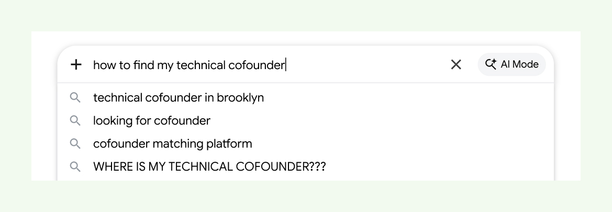
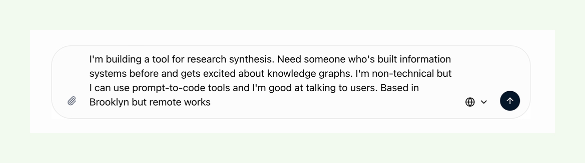

Searching used to mean Ask Jeeves. Now it’s Ask GPT, or Claude, or Gemini, or your LLM of choice. No more need to make yourself legible to the search engine, à la *“am I using the right keywords?*

Now you just pour out the idea soup of what’s on your mind. You’re not worried about offending or sounding stupid to LLMs, which are trained to in turn interpret our intent—or, parse out [the shape of what we meant](https://blog.index.network/the-shape-of-what-you-meant).

LLMs changed the game of finding information. It feels so much easier now, does it not? (Hallucinations aside.)

But what about… finding your people?

Right now it feels exhausting to meet people through the internet—not just anyone but the ones who unlock our next job, teammate, opportunity.

[Opportunity starts with meeting the right person](https://index.network/blog/the-magic-factory) who can lead you to it. But we still search for people the old way, through algorithms. We toggle LinkedIn filters, send cold emails and DMs. Or we throw our hands up in the air and go back to IRL gatherings, looking for industry events and communities to join. We broadcast what we’re looking for to hundreds or thousands, hoping the right person sees it at the right time.

What if finding your people worked like talking to GPT? Scrap ‘finding’; the process is now expressing your intent to a machine, and letting the machine’s worker bees—or agents—scurry around the common grounds of the internet to find your others on your behalf.

In practice, it’s quite similar to how intent and opportunity routing works in communities.

Say someone declares an intent clearly in a Slack channel - "here's my prototype, here's what I want to learn, here's my calendly if you’re open to testing it". Because they’re in a place with established trust and context, they have three conversations with relevant people booked in the next week.

It works, but it’s hard to scale, and what if you’re struggling to find your community in the first place? What if you’re looking for networks-to-be-yours?

Example: You're a solo founder. You don't have a community yet. Every community you've tried either moves too slow (trade associations) or skews too junior (Discord servers) or is too broad (founder Twitter). You're stuck between worlds.

You declare your intent: "Building X for Y audience. Want to be around people who are also doing this, like peer business therapists. Pre-revenue, figuring it out."

Agents don’t match you to a community. It finds five other people with similar intents - maybe also between worlds, building things adjacent to yours. The network assembles itself.

When intent becomes the search query, discovery is no longer burdened with broadcasting. You express what you’re looking for and your others find you. It’s new infrastructure for finding your others.