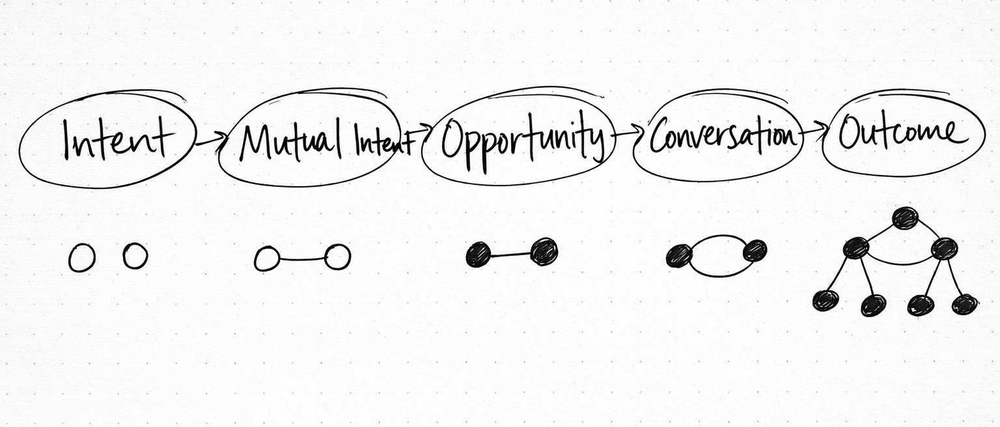

---

title: "The Magic Factory" 
date: "2026-2-10"  
description: "What it looks like when opportunity becomes programmable. "  
image: "magic-factory.gif"

---

[video](magic-factory-white.mp4)
**What if opportunity could be systematically detected, measured, and brokered?**

Imagine you’re one of those superconnectors. The ringleader of the friend group. Maybe you run an accelerator, or any sort of group that’s dense with valuable ideas. You’re constantly trying to get the right people to sit next to each other at dinner, see what happens from that collision of ideas.

The process isn't just "find people and introduce them." It's: Be the social radar. Detect intent, find mutual intent, recognize when an opportunity is forming, know when it's ready, broker it at the right moment, protect its fragility throughout.

*"Caution! Fragile package, this side up!"*

What you’re doing is assessing and moving opportunity. This is opportunity at its most basic evolutionary stage: an idea. A probability, or even just a figment of imagination.

Even at its most abstract, it can be detected and measured. It has a lifecycle: it forms, it matures, it fades. And crucially, it can be lost—through the wrong time or wrong place, or the simple fact that Molly logged off early and never saw Maya's post.

They’re also delicate objects. They shapeshift through constant movement. But in those moments when the glass stays intact, it feels like magic. Connecting with the right person at the right time, who shares your flavor of weird and just gets your idea—that’s the high we chase. But what if that sense of serendipity could also be engineered?

*What if there was infrastructure to see the moment coming?*

First, we'd need to understand what kills it. Social platforms today assume people know what they’re looking for and can say it clearly. But as we all know, we can’t always articulate what we want. Making opportunity legible starts with breaking down the messy, human bits of it.

**Opportunity comes from activity, not search.** People don’t “look for opportunities.” They don’t wake up with a clear search query for the perfect job; they retoggle their LinkedIn filters. They noodle on something, ask questions to their friends and mentors, hem and haw, overthink it and finally commit to some sort of next step. Opportunity arises from the residue of activity. That’s why labs discover grants while doing research, or investors see deals while talking to operators.

**Opportunities depend on trust.** Technology can’t replace the trust that already resides within familiar contexts - but it can augment it. This is where agents come in, as actors that operate within existing networks of trust. You're not outsourcing judgment to a machine, but rather delegating the exhausting work of constant pattern-matching.

**Opportunity requires privacy before visibility.** They need space to take shape. A place to putter around before parading itself on external channels or social media platforms. So we propose to instead start with intents: a private signal on what you're actually looking for, expressed in natural language. Not a post for the algorithm, just the raw need or the first insight.

**Opportunity timing is rarely written down.** You can’t always see “the right time” but you can feel it. It’s sensed in conversations: through tone, urgency, and what people start or stop saying. Maybe they just crossed a threshold (funding, conviction, frustration), or they’re tinkering with a prototype but haven’t registered the business. In any case, public channels aren’t usually where you discover someone at those early moments.

The right connections enable not just the match itself, but also - the opportunity to have a conversation, an agreement, something that tees up to the outcome you’re looking for. Opportunities are a networked object: the smallest unit at which value formation becomes legible. They form when shared intent and timing bring people together in a way that feels trustworthy, worthwhile, and appropriate to act on.

The progression usually looks like:

**Intent → Mutual Intent → Opportunity → Conversation → Outcome**

Imagine this flow embedded and repeated into an existing community where latent potential is high. Every unmatched intent is unrealized economic value. A founder’s looking for a commercial leader, and the right partnerships expert is a few channels away. The community holds the supply and demand, and it just needs a bit of engineering to read between the lines.

Now rather than relying on a human superconnector or erratic server channels, an ambient discovery layer of agents works on their behalf: to see opportunity forming, broker it systematically, and protect it throughout. Ambient discovery enables something even more quietly powerful: ambient optimism.

What if the machine could see what community leaders see? What if their tribal knowledge was able to be translated into something machine-readable, so we can pursue growth in calm confidence, trusting that the right opportunities will find us?

Enter the magic factory.