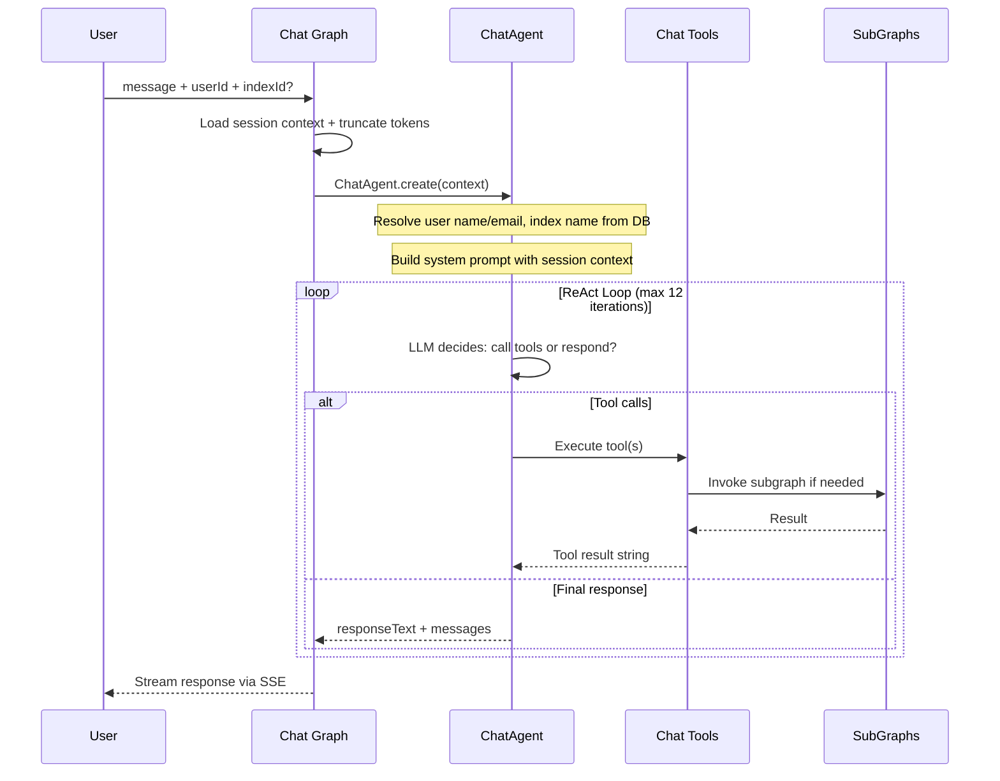
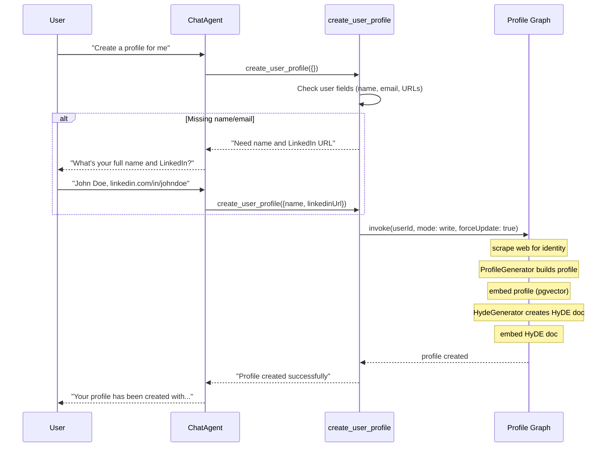
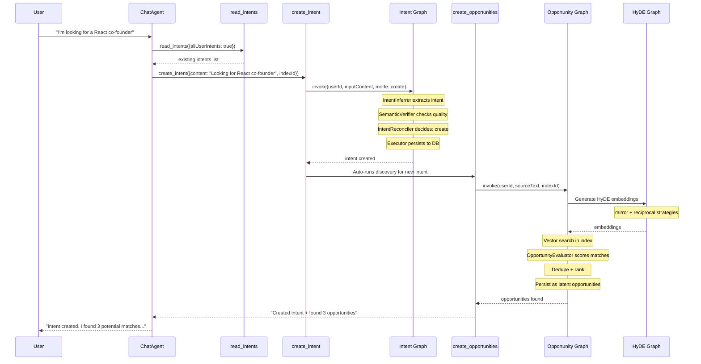
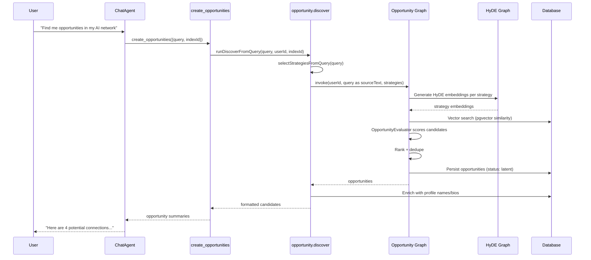
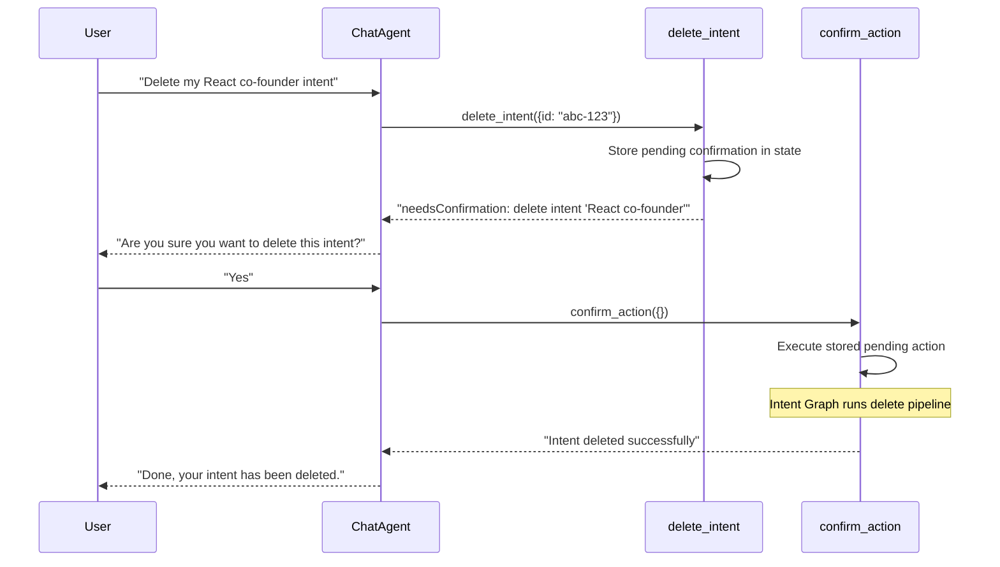
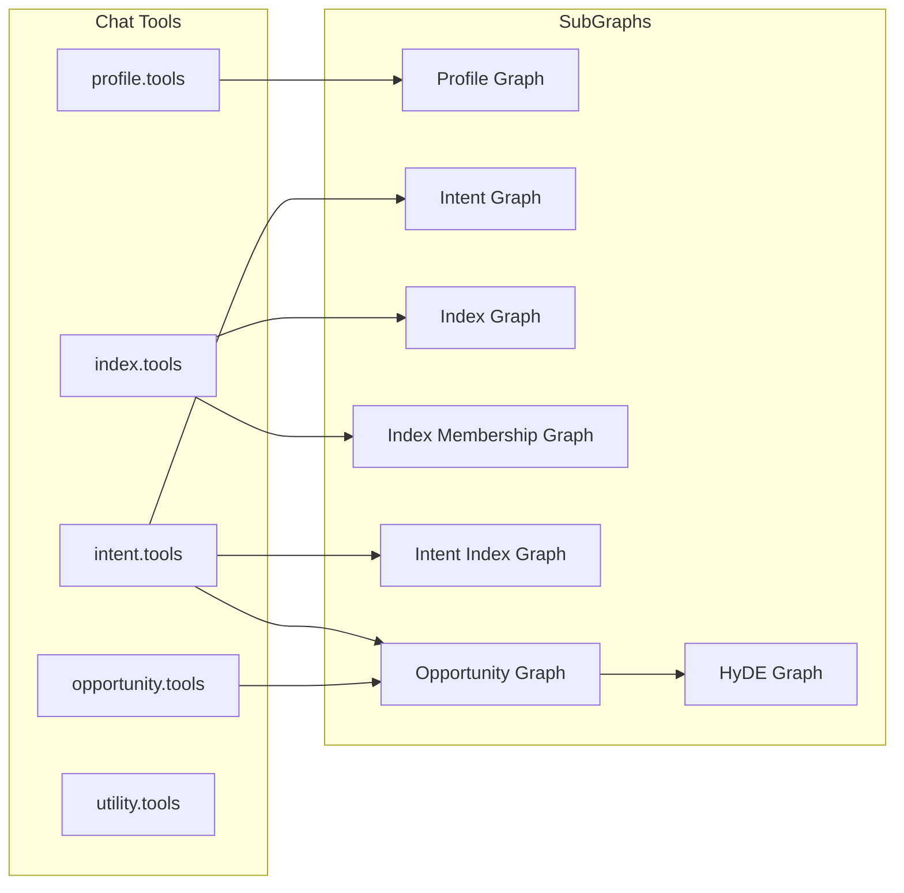

# Index Network Protocol

This is the protocol layer: LangGraph workflows, AI agents, chat tools, and supporting infrastructure that power intent-driven discovery.

## Directory Structure

```
protocol/src/lib/protocol/
  graphs/           8 LangGraph state machines (NAME.graph.ts)
  states/           8 graph state definitions (NAME.state.ts)
  tools/            Chat tool definitions by domain
  agents/           Flat, domain-prefixed AI agents
  streamers/        SSE streaming for chat
  support/          Infrastructure & utilities
  interfaces/       Adapter contracts (database, embedder, cache, queue, scraper)
  docs/             Design papers and templates
```

## Graphs

| Graph | File | Purpose |
|-------|------|---------|
| Chat | `chat.graph.ts` | ReAct agent loop — LLM calls tools, responds to user |
| Intent | `intent.graph.ts` | Extract, verify, reconcile, and persist intents |
| Profile | `profile.graph.ts` | Generate/update user profiles with scraping and embedding |
| Opportunity | `opportunity.graph.ts` | HyDE-based discovery: search, evaluate, rank, persist |
| HyDE | `hyde.graph.ts` | Generate hypothetical documents and embed them (cache-aware) |
| Index | `index.graph.ts` | Manage index CRUD |
| Index Membership | `index_membership.graph.ts` | Manage index member join/leave |
| Intent Index | `intent_index.graph.ts` | Evaluate and assign/unassign intents to indexes |

## Agents

| Agent | File | Used By |
|-------|------|---------|
| ChatAgent | `chat.agent.ts` | Chat graph — orchestrates tool calls |
| Chat Prompt | `chat.prompt.ts` | Chat graph — system prompt and context builder |
| Title Generator | `chat.title.generator.ts` | Chat service — generates conversation titles |
| Intent Inferrer | `intent.inferrer.ts` | Intent graph — extracts intents from content |
| Intent Reconciler | `intent.reconciler.ts` | Intent graph — decides create/update/expire actions |
| Intent Verifier | `intent.verifier.ts` | Intent graph — validates felicity conditions |
| Intent Indexer | `intent.indexer.ts` | Intent Index graph — scores intent-index fit |
| Profile Generator | `profile.generator.ts` | Profile graph — generates profiles from identity data |
| Profile HyDE Gen | `profile.hyde.generator.ts` | Profile graph — generates HyDE docs for profiles |
| HyDE Generator | `hyde.generator.ts` | HyDE graph — generates hypothetical match documents |
| HyDE Strategies | `hyde.strategies.ts` | HyDE graph — strategy registry (mirror, reciprocal, etc.) |
| Opp. Evaluator | `opportunity.evaluator.ts` | Opportunity graph — scores and synthesizes matches |

## Tools (Chat)

| File | Tools |
|------|-------|
| `profile.tools.ts` | read_user_profiles, create_user_profile, update_user_profile |
| `intent.tools.ts` | read_intents, create_intent, update_intent, delete_intent, create_intent_index, read_intent_indexes, delete_intent_index |
| `index.tools.ts` | read_indexes, read_users, create_index, update_index, delete_index, create_index_membership |
| `opportunity.tools.ts` | create_opportunities, list_my_opportunities, send_opportunity |
| `utility.tools.ts` | scrape_url, confirm_action, cancel_action |

## Core Concepts

| Concept | Description |
|---------|-------------|
| **User** | Identity (session auth). Has one profile and many intents. Member of indexes. |
| **Intent** | What someone is seeking or offering. Has payload, embedding, status, semantic governance fields. Lives in indexes via intent_indexes. |
| **Index** | A community/context. Has members with roles, optional prompt for LLM evaluation, join policy. Discovery is index-scoped. |
| **Profile** | User's identity, narrative, skills, interests. Has vector embedding and optional HyDE embedding. Used for verification and search. |
| **Opportunity** | A suggested connection between two parties in an index. Status: latent -> pending -> accepted/rejected/expired. |
| **HyDE** | Hypothetical Document Embeddings. Generated "ideal match" text per strategy, then embedded for richer semantic search. |

## How a User Message Flows Through the System

When a user sends a message, everything starts at the Chat Graph. The agent decides which tools to call, and those tools invoke subgraphs.

### High-Level Flow



### What Happens Inside the Agent Loop

The ChatAgent is a ReAct-style loop. Each iteration, the LLM sees the full conversation (system prompt + messages + tool results) and either makes tool calls or produces a final response.


### Example: "Create a profile for me"



### Example: "I'm looking for a React co-founder"



### Example: "Find me opportunities" (ad-hoc discovery)



### Example: Destructive action with confirmation



### Tool-to-Subgraph Mapping



## Business Logic Flows

### Intent Lifecycle

Handled by the **Intent Graph**:
- **Create**: prep -> inference (ExplicitIntentInferrer) -> verification (SemanticVerifier) -> reconciler (create/update/expire) -> executor (DB persist)
- **Update**: same pipeline with `update` mode and optional target intent IDs
- **Delete**: prep -> reconciler -> executor (no inference/verification)

Intent-index assignment is separate, handled by the **Intent Index Graph** when the user acts in chat.

### Profile Lifecycle

Handled by the **Profile Graph** in two modes:
- **Query**: load existing profile only
- **Write**: check_state -> scrape (if needed) -> generate_profile -> embed_save_profile -> generate_hyde -> embed_save_hyde

### Opportunity Discovery

Handled by the **Opportunity Graph**:
1. **Prep**: load user's index memberships and active intents
2. **Scope**: determine which indexes to search
3. **Discovery**: HyDE generation -> vector search within target indexes
4. **Evaluation**: OpportunityEvaluator scores and synthesizes dual interpretations
5. **Ranking**: sort by score, dedupe by (source, candidate, index)
6. **Persist**: create opportunity records in `latent` status

Opportunities are created when users ask ("find me opportunities") or when intents are created. Users explicitly "send" to promote latent -> pending.

### Chat as Orchestration

The **Chat Graph** is a ReAct loop: one agent_loop node where the LLM decides to call tools or respond. All protocol operations are accessible through tools. Destructive actions (update/delete) require user confirmation via confirm_action/cancel_action.

## Key Invariants

- **Index-scoped discovery**: opportunities only between intents sharing an index
- **Dual synthesis**: each opportunity has interpretations for both parties
- **Agent creates, user sends**: opportunities start as latent drafts
- **Destructive actions require confirmation**: update/delete go through pending confirmation flow
- **Intent quality gates**: SemanticVerifier checks felicity conditions before persistence

## Support Files

| File | Purpose |
|------|---------|
| `protocol.logger.ts` | Protocol-layer logging with call-scoped tracing |
| `chat.checkpointer.ts` | PostgresSaver singleton for LangGraph state persistence |
| `chat.utils.ts` | Token counting and context window management |
| `opportunity.discover.ts` | Ad-hoc discovery from chat queries |
| `opportunity.presentation.ts` | Pure presentation layer for opportunity cards |
| `opportunity.utils.ts` | HyDE strategy selection and actor role derivation |

## Data Model

Full schema: `protocol/src/schemas/database.schema.ts`

Core tables: `users`, `user_profiles`, `intents`, `indexes`, `index_members`, `intent_indexes`, `opportunities`, `hyde_documents`, `chat_sessions`, `chat_messages`.
