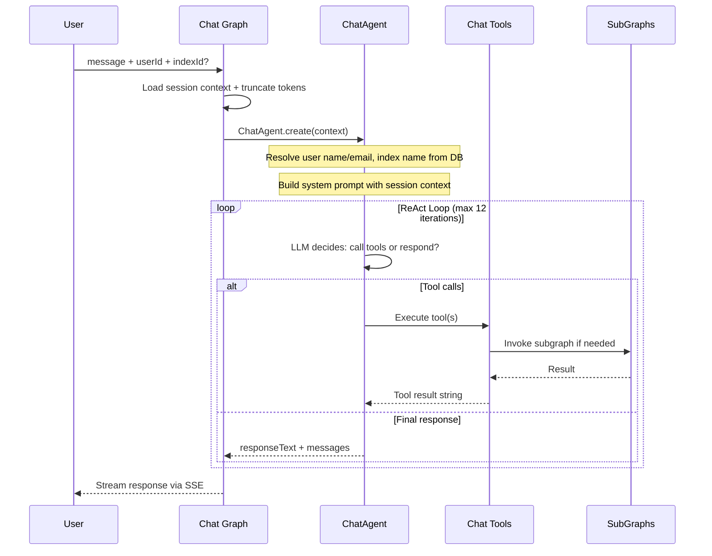
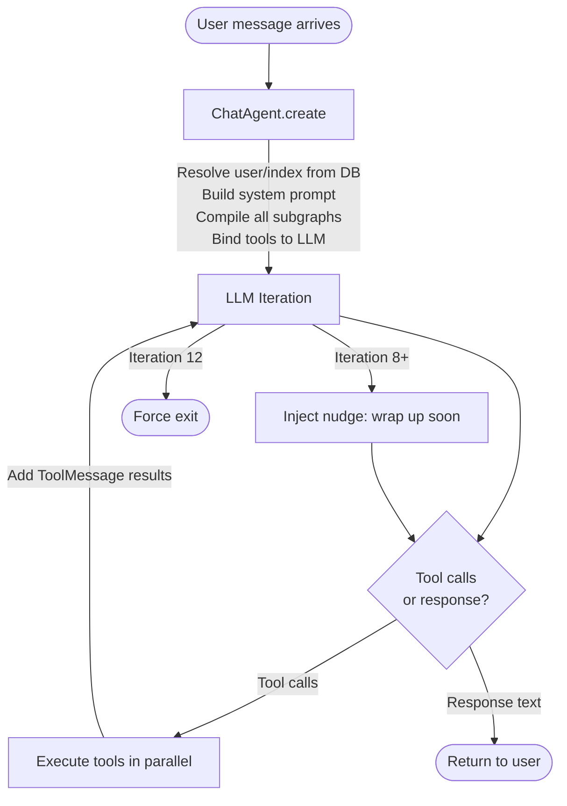
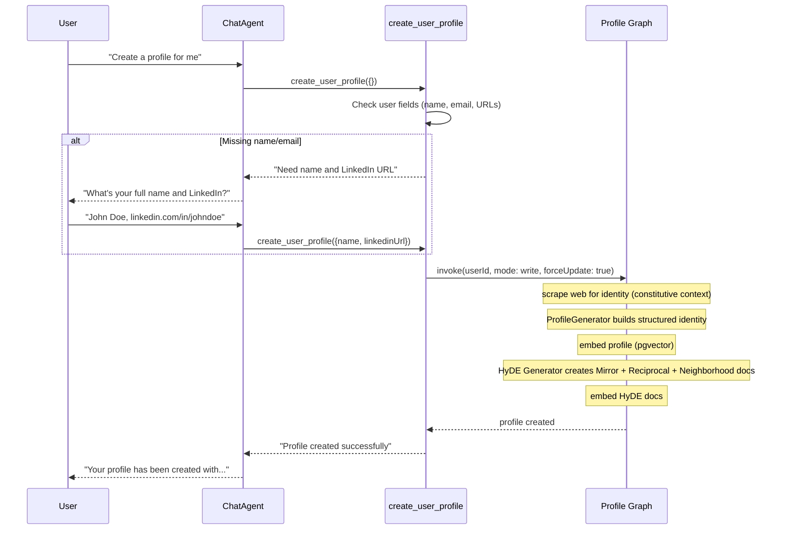
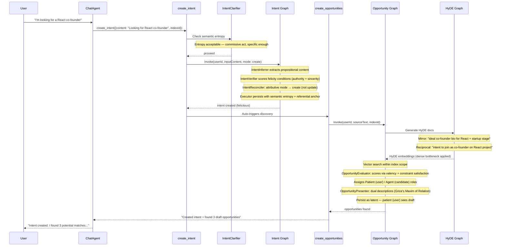
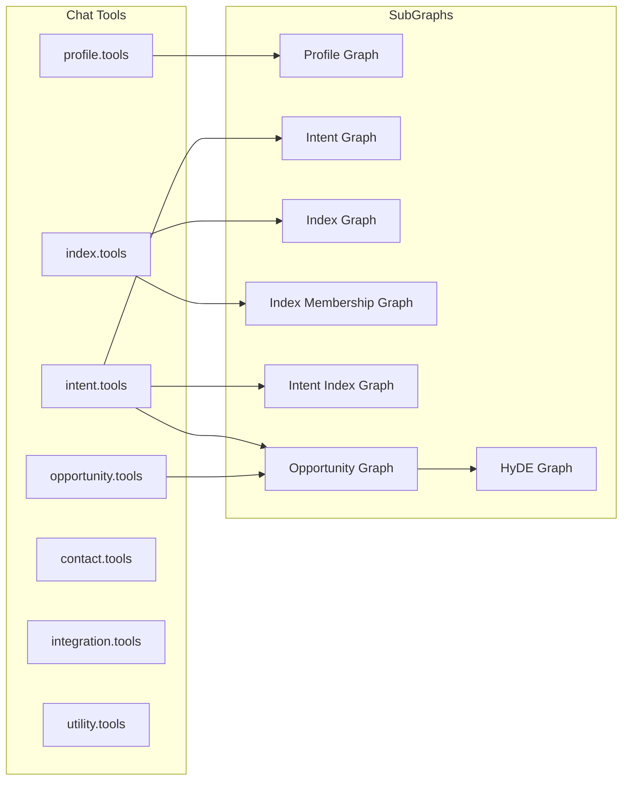

# Index Network Protocol

This is the protocol layer: LangGraph workflows, AI agents, chat tools, and supporting infrastructure that power intent-driven discovery.

## Directory Structure

```
packages/protocol/src/
  graphs/           11 LangGraph state machines (NAME.graph.ts)
  states/           11 graph state definitions (NAME.state.ts)
  tools/            Chat tool definitions by domain
  agents/           Flat, domain-prefixed AI agents
  streamers/        SSE streaming for chat
  support/          Infrastructure & utilities
  interfaces/       Adapter contracts (database, embedder, cache, queue, scraper)
  docs/             Design papers (linguistic and semantic governance theory)
```

## Graphs

| Graph | File | Purpose |
|-------|------|---------|
| Chat | `chat.graph.ts` | ReAct agent loop — LLM calls tools, responds to user |
| Intent | `intent.graph.ts` | Clarify, infer, verify felicity conditions, reconcile, and persist intents |
| Profile | `profile.graph.ts` | Generate/update user profiles with scraping and embedding |
| Opportunity | `opportunity.graph.ts` | HyDE-based discovery: search, evaluate (valency), rank, persist |
| HyDE | `hyde.graph.ts` | Generate hypothetical documents (Mirror, Reciprocal, Neighborhood) and embed them (cache-aware) |
| Index | `index.graph.ts` | Manage index CRUD |
| Index Membership | `index_membership.graph.ts` | Manage index member join/leave |
| Intent Index | `intent_index.graph.ts` | Evaluate and assign/unassign intents to indexes |
| Home | `home.graph.ts` | Categorize and curate home feed content |
| Maintenance | `maintenance.graph.ts` | Periodic maintenance tasks (feed health, opportunity expiration) |
| Negotiation | `negotiation.graph.ts` | Multi-turn bilateral negotiation flows |

## Agents

| Agent | File | Used By |
|-------|------|---------|
| ChatAgent | `chat.agent.ts` | Chat graph — orchestrates ReAct loop and tool calls |
| Chat Prompt | `chat.prompt.ts` | Chat graph — system prompt and context builder |
| Chat Prompt Modules | `chat.prompt.modules.ts` | Chat graph — composable prompt modules |
| Title Generator | `chat.title.generator.ts` | Chat service — generates conversation titles |
| Intent Clarifier | `intent.clarifier.ts` | Intent tools — checks specificity (entropy threshold) before persisting |
| Intent Inferrer | `intent.inferrer.ts` | Intent graph — extracts structured intents from free text |
| Intent Reconciler | `intent.reconciler.ts` | Intent graph — determines create/update/expire action (Donnellan's distinction) |
| Intent Verifier | `intent.verifier.ts` | Intent graph — classifies speech act type; scores felicity conditions and semantic entropy |
| Intent Indexer | `intent.indexer.ts` | Intent Index graph — scores intent-index fit as relevancy score |
| Profile Generator | `profile.generator.ts` | Profile graph — generates structured identity from raw data |
| Profile HyDE Generator | `profile.hyde.generator.ts` | Profile graph — generates HyDE documents for profiles |
| HyDE Generator | `hyde.generator.ts` | HyDE graph — generates hypothetical match documents per strategy |
| HyDE Strategies | `hyde.strategies.ts` | HyDE graph — LLM-selected strategy registry |
| Opportunity Evaluator | `opportunity.evaluator.ts` | Opportunity graph — scores matches; assigns valency role (Agent/Patient/Peer) |
| Opportunity Presenter | `opportunity.presenter.ts` | Home graph, opportunity tools — generates role-appropriate descriptions (Grice's Maxim of Relation) |
| Home Categorizer | `home.categorizer.ts` | Home graph — classifies and curates feed items |
| Suggestion Generator | `suggestion.generator.ts` | Chat — generates proactive reply suggestions |
| Lens Inferrer | `lens.inferrer.ts` | HyDE graph — infers target corpus (profiles vs. intents) per strategy |
| Negotiation Proposer | `negotiation.proposer.ts` | Negotiation graph — drafts negotiation proposals |
| Negotiation Responder | `negotiation.responder.ts` | Negotiation graph — evaluates and responds to proposals |
| Negotiation Insights Generator | `negotiation.insights.generator.ts` | Negotiation graph — synthesizes negotiation session insights |
| Invite Generator | `invite.generator.ts` | Invite flow — generates personalized invite messages |

## Tools (Chat)

| File | Tools |
|------|-------|
| `profile.tools.ts` | `read_user_profiles`, `create_user_profile`, `update_user_profile`, `complete_onboarding` |
| `intent.tools.ts` | `read_intents`, `create_intent`, `update_intent`, `delete_intent`, `create_intent_index`, `read_intent_indexes`, `delete_intent_index` |
| `index.tools.ts` | `read_indexes`, `read_index_memberships`, `create_index`, `update_index`, `delete_index`, `create_index_membership`, `delete_index_membership` |
| `opportunity.tools.ts` | `create_opportunities`, `list_opportunities`, `update_opportunity` |
| `contact.tools.ts` | `import_contacts`, `list_contacts`, `add_contact`, `remove_contact` |
| `integration.tools.ts` | `import_gmail_contacts` |
| `utility.tools.ts` | `scrape_url`, `read_docs` |

## Core Concepts

The system models human collaboration through a linguistic and information-theoretic framework. Terminology follows Speech Act Theory (Searle), Hypothetical Document Embeddings (Gao et al.), Valency theory (Hanks), and Gricean pragmatics.

| Concept | Description |
|---------|-------------|
| **User** | Identity (session auth). Has one profile and many intents. Member of indexes. |
| **Profile** | User's identity, narrative, skills, interests. Provides the **constitutive context** — what the user *is* and therefore has the *authority* to do. Has vector embedding and HyDE embeddings for semantic matching. |
| **Intent** | A **commissive** or **directive speech act** — what the user is seeking or offering. Modelled as a Specific Indefinite: a future state uniquely satisfiable by a matching candidate. Each intent carries a **semantic entropy** score (constraint density), a **referential anchor** (Donnellan referential/attributive mode), and **felicity condition** scores (preparatory/authority and sincerity). |
| **Index** | A community scoped to a purpose. Has members with roles, an optional prompt for LLM-based evaluation, and a join policy. Discovery is index-scoped — opportunities only arise between intents that share an index. |
| **Opportunity** | A **semantic intersection**: the point where a candidate's constitutive facts (profile/intent) satisfy the propositional content of a source intent. Scored by the Opportunity Evaluator using **valency** (argument-role fit) and **constraint satisfaction**. Presented with dual descriptions per **Grice's Maxim of Relation** — one framed for the source, one for the candidate. |
| **HyDE** | Hypothetical Document Embeddings. Three strategy types: **Mirror** (hallucinates the ideal candidate's biography — direct satisfaction of the intent's conditions), **Reciprocal** (hallucinates a complementary intent via meaning postulates — "if A wants to buy, infer B wants to sell"), and **Neighborhood** (hallucinates the discourse frame/community context). The encoder acts as a dense bottleneck filtering hallucinated specifics and retaining the semantic signal. |
| **Felicity Conditions** | Scores evaluating whether an intent is valid: **preparatory condition** (does the user have the authority/skills for this act?) and **sincerity condition** (is the commitment genuine?). Intents that fail these are classified as *misfired* or *void*. |
| **Semantic Entropy** | Constraint density of an intent (0.0 = maximally constrained, 1.0 = trivially satisfiable). High-entropy intents ("I want a job") trigger an **elaboration loop** — a request for missing constraints before persistence. |
| **Semantic Governance** | The full pipeline that ensures only felicitous, low-entropy, referentially anchored intents enter the graph. Implemented by the Intent Verifier and Intent Clarifier agents. |
| **Valency Roles** | Derived from the argument structure of the source intent's goal verb (Hanks). The Opportunity Evaluator assigns: **Agent** (the one who can offer/do), **Patient** (the one who needs/seeks), or **Peer** (symmetric collaboration). These roles govern opportunity visibility and the notification cascade. |

## Opportunity Lifecycle and Role-Based Visibility

Opportunities flow through a tiered reveal cascade determined by actor role, not by who triggered discovery.

### Status Tiers

- **Tier 0** (`latent`): Draft — first tier can send
- **Tier 1** (`pending`): Sent — next tier is notified and can act
- **Tier 2** (`accepted` / `rejected` / `expired`): Terminal — all actors can see

### Role–Visibility Matrix

| Role | No introducer | With introducer |
|------|--------------|-----------------|
| `introducer` | n/a | Tier 0 (always) |
| `patient` | Tier 0 (always) | Tier 1 (pending+) |
| `agent` | Tier 1 (pending+) | Tier 2 (accepted+) |
| `peer` | Tier 0 (always) | Tier 0 (always) |
| `party` | same as patient | same as patient |

### Status Transitions

| Transition | Who triggers |
|-----------|-------------|
| `latent → pending` | Introducer, patient (no introducer), peer, party (no introducer) |
| `pending → accepted` | Recipient accepts |
| `pending → rejected` | Recipient declines |
| `latent/pending → expired` | TTL or user dismisses |

## How a User Message Flows Through the System

When a user sends a message, everything starts at the Chat Graph. The agent decides which tools to call, and those tools invoke subgraphs.

### High-Level Flow



### What Happens Inside the Agent Loop

The ChatAgent is a ReAct-style loop. Each iteration, the LLM sees the full conversation (system prompt + messages + tool results) and either makes tool calls or produces a final response.



### Example: "Create a profile for me"



### Example: "I'm looking for a React co-founder"



### Tool-to-Subgraph Mapping



## Business Logic Flows

### Intent Lifecycle

Handled by the **Intent Graph**:
1. **Clarification** (pre-graph): `IntentClarifier` checks semantic entropy — if the utterance is underspecified (high entropy, trivially satisfiable), it returns an elaboration request rather than persisting.
2. **Inference**: `IntentInferrer` extracts structured intents (propositional content) from free text. Can produce multiple intents from a single input.
3. **Semantic Verification**: `IntentVerifier` classifies the speech act type (commissive, directive, assertive) and scores felicity conditions — preparatory (authority) and sincerity. Assigns `felicitous`, `misfired`, or `void` status.
4. **Reconciliation**: `IntentReconciler` applies Donnellan's distinction — referential intents (user has a specific target in mind) update an existing record; attributive intents (any member of a class) create a new one if sufficiently different.
5. **Persistence**: Executor writes the intent with `semanticEntropy`, `referentialAnchor`, `speechActType`, and `felicityScores` fields.

### HyDE Pipeline

Handled by the **HyDE Graph** and **Profile Graph**:
- **Mirror strategy**: Generates a hypothetical biography of the ideal candidate whose constitutive facts satisfy the intent's conditions of satisfaction (direct valency slot fill).
- **Reciprocal strategy**: Generates a complementary intent via meaning postulates — "If user A wants to invest, infer B wants funding."
- **Neighborhood strategy**: Generates a discourse frame document (conference abstract, forum thread) that contextualises the intent topic via frame semantics.
- The encoder acts as a **dense bottleneck** — hallucinated specifics (fake names, invented details) are filtered out; only the semantic relevance signal is preserved in the embedding.

### Opportunity Discovery

Handled by the **Opportunity Graph**:
1. **Prep**: Load user's indexed intents and HyDE documents.
2. **Scope**: Determine target indexes (single or all).
3. **Discovery**: Vector similarity search using HyDE embeddings within index scope. Both source and candidate require HyDE documents.
4. **Evaluation**: `OpportunityEvaluator` scores each candidate pair via **valency** (does the candidate fill the argument slot of the source's goal verb?) and **constraint satisfaction** (does the candidate's constitutive context match all extracted constraints?). Assigns role: Agent, Patient, or Peer.
5. **Presentation**: `OpportunityPresenter` generates two descriptions per Grice's Maxim of Relation — one from the source's frame, one from the candidate's frame.
6. **Persist**: Opportunities created as `latent` with actor roles. Role determines tier-0 visibility (see Opportunity Lifecycle above).

### Chat as Orchestration

The **Chat Graph** is a ReAct loop: one `agent_loop` node where the LLM decides to call tools or respond. All protocol operations are accessible through tools. Destructive actions (update/delete) go through the intent/opportunity graph's reconciler rather than direct mutation, preserving semantic governance invariants.

## Key Invariants

- **Index-scoped discovery**: Opportunities only arise between intents sharing an index
- **Specific Indefinites only**: Underspecified (high-entropy) intents do not enter the graph — they trigger elaboration
- **Felicity-gated persistence**: Only intents classified as `felicitous` are persisted as active
- **Dual synthesis**: Each opportunity has descriptions framed for both actors (Grice's Maxim of Relation)
- **Role-based visibility**: Opportunity reveal follows a tiered cascade; agent visibility is deferred when a patient or introducer is present
- **Encoding bottleneck**: HyDE hallucinations are never stored or shown — only their embeddings are used

## Support Files

| File | Purpose |
|------|---------|
| `protocol.logger.ts` | Protocol-layer logging with call-scoped tracing |
| `chat.checkpointer.ts` | PostgresSaver singleton for LangGraph state persistence |
| `chat.utils.ts` | Token counting and context window management |
| `opportunity.discover.ts` | Ad-hoc discovery from chat queries |
| `opportunity.card-text.ts` | Pure card text generation for opportunity display |
| `opportunity.enricher.ts` | Enrich opportunity records with profile data |
| `opportunity.utils.ts` | HyDE strategy selection and actor role derivation |
| `introducer.discovery.ts` | Introducer-driven contact-pair discovery |
| `feed.health.ts` | Feed health metrics computation |

## Data Model

Full schema: `protocol/src/schemas/database.schema.ts`

Core tables: `users`, `user_profiles`, `intents`, `indexes`, `index_members`, `intent_indexes`, `opportunities`, `hyde_documents`, `chat_sessions`, `chat_messages`.
