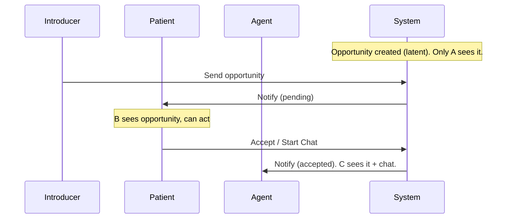
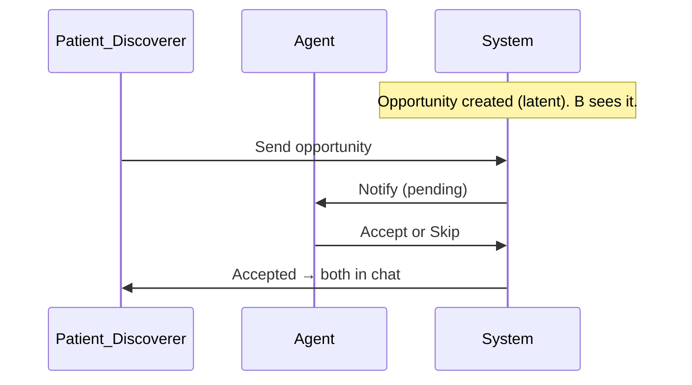
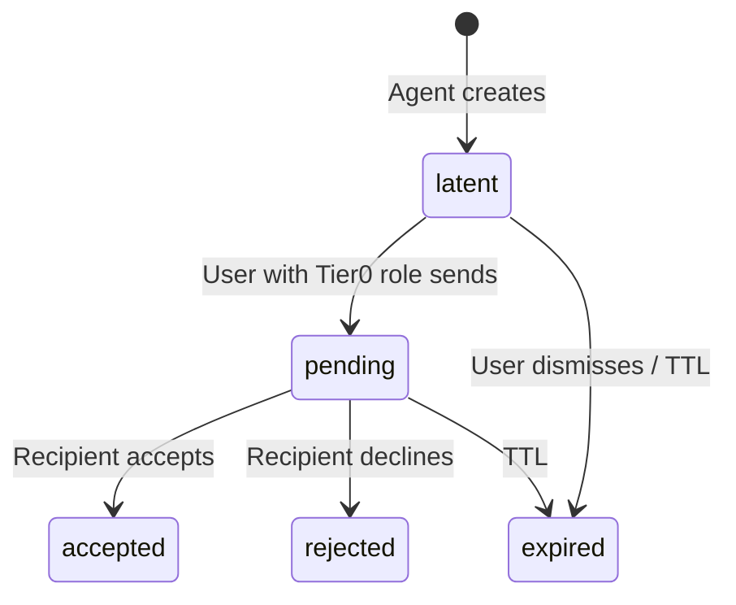
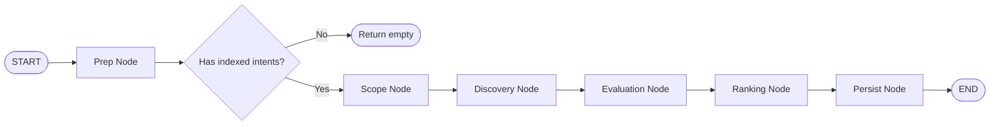

# Latent Opportunity Lifecycle

> **Status**: Design  
> **Related**: Opportunity Graph (`../graphs/opportunity.graph.ts`), Chat Graph, Intent Graph

## Motivation

Users should not create opportunities directly. Instead, the agent discovers, evaluates, and presents opportunities — and the user chooses to act on them (send, dismiss, or explore). Visibility of an opportunity is **role-based**: who can see it at each status depends on the actor's role (introducer, patient, agent, peer, party), not on who triggered discovery.

### Target Experience

```
User:  "Hey agent, find opportunities for me"
Agent: [Runs opportunity graph: prep → scope → discovery → evaluation → ranking → persist]
       "Here are some draft opportunities. You can send an intro when ready."

User sees only the drafts they are allowed to see (by role). User chooses to send or dismiss.
When user sends, the system notifies the appropriate next person based on roles.
```

## Role-Based Visibility Model

Who can see an opportunity is determined by **actor role** and **status**. There is no separate "sender" or "receiver" at creation time. The presence of an **introducer** pushes the patient and agent one tier later in the reveal cascade.

### Status Tiers

- **Tier 0** (`latent`): First to see — can send to next tier
- **Tier 1** (`pending`): Sees after someone sent; can accept/reject
- **Tier 2** (`accepted`, `rejected`, `expired`): Terminal; all actors can see

### Role–Visibility Matrix

| Role        | No introducer     | With introducer   |
|------------|--------------------|--------------------|
| `introducer` | n/a                | Tier 0 (always)   |
| `patient`    | Tier 0 (always)    | Tier 1 (pending+) |
| `agent`      | Tier 1 (pending+)  | Tier 2 (accepted+) |
| `peer`       | Tier 0 (always)    | Tier 0 (always)   |
| `party`      | same as patient    | same as patient   |

- **Introducer**: Curator who created the match (e.g. "I think Alice and Bob should meet"). Sees the opportunity from latent and can send it to the patient.
- **Patient**: The one who **needs** something (seeker, requester). Sees early and decides whether to reach out.
- **Agent**: The one who **can offer** something (helper, provider). Sees last when there is an introducer (only after patient has committed); sees at pending when there is no introducer.
- **Peer**: Symmetric collaboration. Both see from latent; either can send.
- **Party**: Generic (e.g. manual creation). Treated like patient for visibility.

### Compact Visibility Rule

A user can see an opportunity if and only if:

- They are an **introducer** or **peer**, or
- They are **patient** or **party** and (status is not latent, or there is no introducer), or
- They are **agent** and (status is accepted/rejected/expired, or (status is not latent and there is no introducer)).

## Three Scenarios

### Scenario 1: Introducer Recommends Two People (A introduces B ↔ C)

- **Latent**: Only the introducer (A) sees the opportunity.
- **A sends** → status becomes `pending`. The **patient** (e.g. B) is notified and can now see it.
- **Patient sends message** (e.g. "Start Chat") → status becomes `accepted`. The **agent** (C) now sees it and is auto-added to the chat.



### Scenario 2: User Discovers Connection with Someone Else (B discovers B ↔ C)

- **Latent**: The **patient** (B) sees it (B is the discoverer and has the "need" role in this example). If B were the **agent** (has something to offer), B would **not** see the draft — only the patient (C) would see it once sent.
- **B sends** → `pending`. The **agent** (C) is notified and can accept/reject.
- **C accepts** → `accepted`; both see it and chat starts.



### Scenario 3: Peer Match (Both Are Peers)

- **Latent**: **Both** peers see the opportunity.
- **Either peer sends** → `pending`. The other peer is notified.
- **Other peer accepts** → `accepted`; both can start talking.

```mermaid
sequenceDiagram
    participant P1 as Peer1
    participant P2 as Peer2
    participant Sys as System

    Note over Sys: Opportunity created (latent). Both see it.
    P1->>Sys: Send opportunity
    Sys->>P2: Notify (pending)
    P2->>Sys: Accept
    Note over Sys: accepted; both see it
```

## Status Transitions and Who Triggers Them

| Transition     | Who can trigger                          |
|----------------|------------------------------------------|
| latent → pending | Introducer, patient (no introducer), peer, party (no introducer) |
| pending → accepted | Recipient accepts (e.g. Start Chat)  |
| pending → rejected | Recipient declines (e.g. Skip)     |
| latent/pending → expired | TTL or user dismisses              |

## Notification Targeting (Send Node)

When an opportunity is promoted from latent to pending, **only the role that becomes visible at the next tier** is notified:

- **Sender is introducer** → notify **patient** (and party if present).
- **Sender is patient or party** (no introducer) → notify **agent**.
- **Sender is peer** → notify the **other peer(s)**.

No schema changes are required; targeting is derived from `actors[].role`.

## Key Constraint: Index-Scoped Discovery

**Opportunities only exist between intents that share the same index.** Non-indexed intents cannot participate in opportunity discovery. This ensures:

- Privacy: Users control which indexes they join and what they share
- Relevance: Index prompts guide matching
- Scalability: Search space is bounded by index membership

## Lifecycle State Diagram



## Opportunity Graph Architecture

### Graph Structure (Linear Multi-Step Workflow)



**Linear Flow:** `Prep → Scope → Discovery → Evaluation → Ranking → Persist → END`

**Node Responsibilities:**

1. **Prep Node**: Fetches user's active indexed intents with hyde documents; validates at least one indexed intent.
2. **Scope Node**: Determines target indexes (single or all user indexes).
3. **Discovery Node**: Vector similarity search on hyde embeddings within index scope; returns candidate pairs.
4. **Evaluation Node**: OpportunityEvaluator (LLM) scores each candidate and assigns **valency role** (Agent / Patient / Peer). This role drives visibility and notifications.
5. **Ranking Node**: Sorts by score, applies limit, deduplicates.
6. **Persist Node**: Creates opportunities with `status: 'latent'` and assigns actor roles from valency.

### Send Node (CRUD Path)

- Validates opportunity is latent and caller is an actor.
- **Authorization**: Only actors who can see at latent (introducer, peer, patient without introducer, party without introducer) can send.
- Updates status to `pending` and queues notifications only to the role that becomes visible at the next tier (see Notification Targeting above).

## How LLM Agents Use Role Information

| Agent | Use of roles |
|-------|------------------|
| **OpportunityEvaluator** | Assigns valency (Agent / Patient / Peer). System prompt explains that this choice controls who sees the opportunity and when — Agent last, Patient early, Peer both. |
| **OpportunityPresenter** | Receives `viewerRole`. Suggests role-appropriate actions (e.g. patient: "Send a message to start the conversation"; agent: "Someone is interested — check their message"; introducer: "Share this with [name]"). |
| **Chat agent** | Prompt explains role-based visibility in natural language (no jargon). Tool descriptions state that send_opportunity notifies "the next person in the connection" based on roles, and that list_opportunities only returns opportunities the user is allowed to see. |

## Chat Tools

| Tool | Behavior |
|------|----------|
| `create_opportunities` | Invokes opportunity graph; creates draft (latent) opportunities. Discovered opportunities may not all be visible to the user depending on their role in each match. |
| `list_opportunities` | Returns opportunities the user is allowed to see (role + status). Filtered by visibility guard in `getOpportunitiesForUser`. |
| `send_opportunity` | Promotes latent → pending. System notifies the appropriate next person by role (patient if sent by introducer, agent if sent by patient, other peer if sent by peer). |

## Data Flow (Discovery and Send)

Discovery flow is unchanged: user or agent calls `create_opportunities` → graph runs Prep through Persist → opportunities created as latent. List and send use the same graph in read/send mode; `getOpportunitiesForUser` applies the role-based visibility guard so only allowed opportunities are returned. On send, only the next-tier role is notified.

## Hyde Documents and Semantic Search

Discovery uses hyde embeddings for vector similarity within index scope. Both source and candidate must have hyde documents. The evaluator assigns valency (and thus actor roles) from profile and intent context; that assignment is persisted and used for visibility and notifications only — no extra schema fields.

## Future Extensions

- Notification on pending → accepted (agent notified when patient sends message).
- Chat creation on accept.
- Auto-expire latent after N days.
- Batch send; UI card view with send/dismiss.
- Fast path: list-only and send-only routes without running discovery.
