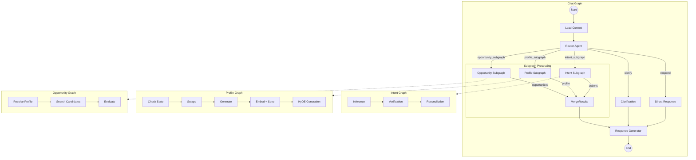

# Chat Graph Architecture

This document describes the architecture for implementing the Chat Graph in [`chat.graph.ts`](protocol/src/lib/protocol/graphs/chat/chat.graph.ts). The Chat Graph is a LangGraph implementation that orchestrates conversational AI interactions and coordinates subgraphs for Intent, Profile, and Opportunity processing.

---

## Overview

The Chat Graph serves as the **primary orchestration layer** for user conversations. It:

1. Receives user messages and maintains conversation history
2. Analyzes user intent to determine appropriate routing
3. Delegates to specialized subgraphs (Intent, Profile, Opportunity)
4. Synthesizes results into coherent user responses

This follows the **Semantic Intersection** model described in the protocol docs, where:
- **Profile** = User Authority (Constitutive Context)
- **Intent** = User Goals (Commissive Acts)
- **Opportunity** = Constraint Satisfaction (Matching)

---

## 1. Chat Graph State Schema

### File: [`chat.graph.state.ts`](protocol/src/lib/protocol/graphs/chat/chat.graph.state.ts)

```typescript
import { Annotation, MessagesAnnotation, messagesStateReducer } from "@langchain/langgraph";
import type { BaseMessage } from "@langchain/core/messages";
import { ProfileDocument } from "../../agents/profile/profile.generator";
import { IntentReconcilerOutput } from "../../agents/intent/reconciler/intent.reconciler";
import { Opportunity } from "../../agents/opportunity/opportunity.evaluator";

// --- Routing Decision Types ---
export type RouteTarget = 
  | "intent_subgraph"    // Process intents (goals, preferences)
  | "profile_subgraph"   // Profile queries/updates
  | "opportunity_subgraph" // Discovery and matching
  | "respond"            // Direct response (no subgraph needed)
  | "clarify";           // Need more information

export interface RoutingDecision {
  target: RouteTarget;
  confidence: number;
  reasoning: string;
  extractedContext?: string; // Relevant context from message
}

// --- Subgraph Output Types ---
export interface SubgraphResults {
  intent?: {
    actions: IntentReconcilerOutput['actions'];
    inferredIntents: string[];
  };
  profile?: {
    updated: boolean;
    profile?: ProfileDocument;
  };
  opportunity?: {
    opportunities: Opportunity[];
    searchQuery?: string;
  };
}

// --- Main State Annotation ---
export const ChatGraphState = Annotation.Root({
  // === Messages (Chat History) ===
  messages: Annotation<BaseMessage[]>({
    reducer: messagesStateReducer,
    default: () => [],
  }),

  // === User Context ===
  userId: Annotation<string>,
  
  userProfile: Annotation<ProfileDocument | undefined>({
    reducer: (curr, next) => next ?? curr,
    default: () => undefined,
  }),
  
  activeIntents: Annotation<string>({
    reducer: (curr, next) => next ?? curr,
    default: () => "",
  }),

  // === Routing State ===
  routingDecision: Annotation<RoutingDecision | undefined>({
    reducer: (curr, next) => next,
    default: () => undefined,
  }),

  // === Subgraph Outputs ===
  subgraphResults: Annotation<SubgraphResults>({
    reducer: (curr, next) => ({ ...curr, ...next }),
    default: () => ({}),
  }),

  // === Response Generation ===
  responseText: Annotation<string | undefined>({
    reducer: (curr, next) => next,
    default: () => undefined,
  }),

  // === Error Handling ===
  error: Annotation<string | undefined>({
    reducer: (curr, next) => next,
    default: () => undefined,
  }),
});

export type ChatGraphStateType = typeof ChatGraphState.State;
```

### State Schema Rationale

| Field | Purpose | Reducer Logic |
|-------|---------|---------------|
| `messages` | Chat history with `messagesStateReducer` | Appends messages, handles IDs |
| `userId` | Required input for all DB operations | Simple value |
| `userProfile` | Cached profile for context enrichment | Keep existing if no update |
| `activeIntents` | Formatted intent list for reconciliation | Overwrite on refresh |
| `routingDecision` | Router output determining flow | Overwrite per turn |
| `subgraphResults` | Accumulated outputs from subgraphs | Merge objects |
| `responseText` | Final generated response | Overwrite per turn |

---

## 2. Chat Agents Architecture

### File Structure
```
protocol/src/lib/protocol/agents/chat/
├── router.agent.ts           # Analyzes messages, determines routing
├── response.generator.ts     # Synthesizes final user response
├── context.enricher.ts       # (Optional) Loads/enriches context
└── README.md                 # Agent documentation
```

### 2.1 RouterAgent

**Purpose:** Analyze user message and determine which subgraph/action to route to.

**File:** [`router.agent.ts`](protocol/src/lib/protocol/agents/chat/router.agent.ts)

```typescript
// --- System Prompt ---
const systemPrompt = `
You are a Routing Agent for a professional networking platform.
Your task is to analyze user messages and determine the appropriate action.

## Routing Options

1. **intent_subgraph** - Route here when:
   - User expresses goals, desires, or things they want to achieve
   - User updates preferences or changes their objectives
   - User mentions looking for something specific
   - Keywords: "I want", "looking for", "need", "goal", "interested in"

2. **profile_subgraph** - Route here when:
   - User asks about their profile or wants to see their info
   - User wants to update their bio, skills, or attributes
   - User asks "who am I" or "what do you know about me"
   - Keywords: "my profile", "update my", "my skills", "about me"

3. **opportunity_subgraph** - Route here when:
   - User asks for recommendations or matches
   - User wants to discover people or opportunities
   - User asks "who should I meet" or "find me someone"
   - Keywords: "find", "recommend", "discover", "match", "connect me"

4. **respond** - Route here when:
   - General conversation or greeting
   - Questions about how the system works
   - Acknowledgment or follow-up to previous action
   - No specific action needed

5. **clarify** - Route here when:
   - Message is ambiguous or too vague
   - Multiple possible interpretations exist
   - Missing critical context to proceed

## Output Rules
- Always provide confidence (0.0-1.0) in your routing decision
- Extract any relevant context that should be passed to the subgraph
- Explain your reasoning briefly
`;

// --- Response Schema ---
const routingResponseSchema = z.object({
  target: z.enum([
    "intent_subgraph",
    "profile_subgraph", 
    "opportunity_subgraph",
    "respond",
    "clarify"
  ]).describe("The routing target"),
  confidence: z.number().min(0).max(1).describe("Confidence in this routing decision"),
  reasoning: z.string().describe("Brief explanation for this routing choice"),
  extractedContext: z.string().optional().describe("Relevant context extracted from message")
});

export type RouterOutput = z.infer<typeof routingResponseSchema>;

export class RouterAgent {
  private agent: ReactAgent;

  constructor() {
    this.agent = createAgent({ 
      model, 
      responseFormat: routingResponseSchema, 
      systemPrompt 
    });
  }

  public async invoke(
    userMessage: string, 
    profileContext: string,
    activeIntents: string
  ): Promise<RouterOutput> {
    const messages = [
      new HumanMessage(`
# User Message
${userMessage}

# User Profile Context
${profileContext || "No profile loaded yet."}

# Active Intents
${activeIntents || "No active intents."}
      `)
    ];
    
    const result = await this.agent.invoke({ messages });
    return routingResponseSchema.parse(result.structuredResponse);
  }
}
```

### 2.2 ResponseGeneratorAgent

**Purpose:** Synthesize final response to user based on subgraph results and conversation context.

**File:** [`response.generator.ts`](protocol/src/lib/protocol/agents/chat/response.generator.ts)

```typescript
// --- System Prompt ---
const systemPrompt = `
You are a Response Generator for a professional networking platform.
Your task is to synthesize a helpful, natural response based on system outputs.

## Response Guidelines

1. **Be Conversational** - Write like a helpful assistant, not a robot
2. **Be Specific** - Reference actual results, not generic responses
3. **Be Actionable** - Suggest next steps when appropriate
4. **Be Concise** - Respect user's time, avoid unnecessary verbosity

## Context Handling

- If intents were created/updated: Acknowledge the change and summarize
- If profile was updated: Confirm what was changed
- If opportunities found: Present them clearly with key highlights
- If clarification needed: Ask specific questions
- If no action taken: Engage naturally in conversation

## Tone
Professional but friendly. Like a knowledgeable colleague who wants to help.
`;

// --- Response Schema ---
const responseSchema = z.object({
  response: z.string().describe("The response to send to the user"),
  suggestedActions: z.array(z.string()).optional().describe("Suggested follow-up actions")
});

export type ResponseGeneratorOutput = z.infer<typeof responseSchema>;

export class ResponseGeneratorAgent {
  private agent: ReactAgent;

  constructor() {
    this.agent = createAgent({ 
      model, 
      responseFormat: responseSchema, 
      systemPrompt 
    });
  }

  public async invoke(
    originalMessage: string,
    routingDecision: RoutingDecision,
    subgraphResults: SubgraphResults
  ): Promise<ResponseGeneratorOutput> {
    const messages = [
      new HumanMessage(`
# Original User Message
${originalMessage}

# Routing Decision
Target: ${routingDecision.target}
Reasoning: ${routingDecision.reasoning}

# Subgraph Results
${JSON.stringify(subgraphResults, null, 2)}

Generate an appropriate response for the user.
      `)
    ];
    
    const result = await this.agent.invoke({ messages });
    return responseSchema.parse(result.structuredResponse);
  }
}
```

### 2.3 ContextEnricherAgent (Optional)

**Purpose:** Load and enrich user context before processing. Can be a simple function rather than full agent.

```typescript
// This could be a simple utility function in the graph nodes
// rather than a full agent, since it's primarily DB operations

export async function enrichContext(
  userId: string,
  database: Database
): Promise<{ profile: ProfileDocument | null; activeIntents: string }> {
  const profile = await database.getProfile(userId);
  
  // Format active intents as string for prompts
  // This would call your intent service
  const activeIntents = ""; // Load from DB
  
  return { profile, activeIntents };
}
```

---

## 3. Graph Node Structure

### Node Diagram

```
┌─────────────────────────────────────────────────────────────────┐
│                         Chat Graph                               │
├─────────────────────────────────────────────────────────────────┤
│                                                                  │
│   START                                                          │
│     │                                                            │
│     ▼                                                            │
│  ┌──────────────┐                                                │
│  │ load_context │ ← Fetch profile & intents from DB              │
│  └──────┬───────┘                                                │
│         │                                                        │
│         ▼                                                        │
│  ┌──────────────┐                                                │
│  │    router    │ ← RouterAgent determines target                │
│  └──────┬───────┘                                                │
│         │                                                        │
│         ▼  (Conditional Edges)                                   │
│  ┌──────┴──────┬──────────────┬──────────────┬──────────┐        │
│  │             │              │              │          │        │
│  ▼             ▼              ▼              ▼          ▼        │
│ ┌────┐    ┌─────────┐   ┌───────────┐   ┌────────┐  ┌───────┐   │
│ │INT │    │ PROFILE │   │OPPORTUNITY│   │RESPOND │  │CLARIFY│   │
│ └─┬──┘    └────┬────┘   └─────┬─────┘   └───┬────┘  └───┬───┘   │
│   │            │              │             │           │        │
│   └────────────┴──────────────┴─────────────┴───────────┘        │
│                              │                                   │
│                              ▼                                   │
│                    ┌──────────────────┐                          │
│                    │generate_response │ ← ResponseGeneratorAgent │
│                    └────────┬─────────┘                          │
│                             │                                    │
│                             ▼                                    │
│                           END                                    │
│                                                                  │
└─────────────────────────────────────────────────────────────────┘
```

### Node Definitions

| Node | Type | Description |
|------|------|-------------|
| `load_context` | Function | Loads user profile and active intents from DB |
| `router` | Agent | Analyzes message and returns routing decision |
| `intent_subgraph` | Compiled Subgraph | IntentGraphFactory.createGraph() |
| `profile_subgraph` | Compiled Subgraph | ProfileGraphFactory.createGraph() |
| `opportunity_subgraph` | Compiled Subgraph | OpportunityGraph.compile() |
| `respond_direct` | Function | Handles direct responses (no subgraph) |
| `clarify` | Function | Generates clarification request |
| `generate_response` | Agent | Synthesizes final user response |

---

## 4. Graph Implementation

### File: [`chat.graph.ts`](protocol/src/lib/protocol/graphs/chat/chat.graph.ts)

```typescript
import { StateGraph, START, END, Command } from "@langchain/langgraph";
import { HumanMessage, AIMessage } from "@langchain/core/messages";
import { ChatGraphState, RouteTarget } from "./chat.graph.state";
import { RouterAgent } from "../../agents/chat/router.agent";
import { ResponseGeneratorAgent } from "../../agents/chat/response.generator";
import { IntentGraphFactory } from "../intent/intent.graph";
import { ProfileGraphFactory } from "../profile/profile.graph";
import { OpportunityGraph } from "../opportunity/opportunity.graph";
import { Database } from "../../interfaces/database.interface";
import { Embedder } from "../../interfaces/embedder.interface";
import { Scraper } from "../../interfaces/scraper.interface";
import { log } from "../../../log";

export class ChatGraphFactory {
  constructor(
    private database: Database,
    private embedder: Embedder,
    private scraper: Scraper
  ) {}

  public createGraph() {
    // Initialize Agents
    const routerAgent = new RouterAgent();
    const responseGenerator = new ResponseGeneratorAgent();

    // Initialize Subgraphs
    const intentGraph = new IntentGraphFactory().createGraph();
    const profileGraph = new ProfileGraphFactory(
      this.database, 
      this.embedder, 
      this.scraper
    ).createGraph();
    const opportunityGraph = new OpportunityGraph(
      this.database, 
      this.embedder
    ).compile();

    // ─────────────────────────────────────────────────────────
    // NODE: Load Context
    // ─────────────────────────────────────────────────────────
    const loadContextNode = async (state: typeof ChatGraphState.State) => {
      log.info("[ChatGraph:LoadContext] Loading user context...", { 
        userId: state.userId 
      });

      const profile = await this.database.getProfile(state.userId);
      
      // TODO: Load active intents from IntentService
      const activeIntents = "No active intents."; 

      return {
        userProfile: profile ?? undefined,
        activeIntents
      };
    };

    // ─────────────────────────────────────────────────────────
    // NODE: Router
    // ─────────────────────────────────────────────────────────
    const routerNode = async (state: typeof ChatGraphState.State) => {
      const lastMessage = state.messages[state.messages.length - 1];
      const userMessage = lastMessage?.content?.toString() || "";

      log.info("[ChatGraph:Router] Analyzing message...", { 
        message: userMessage.substring(0, 50) 
      });

      const profileContext = state.userProfile 
        ? `Name: ${state.userProfile.identity.name}\n` +
          `Bio: ${state.userProfile.identity.bio}\n` +
          `Skills: ${state.userProfile.attributes.skills.join(", ")}`
        : "";

      const decision = await routerAgent.invoke(
        userMessage,
        profileContext,
        state.activeIntents
      );

      log.info("[ChatGraph:Router] Decision made", { 
        target: decision.target, 
        confidence: decision.confidence 
      });

      return {
        routingDecision: decision
      };
    };

    // ─────────────────────────────────────────────────────────
    // NODE: Intent Subgraph Wrapper
    // ─────────────────────────────────────────────────────────
    const intentSubgraphNode = async (state: typeof ChatGraphState.State) => {
      const lastMessage = state.messages[state.messages.length - 1];
      
      // Map ChatGraphState to IntentGraphState
      const intentInput = {
        userProfile: state.userProfile 
          ? JSON.stringify(state.userProfile) 
          : "",
        activeIntents: state.activeIntents,
        inputContent: lastMessage?.content?.toString() || "",
        inferredIntents: [],
        verifiedIntents: [],
        actions: []
      };

      const result = await intentGraph.invoke(intentInput);

      return {
        subgraphResults: {
          intent: {
            actions: result.actions,
            inferredIntents: result.inferredIntents.map(i => i.description)
          }
        }
      };
    };

    // ─────────────────────────────────────────────────────────
    // NODE: Profile Subgraph Wrapper
    // ─────────────────────────────────────────────────────────
    const profileSubgraphNode = async (state: typeof ChatGraphState.State) => {
      const lastMessage = state.messages[state.messages.length - 1];
      
      // Map ChatGraphState to ProfileGraphState
      const profileInput = {
        userId: state.userId,
        input: state.routingDecision?.extractedContext,
        objective: undefined,
        profile: state.userProfile,
        hydeDescription: undefined
      };

      const result = await profileGraph.invoke(profileInput);

      return {
        userProfile: result.profile,
        subgraphResults: {
          profile: {
            updated: true,
            profile: result.profile
          }
        }
      };
    };

    // ─────────────────────────────────────────────────────────
    // NODE: Opportunity Subgraph Wrapper
    // ─────────────────────────────────────────────────────────
    const opportunitySubgraphNode = async (state: typeof ChatGraphState.State) => {
      // Build HyDE description from user message context
      const hydeDescription = state.routingDecision?.extractedContext || 
        state.messages[state.messages.length - 1]?.content?.toString() || "";

      const opportunityInput = {
        options: {
          hydeDescription,
          limit: 5
        },
        sourceUserId: state.userId,
        sourceProfileContext: "",
        candidates: [],
        opportunities: []
      };

      const result = await opportunityGraph.invoke(opportunityInput);

      return {
        subgraphResults: {
          opportunity: {
            opportunities: result.opportunities,
            searchQuery: hydeDescription
          }
        }
      };
    };

    // ─────────────────────────────────────────────────────────
    // NODE: Direct Response (no subgraph needed)
    // ─────────────────────────────────────────────────────────
    const respondDirectNode = async (state: typeof ChatGraphState.State) => {
      // For simple responses, we can skip to response generation
      return {};
    };

    // ─────────────────────────────────────────────────────────
    // NODE: Clarify
    // ─────────────────────────────────────────────────────────
    const clarifyNode = async (state: typeof ChatGraphState.State) => {
      return {
        subgraphResults: {
          // Signal that clarification is needed
        }
      };
    };

    // ─────────────────────────────────────────────────────────
    // NODE: Generate Response
    // ─────────────────────────────────────────────────────────
    const generateResponseNode = async (state: typeof ChatGraphState.State) => {
      const lastMessage = state.messages[state.messages.length - 1];
      const userMessage = lastMessage?.content?.toString() || "";

      if (!state.routingDecision) {
        return {
          responseText: "I'm sorry, I couldn't process your request.",
          messages: [new AIMessage("I'm sorry, I couldn't process your request.")]
        };
      }

      const response = await responseGenerator.invoke(
        userMessage,
        state.routingDecision,
        state.subgraphResults
      );

      return {
        responseText: response.response,
        messages: [new AIMessage(response.response)]
      };
    };

    // ─────────────────────────────────────────────────────────
    // ROUTING CONDITION
    // ─────────────────────────────────────────────────────────
    const routeCondition = (state: typeof ChatGraphState.State): RouteTarget => {
      return state.routingDecision?.target || "respond";
    };

    // ─────────────────────────────────────────────────────────
    // GRAPH ASSEMBLY
    // ─────────────────────────────────────────────────────────
    const workflow = new StateGraph(ChatGraphState)
      // Add Nodes
      .addNode("load_context", loadContextNode)
      .addNode("router", routerNode)
      .addNode("intent_subgraph", intentSubgraphNode)
      .addNode("profile_subgraph", profileSubgraphNode)
      .addNode("opportunity_subgraph", opportunitySubgraphNode)
      .addNode("respond_direct", respondDirectNode)
      .addNode("clarify", clarifyNode)
      .addNode("generate_response", generateResponseNode)

      // Define Flow
      .addEdge(START, "load_context")
      .addEdge("load_context", "router")

      // Conditional Routing
      .addConditionalEdges("router", routeCondition, {
        intent_subgraph: "intent_subgraph",
        profile_subgraph: "profile_subgraph",
        opportunity_subgraph: "opportunity_subgraph",
        respond: "respond_direct",
        clarify: "clarify"
      })

      // All paths lead to response generation
      .addEdge("intent_subgraph", "generate_response")
      .addEdge("profile_subgraph", "generate_response")
      .addEdge("opportunity_subgraph", "generate_response")
      .addEdge("respond_direct", "generate_response")
      .addEdge("clarify", "generate_response")

      .addEdge("generate_response", END);

    return workflow.compile();
  }
}
```

---

## 5. Routing Logic and Triggers

### Routing Decision Matrix

| User Input Pattern | Route Target | Confidence Trigger |
|-------------------|--------------|-------------------|
| "I want to...", "Looking for...", "My goal is..." | `intent_subgraph` | High (0.8+) |
| "Update my profile", "My skills are...", "About me" | `profile_subgraph` | High (0.8+) |
| "Find people who...", "Recommend...", "Who should I meet" | `opportunity_subgraph` | High (0.8+) |
| Greetings, general questions, acknowledgments | `respond` | Medium (0.6+) |
| Ambiguous, incomplete, or confusing messages | `clarify` | Low (<0.5) |

### Trigger Examples

#### Intent Subgraph Triggers
```
✓ "I want to find a co-founder for my startup"
✓ "I'm looking to invest in DeFi projects"
✓ "My goal is to learn Rust programming"
✓ "I need help with fundraising"
```

#### Profile Subgraph Triggers
```
✓ "What do you know about me?"
✓ "Update my bio to include my new role"
✓ "Add Python to my skills"
✓ "Show me my profile"
```

#### Opportunity Subgraph Triggers
```
✓ "Find me developers who know Solidity"
✓ "Who should I connect with?"
✓ "Recommend people for my project"
✓ "Discover investors in my space"
```

---

## 6. Flow Diagram



---

## 7. File Structure

```
protocol/src/lib/protocol/
├── agents/
│   ├── chat/
│   │   ├── router.agent.ts          # Message routing logic
│   │   ├── router.agent.spec.ts     # Router tests
│   │   ├── response.generator.ts    # Response synthesis
│   │   ├── response.generator.spec.ts
│   │   ├── context.enricher.ts      # Context loading utilities
│   │   └── README.md                # Agent documentation
│   ├── intent/                      # (existing)
│   ├── opportunity/                 # (existing)
│   └── profile/                     # (existing)
│
├── graphs/
│   ├── chat/
│   │   ├── chat.graph.ts            # Main graph factory
│   │   ├── chat.graph.state.ts      # State annotation schema
│   │   └── chat.graph.spec.ts       # Graph integration tests
│   ├── intent/                      # (existing)
│   ├── opportunity/                 # (existing)
│   └── profile/                     # (existing)
│
└── interfaces/
    ├── database.interface.ts        # (existing)
    └── embedder.interface.ts        # (existing)
```

---

## 8. Database Interface Extensions

The current [`Database`](protocol/src/lib/protocol/interfaces/database.interface.ts) interface may need extensions for chat functionality:

```typescript
interface Database {
  // --- Existing Methods ---
  getProfile(userId: string): Promise<ProfileDocument | null>;
  saveProfile(userId: string, profile: ProfileDocument): Promise<void>;
  saveHydeProfile(userId: string, description: string, embedding: number[]): Promise<void>;
  getUser(userId: string): Promise<any | null>;

  // --- Proposed Extensions for Chat ---
  
  /**
   * Retrieves active intents for a user in formatted string format.
   * Used by RouterAgent for context.
   */
  getActiveIntentsFormatted(userId: string): Promise<string>;

  /**
   * Saves a chat conversation turn for persistence/debugging.
   * Optional - depends on persistence requirements.
   */
  saveChatTurn?(
    userId: string, 
    messages: BaseMessage[], 
    routingDecision: RoutingDecision
  ): Promise<void>;
}
```

---

## 9. Implementation Order

The recommended implementation order:

1. **State Schema** - Create [`chat.graph.state.ts`](protocol/src/lib/protocol/graphs/chat/chat.graph.state.ts)
2. **RouterAgent** - Create [`router.agent.ts`](protocol/src/lib/protocol/agents/chat/router.agent.ts) with tests
3. **ResponseGeneratorAgent** - Create [`response.generator.ts`](protocol/src/lib/protocol/agents/chat/response.generator.ts) with tests
4. **Graph Assembly** - Implement [`chat.graph.ts`](protocol/src/lib/protocol/graphs/chat/chat.graph.ts)
5. **Integration Tests** - Create [`chat.graph.spec.ts`](protocol/src/lib/protocol/graphs/chat/chat.graph.spec.ts)
6. **API Integration** - Connect to existing chat routes

---

## 10. Testing Strategy

### Unit Tests

```typescript
// chat.graph.spec.ts
describe('ChatGraph', () => {
  let graphRunner: CompiledGraph;
  let mockDatabase: Database;
  let mockEmbedder: Embedder;

  beforeAll(() => {
    mockDatabase = createMockDatabase();
    mockEmbedder = createMockEmbedder();
    
    const factory = new ChatGraphFactory(mockDatabase, mockEmbedder, mockScraper);
    graphRunner = factory.createGraph();
  });

  it('should route intent messages to intent subgraph', async () => {
    const result = await graphRunner.invoke({
      userId: 'test-user',
      messages: [new HumanMessage("I want to find a co-founder")],
    });
    
    expect(result.routingDecision?.target).toBe('intent_subgraph');
    expect(result.subgraphResults?.intent).toBeDefined();
  });

  it('should route profile queries to profile subgraph', async () => {
    const result = await graphRunner.invoke({
      userId: 'test-user',
      messages: [new HumanMessage("Show me my profile")],
    });
    
    expect(result.routingDecision?.target).toBe('profile_subgraph');
  });

  it('should route discovery requests to opportunity subgraph', async () => {
    const result = await graphRunner.invoke({
      userId: 'test-user',
      messages: [new HumanMessage("Find me developers who know Rust")],
    });
    
    expect(result.routingDecision?.target).toBe('opportunity_subgraph');
  });
});
```

---

## 11. Error Handling

The graph should handle errors gracefully at each node:

```typescript
const safeNodeWrapper = <T>(
  nodeFn: (state: ChatGraphStateType) => Promise<T>
) => async (state: ChatGraphStateType): Promise<T | { error: string }> => {
  try {
    return await nodeFn(state);
  } catch (error) {
    log.error("[ChatGraph] Node error", { error });
    return { error: error instanceof Error ? error.message : "Unknown error" };
  }
};
```

---

## Summary

This architecture provides:

1. **Clean Separation** - Router, Response Generator, and subgraphs have distinct responsibilities
2. **Semantic Governance** - Routing decisions follow the Profile-Intent-Opportunity model
3. **Extensibility** - New subgraphs can be added with minimal changes
4. **Testability** - Each component can be tested in isolation
5. **LangGraph Best Practices** - Uses `Annotation.Root`, `Command` pattern, and `messagesStateReducer`

The implementation follows established patterns from [`IntentGraphFactory`](protocol/src/lib/protocol/graphs/intent/intent.graph.ts:11), [`ProfileGraphFactory`](protocol/src/lib/protocol/graphs/profile/profile.graph.ts:13), and [`OpportunityGraph`](protocol/src/lib/protocol/graphs/opportunity/opportunity.graph.ts:8) while adding the orchestration layer needed for conversational interaction.
