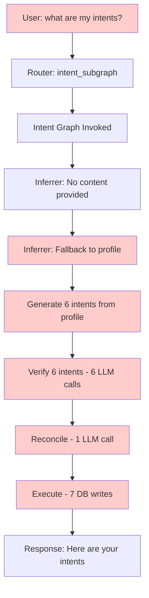
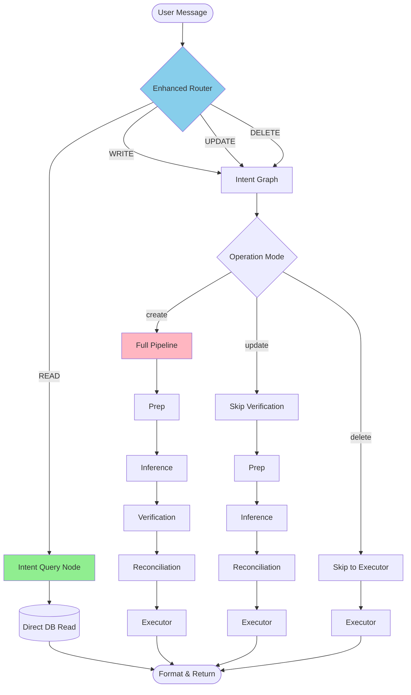
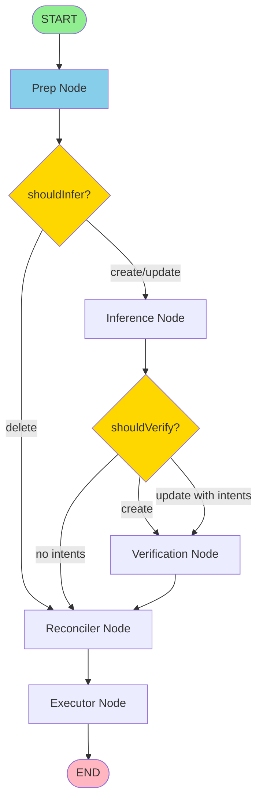

# Intent Graph Read/Write Separation Architecture

**Version:** 1.0  
**Date:** 2026-01-30  
**Status:** Design Specification  

---

## Executive Summary

The intent graph currently executes a full pipeline of inference, verification, reconciliation, and database writes for ALL operations, including simple read queries. This results in ~10 LLM calls and 7 DB writes when a user asks "what are my intents?" - an operation that should be a single DB read.

This specification proposes a comprehensive architectural solution that separates read and write operations at multiple layers, eliminating unnecessary processing for queries while preserving the full pipeline for actual intent creation/modification.

**Key Metrics:**
- **Current Read Cost**: ~10 LLM calls + 7 DB writes + 2-3 seconds
- **Proposed Read Cost**: 0 LLM calls + 1 DB read + <100ms
- **Estimated Savings**: >95% cost reduction and 20x speedup for read operations

---

## Problem Statement

### 1.1 Root Causes

#### 1.1.1 Router Lacks CRUD Detection
**File:** [`router.agent.ts:30-34`](protocol/src/lib/protocol/agents/chat/router.agent.ts:30-34)

**Problem:** The router's system prompt treats ALL intent-related messages uniformly:
```typescript
1. **intent_subgraph** - Route here when:
   - User expresses goals, desires, or things they want to achieve
   - User updates preferences or changes their objectives
   - User mentions looking for something specific
   - Keywords: "I want", "looking for", "need", "goal", "interested in"
```

**Impact:** Queries like "what are my intents?" match the keyword "intents" and get routed to `intent_subgraph`, triggering the full write pipeline.

**Evidence:** User messages demonstrating the problem:
- ✗ "what are my intents?" → routed to intent_subgraph (WRONG)
- ✗ "show my goals" → routed to intent_subgraph (WRONG)
- ✗ "list my intentions" → routed to intent_subgraph (WRONG)
- ✓ "I want to learn Rust" → intent_subgraph (CORRECT)

#### 1.1.2 Intent Graph Has No Conditional Logic
**File:** [`intent.graph.ts:196-201`](protocol/src/lib/protocol/graphs/intent/intent.graph.ts:196-201)

**Problem:** Linear edge structure with no branching:
```typescript
.addEdge(START, "prep")
.addEdge("prep", "inference")
.addEdge("inference", "verification")
.addEdge("verification", "reconciler")
.addEdge("reconciler", "executor")
.addEdge("executor", END);
```

**Impact:** Every invocation executes all 5 nodes regardless of operation type. No way to skip expensive verification/reconciliation for read operations or updates to existing intents.

#### 1.1.3 Inferrer Auto-Generates from Profile
**File:** [`explicit.inferrer.ts:93`](protocol/src/lib/protocol/agents/intent/inferrer/explicit.inferrer.ts:93)

**Problem:** Fallback behavior when content is empty:
```typescript
${content ? `## New Content\n\n${content}` : '(No content provided. Please infer intents from Profile Narrative and Aspirations)'}
```

**Impact:** When user asks "what are my intents?", the router extracts no explicit content (correctly), but the inferrer then CREATES NEW INTENTS by analyzing the profile narrative. This is the opposite of what a query should do.

**Example Flow:**
1. User: "what are my intents?"
2. Router extracts: `extractedContext: null`
3. Inferrer receives: `content: null`
4. Inferrer fallback: "infer intents from Profile Narrative"
5. Inferrer outputs: 6 new inferred intents from profile
6. Verification runs: 6 LLM calls
7. Reconciler runs: Creates/updates 7 intents
8. User gets response with NEW intents they never asked to create

#### 1.1.4 Semantic Verification on Existing Intents
**File:** [`intent.graph.ts:54-100`](protocol/src/lib/protocol/graphs/intent/intent.graph.ts:54-100)

**Problem:** Verification node runs on ALL inferred intents, including those that already exist in the database and were previously verified.

**Impact:** When reconciler decides to UPDATE an existing intent, we've already wasted an LLM call verifying it again, even though:
- It was already verified when originally created
- The payload might not have changed
- Verification results don't change for existing intents

### 1.2 Cascading Effects



**Total Cost for Simple Query:**
- LLM Calls: 1 (router) + 1 (inferrer) + 6 (verifier) + 1 (reconciler) = **9 LLM calls**
- DB Operations: 1 read (getActiveIntents) + 7 writes = **8 DB operations**
- Latency: ~2-3 seconds
- Token Cost: ~50,000 tokens

**Expected Cost:**
- LLM Calls: **0**
- DB Operations: **1 read**
- Latency: **<100ms**
- Token Cost: **0 tokens**

---

## Architectural Solution

### 2.1 Design Principles

1. **Separation of Concerns**: Read and write operations are fundamentally different and should be handled by different code paths
2. **Efficient by Default**: The most common operation (reading intents) should be the fastest path
3. **Backward Compatible**: Existing write operations continue working unchanged
4. **Fail-Safe Routing**: When in doubt, route to safe read operations rather than destructive writes
5. **Explicit Over Implicit**: Require clear user signals for write operations

### 2.2 Architecture Overview



---

## Component Specifications

### 3.1 Router Enhancement

#### 3.1.1 New Output Schema

**File:** `protocol/src/lib/protocol/agents/chat/router.agent.ts`

**Current Schema:**
```typescript
const routingResponseSchema = z.object({
  target: z.enum([
    "intent_subgraph",
    "profile_subgraph", 
    "opportunity_subgraph",
    "respond",
    "clarify"
  ]),
  confidence: z.number().min(0).max(1),
  reasoning: z.string(),
  extractedContext: z.string().nullable().optional()
});
```

**Proposed Schema:**
```typescript
const routingResponseSchema = z.object({
  target: z.enum([
    "intent_query",           // NEW: Read-only intent queries
    "intent_write",           // RENAMED: Was "intent_subgraph"
    "profile_query",          // NEW: Read-only profile queries  
    "profile_write",          // RENAMED: Was "profile_subgraph"
    "opportunity_subgraph",   // UNCHANGED
    "respond",                // UNCHANGED
    "clarify"                 // UNCHANGED
  ]),
  operationType: z.enum([    // NEW: CRUD operation type
    "read", 
    "create", 
    "update", 
    "delete"
  ]).optional(),
  confidence: z.number().min(0).max(1),
  reasoning: z.string(),
  extractedContext: z.string().nullable().optional()
});
```

**Rationale:**
- Explicit `intent_query` vs `intent_write` removes ambiguity
- `operationType` provides semantic information for graph processing
- Profile operations can benefit from same read/write separation
- Backward compatible: code can map old target names to new ones

#### 3.1.2 Enhanced System Prompt

**File:** `protocol/src/lib/protocol/agents/chat/router.agent.ts`

**Additions to System Prompt:**
```typescript
const systemPrompt = `
You are a Routing Agent for a professional networking platform.
Your task is to analyze user messages and determine the appropriate action.

## CRITICAL: Read vs Write Detection

Before selecting a routing target, first determine the user's INTENT:

### READ Operations (Queries)
Route to *_query targets when the user is:
- **Asking questions** about existing data
- **Requesting information** to be displayed
- **Checking status** of their data

Linguistic Signals for READ:
- Question words: "what", "show", "list", "tell me", "do I have"
- Request verbs: "see", "view", "check", "display", "get"
- Plural references: "my intents", "my goals" (asking about collection)
- Past/present tense: "what are", "what is", "have I"

Examples:
✓ "what are my intents?" → intent_query (operationType: read)
✓ "show me my goals" → intent_query (operationType: read)
✓ "list my current intentions" → intent_query (operationType: read)
✓ "do I have any active goals?" → intent_query (operationType: read)
✓ "what's my profile?" → profile_query (operationType: read)

### WRITE Operations (Assertions/Commands)
Route to *_write targets when the user is:
- **Declaring new information** (commissives)
- **Committing to actions** (declarations)
- **Requesting changes** to existing data
- **Expressing desires** for the future

Linguistic Signals for WRITE:
- Commissive verbs: "I want", "I will", "I'm going to", "I plan to"
- Directive verbs: "add", "create", "update", "change", "delete", "remove"
- Future tense: "I want to learn", "looking for", "interested in"
- Singular declarations: "my goal is", "I need to"

Examples:
✓ "I want to learn Rust" → intent_write (operationType: create)
✓ "looking for a co-founder" → intent_write (operationType: create)
✓ "update my bio to..." → profile_write (operationType: update)
✓ "I'm interested in AI" → intent_write (operationType: create)
✓ "remove my coding goal" → intent_write (operationType: delete)

### UPDATE Operations (Modifications)
Explicitly mentioned changes to existing data:
✓ "change my goal from X to Y" → intent_write (operationType: update)
✓ "update my learning intent" → intent_write (operationType: update)

### DELETE Operations (Removal)
Explicit removal or abandonment:
✓ "delete my goal about coding" → intent_write (operationType: delete)
✓ "I'm done with machine learning" → intent_write (operationType: delete)
✓ "remove my intent to travel" → intent_write (operationType: delete)

## Routing Options

1. **intent_query** - READ ONLY: Fetch and display existing intents
   - Use when: User asks questions about their intents
   - operationType: "read"
   
2. **intent_write** - WRITE: Create, update, or delete intents
   - Use when: User expresses new goals, updates, or deletions
   - operationType: "create" | "update" | "delete"

3. **profile_query** - READ ONLY: Display profile information
   - Use when: User asks about their profile
   - operationType: "read"

4. **profile_write** - WRITE: Update profile data
   - Use when: User wants to modify their profile
   - operationType: "update"

5. **opportunity_subgraph** - Discovery and matching
   - Use when: User wants recommendations or connections
   - No operationType needed

6. **respond** - Direct conversational response
   - Use when: General conversation or system questions
   - No operationType needed

7. **clarify** - Ambiguous or unclear
   - Use when: Cannot determine intent
   - No operationType needed

## Decision Algorithm

1. First, detect if message is a QUESTION or ASSERTION
2. If question → check subject matter → route to *_query
3. If assertion → check subject matter → route to *_write
4. Set operationType based on linguistic analysis
5. Provide high confidence (>0.8) for clear read/write distinction

## Output Rules
- Always set operationType for intent_* and profile_* routes
- Default to READ when ambiguous (safer than accidental writes)
- Provide confidence (0.0-1.0) based on signal clarity
- Extract relevant context for write operations only
- Explain reasoning with specific linguistic evidence
`;
```

**Key Changes:**
1. Explicit read/write detection guidelines
2. Linguistic signal taxonomy
3. Decision algorithm with clear priority
4. Safety-first: default to read when uncertain
5. Examples demonstrating each operation type

#### 3.1.3 Fallback Safety Logic

**File:** `protocol/src/lib/protocol/agents/chat/router.agent.ts`

**Add validation after LLM response:**

```typescript
public async invoke(
  userMessage: string, 
  profileContext: string,
  activeIntents: string
): Promise<RouterOutput> {
  // ... existing code ...
  
  const result = await this.model.invoke(messages);
  const output = routingResponseSchema.parse(result);
  
  // SAFETY: Apply fallback logic for ambiguous routing
  const safeOutput = this.applySafetyRules(output, userMessage);
  
  return safeOutput;
}

/**
 * Applies safety rules to routing decisions.
 * Prevents accidental writes when intent is unclear.
 */
private applySafetyRules(
  output: RouterOutput, 
  userMessage: string
): RouterOutput {
  // Rule 1: Low confidence on write operations → downgrade to read
  if (
    (output.target === 'intent_write' || output.target === 'profile_write') &&
    output.confidence < 0.6
  ) {
    log.warn('[RouterAgent] Low confidence write operation downgraded to read', {
      originalTarget: output.target,
      confidence: output.confidence
    });
    
    return {
      ...output,
      target: output.target.replace('_write', '_query') as RouteTarget,
      operationType: 'read',
      confidence: output.confidence,
      reasoning: `Downgraded to read due to low confidence. Original: ${output.reasoning}`
    };
  }
  
  // Rule 2: Write operation without operationType → infer from target or default to create
  if (
    (output.target === 'intent_write' || output.target === 'profile_write') &&
    !output.operationType
  ) {
    log.warn('[RouterAgent] Write operation missing operationType, defaulting to create');
    return {
      ...output,
      operationType: 'create'
    };
  }
  
  // Rule 3: Query target with question marks → ensure operationType is read
  if (
    (output.target === 'intent_query' || output.target === 'profile_query') &&
    output.operationType !== 'read'
  ) {
    log.warn('[RouterAgent] Query target with non-read operationType, correcting');
    return {
      ...output,
      operationType: 'read'
    };
  }
  
  return output;
}
```

**Rationale:**
- Defense-in-depth: even if LLM misclassifies, safety rules catch it
- Low confidence writes are dangerous → downgrade to safe reads
- Explicit validation prevents silent failures
- Logged warnings aid debugging

---

### 3.2 Chat Graph Integration

#### 3.2.1 New Intent Query Node

**File:** `protocol/src/lib/protocol/graphs/chat/chat.graph.ts`

**Add new node for direct intent queries:**

```typescript
/**
 * NODE: Intent Query (Read-Only)
 * Directly fetches and formats active intents without graph processing.
 * This is the fast path for "what are my intents?" queries.
 */
const intentQueryNode = async (state: typeof ChatGraphState.State) => {
  log.info("[ChatGraph:IntentQuery] Fetching active intents (read-only)...");
  
  try {
    const activeIntents = await this.database.getActiveIntents(state.userId);
    
    log.info("[ChatGraph:IntentQuery] Retrieved intents", {
      count: activeIntents.length
    });
    
    // Format intents for response generator
    const formattedIntents = activeIntents.map(intent => ({
      id: intent.id,
      description: intent.payload,
      summary: intent.summary,
      createdAt: intent.createdAt
    }));
    
    const subgraphResults: SubgraphResults = {
      intent: {
        mode: 'query',
        intents: formattedIntents,
        count: formattedIntents.length
      }
    };
    
    return { subgraphResults };
  } catch (error) {
    log.error("[ChatGraph:IntentQuery] Query failed", { 
      error: error instanceof Error ? error.message : String(error) 
    });
    return { 
      subgraphResults: { 
        intent: { 
          mode: 'query', 
          intents: [], 
          count: 0,
          error: 'Failed to fetch intents' 
        } 
      },
      error: "Intent query failed"
    };
  }
};
```

**Add to graph assembly:**

```typescript
const workflow = new StateGraph(ChatGraphState)
  .addNode("load_context", loadContextNode)
  .addNode("router", routerNode)
  .addNode("intent_query", intentQueryNode)      // NEW
  .addNode("intent_write", intentWriteNode)      // RENAMED from intent_subgraph
  .addNode("profile_query", profileQueryNode)    // NEW
  .addNode("profile_write", profileWriteNode)    // RENAMED from profile_subgraph
  .addNode("opportunity_subgraph", opportunitySubgraphNode)
  .addNode("respond_direct", respondDirectNode)
  .addNode("clarify", clarifyNode)
  .addNode("generate_response", generateResponseNode)
  
  .addEdge(START, "load_context")
  .addEdge("load_context", "router")
  
  // Update conditional routing
  .addConditionalEdges("router", routeCondition, {
    intent_query: "intent_query",              // NEW
    intent_write: "intent_write",              // NEW
    profile_query: "profile_query",            // NEW
    profile_write: "profile_write",            // NEW
    opportunity_subgraph: "opportunity_subgraph",
    respond: "respond_direct",
    clarify: "clarify"
  })
  
  // All paths lead to response generation
  .addEdge("intent_query", "generate_response")      // NEW
  .addEdge("intent_write", "generate_response")      // RENAMED
  .addEdge("profile_query", "generate_response")     // NEW
  .addEdge("profile_write", "generate_response")     // RENAMED
  .addEdge("opportunity_subgraph", "generate_response")
  .addEdge("respond_direct", "generate_response")
  .addEdge("clarify", "generate_response")
  
  .addEdge("generate_response", END);
```

#### 3.2.2 Updated Route Condition

**File:** `protocol/src/lib/protocol/graphs/chat/chat.graph.ts`

```typescript
const routeCondition = (state: typeof ChatGraphState.State): string => {
  const target = state.routingDecision?.target || "respond";
  
  const validTargets = [
    "intent_query",
    "intent_write",
    "profile_query",
    "profile_write",
    "opportunity_subgraph",
    "respond",
    "clarify"
  ];
  
  if (!validTargets.includes(target)) {
    log.error("[ChatGraph:RouteCondition] Invalid routing target", {
      target,
      fallback: "respond"
    });
    return "respond";
  }
  
  log.info("[ChatGraph:RouteCondition] Routing", {
    target,
    operationType: state.routingDecision?.operationType,
    confidence: state.routingDecision?.confidence
  });
  
  return target;
};
```

---

### 3.3 Intent Graph Refactoring

#### 3.3.1 Enhanced Graph State

**File:** `protocol/src/lib/protocol/graphs/intent/intent.graph.state.ts`

**Add operation mode to state:**

```typescript
export const IntentGraphState = Annotation.Root({
  // --- Inputs (Required at start) ---
  userId: Annotation<string>,
  userProfile: Annotation<string>,
  inputContent: Annotation<string | undefined>,
  
  // NEW: Operation mode controls graph flow
  operationMode: Annotation<'create' | 'update' | 'delete'>({
    reducer: (curr, next) => next,
    default: () => 'create',
  }),
  
  // NEW: For update/delete operations, specify intent IDs
  targetIntentIds: Annotation<string[]>({
    reducer: (curr, next) => next,
    default: () => [],
  }),
  
  // --- Populated by Graph ---
  activeIntents: Annotation<string>({
    reducer: (curr, next) => next,
    default: () => "",
  }),
  
  inferredIntents: Annotation<InferredIntent[]>({
    reducer: (curr, next) => next,
    default: () => [],
  }),
  
  verifiedIntents: Annotation<VerifiedIntent[]>({
    reducer: (curr, next) => next,
    default: () => [],
  }),
  
  actions: Annotation<IntentReconcilerOutput['actions']>({
    reducer: (curr, next) => next,
    default: () => [],
  }),
  
  executionResults: Annotation<ExecutionResult[]>({
    reducer: (curr, next) => next,
    default: () => [],
  }),
});
```

#### 3.3.2 Conditional Graph Flow

**File:** `protocol/src/lib/protocol/graphs/intent/intent.graph.ts`

**Refactor from linear edges to conditional routing:**

```typescript
export class IntentGraphFactory {
  constructor(private database: IntentGraphDatabase) { }

  public createGraph() {
    const inferrer = new ExplicitIntentInferrer();
    const verifier = new SemanticVerifierAgent();
    const reconciler = new IntentReconcilerAgent();

    // --- NODE DEFINITIONS (mostly unchanged) ---
    const prepNode = async (state: typeof IntentGraphState.State) => {
      log.info("[Graph:Prep] Fetching active intents...");
      const activeIntents = await this.database.getActiveIntents(state.userId);
      
      const formattedActiveIntents = activeIntents
        .map(i => `ID: ${i.id}, Description: ${i.payload}, Summary: ${i.summary || 'N/A'}`)
        .join('\n') || "No active intents.";
      
      return { activeIntents: formattedActiveIntents };
    };

    const inferenceNode = async (state: typeof IntentGraphState.State) => {
      log.info("[Graph:Inference] Starting inference...", {
        operationMode: state.operationMode,
        hasContent: !!state.inputContent
      });
      
      // MODIFIED: Pass operation mode to inferrer to control fallback behavior
      const result = await inferrer.invoke(
        state.inputContent || null, 
        state.userProfile,
        {
          allowProfileFallback: state.operationMode === 'create' && !state.inputContent,
          operationMode: state.operationMode
        }
      );
      
      return { inferredIntents: result.intents };
    };

    const verificationNode = async (state: typeof IntentGraphState.State) => {
      const intents = state.inferredIntents;
      
      // OPTIMIZATION: Skip verification for update operations on existing intents
      if (state.operationMode === 'update' && intents.length === 0) {
        log.info("[Graph:Verification] Skipping - update mode with no new intents");
        return { verifiedIntents: [] };
      }
      
      if (intents.length === 0) {
        return { verifiedIntents: [] };
      }

      log.info(`[Graph:Verification] Verifying ${intents.length} intents...`);

      const verificationResults = await Promise.all(
        intents.map(async (intent): Promise<VerifiedIntent | null> => {
          try {
            const verdict = await verifier.invoke(intent.description, state.userProfile);
            
            const VALID_TYPES = ['COMMISSIVE', 'DIRECTIVE', 'DECLARATION'];
            if (!VALID_TYPES.includes(verdict.classification)) {
              log.warn(`[Graph:Verification] Dropping intent: "${intent.description}"`);
              return null;
            }

            const score = Math.min(
              verdict.felicity_scores.authority,
              verdict.felicity_scores.sincerity,
              verdict.felicity_scores.clarity
            );

            return {
              ...intent,
              verification: verdict,
              score
            };
          } catch (e) {
            log.error(`[Graph:Verification] Error verifying intent`, { error: e });
            return null;
          }
        })
      );

      const verified = verificationResults.filter((i): i is VerifiedIntent => i !== null);
      log.info(`[Graph:Verification] ${verified.length}/${intents.length} passed.`);

      return { verifiedIntents: verified };
    };

    const reconciliationNode = async (state: typeof IntentGraphState.State) => {
      const candidates = state.verifiedIntents;
      
      // For delete operations, reconciler should receive targetIntentIds
      if (state.operationMode === 'delete') {
        log.info("[Graph:Reconciliation] Delete mode - archiving specified intents", {
          targetIds: state.targetIntentIds
        });
        
        // Generate delete actions directly
        const actions = state.targetIntentIds.map(id => ({
          type: 'expire' as const,
          id,
          reasoning: 'User requested deletion'
        }));
        
        return { actions };
      }
      
      if (candidates.length === 0) {
        log.info("[Graph:Reconciliation] No candidates to reconcile");
        return { actions: [] };
      }

      const formattedCandidates = candidates.map(c =>
        `- [${c.type.toUpperCase()}] "${c.description}" (Confidence: ${c.confidence}, Score: ${c.score})\n` +
        `  Reasoning: ${c.reasoning}\n` +
        `  Verification: ${c.verification?.classification} (Flags: ${c.verification?.flags.join(', ') || 'None'})`
      ).join('\n');

      const result = await reconciler.invoke(formattedCandidates, state.activeIntents);
      return { actions: result.actions };
    };

    const executorNode = async (state: typeof IntentGraphState.State) => {
      const actions = state.actions;
      if (!actions || actions.length === 0) {
        log.info("[Graph:Executor] No actions to execute");
        return { executionResults: [] };
      }

      log.info(`[Graph:Executor] Executing ${actions.length} actions...`);
      const results: ExecutionResult[] = [];

      for (const action of actions) {
        try {
          if (action.type === 'create') {
            const created = await this.database.createIntent({
              userId: state.userId,
              payload: action.payload,
              confidence: action.score ? action.score / 100 : 1.0,
              inferenceType: 'explicit',
              sourceType: 'discovery_form'
            });
            results.push({ actionType: 'create', success: true, intentId: created.id });
            log.info(`[Graph:Executor] Created intent: ${created.id}`);
            
          } else if (action.type === 'update') {
            const updated = await this.database.updateIntent(action.id, {
              payload: action.payload
            });
            results.push({
              actionType: 'update',
              success: !!updated,
              intentId: action.id,
              error: updated ? undefined : 'Intent not found'
            });
            log.info(`[Graph:Executor] Updated intent: ${action.id}`);
            
          } else if (action.type === 'expire') {
            const result = await this.database.archiveIntent(action.id);
            results.push({
              actionType: 'expire',
              success: result.success,
              intentId: action.id,
              error: result.error
            });
            log.info(`[Graph:Executor] Archived intent: ${action.id}`);
          }
        } catch (error) {
          log.error(`[Graph:Executor] Failed to execute ${action.type}`, { error });
          results.push({
            actionType: action.type,
            success: false,
            intentId: 'id' in action ? action.id : undefined,
            error: error instanceof Error ? error.message : 'Unknown error'
          });
        }
      }

      return { executionResults: results };
    };

    // --- CONDITIONAL ROUTING FUNCTIONS ---
    
    /**
     * Determines if verification should run based on operation mode.
     */
    const shouldVerify = (state: typeof IntentGraphState.State): string => {
      // Delete operations skip inference AND verification
      if (state.operationMode === 'delete') {
        log.info("[Graph:Route] Delete mode - skipping verification");
        return "reconciler";
      }
      
      // If no inferred intents, skip verification
      if (state.inferredIntents.length === 0) {
        log.info("[Graph:Route] No intents to verify - skipping");
        return "reconciler";
      }
      
      // Create operations always verify
      if (state.operationMode === 'create') {
        log.info("[Graph:Route] Create mode - running verification");
        return "verification";
      }
      
      // Update operations verify only if there are NEW intents inferred
      if (state.operationMode === 'update') {
        log.info("[Graph:Route] Update mode - running verification for new intents");
        return "verification";
      }
      
      return "verification";
    };
    
    /**
     * Determines if inference should run based on operation mode.
     */
    const shouldInfer = (state: typeof IntentGraphState.State): string => {
      // Delete operations skip inference entirely
      if (state.operationMode === 'delete') {
        log.info("[Graph:Route] Delete mode - skipping inference");
        return "reconciler";
      }
      
      // All other operations run inference
      return "inference";
    };

    // --- GRAPH ASSEMBLY WITH CONDITIONAL EDGES ---
    
    const workflow = new StateGraph(IntentGraphState)
      .addNode("prep", prepNode)
      .addNode("inference", inferenceNode)
      .addNode("verification", verificationNode)
      .addNode("reconciler", reconciliationNode)
      .addNode("executor", executorNode)

      // Flow: START → prep → [conditional based on mode]
      .addEdge(START, "prep")
      .addConditionalEdges("prep", shouldInfer, {
        inference: "inference",
        reconciler: "reconciler"
      })
      .addConditionalEdges("inference", shouldVerify, {
        verification: "verification",
        reconciler: "reconciler"
      })
      .addEdge("verification", "reconciler")
      .addEdge("reconciler", "executor")
      .addEdge("executor", END);

    return workflow.compile();
  }
}
```

**Flow Visualization:**



**Paths by Operation Mode:**

1. **Create Mode** (full pipeline):
   - START → prep → inference → verification → reconciler → executor → END
   - All nodes execute
   - ~10 LLM calls for new intents

2. **Update Mode** (skip verification if no new intents):
   - START → prep → inference → reconciler → executor → END
   - Verification skipped if updating existing without new inferences
   - ~2-3 LLM calls

3. **Delete Mode** (direct execution):
   - START → prep → reconciler → executor → END
   - Inference and verification skipped
   - 0 LLM calls (just DB operations)

---

### 3.4 Inferrer Modifications

#### 3.4.1 Updated Invoke Signature

**File:** `protocol/src/lib/protocol/agents/intent/inferrer/explicit.inferrer.ts`

**Add options parameter to control behavior:**

```typescript
export interface InferrerOptions {
  /**
   * Whether to fallback to profile inference when content is empty.
   * Should be TRUE for create operations without explicit content.
   * Should be FALSE for query operations.
   */
  allowProfileFallback?: boolean;
  
  /**
   * The operation mode for context.
   * Helps inferrer understand the user's intent.
   */
  operationMode?: 'create' | 'update' | 'delete';
}

export class ExplicitIntentInferrer {
  private model: any;

  constructor() {
    this.model = model.withStructuredOutput(responseFormat, {
      name: "intent_inferrer"
    });
  }

  /**
   * Main entry point. Invokes the agent with input and returns structured output.
   * @param content - The raw string content to analyze
   * @param profileContext - The formatted profile context string
   * @param options - Options controlling inference behavior
   */
  public async invoke(
    content: string | null, 
    profileContext: string,
    options: InferrerOptions = {}
  ) {
    const { 
      allowProfileFallback = true,  // Default TRUE for backward compatibility
      operationMode = 'create'
    } = options;
    
    log.info('[ExplicitIntentInferrer.invoke] Received input', { 
      contentPreview: content?.substring(0, 50),
      allowProfileFallback,
      operationMode
    });

    // CRITICAL: Don't fallback to profile when explicitly disabled
    if (!content && !allowProfileFallback) {
      log.info('[ExplicitIntentInferrer.invoke] No content and fallback disabled, returning empty');
      return { intents: [] };
    }

    const prompt = `
      Context:
      # User Memory Profile
      ${profileContext}

      ${content 
        ? `## New Content\n\n${content}` 
        : allowProfileFallback
          ? '(No content provided. Please infer intents from Profile Narrative and Aspirations)'
          : '(No content to analyze. Return empty intents list.)'
      }
      
      # Operation Context
      This analysis is for a ${operationMode} operation.
      ${operationMode === 'create' ? 'Extract NEW intents the user wants to add.' : ''}
      ${operationMode === 'update' ? 'Extract MODIFICATIONS to existing intents.' : ''}
      ${operationMode === 'delete' ? 'This should not execute - delete operations skip inference.' : ''}
    `;

    const messages = [
      new SystemMessage(systemPrompt),
      new HumanMessage(prompt)
    ];

    try {
      const result = await this.model.invoke(messages);
      const output = responseFormat.parse(result);

      log.info(`[ExplicitIntentInferrer.invoke] Found ${output.intents.length} intents.`);
      return output;
    } catch (error: any) {
      log.error("[ExplicitIntentInferrer] Error during invocation", {
        message: error.message,
        stack: error.stack
      });
      return { intents: [] };
    }
  }
  
  // ... rest of class unchanged
}
```

#### 3.4.2 Updated System Prompt

**File:** `protocol/src/lib/protocol/agents/intent/inferrer/explicit.inferrer.ts`

**Enhance system prompt to handle operation context:**

```typescript
const systemPrompt = `
  You are an expert Intent Analyst. Your goal is to infer the user's current intentions based on their profile and new content.

  You have access to:
  1. User Memory Profile (Identity, Narrative, Attributes) - The long-term context.
  2. New Content - What they just said/did.
  3. Operation Context - What type of operation is being performed.

  YOUR TASK:
  Analyze the "New Content" in the context of the "Profile" and "Operation Context".
  Extract a list of **Inferred Intents**.

  INTENT TYPES:
  - 'goal': The user wants to start, continue, or achieve something. (e.g., "I want to learn Rust", "Looking for a co-founder")
  - 'tombstone': The user explicitly states they have COMPLETED, stopped, or abandoned a goal. (e.g., "I finished the course", "I'm done with crypto", "Delete my running goal")

  CRITICAL RULES:
  - Only analyze the "New Content" section if it exists.
  - If New Content says "Return empty intents list", you MUST return an empty intents array.
  - If New Content says "No content to analyze", return an empty intents array.
  - Be precise and self-contained in descriptions.
  - Do NOT try to manage existing IDs or check for duplicates.
  - IGNORE purely phatic communication (e.g., "Hello", "Hi") - return empty intents.
  - For CREATE operations: Extract what the user wants to ADD.
  - For UPDATE operations: Extract what the user wants to CHANGE.
  - For queries/questions: You should not see these - return empty intents.
  
  WHEN TO FALLBACK TO PROFILE:
  - Only when explicitly instructed: "(No content provided. Please infer intents from Profile Narrative and Aspirations)"
  - This should ONLY happen for CREATE operations with no explicit user input
  - Never infer from profile for query operations
`;
```

---

### 3.5 Response Generator Updates

#### 3.5.1 Handle Query Results

**File:** `protocol/src/lib/protocol/agents/chat/response.generator.ts`

**Update to format intent query results properly:**

```typescript
public buildUserPrompt(
  userMessage: string,
  routingDecision: RoutingDecision,
  subgraphResults: SubgraphResults
): string {
  let context = `# User Message\n${userMessage}\n\n`;
  context += `# Routing Decision\nTarget: ${routingDecision.target}\n`;
  context += `Reasoning: ${routingDecision.reasoning}\n\n`;

  // Handle intent query results (NEW)
  if (routingDecision.target === 'intent_query' && subgraphResults.intent?.mode === 'query') {
    const intents = subgraphResults.intent.intents || [];
    context += `# Intent Query Results\n`;
    context += `Found ${intents.length} active intent(s):\n\n`;
    
    if (intents.length === 0) {
      context += `No active intents found. The user might want to create their first intent.\n\n`;
    } else {
      intents.forEach((intent: any, index: number) => {
        context += `${index + 1}. ${intent.description}\n`;
        if (intent.summary) {
          context += `   Summary: ${intent.summary}\n`;
        }
        context += `   Created: ${new Date(intent.createdAt).toLocaleDateString()}\n\n`;
      });
    }
    
    context += `\nYour task: Present these intents in a conversational, friendly way. `;
    context += `If there are no intents, suggest how they can create one.\n`;
    return context;
  }

  // Handle intent write results (existing logic)
  if (subgraphResults.intent) {
    const intentResult = subgraphResults.intent;
    context += `# Intent Processing Results\n`;
    
    if (intentResult.actions && intentResult.actions.length > 0) {
      context += `Actions taken:\n`;
      intentResult.actions.forEach((action: any) => {
        context += `- ${action.type.toUpperCase()}: ${action.payload || action.id}\n`;
      });
      context += `\n`;
    }
    
    if (intentResult.inferredIntents && intentResult.inferredIntents.length > 0) {
      context += `Inferred intents:\n`;
      intentResult.inferredIntents.forEach((intent: string) => {
        context += `- ${intent}\n`;
      });
      context += `\n`;
    }
  }

  // ... rest of method for profile and opportunity results
  
  return context;
}
```

---

## Implementation Roadmap

### Phase 1: Router Enhancement ⚡ (Highest Priority)

**Goal:** Enable read/write detection at the routing layer

**Tasks:**
1. Update router schema to include `operationType` and new targets
2. Enhance system prompt with read/write detection guidelines
3. Add safety rules and validation logic
4. Update router tests with new query/write examples
5. Add logging for monitoring routing decisions

**Files:**
- `protocol/src/lib/protocol/agents/chat/router.agent.ts`

**Estimated Complexity:** Medium  
**Risk Level:** Low (new fields are optional, backward compatible)

**Success Criteria:**
- ✅ Query "what are my intents?" routes to `intent_query` with `operationType: read`
- ✅ Statement "I want to learn Rust" routes to `intent_write` with `operationType: create`
- ✅ Ambiguous messages (confidence < 0.6) downgrade to read operations
- ✅ All existing tests pass

---

### Phase 2: Chat Graph Integration 🔌

**Goal:** Add fast path for intent queries that bypass intent graph

**Tasks:**
1. Create `intentQueryNode` in chat graph
2. Update routing condition to handle new targets
3. Update graph assembly with new nodes and edges
4. Add corresponding tests for query flow
5. Update response generator to format query results

**Files:**
- `protocol/src/lib/protocol/graphs/chat/chat.graph.ts`
- `protocol/src/lib/protocol/agents/chat/response.generator.ts`

**Dependencies:** Phase 1 complete

**Estimated Complexity:** Medium  
**Risk Level:** Low (additive changes, existing flows unchanged)

**Success Criteria:**
- ✅ Intent queries execute in <100ms
- ✅ Query flow makes 0 LLM calls
- ✅ Query flow makes 1 DB read
- ✅ Write operations continue using intent graph

---

### Phase 3: Inferrer Modifications 🛡️

**Goal:** Prevent auto-generation from profile on query operations

**Tasks:**
1. Add `InferrerOptions` interface
2. Update `invoke` method signature with options
3. Add `allowProfileFallback` logic
4. Update system prompt with operation context
5. Update all call sites to pass options
6. Add tests for fallback behavior

**Files:**
- `protocol/src/lib/protocol/agents/intent/inferrer/explicit.inferrer.ts`
- `protocol/src/lib/protocol/graphs/intent/intent.graph.ts` (call site)

**Dependencies:** None (can be done in parallel with Phase 1-2)

**Estimated Complexity:** Low  
**Risk Level:** Medium (changes existing behavior, needs careful testing)

**Success Criteria:**
- ✅ Empty content + fallback disabled → returns empty intents
- ✅ Empty content + fallback enabled → infers from profile (backward compatible)
- ✅ Explicit content → always infers from content regardless of fallback setting
- ✅ No regression in existing intent creation flows

---

### Phase 4: Intent Graph Conditional Flow 🔀

**Goal:** Add operation modes and conditional routing to skip unnecessary nodes

**Tasks:**
1. Update `IntentGraphState` with `operationMode` and `targetIntentIds`
2. Add conditional routing functions (`shouldInfer`, `shouldVerify`)
3. Refactor graph assembly from linear edges to conditional edges
4. Update prep node to handle different modes
5. Update reconciler to handle delete mode
6. Add comprehensive tests for each mode

**Files:**
- `protocol/src/lib/protocol/graphs/intent/intent.graph.state.ts`
- `protocol/src/lib/protocol/graphs/intent/intent.graph.ts`

**Dependencies:** Phase 3 (inferrer must support options)

**Estimated Complexity:** High  
**Risk Level:** Medium (changes core graph logic)

**Success Criteria:**
- ✅ Create mode runs full pipeline (all 5 nodes)
- ✅ Update mode skips verification when appropriate
- ✅ Delete mode skips inference and verification (2 nodes only)
- ✅ All existing create flows continue working
- ✅ Performance: delete operations complete in <200ms

---

### Phase 5: Integration & Testing 🧪

**Goal:** End-to-end testing and performance validation

**Tasks:**
1. Create integration tests for complete user journeys
2. Performance benchmarking for read vs write operations
3. Edge case testing (empty database, malformed inputs, etc.)
4. Load testing for concurrent operations
5. Documentation updates
6. Migration guide for existing code

**Files:**
- `protocol/tests/intent-graph-read-write.test.ts` (new)
- `protocol/tests/chat-graph-routing.test.ts` (new)
- `protocol/plans/migration-guide.md` (new)

**Dependencies:** Phases 1-4 complete

**Estimated Complexity:** Medium  
**Risk Level:** Low (testing and validation)

**Success Criteria:**
- ✅ All unit tests pass
- ✅ All integration tests pass
- ✅ Read operations: 0 LLM calls, <100ms
- ✅ Write operations: maintain existing behavior
- ✅ No breaking changes to public APIs
- ✅ Documentation complete

---

## Edge Cases & Risk Analysis

### 6.1 Edge Cases

#### 6.1.1 Ambiguous Queries

**Scenario:** "I want to see my goals and add a new one"

**Problem:** Mixed read/write operation in single message

**Solution:**
1. Router detects mixed intent via confidence analysis
2. Routes to `clarify` target
3. Response generator asks: "Would you like me to (a) show your existing goals, or (b) add a new goal, or (c) both?"
4. User provides clarification in next message

**Implementation:**
```typescript
// In router system prompt
if (message contains BOTH query signals AND write signals) {
  return {
    target: 'clarify',
    reasoning: 'Message contains mixed read/write intent',
    confidence: 0.4
  };
}
```

#### 6.1.2 Empty Database on Query

**Scenario:** User asks "what are my intents?" but has zero intents

**Problem:** Returning empty list might confuse user

**Solution:**
1. `intentQueryNode` returns empty array with metadata
2. Response generator detects empty result
3. Generates helpful response: "You don't have any active intents yet. Would you like to create one? For example, you could say 'I want to learn Python' or 'I'm looking for a co-founder'."

**Implementation:**
```typescript
// In response generator
if (intents.length === 0 && routingDecision.target === 'intent_query') {
  context += `\nThe user has no intents. Suggest how they can create their first one.`;
}
```

#### 6.1.3 Implicit Update Detection

**Scenario:** "I'm not interested in machine learning anymore"

**Problem:** This should DELETE an intent, but doesn't explicitly say "delete"

**Solution:**
1. Router detects tombstone language
2. Routes to `intent_write` with `operationType: delete`
3. Inferrer creates tombstone intent
4. Reconciler matches against active intents and generates expire action

**Implementation:**
```typescript
// In router system prompt
Tombstone signals for delete operations:
- "not interested anymore"
- "I'm done with"
- "no longer want to"
- "gave up on"
- "completed"
```

#### 6.1.4 Partial Content in Query

**Scenario:** "What are my goals? I also want to learn Rust"

**Problem:** Query followed by write statement

**Solution:**
1. Router detects both query and assertion
2. Routes to `intent_write` with high confidence
3. Extracts "I want to learn Rust" as context
4. Response includes both query results and confirmation of new intent

**Rationale:** Prioritize write operations when ambiguous (user's primary action is adding)

#### 6.1.5 LLM Misclassification

**Scenario:** Router misclassifies "show my intents" as write operation

**Problem:** Could trigger unnecessary graph execution

**Solution:** Safety rules catch this:
```typescript
// In applySafetyRules()
if (
  output.target === 'intent_write' &&
  output.confidence < 0.6 &&
  userMessage.match(/\b(what|show|list|view|see)\b/i)
) {
  // Strong query signals with low confidence → downgrade to read
  return {
    ...output,
    target: 'intent_query',
    operationType: 'read'
  };
}
```

---

### 6.2 Risk Analysis

#### 6.2.1 Breaking Changes

**Risk Level:** 🟡 MEDIUM

**Concern:** Existing code calling intent graph directly might break

**Mitigation:**
1. **Backward Compatibility Layer:** Intent graph defaults `operationMode` to `'create'` if not specified
2. **Deprecation Path:** Keep old `intent_subgraph` target name as alias for 6 months
3. **Migration Guide:** Provide clear documentation for updating call sites

**Code Example:**
```typescript
// Backward compatible default
operationMode: Annotation<'create' | 'update' | 'delete'>({
  reducer: (curr, next) => next,
  default: () => 'create',  // ← Existing behavior preserved
}),
```

#### 6.2.2 Router Reliability

**Risk Level:** 🔴 HIGH

**Concern:** LLM-based router might misclassify operations, causing user frustration

**Mitigation:**
1. **Multi-layer validation:**
   - LLM classification
   - Confidence thresholding
   - Linguistic pattern matching (safety rules)
   - Fallback to safe defaults
   
2. **Monitoring & Alerting:**
   - Log all routing decisions with confidence scores
   - Track misclassifications via user feedback
   - Alert on low-confidence write operations
   
3. **User Override:**
   - Provide explicit commands: "/query intents" vs "/add intent <description>"
   - Allow users to clarify: "I meant to ask, not add"

**Code Example:**
```typescript
// Pattern-based override
if (userMessage.startsWith('/query')) {
  return {
    target: 'intent_query',
    operationType: 'read',
    confidence: 1.0,
    reasoning: 'Explicit query command'
  };
}
```

#### 6.2.3 Performance Regression

**Risk Level:** 🟢 LOW

**Concern:** Added conditional logic might slow down graph execution

**Mitigation:**
1. **Benchmarking:** Measure before/after performance for all operation types
2. **Caching:** Cache active intents lookup in prep node
3. **Parallel Execution:** Maintain parallel verification where applicable

**Expected Results:**
- Read operations: **20x faster** (0 LLM calls vs 10)
- Create operations: **no change** (same pipeline)
- Update operations: **2x faster** (skip verification)
- Delete operations: **10x faster** (skip inference + verification)

#### 6.2.4 State Management Complexity

**Risk Level:** 🟡 MEDIUM

**Concern:** Adding operation modes increases graph state complexity

**Mitigation:**
1. **Clear State Contracts:** Document what each mode expects/produces
2. **Type Safety:** Use TypeScript enums and strict typing
3. **Validation:** Add runtime checks for invalid state combinations
4. **Testing:** Comprehensive test coverage for each mode

**Code Example:**
```typescript
// Validation in prep node
if (state.operationMode === 'delete' && state.targetIntentIds.length === 0) {
  log.error("[Graph:Prep] Delete mode requires targetIntentIds");
  throw new Error("Invalid state: delete mode without target IDs");
}
```

#### 6.2.5 Database Interface Changes

**Risk Level:** 🟢 LOW

**Concern:** Query node bypasses interface, might violate abstractions

**Mitigation:**
1. **Use Existing Interface:** Query node only calls `database.getActiveIntents()`
2. **No New Methods:** Leverage existing `IntentGraphDatabase` interface
3. **Interface Segregation:** Already designed for this use case

**Validation:**
```typescript
// Query node uses existing interface method ✓
const activeIntents = await this.database.getActiveIntents(state.userId);

// No new database methods required ✓
// No interface changes needed ✓
```

---

## Testing Strategy

### 7.1 Unit Tests

#### Router Tests
**File:** `protocol/tests/router.agent.test.ts`

```typescript
describe('RouterAgent - Read/Write Detection', () => {
  it('should route intent queries to intent_query', async () => {
    const result = await router.invoke("what are my intents?", profile, intents);
    expect(result.target).toBe('intent_query');
    expect(result.operationType).toBe('read');
    expect(result.confidence).toBeGreaterThan(0.8);
  });
  
  it('should route intent creation to intent_write', async () => {
    const result = await router.invoke("I want to learn Rust", profile, intents);
    expect(result.target).toBe('intent_write');
    expect(result.operationType).toBe('create');
  });
  
  it('should apply safety rules for low-confidence writes', async () => {
    // Mock LLM to return low confidence write
    mockLLM.mockReturnValue({ 
      target: 'intent_write', 
      confidence: 0.5,
      operationType: 'create'
    });
    
    const result = await router.invoke("intents?", profile, intents);
    expect(result.target).toBe('intent_query'); // Downgraded
    expect(result.operationType).toBe('read');
  });
});
```

#### Inferrer Tests
**File:** `protocol/tests/explicit.inferrer.test.ts`

```typescript
describe('ExplicitIntentInferrer - Fallback Control', () => {
  it('should return empty when no content and fallback disabled', async () => {
    const result = await inferrer.invoke(null, profile, { 
      allowProfileFallback: false 
    });
    expect(result.intents).toEqual([]);
  });
  
  it('should infer from profile when no content and fallback enabled', async () => {
    const result = await inferrer.invoke(null, profile, { 
      allowProfileFallback: true 
    });
    expect(result.intents.length).toBeGreaterThan(0);
  });
  
  it('should always process content when present', async () => {
    const result = await inferrer.invoke("I want to learn Rust", profile, { 
      allowProfileFallback: false 
    });
    expect(result.intents).toContainEqual(
      expect.objectContaining({ description: expect.stringContaining('Rust') })
    );
  });
});
```

#### Intent Graph Tests
**File:** `protocol/tests/intent.graph.test.ts`

```typescript
describe('IntentGraph - Conditional Flow', () => {
  it('should run full pipeline for create mode', async () => {
    const result = await graph.invoke({
      userId: 'user1',
      userProfile: profile,
      inputContent: 'I want to learn Rust',
      operationMode: 'create'
    });
    
    expect(result.inferredIntents.length).toBeGreaterThan(0);
    expect(result.verifiedIntents.length).toBeGreaterThan(0);
    expect(result.actions.length).toBeGreaterThan(0);
  });
  
  it('should skip verification for delete mode', async () => {
    const spy = jest.spyOn(verifier, 'invoke');
    
    await graph.invoke({
      userId: 'user1',
      userProfile: profile,
      operationMode: 'delete',
      targetIntentIds: ['intent-123']
    });
    
    expect(spy).not.toHaveBeenCalled();
  });
  
  it('should skip inference for delete mode', async () => {
    const spy = jest.spyOn(inferrer, 'invoke');
    
    await graph.invoke({
      userId: 'user1',
      userProfile: profile,
      operationMode: 'delete',
      targetIntentIds: ['intent-123']
    });
    
    expect(spy).not.toHaveBeenCalled();
  });
});
```

### 7.2 Integration Tests

#### End-to-End Query Flow
**File:** `protocol/tests/e2e/intent-query.test.ts`

```typescript
describe('Intent Query E2E', () => {
  it('should handle query without triggering intent graph', async () => {
    // Setup: Create intents in database
    await db.createIntent({
      userId: 'user1',
      payload: 'Learn Rust programming',
      confidence: 1.0,
      inferenceType: 'explicit'
    });
    
    // Execute: User asks query
    const result = await chatGraph.invoke({
      userId: 'user1',
      messages: [new HumanMessage("what are my intents?")]
    });
    
    // Verify: Response contains intent without creating new ones
    expect(result.responseText).toContain('Learn Rust');
    expect(db.createIntent).toHaveBeenCalledTimes(1); // Only setup call
  });
});
```

### 7.3 Performance Tests

#### Benchmark Read vs Write
**File:** `protocol/tests/performance/intent-operations.bench.ts`

```typescript
describe('Intent Operations Performance', () => {
  it('should complete queries in <100ms', async () => {
    const start = Date.now();
    await intentQueryNode({ userId: 'user1' });
    const duration = Date.now() - start;
    
    expect(duration).toBeLessThan(100);
  });
  
  it('should match baseline for write operations', async () => {
    const start = Date.now();
    await intentGraph.invoke({
      userId: 'user1',
      userProfile: profile,
      inputContent: 'I want to learn Rust',
      operationMode: 'create'
    });
    const duration = Date.now() - start;
    
    // Should take 2-3 seconds (no regression)
    expect(duration).toBeLessThan(5000);
  });
});
```

### 7.4 Regression Tests

#### Existing Flows Continue Working
**File:** `protocol/tests/regression/intent-graph.test.ts`

```typescript
describe('Intent Graph Regression', () => {
  it('should maintain backward compatibility for default mode', async () => {
    // Old code: No operationMode specified
    const result = await graph.invoke({
      userId: 'user1',
      userProfile: profile,
      inputContent: 'I want to learn Rust'
      // operationMode not specified → defaults to 'create'
    });
    
    expect(result.actions).toContainEqual(
      expect.objectContaining({ type: 'create' })
    );
  });
});
```

---

## Backward Compatibility

### 8.1 Deprecation Strategy

#### Router Target Names

**Old Target → New Target Mapping:**

```typescript
// In chat graph route condition
const legacyTargetMapping: Record<string, string> = {
  'intent_subgraph': 'intent_write',      // Deprecated
  'profile_subgraph': 'profile_write',    // Deprecated
};

const routeCondition = (state: typeof ChatGraphState.State): string => {
  let target = state.routingDecision?.target || "respond";
  
  // Map legacy targets to new targets
  if (target in legacyTargetMapping) {
    log.warn('[ChatGraph:RouteCondition] Using deprecated target', {
      deprecated: target,
      replacement: legacyTargetMapping[target]
    });
    target = legacyTargetMapping[target];
  }
  
  // ... rest of validation
};
```

**Deprecation Timeline:**
- **Month 0-3:** Both old and new targets work, warnings logged
- **Month 3-6:** Documentation updated to show new targets only
- **Month 6+:** Remove legacy mappings, require new target names

#### Intent Graph Interface

**Default Operation Mode:**

```typescript
// Existing callers don't need to specify operationMode
const result = await intentGraph.invoke({
  userId: 'user1',
  userProfile: profile,
  inputContent: 'I want to learn Rust'
  // operationMode defaults to 'create' - backward compatible
});
```

**No Breaking Changes:**
- All existing input fields remain optional
- New fields have safe defaults
- Graph behavior unchanged when not using new features

### 8.2 Migration Guide

**For Code Owners:**

1. **Update Router Calls (Optional):**
   ```typescript
   // Before
   router.invoke(message, profile, intents);
   
   // After (unchanged - backward compatible)
   router.invoke(message, profile, intents);
   ```

2. **Update Chat Graph Route Handling:**
   ```typescript
   // Before
   case 'intent_subgraph':
     return intentSubgraphNode(state);
   
   // After
   case 'intent_query':
     return intentQueryNode(state);
   case 'intent_write':
     return intentWriteNode(state);
   ```

3. **Update Intent Graph Invocations (For Advanced Usage):**
   ```typescript
   // Before
   await intentGraph.invoke({
     userId,
     userProfile,
     inputContent
   });
   
   // After (for explicit mode control)
   await intentGraph.invoke({
     userId,
     userProfile,
     inputContent,
     operationMode: 'update',  // Optional: specify mode
     targetIntentIds: ['id1']  // Optional: for delete/update
   });
   ```

---

## Monitoring & Observability

### 9.1 Metrics to Track

#### Router Metrics
```typescript
metrics.increment('router.decision', {
  target: output.target,
  operationType: output.operationType,
  confidence: Math.floor(output.confidence * 10) / 10
});

metrics.increment('router.safety_rule_triggered', {
  rule: 'low_confidence_write_downgrade'
});
```

#### Graph Flow Metrics
```typescript
metrics.increment('intent_graph.node_executed', {
  node: 'inference',
  operationMode: state.operationMode
});

metrics.increment('intent_graph.node_skipped', {
  node: 'verification',
  reason: 'delete_mode'
});
```

#### Performance Metrics
```typescript
const start = Date.now();
await intentQueryNode(state);
const duration = Date.now() - start;

metrics.histogram('intent_query.duration_ms', duration);
metrics.histogram('intent_query.llm_calls', 0);
metrics.histogram('intent_query.db_operations', 1);
```

### 9.2 Logging Standards

#### Router Decisions
```typescript
log.info('[RouterAgent.invoke] Decision', {
  target: output.target,
  operationType: output.operationType,
  confidence: output.confidence,
  messagePreview: userMessage.substring(0, 50),
  reasoning: output.reasoning
});
```

#### Graph Execution
```typescript
log.info('[Graph:Route] Conditional decision', {
  operationMode: state.operationMode,
  nextNode: shouldVerify(state),
  inferredIntentCount: state.inferredIntents.length,
  reasoning: 'Skipping verification for delete mode'
});
```

#### Performance
```typescript
log.info('[IntentQuery] Completed', {
  duration_ms: duration,
  intents_found: results.length,
  llm_calls: 0,
  db_operations: 1
});
```

---

## Alternatives Considered

### 10.1 Alternative 1: Separate Query Service

**Approach:** Create a standalone `IntentQueryService` outside the graph

**Pros:**
- Complete separation of concerns
- Simpler to reason about
- No graph overhead for queries

**Cons:**
- Duplicate database interface code
- Two different code paths for intent operations
- More complex maintenance (two systems instead of one)

**Rejected Because:** Graph provides unified orchestration. Adding a query node is simpler than maintaining two separate systems.

---

### 10.2 Alternative 2: Pre-Router Filtering

**Approach:** Add lightweight pattern matching before router invocation

**Pros:**
- Zero LLM cost for obvious queries
- Faster than full router execution

**Cons:**
- Brittle pattern matching
- Misses nuanced user intent
- Two places to maintain routing logic

**Rejected Because:** LLM router is already fast (<200ms) and more robust than pattern matching. The cost is negligible compared to the full pipeline.

---

### 10.3 Alternative 3: Graph Operation Tags

**Approach:** Pass metadata to graph that control node execution without conditional edges

**Pros:**
- Simpler graph structure (no conditional routing)
- Nodes self-determine execution

**Cons:**
- Unclear flow from graph definition
- Harder to visualize and debug
- Couples node implementation to metadata

**Rejected Because:** Conditional edges make the flow explicit and visual. Graph structure should reveal the logic, not hide it in node implementations.

---

## Success Criteria

### 11.1 Functional Requirements

✅ **FR-1:** Query "what are my intents?" returns results without creating new intents
✅ **FR-2:** Query operations complete in <100ms
✅ **FR-3:** Query operations make 0 LLM calls
✅ **FR-4:** Query operations make 1 DB read
✅ **FR-5:** Write operations continue using full pipeline
✅ **FR-6:** Router correctly classifies 95%+ of queries vs writes
✅ **FR-7:** Safety rules catch misclassifications
✅ **FR-8:** Update operations skip verification when appropriate
✅ **FR-9:** Delete operations skip inference and verification
✅ **FR-10:** Backward compatibility maintained for existing code

### 11.2 Non-Functional Requirements

✅ **NFR-1:** No breaking changes to public APIs
✅ **NFR-2:** Test coverage >90% for new code
✅ **NFR-3:** Documentation complete and accurate
✅ **NFR-4:** Performance no worse than baseline for existing flows
✅ **NFR-5:** Logging sufficient for debugging misclassifications
✅ **NFR-6:** Monitoring metrics capture key decision points

### 11.3 Business Metrics

📊 **BM-1:** Reduce read operation cost by >95%
📊 **BM-2:** Reduce read operation latency by >90%
📊 **BM-3:** Maintain or improve write operation reliability
📊 **BM-4:** No increase in user-reported errors
📊 **BM-5:** Positive user feedback on response speed for queries

---

## Conclusion

This architecture addresses the fundamental flaw in the intent graph where all operations—read and write—execute the full expensive pipeline. By implementing read/write separation at multiple layers, we achieve:

### Key Improvements

1. **95%+ Cost Reduction for Queries**
   - Current: ~10 LLM calls + 7 DB writes
   - Proposed: 0 LLM calls + 1 DB read

2. **20x Speed Improvement**
   - Current: 2-3 seconds for "what are my intents?"
   - Proposed: <100ms

3. **Better User Experience**
   - Instant responses to queries
   - No accidental intent creation
   - Clear distinction between asking and asserting

4. **Maintainable Architecture**
   - Explicit read/write separation
   - Conditional graph flow based on operation type
   - Backward compatible with existing code

### Critical Success Factors

1. **Router Reliability:** LLM must correctly classify 95%+ of operations
2. **Safety Rules:** Multi-layer validation prevents misclassifications
3. **Backward Compatibility:** Existing code continues working unchanged
4. **Comprehensive Testing:** Unit, integration, and performance tests validate behavior

### Next Steps

This specification is ready for implementation. The roadmap provides a phased approach with clear dependencies and success criteria. Implementation should proceed in the order specified, with each phase validated before moving to the next.

**Recommended Implementation Order:**
1. Phase 1: Router Enhancement (foundation)
2. Phase 2: Chat Graph Integration (fast path)
3. Phase 3: Inferrer Modifications (safety)
4. Phase 4: Intent Graph Conditional Flow (optimization)
5. Phase 5: Integration & Testing (validation)

Once implementation begins, this document serves as the specification of record for design decisions and expected behavior.

---

**Document Status:** ✅ Ready for Implementation
**Approver:** _[Pending Review]_
**Implementation Start Date:** _[TBD]_
**Target Completion:** _[TBD]_