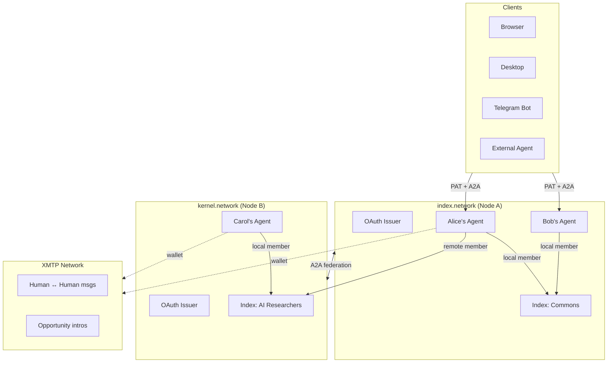
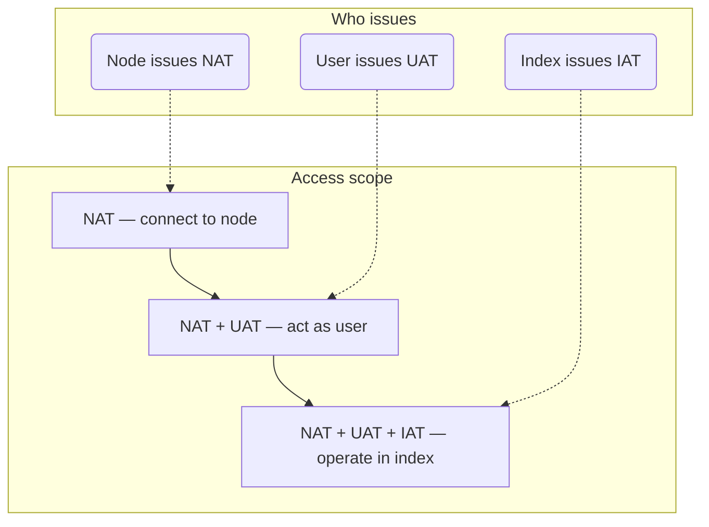

# Index Protocol — Architecture

A self-deployable, intent-driven discovery protocol. Each deployment is a **node** (e.g. index.network, kernel.network, boun.network) with its own users, indexes, agents, and policies.

Every user is a discoverable A2A agent. Every node is an OAuth issuer. Every person has a wallet identity for encrypted human messaging. No custom protocols — every layer uses an existing standard.

---

## Table of contents

1. [Entities](#1-entities)
2. [Identity model](#2-identity-model)
3. [System model](#3-system-model)
4. [Layer 1: Identity & auth](#4-layer-1-identity--auth)
5. [Layer 2: Per-user A2A agents](#5-layer-2-per-user-a2a-agents)
6. [Layer 3: Human messaging (XMTP)](#6-layer-3-human-messaging-xmtp)
7. [Layer 4: Discovery engine](#7-layer-4-discovery-engine)
8. [Layer 5: Federation](#8-layer-5-federation)
9. [Layer 6: Multi-client](#9-layer-6-multi-client)
10. [Index governance](#10-index-governance)
11. [Privacy model](#11-privacy-model)
12. [Protocol separation](#12-protocol-separation)
13. [Implementation phases](#13-implementation-phases)
14. [Standards](#14-standards)

---

## 1. Entities

| Entity | Description |
|--------|-------------|
| **Person** | A real human — outside the system. Has a wallet (SIWE) and registers to nodes. |
| **Node/Server** | A self-deployed instance of the protocol. OAuth issuer, hosts users, indexes, agents. |
| **User** | A registered identity within one node. Scoped to that node. |
| **Agent** | The user's personal A2A agent, hosted on their node. Discoverable, skill-bearing. |
| **Intent** | A user's expressed want or need. Belongs to the user; linked to indexes secondarily. |
| **Index** | A community/context where intents are shared and matched. Can span nodes via federation. |
| **Opportunity** | A match between users discovered by AI analyzing intent compatibility within an index. |


- A **node** has many users and many indexes.
- A **user** belongs to exactly one node and owns intents.
- **Intents** belong to the user first; linkage to indexes is a secondary association.
- A **person** (outside the system) has agents and registers as users (one per node).
- An **agent** accumulates tokens (NAT, UAT, IAT) for multiple nodes, users, and indexes.

A person may register to multiple nodes with the same or different identity — that choice is the person's, not the protocol's. Each resulting user is an independent entity scoped to its node.

---

## 2. Identity model

A person has two identity layers:

```
Person (Seref)
├── Wallet (0xABC...DEF) — global, via SIWE/ERC-4361
│   └── XMTP inbox — encrypted human messaging, opportunity intros
│
├── User @ index.network — local identity
│   ├── A2A Agent @ /u/seref/.well-known/agent-card.json
│   ├── PAT: ixn_pat_abc123...
│   └── Intents (owned, linked to local indexes)
│
└── User @ kernel.network — separate local identity
    ├── A2A Agent @ /u/seref/.well-known/agent-card.json
    ├── PAT: krn_pat_xyz789...
    └── Intents (owned, linked to local indexes)
```

The **wallet** is the global cross-node identity. **Users** are node-local identities. Better Auth + SIWE plugin links them — a person authenticates to a node (creating a user) and optionally links their wallet (enabling XMTP).

---

## 3. System model



```
┌──────────────────────────────────────────────────────────────┐
│                    index.network (Node A)                     │
│                                                              │
│  ┌─────────────┐  ┌─────────────┐  ┌──────────────────────┐ │
│  │ OAuth Issuer │  │ A2A Gateway │  │     REST API         │ │
│  │              │  │             │  │    (transitional)     │ │
│  │ /oauth/*     │  │ /u/:id/a2a  │  │    /api/*            │ │
│  └──────┬───────┘  └──────┬──────┘  └─────────┬────────────┘ │
│         │                 │                    │              │
│         └─────────────────┼────────────────────┘              │
│                           │                                   │
│              ┌────────────▼──────────────┐                    │
│              │     Auth Guard (JWT)      │                    │
│              │   PAT → user + scopes     │                    │
│              └────────────┬──────────────┘                    │
│                           │                                   │
│              ┌────────────▼──────────────┐                    │
│              │   Per-User A2A Agents     │                    │
│              │   (skill routing → core)  │                    │
│              └────────────┬──────────────┘                    │
│                           │                                   │
│              ┌────────────▼──────────────┐                    │
│              │   Services / LangGraph    │                    │
│              │   (unchanged core)        │                    │
│              └────────────┬──────────────┘                    │
│                           │                                   │
│         ┌─────────────────┼──────────────────┐                │
│    ┌────▼─────┐   ┌──────▼───────┐   ┌──────▼──────┐        │
│    │PostgreSQL │   │    Redis     │   │  OpenRouter  │        │
│    │ +pgvector │   │   (BullMQ)  │   │    (LLM)    │        │
│    └──────────┘   └──────────────┘   └─────────────┘        │
└──────────────────────────────────────────────────────────────┘
                           │
                    ┌──────▼──────┐
                    │ XMTP Network │  (external, decentralized)
                    │  human msgs  │
                    │  intros/notif │
                    └─────────────┘
```

---

## 4. Layer 1: Identity & auth

Each node is an **OAuth issuer**. PATs are the single auth mechanism for all clients.

```
POST /oauth/token { email, password } → { pat: "ixn_pat_abc123..." }
```

| Client | Auth |
|--------|------|
| Browser | PAT (in memory) |
| Desktop app | PAT (in config) |
| Telegram bot | PAT (in bot config) |
| External A2A agent | PAT (Authorization header) |
| Remote federated server | OAuth token exchange / JWKS verification |

Better Auth handles user management (email/password, social login, SIWE for wallet-based identity). PATs are an additional token layer on top for client-agnostic authentication.

### Token model

Three conceptual token types enforce layered access control:

| Token | Issued by | Purpose | OAuth implementation |
|-------|-----------|---------|---------------------|
| **NAT** | Node | Connect to the node | OAuth client registration (`client_id`) |
| **UAT** | User | Act as that user | PAT or access token (`scope: "user"`) |
| **IAT** | Index | Operate within that index | Scoped token via token exchange (`scope: "index:<id>"`) |

### Access scope ladder



**Key design choice**: The node issues only NAT — it cannot issue UAT or IAT. This limits what a node admin can access or leak. The user controls user-level access; the index controls index-level access.

Cross-node trust: when a user from `index.network` interacts with `kernel.network`, the remote server verifies the user's identity via standard OAuth discovery (JWKS) or A2A Agent Card signatures.

---

## 5. Layer 2: Per-user A2A agents

Every user IS a discoverable agent:

```
GET  /u/{userId}/.well-known/agent-card.json   → Agent Card (public)
POST /u/{userId}/a2a                           → A2A endpoint (authenticated)
```

The Agent Card is dynamically generated from the user's profile.

### Skills

| Skill | Purpose | Response |
|-------|---------|----------|
| `chat` | Multi-turn conversational AI with the user's agent | Streaming (SSE) |
| `intents` | List, get, process user intents | Instant or Task |
| `opportunities` | Discover, list, propose opportunities | Instant or Task |
| `profile` | View user profile | Instant |
| `indexes` | List user's public index memberships | Instant |
| `federation` | Sync shared intents to remote indexes | Push Notification |

### Request model

Every A2A request has two identities:

- **Caller**: The agent/user making the request (resolved from PAT)
- **Target**: The user whose agent is being addressed (resolved from URL path)

### What A2A handles

- Agent discovery ("what can you do?")
- Structured skill invocation ("create this intent", "find opportunities")
- Task lifecycle (submitted → working → completed)
- Streaming responses (SSE for chat)
- Federation push notifications (intent sync)

### What A2A does NOT handle

- Human-to-human conversations (→ XMTP)
- Encrypted messaging (→ XMTP)
- Cross-node identity (→ wallet/SIWE)

---

## 6. Layer 3: Human messaging (XMTP)

XMTP for all human messaging. Server-side clients (Node SDK) for both user and agent wallets. Independent from A2A.

| Concern | Solution |
|---------|----------|
| Transport | Decentralized XMTP network |
| Encryption | End-to-end (MLS protocol) |
| Identity | Wallet address via SIWE |
| Consent | Built into XMTP protocol |
| Infrastructure | None to host (decentralized) |

### What flows through XMTP

| Flow | Example |
|------|---------|
| Human ↔ Human | Seref messages Yanki after seeing an opportunity |
| Bot → Human | Index Bot sends opportunity introduction to both parties |
| Notification → Human | "You have 3 new opportunities this week" |

### What does NOT flow through XMTP

- Agent skill invocation (→ A2A)
- Intent CRUD (→ A2A)
- Federation sync (→ A2A)

### How XMTP connects to the system

```
Opportunity detected by broker
  → OpportunityService creates opportunity record
  → NotificationAgent composes introduction message
  → Sends via XMTP to both parties' wallet addresses
  → Both users see it in their XMTP inbox (any XMTP client)
  → They can reply to each other directly (E2E encrypted)
```

The Index Bot is an XMTP agent with its own wallet. It bridges the discovery engine and human messaging.

---

## 7. Layer 4: Discovery engine

The existing LangGraph-based AI pipeline. A2A wraps it — it doesn't replace it.

- **IntentGraph**: Extract, infer, verify, reconcile intents from content
- **OpportunityGraph**: Match intents across users within an index, score compatibility
- **HyDE Generator**: Create hypothetical document embeddings for multi-strategy semantic search
- **ChatGraph**: ReAct-style conversational agent with tool use
- **ProfileGraph**: Generate user profiles from identity signals

---

## 8. Layer 5: Federation

Users can join indexes on remote nodes. When they do, they choose which intents to share with that index.

### Data replication

| Data | Replicated | Reason |
|------|-----------|--------|
| Selected intent payloads | Yes | Needed for opportunity context |
| Intent embeddings (2000-dim) | Yes | Needed for vector search |
| Profile summary | Yes (Agent Card) | Display in member list |
| Unshared intents | No | User didn't opt in |
| Full profile details | No | Query via A2A on demand |
| Chat history | No | Private to home node |

### Sync protocol

**Primary: A2A Push Notifications (webhooks)**

The home node pushes events to the remote index's node when shared data changes:

```
intent-shared      → User shares a new intent with remote index
intent-updated     → User edits a shared intent
intent-revoked     → User un-shares an intent
member-left        → User leaves the remote index
```

**Direction**: Index owner registers a webhook. Home node posts events to it. One webhook per node pair per index (not per user).

**Fallback: Bulk pull**

For recovery after downtime or initial sync:

```
Remote → Home: "Give me all shared intents for members of index X from your node, since timestamp Y"
```

### Sync topology

The **index owner pulls** (or receives pushes), not individual users:

```
kernel.network owns "AI Researchers" index
  - 3 members from index.network
  - 2 members from dao.network
  - 5 local members

Sync channels: 2 (one per remote node), not 5 (one per remote user)
```

---

## 9. Layer 6: Multi-client

PATs + A2A make every client surface equal:

```
Browser     → PAT → user's A2A agent → services
Desktop     → PAT → user's A2A agent → services
Telegram    → PAT → user's A2A agent → services
CLI         → PAT → user's A2A agent → services
Ext Agent   → PAT → user's A2A agent → services
```

The frontend (Next.js) is one client among many. Over time, it migrates from REST to A2A (hybrid approach — one service at a time, REST deprecated gradually).

---

## 10. Index governance

Three access modes, controlled by index admins (the creator is the first admin).

### Access modes

| Mode | Flow |
|------|------|
| **Open-access** | Any user with NAT+UAT joins freely → IAT issued |
| **Request-based** | User requests → admin approves → IAT issued |
| **Invite-only** | Admin invites → user accepts → IAT issued |

### Admin capabilities

- Issue/revoke IATs
- Approve/deny access requests
- Invite members
- Grant/revoke admin to other members
- Change access mode

### IAT revocation effect

When a user's IAT is revoked:
1. IAT invalidated
2. User's intents unlinked from that index (no longer visible or discoverable in it)
3. Intents still belong to the user and can be linked to other indexes
4. User's NAT + UAT remain valid — can still operate at user level

---

## 11. Privacy model

Privacy is enforced through separation of issuance authority. No single entity can access all data.

| Authority | Can see | Cannot see |
|-----------|---------|------------|
| **Node** | User list, index list, NAT validity | User intents, index membership, index content |
| **User** | Own profile, own intents, own UATs | Other users' intents, index membership of others |
| **Index admin** | Index membership, linked intents, IATs | Other indexes' data, users' unlinked intents |
| **XMTP** | Nothing (E2E encrypted) | Message content (only endpoints see it) |

**Responsibility assignment**:
- The **node** is responsible for node-level data (user identities, index names).
- The **index owner** is responsible for the privacy of users who are members of that index and all index-scoped data.
- The **user** controls their own profile, intents, and which agents get UAT.
- **XMTP messages** are E2E encrypted — not even the node can read them.

---

## 12. Protocol separation

```
┌─────────────────────────────────────────────────────────┐
│                                                         │
│  OAuth/PATs          "Who are you? What can you access?"│
│  ─────────           Identity + authorization           │
│                      Underneath everything              │
│                                                         │
├─────────────────────────────────────────────────────────┤
│                                                         │
│  A2A                 "What can you do? Do this task."   │
│  ───                 Discovery + skill invocation       │
│                      Agent ↔ Agent, Client ↔ Agent      │
│                      Federation sync                    │
│                                                         │
├─────────────────────────────────────────────────────────┤
│                                                         │
│  XMTP                "Let's talk, securely."            │
│  ────                Encrypted human messaging          │
│                      Human ↔ Human, Bot → Human         │
│                      Opportunity introductions          │
│                                                         │
├─────────────────────────────────────────────────────────┤
│                                                         │
│  LangGraph           "Think, match, discover."          │
│  ────────            AI orchestration (unchanged)       │
│                      Intents, opportunities, chat       │
│                                                         │
└─────────────────────────────────────────────────────────┘
```

---

## 13. Implementation phases

| Phase | What | Depends on |
|-------|------|------------|
| **1** | **Foundation** (Done) | — |
| | Better Auth, unified user table | |
| **2** | **PAT System** | Phase 1 |
| | `personal_access_tokens` table, token CRUD, replace cookies | |
| **3** | **Per-User A2A Agents** | Phase 2 |
| | AgentCard per user, A2A executor, skill routing, TaskStore | |
| **4** | **OAuth Issuer** | Phase 2 |
| | JWKS endpoint, JWT-based PATs, cross-node verification | |
| **5** | **Federation** | Phase 3, 4 |
| | Remote index membership, intent replication, push notifications, bulk pull | |
| **6** | **XMTP Messaging** | Phase 1 (independent track) |
| | SIWE plugin for Better Auth, XMTP server-side messaging (done), Index Bot as XMTP agent | |
| **7** | **Multi-Client + Frontend Migration** | Phase 3 |
| | Frontend REST → A2A migration, Telegram bot, desktop client | |

Phase 6 (XMTP) can run in parallel with Phases 2-5. It only needs Better Auth (Phase 1) for the SIWE wallet link.

---

## 14. Standards

| Concern | Standard | Why |
|---------|----------|-----|
| Agent interop | A2A (Google/Linux Foundation) | Discovery, skills, streaming, push notifications — all in one spec |
| Auth | OAuth 2.0 + PATs | Industry standard, works across nodes |
| Identity | Better Auth + SIWE (ERC-4361) | Self-hosted, wallet-compatible |
| Human messaging | XMTP (MLS) | E2E encrypted, decentralized, consent built-in |
| AI orchestration | LangGraph / LangChain | Existing, proven, stays as-is |
| Database | PostgreSQL + pgvector + Drizzle ORM | Existing, stays as-is |
| Embeddings | OpenRouter (text-embedding-3-large, 2000-dim) | Existing, stays as-is |

No custom protocols. Every layer uses an existing standard. The value is in the composition: intent-driven discovery across a federated agent network.
