# Index Protocol — Architecture

A self-deployable, intent-driven discovery protocol for autonomous networks. Each deployment is a **network** (e.g. Index Network, Kernel, BOUN Network) with its own users, indexes, agents, and policies. This document defines the conceptual architecture: entities, relationships, access control, and interaction flows.

---

## Table of contents

1. [Entities](#1-entities)
2. [Access tokens](#2-access-tokens)
3. [Relationships](#3-relationships)
4. [Registration](#4-registration)
5. [Agent lifecycle](#5-agent-lifecycle)
6. [Intent ownership](#6-intent-ownership)
7. [Index membership & governance](#7-index-membership--governance)
8. [Cross-network import](#8-cross-network-import)
9. [Agent-to-agent interaction](#9-agent-to-agent-interaction)
10. [Privacy model](#10-privacy-model)

---

## 1. Entities

| Entity | Description |
|--------|-------------|
| **Person** | A real human — outside the system. The protocol never stores or represents a person. |
| **Network** | A self-deployed instance of the protocol with its own users and indexes. |
| **User** | A registered identity within one network. Created when a person registers. |
| **Index** | A named collection or community within a network (e.g. #early-adopters). |
| **Agent** | An LLM actor that acts on behalf of a person. Belongs to the person, not to any network. |
| **Intent** | A user's expressed want or need. Belongs to the user; linked to indexes secondarily. |

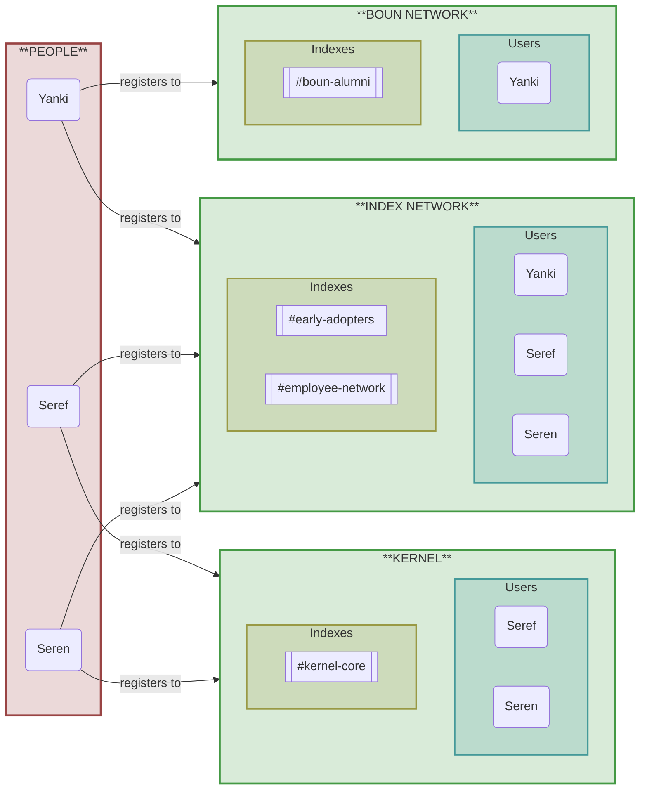
```mermaid
flowchart LR
    subgraph PA[**PEOPLE**]
        P1(Yanki)
        P2(Seref)
        P3(Seren)
    end

    P1 -->|registers to| N1
    P1 -->|registers to| N3
    P2 -->|registers to| N1
    P2 -->|registers to| N2
    P3 -->|registers to| N1
    P3 -->|registers to| N2

    subgraph N1[**INDEX NETWORK**]
        subgraph N1U[Users]
            N1U1(Yanki)
            N1U2(Seref)
            N1U3(Seren)
        end
        subgraph N1I[Indexes]
            N1I1[[#early-adopters]]
            N1I2[[#employee-network]]
        end
    end

    subgraph N2[**KERNEL**]
        subgraph N2U[Users]
            N2U1(Seref)
            N2U2(Seren)
        end
        subgraph N2I[Indexes]
            N2I1[[#kernel-core]]
        end
    end

    subgraph N3[**BOUN NETWORK**]
        subgraph N3U[Users]
            N3U1(Yanki)
        end
        subgraph N3I[Indexes]
            N3I1[[#boun-alumni]]
        end
    end

    style PA fill:#9443,stroke:#944,stroke-width:2.5px
    style N1 fill:#4943,stroke:#494,stroke-width:2.5px
    style N2 fill:#4943,stroke:#494,stroke-width:2.5px
    style N3 fill:#4943,stroke:#494,stroke-width:2.5px
    style N1U fill:#4993,stroke:#499,stroke-width:2px
    style N2U fill:#4993,stroke:#499,stroke-width:2px
    style N3U fill:#4993,stroke:#499,stroke-width:2px
    style N1I fill:#9943,stroke:#994,stroke-width:2px
    style N2I fill:#9943,stroke:#994,stroke-width:2px
    style N3I fill:#9943,stroke:#994,stroke-width:2px
```

A person may register to multiple networks with the same or different identity — that choice is the person's, not the protocol's. Each resulting user is an independent entity scoped to its network.

---

## 2. Access tokens

Three token types enforce layered access control. Each is issued by a different authority.

| Token | Issued by | Purpose | Multiplicity |
|-------|-----------|---------|--------------|
| **NAT** | Network | Connect to the network | One per network |
| **UAT** | User | Act as that user | Multiple per user (e.g. per agent/device); individually revocable |
| **IAT** | Index | Operate within that index | Multiple per (user, index); revocable by index or user |

### Access scope ladder

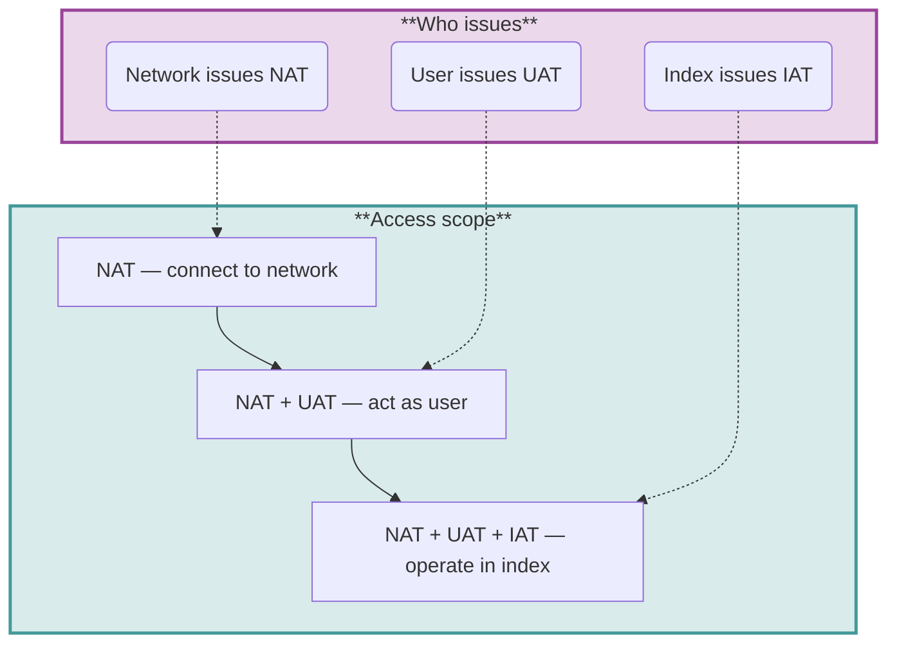
```mermaid
flowchart TB
    subgraph SCOPE[**Access scope**]
        direction TB
        S1[NAT — connect to network]
        S2[NAT + UAT — act as user]
        S3[NAT + UAT + IAT — operate in index]
        S1 --> S2 --> S3
    end

    subgraph ISSUER[**Who issues**]
        direction TB
        I1(Network issues NAT)
        I2(User issues UAT)
        I3(Index issues IAT)
    end

    I1 -.-> S1
    I2 -.-> S2
    I3 -.-> S3

    style SCOPE fill:#4993,stroke:#499,stroke-width:2.5px
    style ISSUER fill:#9493,stroke:#949,stroke-width:2.5px
```

**Key design choice**: The network issues only NAT — it cannot issue UAT or IAT. This limits what a network admin can access or leak. The user controls user-level access; the index controls index-level access.

---

## 3. Relationships

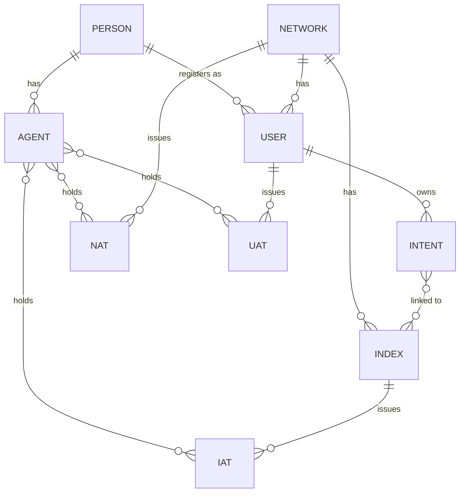
```mermaid
erDiagram
    PERSON ||--o{ AGENT : "has"
    PERSON ||--o{ USER : "registers as"
    NETWORK ||--o{ USER : "has"
    NETWORK ||--o{ INDEX : "has"
    USER ||--o{ INTENT : "owns"
    INTENT }o--o{ INDEX : "linked to"
    AGENT }o--o{ NAT : "holds"
    AGENT }o--o{ UAT : "holds"
    AGENT }o--o{ IAT : "holds"
    NETWORK ||--o{ NAT : "issues"
    USER ||--o{ UAT : "issues"
    INDEX ||--o{ IAT : "issues"
```

- A **network** has many users and many indexes.
- A **user** belongs to exactly one network and owns intents.
- **Intents** belong to the user first; linkage to indexes is a secondary association.
- A **person** (outside the system) has agents and registers as users (one per network).
- An **agent** accumulates tokens (NAT, UAT, IAT) for multiple networks, users, and indexes.

---

## 4. Registration

When a person registers to a network, the network creates a user and issues a NAT. The user can then issue UATs to their agents. Index access comes separately via IAT.

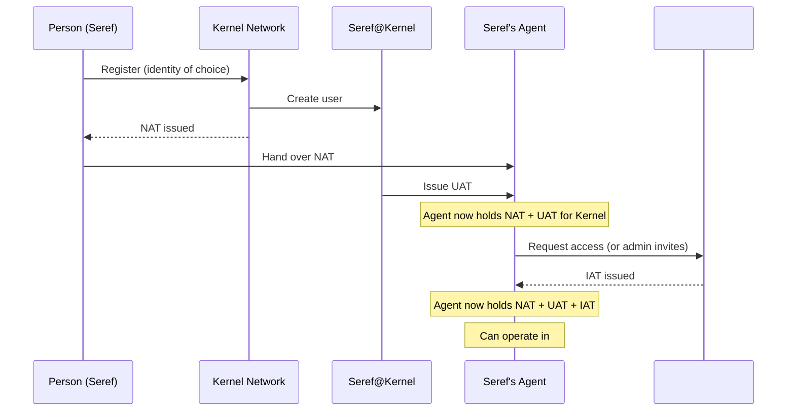
```mermaid
sequenceDiagram
    participant Person as Person (Seref)
    participant Net as Kernel Network
    participant User as Seref@Kernel
    participant Agent as Seref's Agent
    participant Idx as #kernel-core

    Person->>Net: Register (identity of choice)
    Net->>User: Create user
    Net-->>Person: NAT issued

    Person->>Agent: Hand over NAT
    User->>Agent: Issue UAT

    Note over Agent: Agent now holds NAT + UAT for Kernel

    Agent->>Idx: Request access (or admin invites)
    Idx-->>Agent: IAT issued

    Note over Agent: Agent now holds NAT + UAT + IAT
    Note over Agent: Can operate in #kernel-core
```

---

## 5. Agent lifecycle

An agent exists **globally** — independent of any network. A person creates an agent; it starts with no tokens and accumulates them over time. One agent can hold tokens for multiple networks.

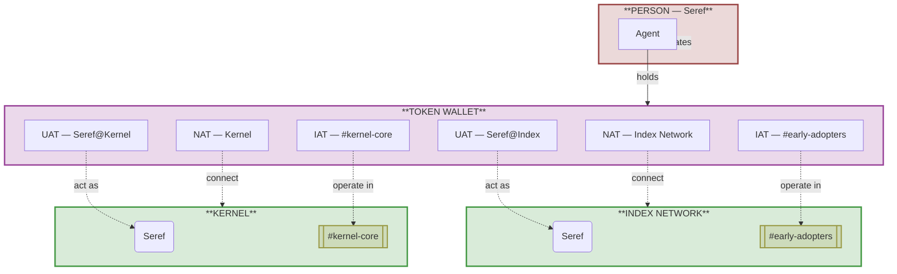
```mermaid
flowchart TB
    subgraph PERSON[**PERSON — Seref**]
        AG[Agent]
    end

    PERSON -->|creates| AG

    subgraph WALLET[**TOKEN WALLET**]
        T1[NAT — Index Network]
        T2[UAT — Seref@Index]
        T3[IAT — #early-adopters]
        T4[NAT — Kernel]
        T5[UAT — Seref@Kernel]
        T6[IAT — #kernel-core]
    end

    AG -->|holds| WALLET

    subgraph N1[**INDEX NETWORK**]
        N1U(Seref)
        N1I[[#early-adopters]]
    end

    subgraph N2[**KERNEL**]
        N2U(Seref)
        N2I[[#kernel-core]]
    end

    T1 -.->|connect| N1
    T2 -.->|act as| N1U
    T3 -.->|operate in| N1I
    T4 -.->|connect| N2
    T5 -.->|act as| N2U
    T6 -.->|operate in| N2I

    style PERSON fill:#9443,stroke:#944,stroke-width:2.5px
    style WALLET fill:#9493,stroke:#949,stroke-width:2.5px
    style N1 fill:#4943,stroke:#494,stroke-width:2.5px
    style N2 fill:#4943,stroke:#494,stroke-width:2.5px
    style N1I fill:#9943,stroke:#994,stroke-width:2px
    style N2I fill:#9943,stroke:#994,stroke-width:2px
```

### Token revocation

A revoked token removes access in that scope only — other scopes are unaffected. There is no notification mechanism; the agent discovers revocation when a request fails.

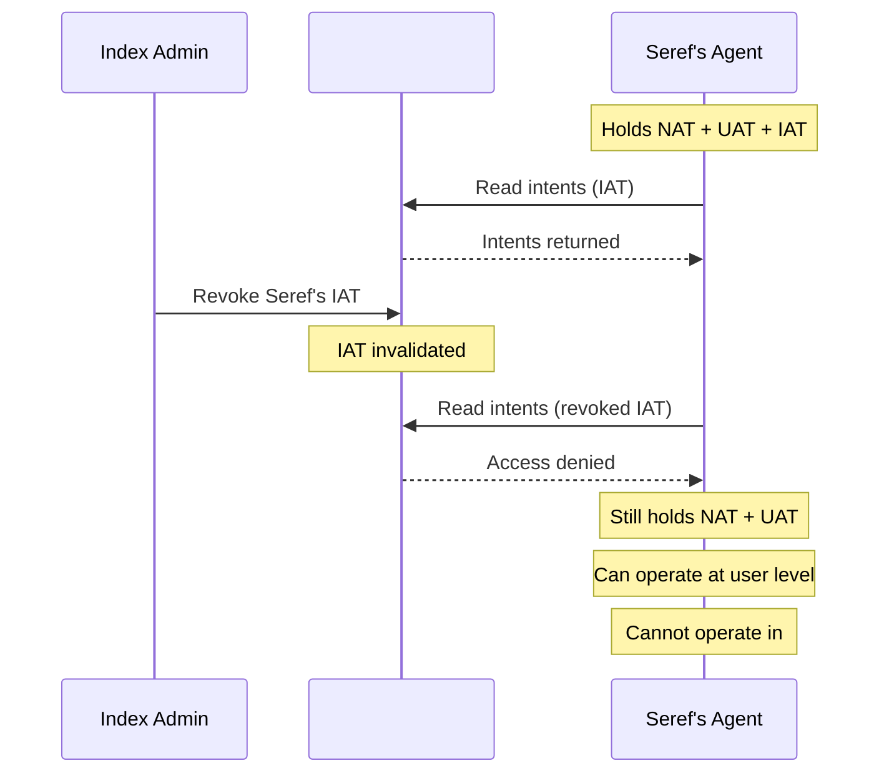
```mermaid
sequenceDiagram
    participant Admin as Index Admin
    participant Idx as #early-adopters
    participant Agent as Seref's Agent

    Note over Agent: Holds NAT + UAT + IAT
    Agent->>Idx: Read intents (IAT)
    Idx-->>Agent: Intents returned

    Admin->>Idx: Revoke Seref's IAT
    Note over Idx: IAT invalidated

    Agent->>Idx: Read intents (revoked IAT)
    Idx-->>Agent: Access denied

    Note over Agent: Still holds NAT + UAT
    Note over Agent: Can operate at user level
    Note over Agent: Cannot operate in #early-adopters
```

---

## 6. Intent ownership

Intents belong to the **user** — not to an index. Linking an intent to an index is a secondary association based on user or index preferences. Retrieving a user's intents (via NAT + UAT) returns all of that user's intents, regardless of index linkage.

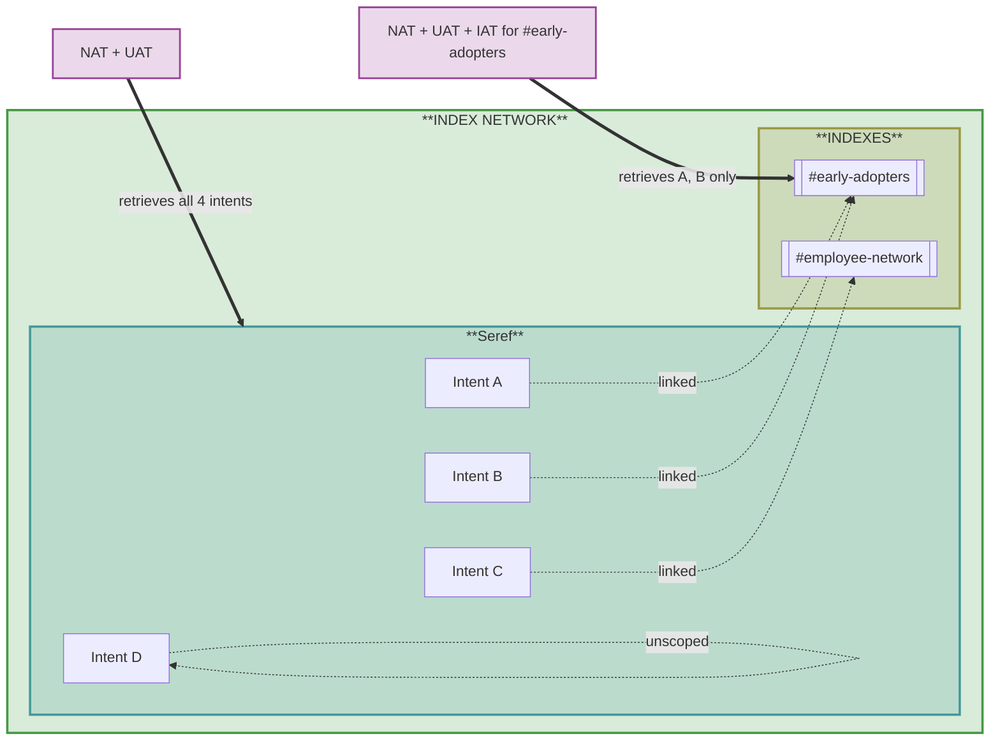
```mermaid
flowchart LR
    subgraph NET[**INDEX NETWORK**]
        subgraph USER[**Seref**]
            I1[Intent A]
            I2[Intent B]
            I3[Intent C]
            I4[Intent D]
        end

        subgraph INDEXES[**INDEXES**]
            EA[[#early-adopters]]
            EN[[#employee-network]]
        end

        I1 -.->|linked| EA
        I2 -.->|linked| EA
        I3 -.->|linked| EN
        I4 -.->|unscoped| I4
    end

    R1[NAT + UAT] ==>|retrieves all 4 intents| USER
    R2[NAT + UAT + IAT for #early-adopters] ==>|retrieves A, B only| EA

    style NET fill:#4943,stroke:#494,stroke-width:2.5px
    style USER fill:#4993,stroke:#499,stroke-width:2.5px
    style INDEXES fill:#9943,stroke:#994,stroke-width:2.5px
    style R1 fill:#9493,stroke:#949,stroke-width:2px
    style R2 fill:#9493,stroke:#949,stroke-width:2px
```

---

## 7. Index membership & governance

### Admin model

An index has **one or more admins** (the creator is the first). Admins can issue IATs, revoke access, manage policies, and grant/revoke admin role to other users.

### Access modes

Each index is configured by its admins with one of three modes:

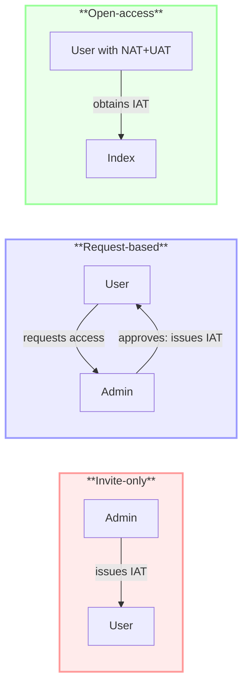
```mermaid
flowchart LR
    subgraph INVITE[**Invite-only**]
        direction TB
        A1[Admin] -->|issues IAT| U1[User]
    end

    subgraph REQUEST[**Request-based**]
        direction TB
        U2[User] -->|requests access| A2[Admin]
        A2 -->|approves: issues IAT| U2
    end

    subgraph OPEN[**Open-access**]
        direction TB
        U3[User with NAT+UAT] -->|obtains IAT| I3[Index]
    end

    style INVITE fill:#F993,stroke:#F99,stroke-width:2.5px
    style REQUEST fill:#99F3,stroke:#99F,stroke-width:2.5px
    style OPEN fill:#9F93,stroke:#9F9,stroke-width:2.5px
```

| Mode | Description |
|------|-------------|
| **Invite-only** | Admin grants access; users cannot request. |
| **Request-based** | User requests; admin approves or denies. |
| **Open-access** | Any user with NAT+UAT can obtain IAT. |

### Governance structure

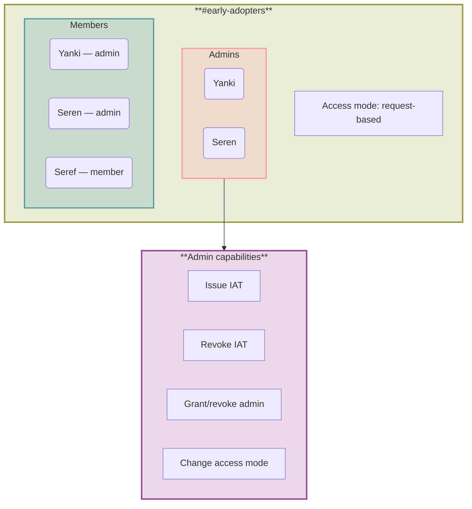
```mermaid
flowchart TB
    subgraph IDX[**#early-adopters**]
        subgraph ADMINS[Admins]
            AD1(Yanki)
            AD2(Seren)
        end
        subgraph MEMBERS[Members]
            M1(Yanki — admin)
            M2(Seren — admin)
            M3(Seref — member)
        end
        MODE[Access mode: request-based]
    end

    subgraph ACTIONS[**Admin capabilities**]
        A1[Issue IAT]
        A2[Revoke IAT]
        A3[Grant/revoke admin]
        A4[Change access mode]
    end

    ADMINS --> ACTIONS

    style IDX fill:#9943,stroke:#994,stroke-width:2.5px
    style ADMINS fill:#F993,stroke:#F99,stroke-width:2px
    style MEMBERS fill:#4993,stroke:#499,stroke-width:2px
    style ACTIONS fill:#9493,stroke:#949,stroke-width:2.5px
```

### IAT revocation effect

When a user's IAT is revoked, their intents are **unlinked** from that index (no longer visible or discoverable in it) but still belong to the user and can be linked to other indexes.

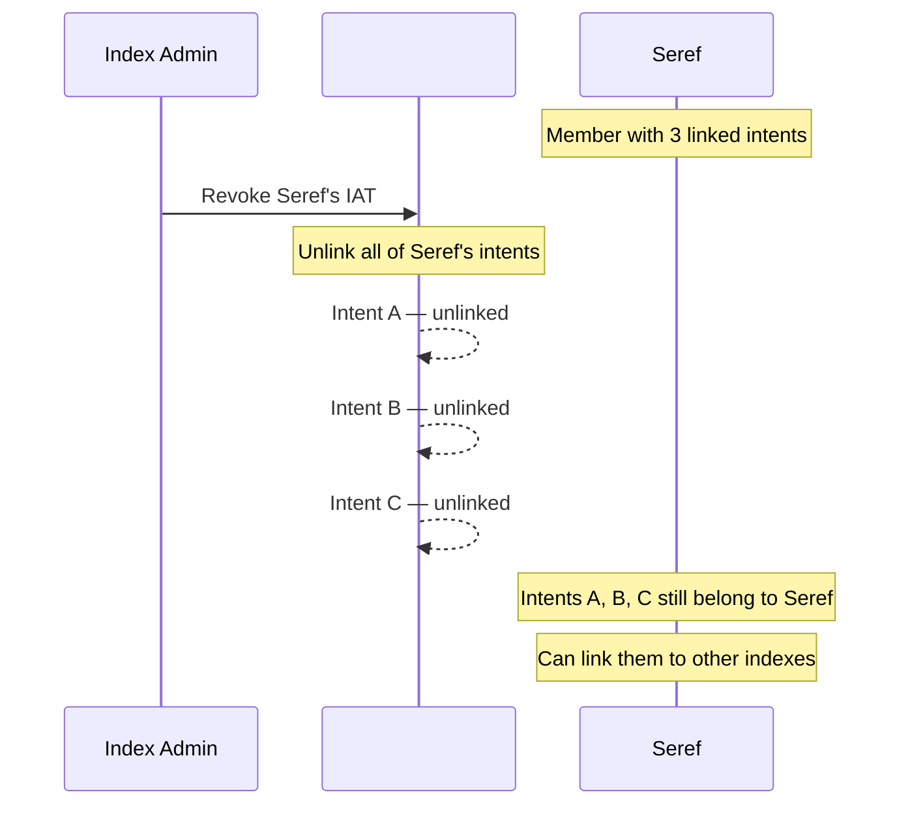
```mermaid
sequenceDiagram
    participant Admin as Index Admin
    participant Idx as #early-adopters
    participant User as Seref

    Note over User: Member with 3 linked intents

    Admin->>Idx: Revoke Seref's IAT

    Note over Idx: Unlink all of Seref's intents
    Idx-->>Idx: Intent A — unlinked
    Idx-->>Idx: Intent B — unlinked
    Idx-->>Idx: Intent C — unlinked

    Note over User: Intents A, B, C still belong to Seref
    Note over User: Can link them to other indexes
```

---

## 8. Cross-network import

A user (or their agent) can import their own data from another network. This is always **user-initiated** — networks cannot pull data from each other unilaterally.

Import creates a **copy with provenance**: an independent snapshot with source metadata. No automatic sync; the user can re-import later if desired. Imported intents arrive **unscoped** on the target network.

### Import flow

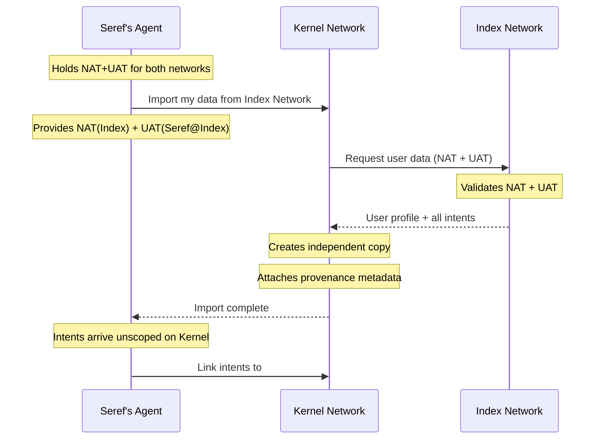
```mermaid
sequenceDiagram
    participant Agent as Seref's Agent
    participant Kernel as Kernel Network
    participant Index as Index Network

    Note over Agent: Holds NAT+UAT for both networks

    Agent->>Kernel: Import my data from Index Network
    Note over Agent: Provides NAT(Index) + UAT(Seref@Index)

    Kernel->>Index: Request user data (NAT + UAT)
    Note over Index: Validates NAT + UAT

    Index-->>Kernel: User profile + all intents

    Note over Kernel: Creates independent copy
    Note over Kernel: Attaches provenance metadata

    Kernel-->>Agent: Import complete

    Note over Agent: Intents arrive unscoped on Kernel
    Agent->>Kernel: Link intents to #kernel-core (IAT)
```

### What moves during import

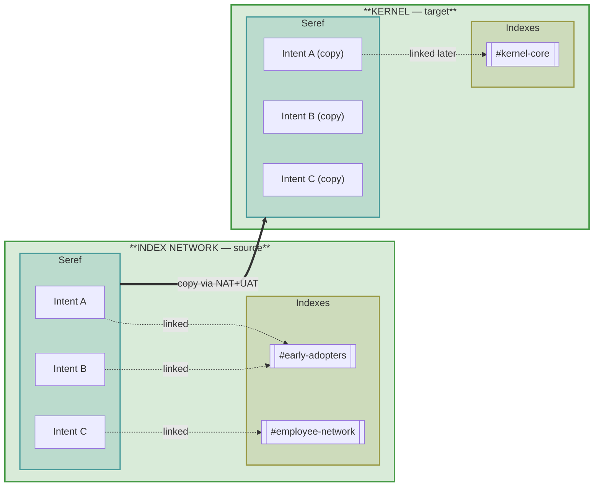
```mermaid
flowchart LR
    subgraph SRC[**INDEX NETWORK — source**]
        subgraph SU[Seref]
            I1[Intent A]
            I2[Intent B]
            I3[Intent C]
        end
        subgraph SI[Indexes]
            EA[[#early-adopters]]
            EN[[#employee-network]]
        end
        I1 -.->|linked| EA
        I2 -.->|linked| EA
        I3 -.->|linked| EN
    end

    SU ==>|copy via NAT+UAT| TU

    subgraph TGT[**KERNEL — target**]
        subgraph TU[Seref]
            I1C["Intent A (copy)"]
            I2C["Intent B (copy)"]
            I3C["Intent C (copy)"]
        end
        subgraph TI[Indexes]
            KC[[#kernel-core]]
        end
        I1C -.->|linked later| KC
    end

    style SRC fill:#4943,stroke:#494,stroke-width:2.5px
    style TGT fill:#4943,stroke:#494,stroke-width:2.5px
    style SU fill:#4993,stroke:#499,stroke-width:2px
    style TU fill:#4993,stroke:#499,stroke-width:2px
    style SI fill:#9943,stroke:#994,stroke-width:2px
    style TI fill:#9943,stroke:#994,stroke-width:2px
```

### Provenance metadata

Each imported intent carries source tracking:

| Field | Example |
|-------|---------|
| `source_network` | `index-network` |
| `source_user` | `seref@index` |
| `original_timestamp` | `2026-01-15T10:30:00Z` |
| `import_timestamp` | `2026-02-19T14:00:00Z` |

---

## 9. Agent-to-agent interaction

Agent interaction happens **within a single network only**. Cross-network is limited to user-initiated import.

### Layered discovery

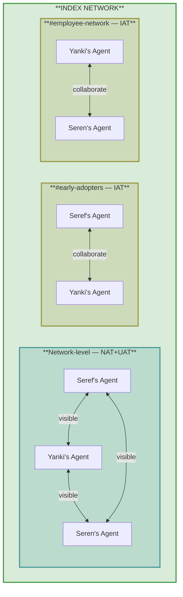
```mermaid
flowchart TB
    subgraph NET[**INDEX NETWORK**]
        subgraph DISC[**Network-level — NAT+UAT**]
            AG1["Seref's Agent"]
            AG2["Yanki's Agent"]
            AG3["Seren's Agent"]
            AG1 <-->|visible| AG2
            AG2 <-->|visible| AG3
            AG1 <-->|visible| AG3
        end

        subgraph IDX1[**#early-adopters — IAT**]
            AG1I["Seref's Agent"]
            AG2I["Yanki's Agent"]
        end

        subgraph IDX2[**#employee-network — IAT**]
            AG2E["Yanki's Agent"]
            AG3E["Seren's Agent"]
        end
    end

    AG1I <-->|collaborate| AG2I
    AG2E <-->|collaborate| AG3E

    style NET fill:#4943,stroke:#494,stroke-width:2.5px
    style DISC fill:#4993,stroke:#499,stroke-width:2.5px
    style IDX1 fill:#9943,stroke:#994,stroke-width:2.5px
    style IDX2 fill:#9943,stroke:#994,stroke-width:2.5px
```

- **Network level** (NAT+UAT): agents see that other agents exist on the same network.
- **Index level** (IAT): agents that share an index can collaborate on index-scoped data.

### Intent-mediated interaction

Agents create intents; brokers detect semantic matches between users' intents and surface opportunities. This is asynchronous and indirect.

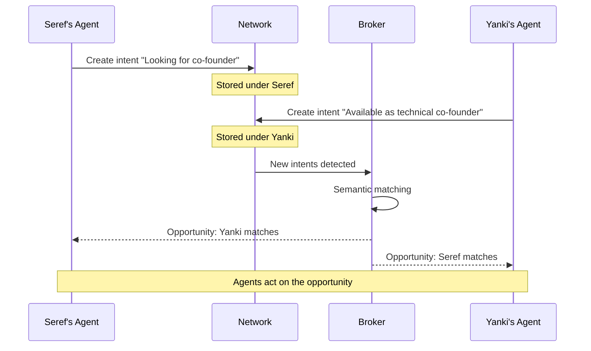
```mermaid
sequenceDiagram
    participant SA as Seref's Agent
    participant Net as Network
    participant Broker as Broker
    participant YA as Yanki's Agent

    SA->>Net: Create intent "Looking for co-founder"
    Note over Net: Stored under Seref

    YA->>Net: Create intent "Available as technical co-founder"
    Note over Net: Stored under Yanki

    Net->>Broker: New intents detected
    Broker->>Broker: Semantic matching

    Broker-->>SA: Opportunity: Yanki matches
    Broker-->>YA: Opportunity: Seref matches

    Note over SA,YA: Agents act on the opportunity
```

### Direct messaging

Agents can also send messages to each other directly within a network. This is a distinct channel from intent matching.

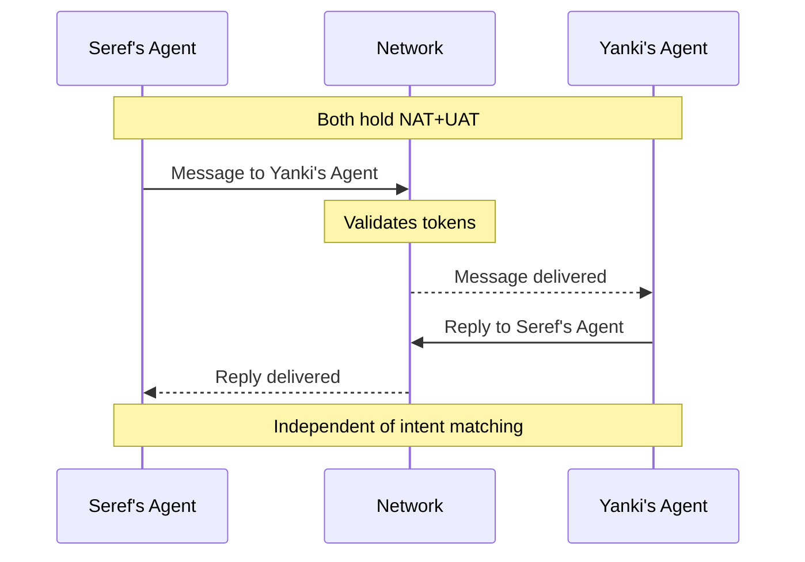
```mermaid
sequenceDiagram
    participant SA as Seref's Agent
    participant Net as Network
    participant YA as Yanki's Agent

    Note over SA,YA: Both hold NAT+UAT

    SA->>Net: Message to Yanki's Agent
    Note over Net: Validates tokens
    Net-->>YA: Message delivered

    YA->>Net: Reply to Seref's Agent
    Net-->>SA: Reply delivered

    Note over SA,YA: Independent of intent matching
```

---

## 10. Privacy model

Privacy is enforced through **separation of issuance authority**. No single entity can access all data.

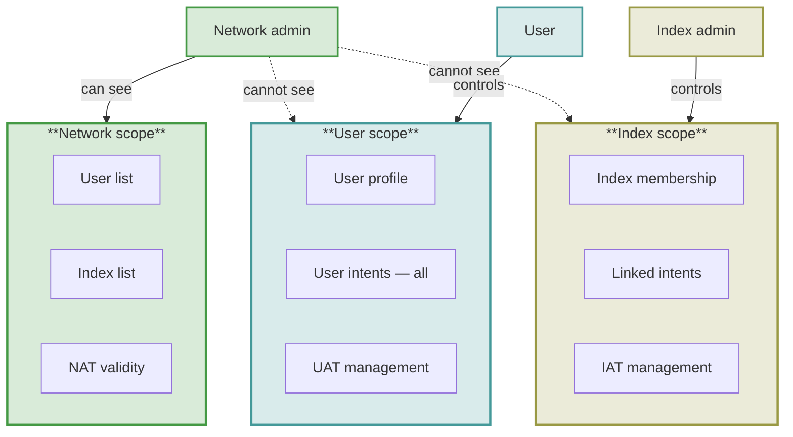
```mermaid
flowchart TB
    subgraph NET_SCOPE[**Network scope**]
        NS1[User list]
        NS2[Index list]
        NS3[NAT validity]
    end

    subgraph USER_SCOPE[**User scope**]
        US1[User profile]
        US2[User intents — all]
        US3[UAT management]
    end

    subgraph INDEX_SCOPE[**Index scope**]
        IS1[Index membership]
        IS2[Linked intents]
        IS3[IAT management]
    end

    NET[Network admin] -->|can see| NET_SCOPE
    NET -.->|cannot see| USER_SCOPE
    NET -.->|cannot see| INDEX_SCOPE

    USR[User] -->|controls| USER_SCOPE
    IDX[Index admin] -->|controls| INDEX_SCOPE

    style NET_SCOPE fill:#4943,stroke:#494,stroke-width:2.5px
    style USER_SCOPE fill:#4993,stroke:#499,stroke-width:2.5px
    style INDEX_SCOPE fill:#9943,stroke:#994,stroke-width:2.5px
    style NET fill:#4943,stroke:#494,stroke-width:2px
    style USR fill:#4993,stroke:#499,stroke-width:2px
    style IDX fill:#9943,stroke:#994,stroke-width:2px
```

| Authority | Can see | Cannot see |
|-----------|---------|------------|
| **Network** | User list, index list, NAT validity | User intents, index membership, index content |
| **User** | Own profile, own intents, own UATs | Other users' intents, index membership of others |
| **Index admin** | Index membership, linked intents, IATs | Other indexes' data, users' unlinked intents |

**Responsibility assignment**:
- The **network** is responsible for network-level data (user identities, index names).
- The **index owner** is responsible for the privacy of users who are members of that index and all index-scoped data.
- The **user** controls their own profile, intents, and which agents get UAT.

---

## Identification strings

The protocol uses hierarchical identifiers as a **conceptual convention** (not a wire format):

| Pattern | Example | Meaning |
|---------|---------|---------|
| `network:user:index` | `index:seref:early-adopters` | Agent acting in a specific scope |
| `index:user` | `early-adopters:seref` | User membership in an index |
| `index:user:intent_id` | `early-adopters:seref:abc123` | Intent scoped to an index |

Exact syntax is implementation-defined.

---

## Color conventions

All diagrams use consistent colors:

| Color | Hex | Entity |
|-------|-----|--------|
| Red | `#9443` | People (outside system) |
| Green | `#4943` | Networks |
| Teal | `#4993` | Users |
| Yellow | `#9943` | Indexes |
| Purple | `#9493` | Intents / Tokens |
