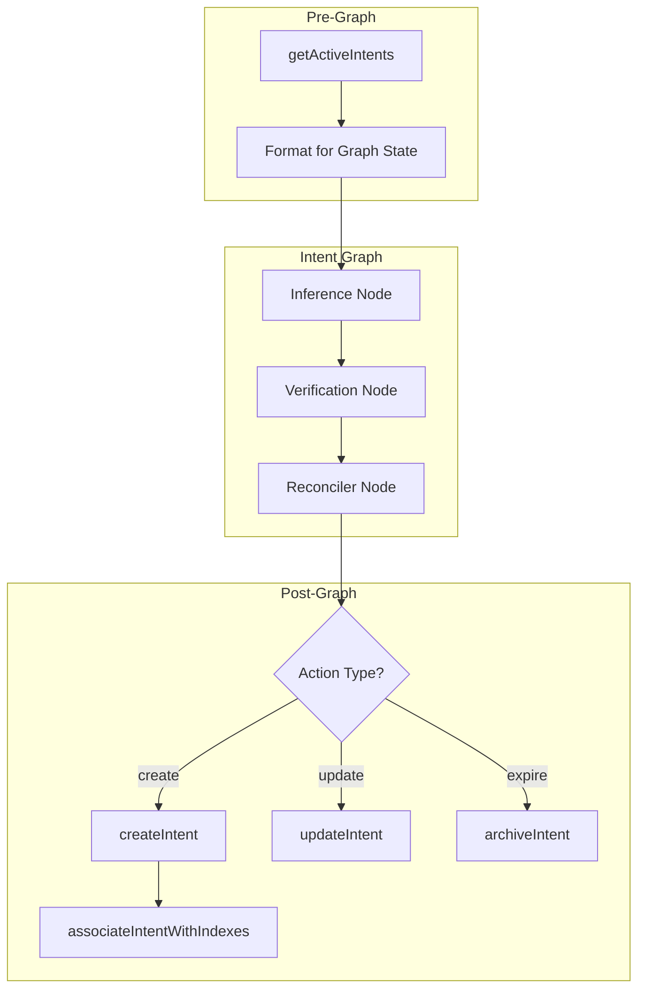

# Database Interface: Intent Graph Support

**Status:** Design / specification. See `src/lib/protocol/interfaces/database.interface.ts` for current interface.

## Overview

This specification defines the updated `src/lib/protocol/interfaces/database.interface.ts` to support the Intent Graph pipeline. The interface additions enable:

1. **Pre-Graph Operations**: State population before graph execution
2. **Post-Graph Operations**: Action execution after reconciliation
3. **Supporting Operations**: Queries, vector search, and index associations

> **Note**: Intent stakes are deprecated and replaced by the Opportunity system. This interface does not include stake operations.

---

## Type Definitions

### ActiveIntent
Minimal intent representation for graph state population.

```typescript
/**
 * Minimal intent representation used for graph state population.
 * Contains only the fields needed for reconciliation logic.
 */
export interface ActiveIntent {
  /** Unique identifier of the intent */
  id: string;
  /** Full intent description/payload */
  payload: string;
  /** Short summary of the intent (may be null if not generated) */
  summary: string | null;
  /** When the intent was created */
  createdAt: Date;
}
```

### CreateIntentData
Input for creating new intents.

```typescript
/**
 * Input data for creating a new intent.
 * Supports the full intent pipeline including embedding and index association.
 */
export interface CreateIntentData {
  /** The user who owns this intent */
  userId: string;
  /** Full intent description/payload */
  payload: string;
  /** Pre-computed summary (optional, will be generated if not provided) */
  summary?: string | null;
  /** Pre-computed embedding vector (optional, will be generated if not provided) */
  embedding?: number[];
  /** Whether the intent should be hidden from public views */
  isIncognito?: boolean;
  /** Index IDs to associate with (optional, uses dynamic scoping if empty) */
  indexIds?: string[];
  /** Source type for provenance tracking */
  sourceType?: 'file' | 'integration' | 'link' | 'discovery_form' | 'enrichment';
  /** Source ID for provenance tracking */
  sourceId?: string;
  /** Confidence score from inference (0-1, required) */
  confidence: number;
  /** How the intent was inferred */
  inferenceType: 'explicit' | 'implicit';
}
```

### UpdateIntentData
Input for updating existing intents.

```typescript
/**
 * Input data for updating an existing intent.
 * All fields are optional - only provided fields will be updated.
 */
export interface UpdateIntentData {
  /** Updated intent description/payload */
  payload?: string;
  /** Updated summary */
  summary?: string | null;
  /** Updated embedding vector */
  embedding?: number[];
  /** Updated incognito status */
  isIncognito?: boolean;
  /** Updated index associations (replaces existing) */
  indexIds?: string[];
}
```

### CreatedIntent
Result of successful intent creation.

```typescript
/**
 * The result of a successful intent creation.
 * Contains the core fields needed for immediate use.
 */
export interface CreatedIntent {
  /** Unique identifier of the created intent */
  id: string;
  /** Full intent description/payload */
  payload: string;
  /** Generated or provided summary */
  summary: string | null;
  /** Incognito status */
  isIncognito: boolean;
  /** Creation timestamp */
  createdAt: Date;
  /** Last update timestamp */
  updatedAt: Date;
  /** Owner user ID */
  userId: string;
}
```

### IntentRecord
Full intent record with all fields.

```typescript
/**
 * Full intent record with all fields (for detailed queries).
 */
export interface IntentRecord extends CreatedIntent {
  /** Archival timestamp (null if active) */
  archivedAt: Date | null;
  /** Embedding vector (may be null) */
  embedding?: number[] | null;
  /** Source type for provenance */
  sourceType?: string | null;
  /** Source ID for provenance */
  sourceId?: string | null;
}
```

### SimilarIntent
Intent with similarity score from vector search.

```typescript
/**
 * Intent with similarity score from vector search.
 */
export interface SimilarIntent extends IntentRecord {
  /** Cosine similarity score (0-1) */
  similarity: number;
}
```

### ArchiveResult
Result of archive operation.

```typescript
/**
 * Result of an archive operation.
 */
export interface ArchiveResult {
  /** Whether the operation succeeded */
  success: boolean;
  /** Error message if failed */
  error?: string;
}
```

### SimilarIntentSearchOptions
Options for vector search.

```typescript
/**
 * Options for vector similarity search.
 */
export interface SimilarIntentSearchOptions {
  /** Maximum number of results to return (default: 10) */
  limit?: number;
  /** Minimum similarity threshold (default: 0.7) */
  threshold?: number;
}
```

---

## Interface Operations

### Profile Operations (Preserved)

These operations remain unchanged from the current interface:

```typescript
getProfile(userId: string): Promise<ProfileDocument | null>;
saveProfile(userId: string, profile: ProfileDocument): Promise<void>;
saveHydeProfile(userId: string, description: string, embedding: number[]): Promise<void>;
getUser(userId: string): Promise<any | null>;
```

### Pre-Graph Operations (State Population)

#### getActiveIntents

```typescript
/**
 * Retrieves all active (non-archived) intents for a user.
 * Used to populate the `activeIntents` field in the Intent Graph state
 * before graph execution.
 *
 * @param userId - The unique identifier of the user
 * @returns Array of active intents with minimal fields needed for reconciliation
 *
 * @example
 * ```typescript
 * const activeIntents = await db.getActiveIntents(userId);
 * const formattedIntents = activeIntents
 *   .map(i => `ID: ${i.id}, Description: ${i.payload}, Summary: ${i.summary || 'N/A'}`)
 *   .join('\n');
 * ```
 */
getActiveIntents(userId: string): Promise<ActiveIntent[]>;
```

**Implementation Reference**: Maps to [`IntentService.getUserIntentObjects()`](src/services/intent.service.ts:144)

### Post-Graph Operations (Action Execution)

#### createIntent

```typescript
/**
 * Creates a new intent with full processing pipeline.
 * Handles summarization, embedding generation, and index association.
 *
 * Called when the reconciler outputs a "create" action.
 *
 * @param data - The intent creation data
 * @returns The created intent with generated fields
 *
 * @example
 * ```typescript
 * // After graph outputs CREATE action
 * const newIntent = await db.createIntent({
 *   userId,
 *   payload: action.payload,
 *   confidence: action.score / 100,
 *   inferenceType: 'explicit',
 *   sourceType: 'discovery_form'
 * });
 * ```
 */
createIntent(data: CreateIntentData): Promise<CreatedIntent>;
```

**Implementation Reference**: Maps to [`IntentService.createIntent()`](src/services/intent.service.ts:735)

#### updateIntent

```typescript
/**
 * Updates an existing intent.
 * Re-generates summary and embedding if payload changes.
 *
 * Called when the reconciler outputs an "update" action.
 *
 * @param intentId - The unique identifier of the intent to update
 * @param data - The fields to update
 * @returns The updated intent or null if not found
 * @throws Error if the intent exists but user doesn't have access
 *
 * @example
 * ```typescript
 * // After graph outputs UPDATE action
 * const updated = await db.updateIntent(action.id, {
 *   payload: action.payload
 * });
 * ```
 */
updateIntent(intentId: string, data: UpdateIntentData): Promise<CreatedIntent | null>;
```

**Implementation Reference**: Maps to [`IntentService.updateIntent()`](src/services/intent.service.ts:480)

#### archiveIntent

```typescript
/**
 * Archives (soft-deletes) an intent.
 * Sets the archivedAt timestamp rather than hard deleting.
 *
 * Called when the reconciler outputs an "expire" action.
 *
 * @param intentId - The unique identifier of the intent to archive
 * @returns Result object indicating success or failure with error message
 *
 * @example
 * ```typescript
 * // After graph outputs EXPIRE action
 * const result = await db.archiveIntent(action.id);
 * if (!result.success) {
 *   console.error(`Failed to archive: ${result.error}`);
 * }
 * ```
 */
archiveIntent(intentId: string): Promise<ArchiveResult>;
```

**Implementation Reference**: Maps to [`IntentService.archiveIntent()`](src/services/intent.service.ts:554)

### Query Operations

#### getIntent

```typescript
/**
 * Retrieves a single intent by ID.
 *
 * @param intentId - The unique identifier of the intent
 * @returns The full intent record or null if not found
 */
getIntent(intentId: string): Promise<IntentRecord | null>;
```

#### getIntentWithOwnership

```typescript
/**
 * Retrieves an intent with ownership verification.
 * Ensures the requesting user owns the intent before returning.
 *
 * Used for processing operations (refine, suggestions) that require ownership.
 *
 * @param intentId - The unique identifier of the intent
 * @param userId - The user requesting access
 * @returns The intent if found and owned by user, null if not found
 * @throws Error with message 'Access denied' if intent exists but is not owned by user
 *
 * @example
 * ```typescript
 * try {
 *   const intent = await db.getIntentWithOwnership(intentId, userId);
 *   if (!intent) return res.status(404).json({ error: 'Not found' });
 *   // Process intent...
 * } catch (e) {
 *   if (e.message === 'Access denied') {
 *     return res.status(403).json({ error: 'Forbidden' });
 *   }
 *   throw e;
 * }
 * ```
 */
getIntentWithOwnership(intentId: string, userId: string): Promise<IntentRecord | null>;
```

**Implementation Reference**: Maps to [`IntentService.getIntentForProcessing()`](src/services/intent.service.ts:612)

### Index Association Operations

#### getUserIndexIds

```typescript
/**
 * Gets Index IDs where the user has auto-assign membership enabled.
 * Used for determining which indexes to associate new intents with.
 *
 * @param userId - The unique identifier of the user
 * @returns Array of index IDs
 *
 * @example
 * ```typescript
 * const indexIds = await db.getUserIndexIds(userId);
 * if (indexIds.length > 0) {
 *   await db.associateIntentWithIndexes(intentId, indexIds);
 * }
 * ```
 */
getUserIndexIds(userId: string): Promise<string[]>;
```

**Implementation Reference**: Maps to [`IndexService.getEligibleIndexesForUser()`](src/services/index.service.ts:26)

#### associateIntentWithIndexes

```typescript
/**
 * Associates an intent with one or more indexes.
 * Creates entries in the intentIndexes join table.
 *
 * @param intentId - The intent to associate
 * @param indexIds - Array of index IDs to associate with
 *
 * @example
 * ```typescript
 * await db.associateIntentWithIndexes(intentId, ['idx_1', 'idx_2']);
 * ```
 */
associateIntentWithIndexes(intentId: string, indexIds: string[]): Promise<void>;
```

**Implementation Reference**: See index association logic in [`IntentService.createIntent()`](src/services/intent.service.ts:823)

### Vector Search Operations

#### findSimilarIntents

```typescript
/**
 * Finds semantically similar intents using vector search.
 * Used for deduplication during intent creation and discovery.
 *
 * Privacy scoping: Results are always filtered by userId to ensure
 * users only see their own intents.
 *
 * @param embedding - The query embedding vector
 * @param userId - The user ID for privacy scoping (required)
 * @param options - Search options (limit, threshold)
 * @returns Array of intents with similarity scores, sorted by similarity
 *
 * @example
 * ```typescript
 * // Check for duplicates before creating
 * const embedding = await embedder.generate(payload);
 * const similar = await db.findSimilarIntents(embedding, userId, {
 *   limit: 5,
 *   threshold: 0.85
 * });
 * if (similar.length > 0 && similar[0].similarity > 0.95) {
 *   // Likely duplicate - consider updating instead
 * }
 * ```
 */
findSimilarIntents(
  embedding: number[],
  userId: string,
  options?: SimilarIntentSearchOptions
): Promise<SimilarIntent[]>;
```

**Implementation Reference**: Maps to [`IntentService.findSimilarIntents()`](src/services/intent.service.ts:166)

---

## Complete Interface Definition

```typescript
import { ProfileDocument } from '../agents/profile/profile.generator';

// ═══════════════════════════════════════════════════════════════════════════════
// INTENT TYPES
// ═══════════════════════════════════════════════════════════════════════════════

export interface ActiveIntent {
  id: string;
  payload: string;
  summary: string | null;
  createdAt: Date;
}

export interface CreateIntentData {
  userId: string;
  payload: string;
  summary?: string | null;
  embedding?: number[];
  isIncognito?: boolean;
  indexIds?: string[];
  sourceType?: 'file' | 'integration' | 'link' | 'discovery_form' | 'enrichment';
  sourceId?: string;
  confidence: number;
  inferenceType: 'explicit' | 'implicit';
}

export interface UpdateIntentData {
  payload?: string;
  summary?: string | null;
  embedding?: number[];
  isIncognito?: boolean;
  indexIds?: string[];
}

export interface CreatedIntent {
  id: string;
  payload: string;
  summary: string | null;
  isIncognito: boolean;
  createdAt: Date;
  updatedAt: Date;
  userId: string;
}

export interface IntentRecord extends CreatedIntent {
  archivedAt: Date | null;
  embedding?: number[] | null;
  sourceType?: string | null;
  sourceId?: string | null;
}

export interface SimilarIntent extends IntentRecord {
  similarity: number;
}

export interface ArchiveResult {
  success: boolean;
  error?: string;
}

export interface SimilarIntentSearchOptions {
  limit?: number;
  threshold?: number;
}

// ═══════════════════════════════════════════════════════════════════════════════
// DATABASE INTERFACE
// ═══════════════════════════════════════════════════════════════════════════════

export interface Database {
  // Profile Operations (Preserved)
  getProfile(userId: string): Promise<ProfileDocument | null>;
  saveProfile(userId: string, profile: ProfileDocument): Promise<void>;
  saveHydeProfile(userId: string, description: string, embedding: number[]): Promise<void>;
  getUser(userId: string): Promise<any | null>;

  // Pre-Graph Operations (State Population)
  getActiveIntents(userId: string): Promise<ActiveIntent[]>;

  // Post-Graph Operations (Action Execution)
  createIntent(data: CreateIntentData): Promise<CreatedIntent>;
  updateIntent(intentId: string, data: UpdateIntentData): Promise<CreatedIntent | null>;
  archiveIntent(intentId: string): Promise<ArchiveResult>;

  // Query Operations
  getIntent(intentId: string): Promise<IntentRecord | null>;
  getIntentWithOwnership(intentId: string, userId: string): Promise<IntentRecord | null>;

  // Index Association Operations
  getUserIndexIds(userId: string): Promise<string[]>;
  associateIntentWithIndexes(intentId: string, indexIds: string[]): Promise<void>;

  // Vector Search Operations
  findSimilarIntents(
    embedding: number[],
    userId: string,
    options?: SimilarIntentSearchOptions
  ): Promise<SimilarIntent[]>;

}
```

---

## Usage Flow Diagram



---

## Implementation Notes

1. **Atomicity**: The `createIntent` operation should be atomic - if any step fails (summarization, embedding, index association), the entire operation should fail or rollback.

2. **Privacy Scoping**: All query and search operations that filter by user should use the `userId` parameter to enforce privacy boundaries.

3. **Error Handling**: 
   - `getIntentWithOwnership` throws on access denied (not null)
   - `archiveIntent` returns a result object rather than throwing
   - `updateIntent` returns null on not found, throws on access denied

4. **Event Triggering**: The implementation should trigger appropriate events (e.g., `IntentEvents.onCreated`) after successful operations.

5. **Index Association**: When `indexIds` is not provided to `createIntent`, the implementation should use dynamic scoping based on user membership.
