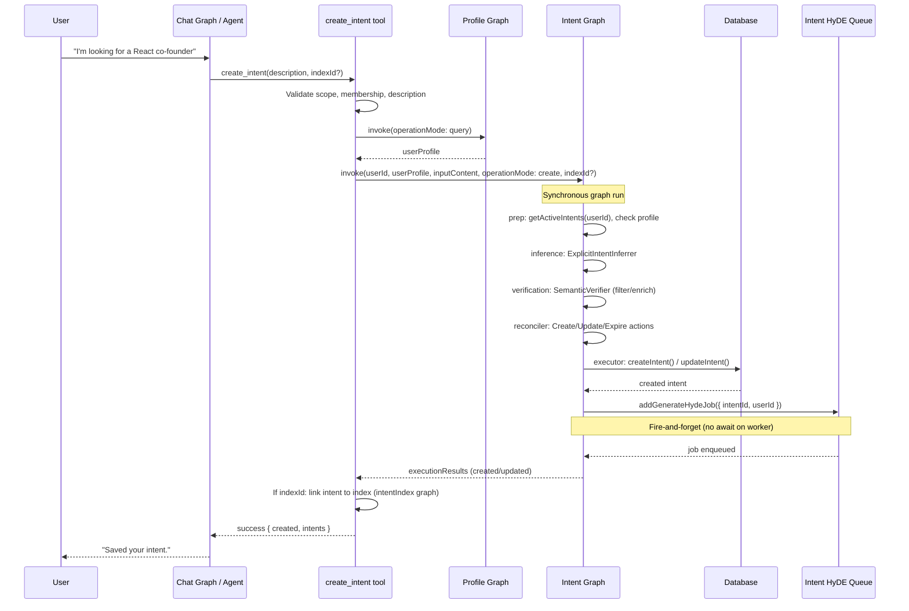
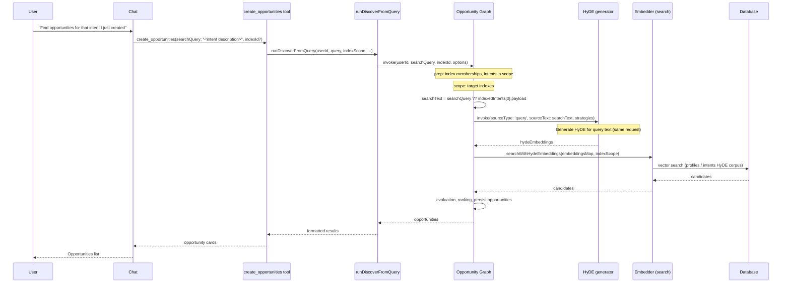
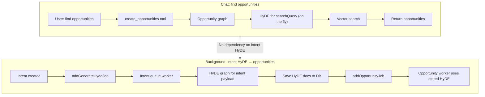

# Intent Creation, HyDE, and Opportunity Discovery Flows

This document describes how intents are created via chat, when HyDE is generated, and how opportunity discovery works—including why "find opportunities" works immediately after creating an intent.

---

## 1. create_intent flow (chat → persistence → HyDE job enqueue)

When the user creates an intent through the chat (e.g. via the `create_intent` tool), the following happens. The intent graph runs **synchronously**; HyDE generation is **enqueued** and runs later in a worker.



**Takeaway:** By the time the API returns the newly-created intent, HyDE for that intent has only been **scheduled**; it is generated asynchronously by the intent queue worker.

---

## 2. Intent HyDE generation (queue worker)

The intent queue worker processes `generate_hyde` jobs. It assigns the intent to the user's indexes, runs the HyDE graph for the intent's payload, then enqueues opportunity discovery for that intent.

```mermaid
flowchart LR
    subgraph Trigger
        A[Intent created/updated] --> B[addGenerateHydeJob]
        B --> C[BullMQ queue]
    end

    subgraph Worker["Intent queue worker"]
        C --> D[handleGenerateHyde]
        D --> E[getIntentForIndexing]
        E --> F[getUserIndexIds]
        F --> G[assignIntentToIndex per index]
        G --> H[HyDE Graph invoke]
    end

    subgraph HyDE["HyDE graph (per intent)"]
        H --> I[check_cache]
        I --> J{forceRegenerate?}
        J -->|yes| K[generate_missing]
        J -->|no| L[cache/DB hit?]
        L -->|missing| K
        L -->|found| M[embed]
        K --> M
        M --> N[cache_results: Redis + saveHydeDocument]
    end

    subgraph After
        N --> O[addOpportunityJob]
    end
```



**Strategies used for intents:** `mirror` (intent → profile: "who can help?") and `reciprocal` (intent → intent: "who needs what I offer?"). Both are persisted to the database.

---

## 3. Chat "find opportunities" (create_opportunities discovery)

When the user asks the chat to find opportunities (e.g. right after creating an intent), the `create_opportunities` tool runs discovery with a **search query**. The opportunity graph generates **HyDE for that query text in the same request**; it does **not** use the intent's stored HyDE.



**Takeaway:** Discovery uses **query-based HyDE** (generated on the fly). The newly-created intent's HyDE does not need to exist yet; the search runs on HyDE derived from the same text in the same request.

---

## 4. Two ways HyDE is used (chat vs background)

| Path | Trigger | Source of HyDE | When |
|------|---------|----------------|------|
| **Chat discovery** | User asks "find opportunities" → `create_opportunities(searchQuery)` | **Query text** (or first intent payload) → HyDE generated **in that request** | Synchronous with the chat call |
| **Background opportunities** | Intent queue worker after intent HyDE completes | **Intent's stored HyDE** (mirror/reciprocal) from DB | Asynchronous, after `generate_hyde` job |



---

## 5. Profile HyDE coverage (discovery)

Chat discovery (query-based path) searches **profile HyDE** in `hyde_documents` (sourceType `'profile'`) joined with index members. So index members need profile HyDE rows to be discoverable. When a user is **added to an index**, we enqueue an `ensure_profile_hyde` job (profile queue) so their profile HyDE is generated or updated. See [Discovery Coverage (Option C) plan](../../docs/plans/2026-02-24-discovery-coverage-option-c.md).

---

## 6. Intent graph create path (detail)

For reference, the intent graph node flow when `operationMode: 'create'`.

```mermaid
flowchart LR
    START([START]) --> P1
    P1 --> P2
    P2 --> P3
    P3 --> I1
    I1 --> I2
    I2 --> V1
    V1 --> V2
    V2 --> V3
    V3 --> R1
    R1 --> R2
    R2 --> E1
    E1 --> E2
    E2 --> END([END])

    subgraph prep["prep"]
        P1[getActiveIntents(userId)]
        P2[Check profile exists]
        P3[Format active intents for reconciler]
    end

    subgraph inference["inference"]
        I1[ExplicitIntentInferrer]
        I2[inferredIntents]
    end

    subgraph verification["verification"]
        V1[SemanticVerifier per intent]
        V2[Enrich vague / filter by type]
        V3[verifiedIntents]
    end

    subgraph reconciler["reconciler"]
        R1[IntentReconciler]
        R2[actions: create | update | expire]
    end

    subgraph executor["executor"]
        E1[createIntent / updateIntent / archiveIntent]
        E2[addGenerateHydeJob or addDeleteHydeJob]
    end
```

---

## Related

- **Scope mismatch (index-bound chat):** [analysis-create-intent-vs-read-intents-scope-mismatch.md](./analysis-create-intent-vs-read-intents-scope-mismatch.md)
- **Intent graph:** `protocol/src/lib/protocol/graphs/intent.graph.ts`
- **Intent queue / HyDE:** `protocol/src/queues/intent.queue.ts`, `protocol/src/lib/protocol/graphs/hyde.graph.ts`
- **Opportunity discovery:** `protocol/src/lib/protocol/support/opportunity.discover.ts`, `protocol/src/lib/protocol/graphs/opportunity.graph.ts`
