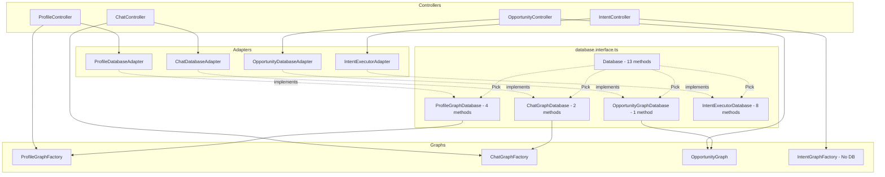

# Interface Narrowing Design for Graph System

**Status:** Design doc. References current interfaces; implementation may vary.

This document defines a pattern for narrowing the `Database` interface using TypeScript's `Pick` utility type, ensuring each graph and controller only depends on the methods it actually uses.

## Table of Contents

1. [Current State Analysis](#current-state-analysis)
2. [Narrowed Type Definitions](#narrowed-type-definitions)
3. [Graph Dependency Declarations](#graph-dependency-declarations)
4. [Controller Adapter Implementations](#controller-adapter-implementations)
5. [Migration Path](#migration-path)

---

## Current State Analysis

### Full Database Interface

The main [`Database`](../src/lib/protocol/interfaces/database.interface.ts) interface has 13 methods organized into categories:

| Category | Methods |
|----------|---------|
| Profile Operations | `getProfile`, `saveProfile`, `saveHydeProfile`, `getUser` |
| Pre-Graph Operations | `getActiveIntents` |
| Post-Graph Operations | `createIntent`, `updateIntent`, `archiveIntent` |
| Query Operations | `getIntent`, `getIntentWithOwnership` |
| Index Association | `getUserIndexIds`, `associateIntentWithIndexes` |
| Vector Search | `findSimilarIntents` |

### Graph Requirements Summary

| Graph | Database Methods Needed | Notes |
|-------|------------------------|-------|
| **Profile Graph** | `getProfile`, `getUser`, `saveProfile`, `saveHydeProfile` | Full profile lifecycle |
| **Chat Graph** | `getProfile`, `getActiveIntents` | Read-only context loading |
| **Opportunity Graph** | `getProfile` | Minimal - profile lookup only |
| **Intent Graph** | **None** | Pure LLM graph - outputs actions |
| **Intent Executor** | 8 intent methods | Post-graph action execution |

---

## Narrowed Type Definitions

Add the following type aliases to [`database.interface.ts`](../src/lib/protocol/interfaces/database.interface.ts):

```typescript
// ═══════════════════════════════════════════════════════════════════════════════
// NARROWED DATABASE INTERFACES
// 
// These types use Pick<Database, ...> to define minimal interfaces for each
// graph or executor. This ensures:
// 1. Graphs only depend on methods they actually use
// 2. Controllers only implement what graphs need
// 3. Tests only mock required methods
// ═══════════════════════════════════════════════════════════════════════════════

/**
 * Minimal database interface for the Profile Graph.
 * 
 * Used by: ProfileGraphFactory
 * Methods:
 * - getProfile: Load existing profile in check_state node
 * - getUser: Fetch user details for scrape objective construction
 * - saveProfile: Persist generated/updated profile
 * - saveHydeProfile: Save HyDE description and embedding
 */
export type ProfileGraphDatabase = Pick<
  Database,
  'getProfile' | 'getUser' | 'saveProfile' | 'saveHydeProfile'
>;

/**
 * Minimal database interface for the Chat Graph.
 * 
 * Used by: ChatGraphFactory
 * Methods:
 * - getProfile: Load user profile for context in load_context node
 * - getActiveIntents: Fetch active intents for router context
 */
export type ChatGraphDatabase = Pick<
  Database,
  'getProfile' | 'getActiveIntents'
>;

/**
 * Minimal database interface for the Opportunity Graph.
 * 
 * Used by: OpportunityGraph
 * Methods:
 * - getProfile: Resolve source profile if context not provided
 */
export type OpportunityGraphDatabase = Pick<
  Database,
  'getProfile'
>;

/**
 * Database interface for executing Intent Graph actions.
 * 
 * The Intent Graph itself is pure LLM and takes no database dependency.
 * This interface is for the caller/controller that executes the actions
 * output by the Intent Graph's reconciler.
 * 
 * Used by: Intent-related controllers and services
 * Methods:
 * - CRUD: createIntent, updateIntent, archiveIntent
 * - Query: getIntent, getIntentWithOwnership
 * - Index: getUserIndexIds, associateIntentWithIndexes
 * - Vector: findSimilarIntents
 */
export type IntentExecutorDatabase = Pick<
  Database,
  | 'createIntent'
  | 'updateIntent'
  | 'archiveIntent'
  | 'getIntent'
  | 'getIntentWithOwnership'
  | 'getUserIndexIds'
  | 'associateIntentWithIndexes'
  | 'findSimilarIntents'
>;
```

### Type Composition Example

For controllers that need multiple capabilities, compose types:

```typescript
/**
 * Example: A controller that runs both Intent Graph and executes its actions
 * would combine ChatGraphDatabase (for loading context) and IntentExecutorDatabase
 */
type ChatWithIntentExecutionDatabase = ChatGraphDatabase & IntentExecutorDatabase;

// Resolves to:
// Pick<Database, 'getProfile' | 'getActiveIntents' | 'createIntent' | 'updateIntent' | ...>
```

---

## Graph Dependency Declarations

### Profile Graph Factory

**File:** [`src/lib/protocol/graphs/profile/profile.graph.ts`](../src/lib/protocol/graphs/profile/profile.graph.ts)

```typescript
import { ProfileGraphDatabase } from "../../interfaces/database.interface";
import { Embedder } from "../../interfaces/embedder.interface";
import { Scraper } from "../../interfaces/scraper.interface";

/**
 * Factory class to build and compile the Profile Generation Graph.
 * 
 * @param database - Requires ProfileGraphDatabase (4 methods)
 * @param embedder - Full Embedder interface
 * @param scraper - Full Scraper interface
 */
export class ProfileGraphFactory {
  constructor(
    private database: ProfileGraphDatabase,  // Changed from Database
    private embedder: Embedder,
    private scraper: Scraper
  ) { }

  public createGraph() {
    // Implementation unchanged - only uses the 4 required methods
  }
}
```

### Chat Graph Factory

**File:** [`src/lib/protocol/graphs/chat/chat.graph.ts`](../src/lib/protocol/graphs/chat/chat.graph.ts)

```typescript
import { ChatGraphDatabase } from "../../interfaces/database.interface";
import { Embedder } from "../../interfaces/embedder.interface";
import { Scraper } from "../../interfaces/scraper.interface";

/**
 * Factory class to build and compile the Chat Graph.
 * 
 * @param database - Requires ChatGraphDatabase (2 methods)
 * @param embedder - Full Embedder interface (for subgraph delegation)
 * @param scraper - Full Scraper interface (for subgraph delegation)
 */
export class ChatGraphFactory {
  constructor(
    private database: ChatGraphDatabase,  // Changed from Database
    private embedder: Embedder,
    private scraper: Scraper
  ) {}

  public createGraph() {
    // Note: Subgraphs are created with their OWN narrowed interfaces
    // ChatGraph passes full dependencies, subgraphs pick what they need
    
    // ProfileGraphFactory will only use what it needs from passed deps
    const profileGraph = new ProfileGraphFactory(
      this.database as ProfileGraphDatabase,  // Type assertion for subset
      this.embedder, 
      this.scraper
    ).createGraph();
    
    // OpportunityGraph will only use getProfile
    const opportunityGraph = new OpportunityGraph(
      this.database,  // Already compatible (ChatGraphDatabase has getProfile)
      this.embedder
    ).compile();
  }
}
```

### Opportunity Graph

**File:** [`src/lib/protocol/graphs/opportunity/opportunity.graph.ts`](../src/lib/protocol/graphs/opportunity/opportunity.graph.ts)

```typescript
import { OpportunityGraphDatabase } from "../../interfaces/database.interface";
import { Embedder } from "../../interfaces/embedder.interface";

/**
 * Opportunity Graph for finding and evaluating connection opportunities.
 * 
 * @param database - Requires OpportunityGraphDatabase (1 method)
 * @param embedder - Full Embedder interface for vector search
 */
export class OpportunityGraph {
  constructor(
    private database: OpportunityGraphDatabase,  // Changed from Database
    private embedder: Embedder
  ) {
    this.evaluatorAgent = new OpportunityEvaluator();
  }
}
```

### Intent Graph Factory

**File:** [`src/lib/protocol/graphs/intent/intent.graph.ts`](../src/lib/protocol/graphs/intent/intent.graph.ts)

```typescript
/**
 * Factory class to build and compile the Intent Processing Graph.
 * 
 * This is a pure LLM graph with NO database dependency.
 * The graph outputs ReconcilerAction[] which the caller executes
 * using IntentExecutorDatabase.
 * 
 * Input State:
 * - userProfile: string (JSON profile context)
 * - activeIntents: string (formatted existing intents)
 * - inputContent: string (user message/content)
 * 
 * Output State:
 * - actions: ReconcilerAction[] (create/update/expire actions)
 */
export class IntentGraphFactory {
  constructor() { }  // No database dependency!

  public createGraph() {
    // Pure LLM processing - inference, verification, reconciliation
    // Returns actions array for caller to execute
  }
}
```

---

## Controller Adapter Implementations

### Pattern: Minimal Adapter Implementation

Controllers should implement adapters that satisfy only the narrowed interface their graph needs.

### Profile Controller Adapter

**File:** [`src/controllers/profile.controller.ts`](../src/controllers/profile.controller.ts)

```typescript
import { eq } from 'drizzle-orm';
import * as schema from '../lib/schema';
import db from '../lib/drizzle/drizzle';
import { ProfileGraphDatabase } from '../lib/protocol/interfaces/database.interface';
import { ProfileDocument } from '../lib/protocol/agents/profile/profile.generator';
import { User } from '../lib/schema';

/**
 * Database adapter for Profile Graph operations.
 * Implements ONLY the 4 methods required by ProfileGraphDatabase.
 */
export class ProfileDatabaseAdapter implements ProfileGraphDatabase {

  async getProfile(userId: string): Promise<ProfileDocument | null> {
    const result = await db.select()
      .from(schema.userProfiles)
      .where(eq(schema.userProfiles.userId, userId))
      .limit(1);
    return (result[0] as unknown as ProfileDocument) || null;
  }

  async getUser(userId: string): Promise<User | null> {
    const result = await db.select()
      .from(schema.users)
      .where(eq(schema.users.id, userId))
      .limit(1);
    return result[0] || null;
  }

  async saveProfile(userId: string, profile: ProfileDocument): Promise<void> {
    const data = {
      userId,
      identity: profile.identity,
      narrative: profile.narrative,
      attributes: profile.attributes,
      embedding: Array.isArray(profile.embedding[0]) 
        ? (profile.embedding as number[][])[0] 
        : (profile.embedding as number[]),
      updatedAt: new Date()
    };

    await db.insert(schema.userProfiles)
      .values(data)
      .onConflictDoUpdate({
        target: schema.userProfiles.userId,
        set: data
      });
  }

  async saveHydeProfile(userId: string, description: string, embedding: number[]): Promise<void> {
    await db.update(schema.userProfiles)
      .set({
        hydeDescription: description,
        hydeEmbedding: embedding,
        updatedAt: new Date()
      })
      .where(eq(schema.userProfiles.userId, userId));
  }

  // Note: NO other Database methods implemented
}

// --- Controller ---

@Controller('/profiles')
export class ProfileController {
  private db: ProfileGraphDatabase;  // Narrowed type
  private embedder: Embedder;
  private scraper: Scraper;
  private factory: ProfileGraphFactory;

  constructor() {
    this.db = new ProfileDatabaseAdapter();  // Minimal implementation
    this.embedder = new IndexEmbedder();
    this.scraper = new ParallelScraperAdapter();
    this.factory = new ProfileGraphFactory(this.db, this.embedder, this.scraper);
  }
}
```

### Chat Controller Adapter

```typescript
import { ChatGraphDatabase } from '../lib/protocol/interfaces/database.interface';
import { ProfileDocument, ActiveIntent } from '../lib/protocol/interfaces/database.interface';

/**
 * Database adapter for Chat Graph operations.
 * Implements ONLY the 2 methods required by ChatGraphDatabase.
 */
export class ChatDatabaseAdapter implements ChatGraphDatabase {

  async getProfile(userId: string): Promise<ProfileDocument | null> {
    const result = await db.select()
      .from(schema.userProfiles)
      .where(eq(schema.userProfiles.userId, userId))
      .limit(1);
    return (result[0] as unknown as ProfileDocument) || null;
  }

  async getActiveIntents(userId: string): Promise<ActiveIntent[]> {
    const results = await db.select({
      id: schema.intents.id,
      payload: schema.intents.payload,
      summary: schema.intents.summary,
      createdAt: schema.intents.createdAt,
    })
      .from(schema.intents)
      .where(
        and(
          eq(schema.intents.userId, userId),
          isNull(schema.intents.archivedAt)
        )
      )
      .orderBy(desc(schema.intents.createdAt));
    
    return results;
  }
}

// --- Controller ---

@Controller('/chat')
export class ChatController {
  private db: ChatGraphDatabase;  // Only 2 methods needed
  private factory: ChatGraphFactory;

  constructor() {
    this.db = new ChatDatabaseAdapter();
    this.factory = new ChatGraphFactory(this.db, new IndexEmbedder(), new ParallelScraperAdapter());
  }
}
```

### Intent Executor Adapter

Used by controllers that need to execute Intent Graph output actions:

```typescript
import { 
  IntentExecutorDatabase,
  CreateIntentData,
  UpdateIntentData,
  CreatedIntent,
  IntentRecord,
  SimilarIntent,
  ArchiveResult,
  SimilarIntentSearchOptions
} from '../lib/protocol/interfaces/database.interface';

/**
 * Database adapter for executing Intent Graph actions.
 * Implements the 8 methods required by IntentExecutorDatabase.
 */
export class IntentExecutorAdapter implements IntentExecutorDatabase {

  async createIntent(data: CreateIntentData): Promise<CreatedIntent> {
    // Full implementation of intent creation pipeline
    // - Generate summary if not provided
    // - Generate embedding if not provided
    // - Insert into database
    // - Associate with indexes
    // ...
  }

  async updateIntent(intentId: string, data: UpdateIntentData): Promise<CreatedIntent | null> {
    // Implementation
  }

  async archiveIntent(intentId: string): Promise<ArchiveResult> {
    // Implementation
  }

  async getIntent(intentId: string): Promise<IntentRecord | null> {
    // Implementation
  }

  async getIntentWithOwnership(intentId: string, userId: string): Promise<IntentRecord | null> {
    // Implementation with ownership check
  }

  async getUserIndexIds(userId: string): Promise<string[]> {
    // Implementation
  }

  async associateIntentWithIndexes(intentId: string, indexIds: string[]): Promise<void> {
    // Implementation
  }

  async findSimilarIntents(
    embedding: number[],
    userId: string,
    options?: SimilarIntentSearchOptions
  ): Promise<SimilarIntent[]> {
    // Vector search implementation
  }
}
```

### Combined Adapter Example

For controllers that need both Chat and Intent execution:

```typescript
import { ChatGraphDatabase, IntentExecutorDatabase } from '../lib/protocol/interfaces/database.interface';

// Combine the interfaces
type ChatWithIntentDatabase = ChatGraphDatabase & IntentExecutorDatabase;

/**
 * Combined adapter for chat with intent action execution.
 */
export class ChatIntentDatabaseAdapter implements ChatWithIntentDatabase {
  // Implements all 10 methods (2 from Chat + 8 from IntentExecutor)
  
  // Chat methods
  async getProfile(userId: string): Promise<ProfileDocument | null> { ... }
  async getActiveIntents(userId: string): Promise<ActiveIntent[]> { ... }
  
  // Intent executor methods
  async createIntent(data: CreateIntentData): Promise<CreatedIntent> { ... }
  async updateIntent(intentId: string, data: UpdateIntentData): Promise<CreatedIntent | null> { ... }
  async archiveIntent(intentId: string): Promise<ArchiveResult> { ... }
  async getIntent(intentId: string): Promise<IntentRecord | null> { ... }
  async getIntentWithOwnership(intentId: string, userId: string): Promise<IntentRecord | null> { ... }
  async getUserIndexIds(userId: string): Promise<string[]> { ... }
  async associateIntentWithIndexes(intentId: string, indexIds: string[]): Promise<void> { ... }
  async findSimilarIntents(embedding: number[], userId: string, options?: SimilarIntentSearchOptions): Promise<SimilarIntent[]> { ... }
}
```

---

## Migration Path

### Step 1: Add Type Definitions

Add the narrowed types to [`database.interface.ts`](../src/lib/protocol/interfaces/database.interface.ts). This is non-breaking.

### Step 2: Update Graph Factories

Update each graph factory constructor to use the narrowed type. This is backward compatible because the narrowed types are subsets of the full interface.

**Order of updates:**
1. `IntentGraphFactory` - Already has no dependency (no change)
2. `OpportunityGraph` - Change `Database` to `OpportunityGraphDatabase`
3. `ProfileGraphFactory` - Change `Database` to `ProfileGraphDatabase`
4. `ChatGraphFactory` - Change `Database` to `ChatGraphDatabase`

### Step 3: Update Controllers

Update controller adapters to implement only the narrowed interface they need. Controllers can choose to:

1. **Implement narrowed interface directly** (recommended for new code)
2. **Keep full implementation** (acceptable for existing code)

### Step 4: Update Tests

Test mocks need only implement the narrowed interface:

```typescript
// Before: Had to mock all 13 methods
const mockDb: Database = {
  getProfile: jest.fn(),
  saveProfile: jest.fn(),
  // ... 11 more methods
};

// After: Only mock what's needed
const mockDb: ProfileGraphDatabase = {
  getProfile: jest.fn(),
  getUser: jest.fn(),
  saveProfile: jest.fn(),
  saveHydeProfile: jest.fn(),
};
```

---

## Architectural Flow Diagram



---

## Naming Conventions

| Type | Pattern | Example |
|------|---------|---------|
| Narrowed interface | `{Graph}Database` | `ProfileGraphDatabase` |
| Executor interface | `{Domain}ExecutorDatabase` | `IntentExecutorDatabase` |
| Adapter class | `{Graph}DatabaseAdapter` | `ProfileDatabaseAdapter` |
| Combined type | `{Graph}With{Feature}Database` | `ChatWithIntentDatabase` |

---

## Summary of Changes

| File | Changes Required |
|------|------------------|
| `database.interface.ts` | Add 4 type aliases |
| `profile.graph.ts` | Change constructor type |
| `chat.graph.ts` | Change constructor type |
| `opportunity.graph.ts` | Change constructor type |
| `intent.graph.ts` | No change (already has no DB) |
| `profile.controller.ts` | Update adapter implements clause |
| Future controllers | Implement narrowed interfaces |
