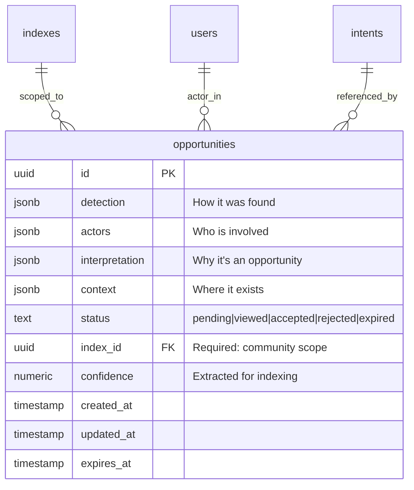
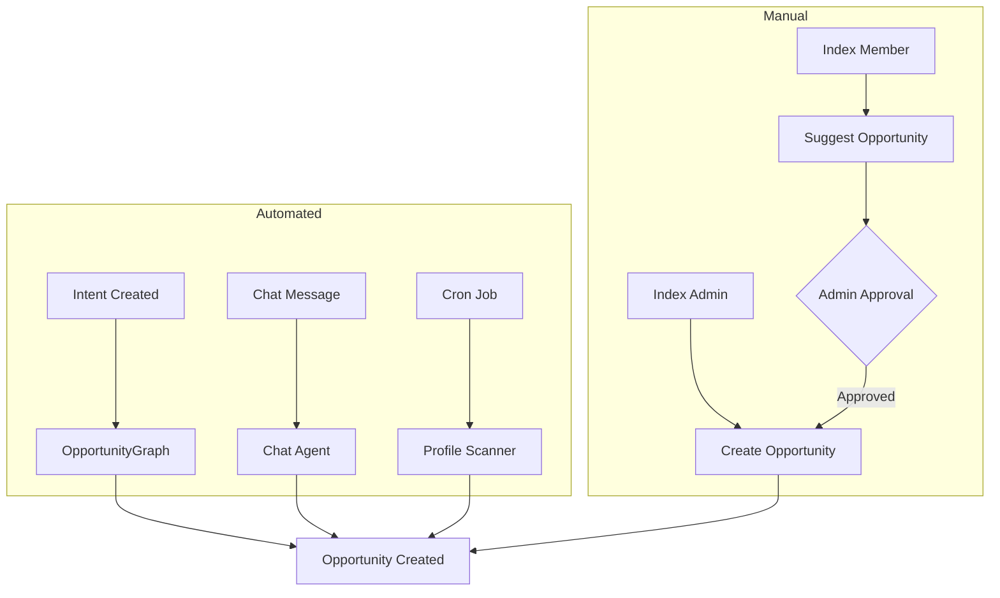
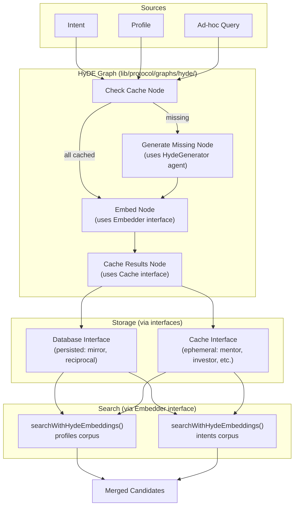
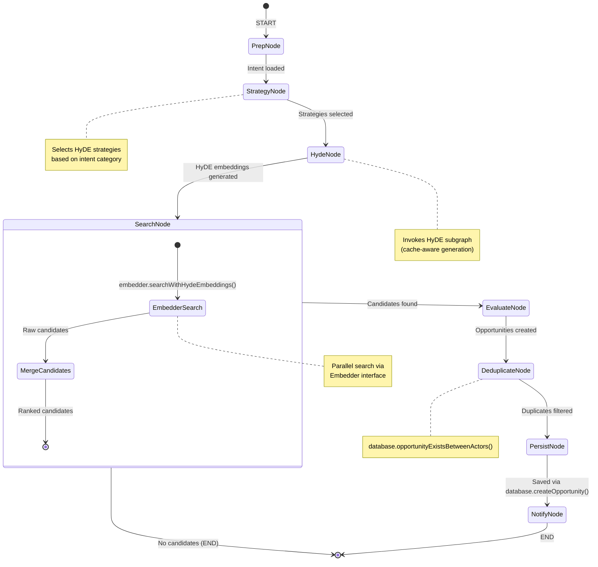
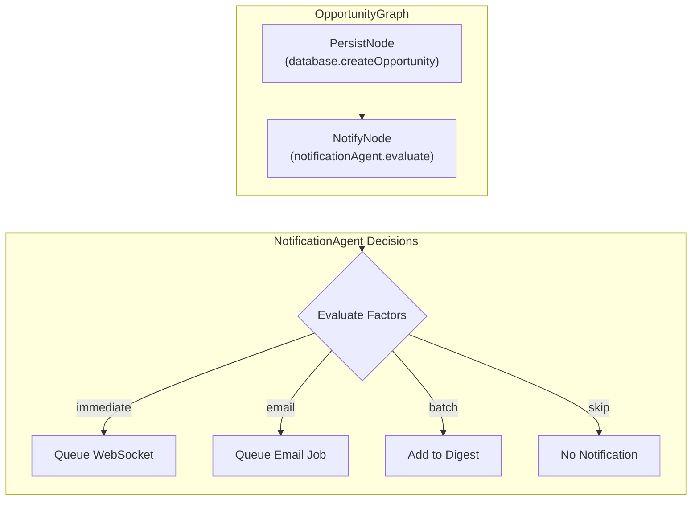
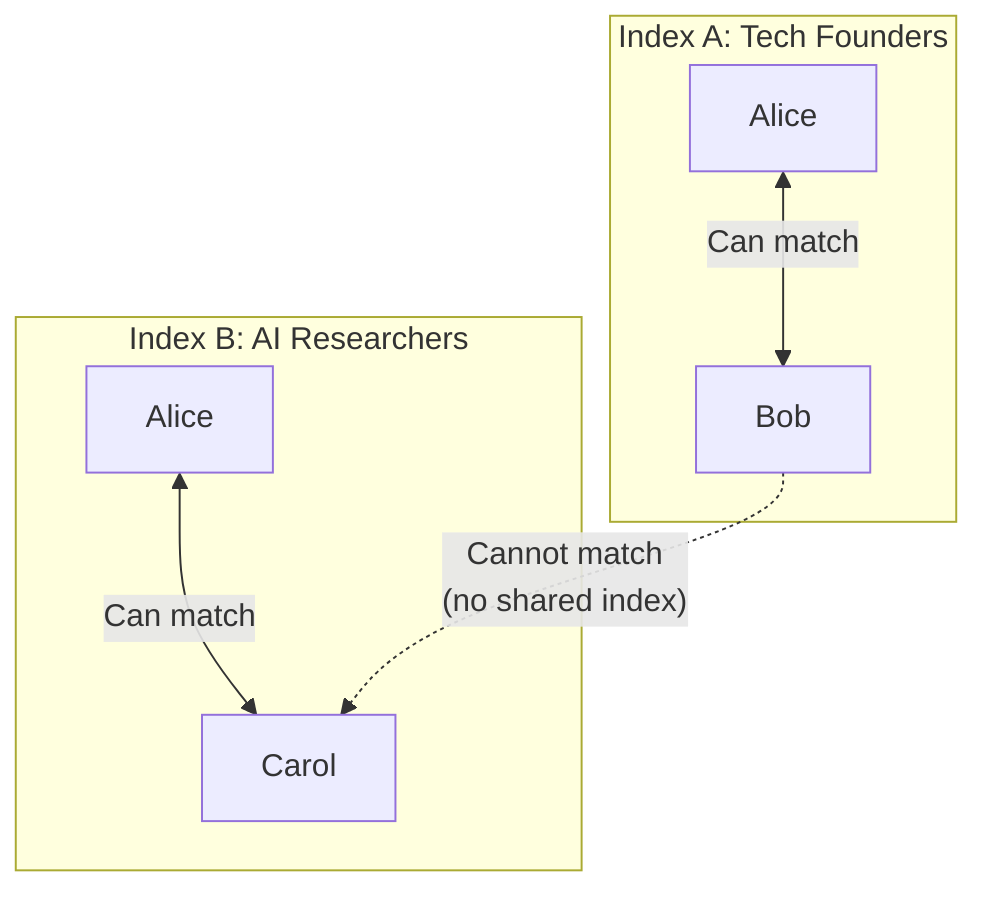
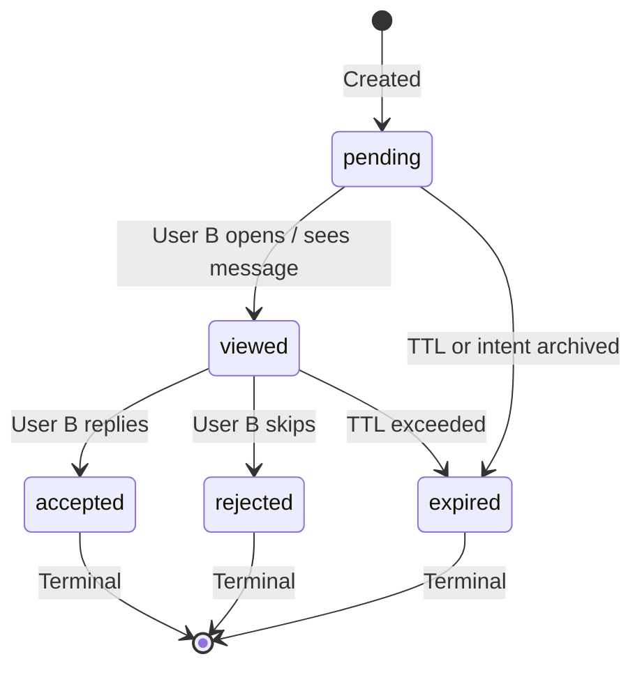

# Opportunity System Redesign Plan

> **Status**: DRAFT - Discussion Only  
> **Author**: AI Assistant  
> **Date**: 2026-02-03  
> **Version**: 3.0 (Interface-Driven Architecture)

## Executive Summary

This document outlines a redesign of the Opportunity system with an **extensible, interface-driven architecture** that:

1. **Retires `intent_stakes`** — Clean break, no migration
2. **Drops I2I/I2P distinction** — Unified opportunity model
3. **Uses extensible JSON schemas** — Focus on data sources, actors, and reasoning
4. **Enables third-party matching** — Curators can create opportunities for others
5. **Separates data from presentation** — Descriptions generated at render time
6. **Supports agent-driven notifications** — No static thresholds
7. **Follows Interface → Adapter → Graph → Controller pattern** — No services layer
8. **Message-first connections** — No mutual "accept"; User A sends a message, User B replies (= accept) or skips (= reject)

---

## 1. Design Principles

### 1.1 Core Philosophy

| Principle | Description |
|-----------|-------------|
| **Data over Presentation** | Store the "what, who, why" — generate descriptions on-demand |
| **Extensible by Default** | JSON schemas evolve without migrations |
| **Actor-Centric** | Opportunities have participants with roles, not fixed source/candidate |
| **Detection Agnostic** | Same opportunity structure whether found by AI, chat, or human curator |
| **Index-Scoped** | All opportunities exist within a community context |
| **Interface-Driven** | All dependencies injected via interfaces, implemented in adapters |

### 1.2 Architectural Pattern

```
┌─────────────────────────────────────────────────────────────────────────────┐
│                              ARCHITECTURE                                    │
├─────────────────────────────────────────────────────────────────────────────┤
│                                                                              │
│   lib/protocol/interfaces/     ──►  Abstract contracts (Database, Embedder, │
│                                      Cache, Queue)                           │
│                                                                              │
│   src/adapters/                ──►  Concrete implementations (Postgres,     │
│                                      Redis, pgvector)                        │
│                                                                              │
│   lib/protocol/graphs/         ──►  LangGraph workflows (inject interfaces) │
│                                                                              │
│   lib/protocol/agents/         ──►  Pure LLM agents (no DB access)          │
│                                                                              │
│   src/controllers/             ──►  HTTP handlers (wire adapters → graphs)  │
│                                                                              │
│   src/jobs/                    ──►  Background jobs (use adapters directly) │
│                                                                              │
└─────────────────────────────────────────────────────────────────────────────┘
```

### 1.3 What We're NOT Doing

- ❌ Static `matchType` enum (I2I, I2P)
- ❌ Fixed `sourceUserId` / `candidateUserId` columns
- ❌ Pre-computed `sourceDescription` / `candidateDescription`
- ❌ Incognito intent handling
- ❌ Data migration from `intent_stakes`
- ❌ Static notification thresholds
- ❌ **Services layer** — Use interfaces + adapters instead
- ❌ **Mutual accept** — Connections are message-first: B replies (= accept) or skips (= reject)

---

## 2. Opportunity Data Model

### 2.1 Schema Overview

```typescript
interface Opportunity {
  id: string;
  
  // ═══════════════════════════════════════════════════════════════
  // DETECTION: How was this opportunity discovered?
  // ═══════════════════════════════════════════════════════════════
  detection: {
    source: string;           // 'opportunity_graph' | 'chat' | 'manual' | 'cron'
    createdBy?: string;       // User ID if manual, Agent ID if automated
    triggeredBy?: string;     // What triggered it (intent ID, message ID, etc.)
    timestamp: string;
  };
  
  // ═══════════════════════════════════════════════════════════════
  // ACTORS: Who is involved in this opportunity?
  // ═══════════════════════════════════════════════════════════════
  actors: Array<{
    role: string;             // 'agent' | 'patient' | 'peer' | 'introducer' | ...
    identityId: string;       // User ID
    intents?: string[];       // Associated intent IDs (can be empty)
    profile?: boolean;        // Was profile used in matching?
  }>;
  
  // ═══════════════════════════════════════════════════════════════
  // INTERPRETATION: Why is this an opportunity?
  // ═══════════════════════════════════════════════════════════════
  interpretation: {
    category: string;         // 'collaboration' | 'hiring' | 'investment' | 'mentorship' | ...
    summary: string;          // Human-readable reasoning (NOT presentation copy)
    confidence: number;       // 0-1 score
    signals?: Array<{         // What signals contributed to this match?
      type: string;           // 'intent_match' | 'profile_similarity' | 'curator_judgment'
      weight: number;
      detail?: string;
    }>;
  };
  
  // ═══════════════════════════════════════════════════════════════
  // CONTEXT: Where does this opportunity exist?
  // ═══════════════════════════════════════════════════════════════
  context: {
    indexId: string;          // Required: community scope
    conversationId?: string;  // If detected in chat
    triggeringIntentId?: string;  // Primary intent that triggered discovery
  };
  
  // ═══════════════════════════════════════════════════════════════
  // LIFECYCLE (message-first: accepted = B replied, rejected = B skipped)
  // ═══════════════════════════════════════════════════════════════
  status: 'pending' | 'viewed' | 'accepted' | 'rejected' | 'expired';
  createdAt: string;
  updatedAt: string;
  expiresAt?: string;
}
```

### 2.2 Entity Relationship



### 2.3 Example Opportunities

#### AI-Detected Match (Graph)
```json
{
  "detection": {
    "source": "opportunity_graph",
    "createdBy": "agent-opportunity-finder",
    "triggeredBy": "intent-abc123",
    "timestamp": "2026-02-03T10:00:00Z"
  },
  "actors": [
    { "role": "agent", "identityId": "alice-id", "intents": ["intent-abc123"], "profile": true },
    { "role": "patient", "identityId": "bob-id", "intents": ["intent-xyz789"], "profile": false }
  ],
  "interpretation": {
    "category": "hiring",
    "summary": "Alice is looking for a React developer; Bob has indicated availability for React contract work",
    "confidence": 0.87,
    "signals": [
      { "type": "intent_reciprocal", "weight": 0.8, "detail": "Complementary intents detected" },
      { "type": "profile_skills", "weight": 0.2, "detail": "Bob's profile lists React expertise" }
    ]
  },
  "context": {
    "indexId": "tech-founders-index",
    "triggeringIntentId": "intent-abc123"
  },
  "status": "pending"
}
```

#### Chat-Detected Match
```json
{
  "detection": {
    "source": "chat",
    "createdBy": "agent-chat-router",
    "triggeredBy": "message-12345",
    "timestamp": "2026-02-03T10:00:00Z"
  },
  "actors": [
    { "role": "peer", "identityId": "alice-id", "intents": [], "profile": true },
    { "role": "peer", "identityId": "bob-id", "intents": [], "profile": true }
  ],
  "interpretation": {
    "category": "collaboration",
    "summary": "During conversation, Alice mentioned interest in Web3 gaming; Bob is building in this space",
    "confidence": 0.72,
    "signals": [
      { "type": "conversation_context", "weight": 1.0, "detail": "Extracted from chat message" }
    ]
  },
  "context": {
    "indexId": "web3-builders-index",
    "conversationId": "chat-session-456"
  },
  "status": "pending"
}
```

#### Manual Curator Match
```json
{
  "detection": {
    "source": "manual",
    "createdBy": "carol-curator-id",
    "timestamp": "2026-02-03T10:00:00Z"
  },
  "actors": [
    { "role": "party", "identityId": "alice-id", "intents": ["intent-111"], "profile": true },
    { "role": "party", "identityId": "bob-id", "intents": [], "profile": true },
    { "role": "introducer", "identityId": "carol-curator-id", "intents": [] }
  ],
  "interpretation": {
    "category": "collaboration",
    "summary": "Alice is building an AI tool and Bob has ML expertise - seems like a great fit",
    "confidence": 0.85,
    "signals": [
      { "type": "curator_judgment", "weight": 1.0, "detail": "Manual match by index admin" }
    ]
  },
  "context": {
    "indexId": "ai-founders-index"
  },
  "status": "pending"
}
```

---

## 3. Actor Roles (Valency)

### 3.1 Core Roles

| Role | Description | UI Framing |
|------|-------------|------------|
| **agent** | Can DO something for others | "Someone who can help you" |
| **patient** | NEEDS something from others | "Someone you can help" |
| **peer** | Symmetric collaboration | "Potential collaborator" |
| **introducer** | Created/facilitated the match | "Introduced by..." |
| **party** | Generic participant (for manual matches) | Context-dependent |

### 3.2 Strategy-Derived Roles

These roles are automatically assigned based on which HyDE strategy found the match:

| Role | Description | Derived From Strategy |
|------|-------------|----------------------|
| **mentor** | Teaches/guides | `mentor` HyDE |
| **mentee** | Learns/receives guidance | `mentor` HyDE (source) |
| **investor** | Provides capital | `investor` HyDE |
| **founder** | Seeks capital | `investor` HyDE (source) |

### 3.3 Future Roles

| Role | Description | Use Case |
|------|-------------|----------|
| **referrer** | Knows relevant people | Network expansion |

### 3.4 Role Assignment

Roles are assigned by:
1. **HyDE Strategy** — Primary method: roles derived from which search strategy found the match (see `deriveRolesFromStrategy()` in Section 9.5)
2. **Curator Selection** — When manually creating opportunities
3. **Conversation Context** — When detected in chat

```typescript
// Role derivation from HyDE strategy (no LLM call needed)
function deriveRolesFromStrategy(strategy: HydeStrategy): { source: string; candidate: string } {
  switch (strategy) {
    case 'mirror':     return { source: 'patient', candidate: 'agent' };
    case 'reciprocal': return { source: 'peer', candidate: 'peer' };
    case 'mentor':     return { source: 'mentee', candidate: 'mentor' };
    case 'investor':   return { source: 'founder', candidate: 'investor' };
    case 'hiree':      return { source: 'agent', candidate: 'patient' };
    case 'collaborator': return { source: 'peer', candidate: 'peer' };
    default:           return { source: 'party', candidate: 'party' };
  }
}
```

This approach eliminates the need for an LLM call to determine roles, as the HyDE strategy semantically encodes the relationship type.

---

## 4. Detection Sources

### 4.1 Automated Detection

| Source | Trigger | Description |
|--------|---------|-------------|
| `opportunity_graph` | Intent created/updated | Background graph runs HyDE matching |
| `chat` | Message in conversation | Chat agent identifies opportunity during dialogue |
| `cron` | Scheduled job | Periodic re-scan for stale profiles/intents |
| `member_added` | User joins index | Scan new member against existing members |

### 4.2 Manual Detection

| Source | Trigger | Description |
|--------|---------|-------------|
| `manual` | Curator action | Index admin creates opportunity for two members |
| `request` | User request | User requests introduction to another member |
| `suggestion` | Non-admin suggestion | Member suggests match (requires approval) |

### 4.3 Detection Flow



---

## 5. HyDE Generation Pipeline

### 5.1 Core Concept

HyDE (Hypothetical Document Embeddings) solves the **cross-voice retrieval problem**. When searching for matches, the source and target documents are written in different perspectives:

| Source | Target | Problem |
|--------|--------|---------|
| Intent: "I need a Rust developer" | Profile: "I'm a Rust dev with 5 years..." | Different voice/perspective |
| Intent: "Looking for seed funding" | Intent: "Looking to invest in early-stage" | Complementary but not lexically similar |
| Chat query: "Find me a mentor" | Profile: "I mentor founders in..." | Ad-hoc query vs structured data |

HyDE bridges this by generating a **hypothetical document in the target's voice**, then searching for real matches against that embedding.

### 5.2 Dual-Mode HyDE Architecture

HyDE generation operates in two modes:

| Mode | Trigger | Strategies | Storage | Use Case |
|------|---------|------------|---------|----------|
| **Automatic** | Intent/Profile creation/update | `mirror`, `reciprocal` | Database (persisted) | Background opportunity detection |
| **Dynamic** | Discovery query, chat, on-demand | `mentor`, `investor`, `collaborator`, `hiree` | Redis (ephemeral TTL) | Real-time search |

**Automatic HyDE** is triggered by existing `intent.graph.ts` and `profile.graph.ts` via queue jobs.

**Dynamic HyDE** uses a dedicated `hyde.graph.ts` for complex multi-strategy generation.

### 5.3 Architecture Overview



### 5.4 Strategy Registry

HyDE strategies are composable templates that define how to generate hypothetical documents:

```typescript
// lib/protocol/agents/hyde/hyde.strategies.ts

export type HydeStrategy = 
  | 'mirror'      // Intent → Profile (who can help me?)
  | 'reciprocal'  // Intent → Intent (who needs what I offer?)
  | 'mentor'      // Intent → Profile (who can guide me?)
  | 'investor'    // Intent → Profile (who would fund this?)
  | 'collaborator'// Intent → Intent (who shares my interests?)
  | 'hiree';      // Intent → Intent (who wants this job?)

export type HydeTargetCorpus = 'profiles' | 'intents';

export interface HydeStrategyConfig {
  targetCorpus: HydeTargetCorpus;
  prompt: (source: string, context?: HydeContext) => string;
  persist: boolean;      // Store in DB or ephemeral (cache)?
  cacheTTL?: number;     // Cache TTL in seconds (if not persisted)
}

export interface HydeContext {
  category?: string;
  indexId?: string;
  customPrompt?: string;
}

export const HYDE_STRATEGIES: Record<HydeStrategy, HydeStrategyConfig> = {
  // ═══════════════════════════════════════════════════════════════
  // CORE STRATEGIES (Pre-computed at intent creation, persisted to DB)
  // ═══════════════════════════════════════════════════════════════
  
  mirror: {
    targetCorpus: 'profiles',
    prompt: (intent) => `
      Write a professional biography for the ideal person who can satisfy this goal:
      "${intent}"
      
      Include their expertise, experience, and what they're currently focused on.
      Write in first person as if they are describing themselves.
    `,
    persist: true,
  },
  
  reciprocal: {
    targetCorpus: 'intents',
    prompt: (intent) => `
      Write a goal or aspiration statement for someone who is looking for exactly 
      what this person offers or needs:
      "${intent}"
      
      Write from the first person perspective as if stating their own goal.
    `,
    persist: true,
  },
  
  // ═══════════════════════════════════════════════════════════════
  // CATEGORY STRATEGIES (Generated on-demand, cached in Redis)
  // ═══════════════════════════════════════════════════════════════
  
  mentor: {
    targetCorpus: 'profiles',
    prompt: (intent) => `
      Write a mentor profile for someone who could guide a person with this goal:
      "${intent}"
      
      Describe their background, what they've achieved, and how they help others.
      Write in first person.
    `,
    persist: false,
    cacheTTL: 3600,  // 1 hour
  },
  
  investor: {
    targetCorpus: 'profiles',
    prompt: (intent) => `
      Write an investor thesis for someone who would be interested in funding:
      "${intent}"
      
      Include their investment focus, stage preference, and what they look for.
      Write in first person.
    `,
    persist: false,
    cacheTTL: 3600,
  },
  
  collaborator: {
    targetCorpus: 'intents',
    prompt: (intent) => `
      Write a collaboration-seeking statement for someone who would be a great 
      peer partner for this person:
      "${intent}"
      
      Focus on complementary skills and shared interests.
      Write in first person.
    `,
    persist: false,
    cacheTTL: 3600,
  },
  
  hiree: {
    targetCorpus: 'intents',
    prompt: (intent) => `
      Write a job-seeking statement for someone who would be perfect for:
      "${intent}"
      
      Describe what role they're looking for and their relevant experience.
      Write in first person.
    `,
    persist: false,
    cacheTTL: 3600,
  },
};
```

### 5.5 HyDE Storage Schema

```sql
-- Dedicated table for HyDE documents (replaces columns on intents)
CREATE TABLE hyde_documents (
  id UUID PRIMARY KEY DEFAULT gen_random_uuid(),
  
  -- Source reference
  source_type TEXT NOT NULL,        -- 'intent' | 'profile' | 'query'
  source_id UUID,                    -- FK to source (nullable for ad-hoc queries)
  source_text TEXT,                  -- For ad-hoc queries without entity reference
  
  -- Strategy configuration
  strategy TEXT NOT NULL,            -- 'mirror' | 'reciprocal' | 'mentor' | ...
  target_corpus TEXT NOT NULL,       -- 'profiles' | 'intents'
  
  -- Context constraints (for scoped generation)
  context JSONB,                     -- { category, indexId, ... }
  
  -- Generated content
  hyde_text TEXT NOT NULL,
  hyde_embedding vector(2000) NOT NULL,
  
  -- Lifecycle
  created_at TIMESTAMP WITH TIME ZONE NOT NULL DEFAULT NOW(),
  expires_at TIMESTAMP WITH TIME ZONE,  -- Staleness control
  
  -- Prevent duplicate HyDE for same source+strategy
  CONSTRAINT hyde_source_strategy_unique 
    UNIQUE NULLS NOT DISTINCT (source_type, source_id, strategy, target_corpus)
);

-- Fast lookup by source
CREATE INDEX hyde_source_idx ON hyde_documents(source_type, source_id);

-- Fast lookup by strategy (for bulk refresh)
CREATE INDEX hyde_strategy_idx ON hyde_documents(strategy);

-- Vector similarity search (when searching FROM hyde)
CREATE INDEX hyde_embedding_idx ON hyde_documents 
USING hnsw (hyde_embedding vector_cosine_ops);

-- Cleanup expired HyDE
CREATE INDEX hyde_expires_idx ON hyde_documents(expires_at) 
WHERE expires_at IS NOT NULL;
```

### 5.6 Drizzle Schema

All table schemas live in **`src/schemas/database.schema.ts`** (do not create `lib/protocol/schemas/`).

```typescript
// src/schemas/database.schema.ts (excerpt: HyDE table)

export type HydeSourceType = 'intent' | 'profile' | 'query';

export const hydeDocuments = pgTable('hyde_documents', {
  id: uuid('id').primaryKey().defaultRandom(),
  
  // Source
  sourceType: text('source_type').$type<HydeSourceType>().notNull(),
  sourceId: uuid('source_id'),
  sourceText: text('source_text'),
  
  // Strategy
  strategy: text('strategy').$type<HydeStrategy>().notNull(),
  targetCorpus: text('target_corpus').$type<HydeTargetCorpus>().notNull(),
  
  // Context
  context: jsonb('context').$type<HydeContext>(),
  
  // Content
  hydeText: text('hyde_text').notNull(),
  hydeEmbedding: vector('hyde_embedding', { dimensions: 2000 }).notNull(),
  
  // Lifecycle
  createdAt: timestamp('created_at', { withTimezone: true }).notNull().defaultNow(),
  expiresAt: timestamp('expires_at', { withTimezone: true }),
}, (table) => ({
  sourceIdx: index('hyde_source_idx').on(table.sourceType, table.sourceId),
  strategyIdx: index('hyde_strategy_idx').on(table.strategy),
  expiresIdx: index('hyde_expires_idx').on(table.expiresAt),
}));
```

### 5.7 Cache Interface

```typescript
// lib/protocol/interfaces/cache.interface.ts

export interface CacheOptions {
  /** TTL in seconds */
  ttl?: number;
}

export interface Cache {
  /**
   * Get a cached value by key.
   * @returns The cached value or null if not found/expired
   */
  get<T>(key: string): Promise<T | null>;

  /**
   * Set a value in cache with optional TTL.
   */
  set<T>(key: string, value: T, options?: CacheOptions): Promise<void>;

  /**
   * Delete a cached value.
   */
  delete(key: string): Promise<boolean>;

  /**
   * Check if a key exists in cache.
   */
  exists(key: string): Promise<boolean>;

  /**
   * Get multiple values by keys.
   */
  mget<T>(keys: string[]): Promise<(T | null)[]>;

  /**
   * Delete multiple keys by pattern (e.g., "hyde:intent:*")
   */
  deleteByPattern(pattern: string): Promise<number>;
}

// ═══════════════════════════════════════════════════════════════════════════════
// NARROWED CACHE INTERFACES
// ═══════════════════════════════════════════════════════════════════════════════

/** Cache interface for HyDE Graph operations. */
export type HydeCache = Pick<Cache, 'get' | 'set' | 'delete' | 'exists'>;

/** Cache interface for Opportunity Graph operations. */
export type OpportunityCache = Pick<Cache, 'get' | 'set' | 'mget'>;
```

### 5.8 HyDE Generator Agent (Pure LLM)

```typescript
// lib/protocol/agents/hyde/hyde.generator.ts

import { BaseLangChainAgent } from '../base.agent';
import { HYDE_STRATEGIES, HydeStrategy, HydeContext, HydeStrategyConfig } from './hyde.strategies';
import { z } from 'zod';

const HydeOutputSchema = z.object({
  hydeText: z.string().describe('The generated hypothetical document'),
});

/**
 * Pure LLM agent that generates hypothetical documents.
 * No database or cache access - just text generation.
 */
export class HydeGenerator extends BaseLangChainAgent<
  { sourceText: string; strategy: HydeStrategy; context?: HydeContext },
  z.infer<typeof HydeOutputSchema>
> {
  constructor() {
    super({
      preset: 'hyde-generator',
      schema: HydeOutputSchema,
    });
  }

  async generate(
    sourceText: string,
    strategy: HydeStrategy,
    context?: HydeContext
  ): Promise<string> {
    const strategyConfig = HYDE_STRATEGIES[strategy];
    if (!strategyConfig) {
      throw new Error(`Unknown HyDE strategy: ${strategy}`);
    }

    const prompt = strategyConfig.prompt(sourceText, context);

    const result = await this.invoke({
      systemPrompt: 'Generate the requested hypothetical document. Be specific and detailed. Write naturally as if you are the person described.',
      userPrompt: prompt,
    });

    return result.hydeText;
  }

  /**
   * Get the target corpus for a strategy.
   */
  static getTargetCorpus(strategy: HydeStrategy): 'profiles' | 'intents' {
    return HYDE_STRATEGIES[strategy].targetCorpus;
  }

  /**
   * Check if a strategy should be persisted to DB vs cached.
   */
  static shouldPersist(strategy: HydeStrategy): boolean {
    return HYDE_STRATEGIES[strategy].persist;
  }

  /**
   * Get cache TTL for ephemeral strategies.
   */
  static getCacheTTL(strategy: HydeStrategy): number | undefined {
    return HYDE_STRATEGIES[strategy].cacheTTL;
  }
}
```

### 5.9 HyDE Graph (Dynamic Generation)

```typescript
// lib/protocol/graphs/hyde/hyde.graph.state.ts

import { Annotation } from "@langchain/langgraph";
import { HydeStrategy, HydeTargetCorpus } from "../../agents/hyde/hyde.strategies";

export interface HydeDocumentState {
  strategy: HydeStrategy;
  targetCorpus: HydeTargetCorpus;
  hydeText: string;
  hydeEmbedding: number[];
}

export const HydeGraphState = Annotation.Root({
  // Input
  sourceText: Annotation<string>,
  sourceType: Annotation<'intent' | 'profile' | 'query'>,
  sourceId: Annotation<string | null>({
    default: () => null,
  }),
  strategies: Annotation<HydeStrategy[]>,
  
  // Control
  forceRegenerate: Annotation<boolean>({
    default: () => false,
  }),
  
  // Intermediate - Cached/Generated HyDE documents
  hydeDocuments: Annotation<Map<HydeStrategy, HydeDocumentState>>({
    reducer: (curr, next) => new Map([...curr, ...next]),
    default: () => new Map(),
  }),
  
  // Output - Embeddings ready for search
  hydeEmbeddings: Annotation<Map<HydeStrategy, number[]>>({
    reducer: (curr, next) => new Map([...curr, ...next]),
    default: () => new Map(),
  }),
});
```

```typescript
// lib/protocol/graphs/hyde/hyde.graph.ts

import { StateGraph, END, START } from "@langchain/langgraph";
import { HydeGraphState, HydeDocumentState } from "./hyde.graph.state";
import { HydeGenerator } from "../../agents/hyde/hyde.generator";
import { HydeGraphDatabase } from "../../interfaces/database.interface";
import { Embedder } from "../../interfaces/embedder.interface";
import { HydeCache } from "../../interfaces/cache.interface";
import { HydeStrategy } from "../../agents/hyde/hyde.strategies";
import { log } from "../../../log";

export class HydeGraph {
  constructor(
    private database: HydeGraphDatabase,
    private embedder: Embedder,
    private cache: HydeCache,
    private generator: HydeGenerator = new HydeGenerator(),
  ) {}

  public compile() {
    return new StateGraph(HydeGraphState)
      .addNode("check_cache", this.checkCacheNode.bind(this))
      .addNode("generate_missing", this.generateMissingNode.bind(this))
      .addNode("embed", this.embedNode.bind(this))
      .addNode("cache_results", this.cacheResultsNode.bind(this))
      .addEdge(START, "check_cache")
      .addConditionalEdges("check_cache", this.shouldGenerate.bind(this), {
        generate: "generate_missing",
        skip: "embed",
      })
      .addEdge("generate_missing", "embed")
      .addEdge("embed", "cache_results")
      .addEdge("cache_results", END)
      .compile();
  }

  /**
   * NODE: check_cache
   * Check cache (Redis) and database for existing HyDE documents.
   */
  private async checkCacheNode(state: typeof HydeGraphState.State) {
    const { sourceType, sourceId, strategies, forceRegenerate } = state;
    
    if (forceRegenerate) {
      log.info("[HydeGraph:CheckCache] Force regenerate - skipping cache");
      return { hydeDocuments: new Map() };
    }

    const cached = new Map<HydeStrategy, HydeDocumentState>();
    
    for (const strategy of strategies) {
      // Build cache key
      const cacheKey = `hyde:${sourceType}:${sourceId || 'query'}:${strategy}`;
      
      // Check Redis cache first (for all strategies)
      const fromCache = await this.cache.get<HydeDocumentState>(cacheKey);
      if (fromCache) {
        log.info(`[HydeGraph:CheckCache] Cache hit for ${strategy}`);
        cached.set(strategy, fromCache);
        continue;
      }
      
      // Check DB for persisted strategies (mirror, reciprocal)
      if (sourceId && HydeGenerator.shouldPersist(strategy)) {
        const fromDb = await this.database.getHydeDocument(sourceType as 'intent' | 'profile', sourceId, strategy);
        if (fromDb) {
          log.info(`[HydeGraph:CheckCache] DB hit for ${strategy}`);
          cached.set(strategy, {
            strategy: fromDb.strategy,
            targetCorpus: fromDb.targetCorpus,
            hydeText: fromDb.hydeText,
            hydeEmbedding: fromDb.hydeEmbedding,
          });
        }
      }
    }
    
    log.info(`[HydeGraph:CheckCache] Found ${cached.size}/${strategies.length} cached`);
    return { hydeDocuments: cached };
  }

  /**
   * CONDITIONAL: shouldGenerate
   * Route to generation if any strategies are missing.
   */
  private shouldGenerate(state: typeof HydeGraphState.State): string {
    const { strategies, hydeDocuments } = state;
    const missing = strategies.filter(s => !hydeDocuments.has(s));
    
    if (missing.length > 0) {
      log.info(`[HydeGraph:Conditional] Need to generate: ${missing.join(', ')}`);
      return 'generate';
    }
    
    log.info("[HydeGraph:Conditional] All strategies cached, skipping generation");
    return 'skip';
  }

  /**
   * NODE: generate_missing
   * Generate HyDE text for missing strategies using HydeGenerator agent.
   */
  private async generateMissingNode(state: typeof HydeGraphState.State) {
    const { sourceText, strategies, hydeDocuments } = state;
    const missing = strategies.filter(s => !hydeDocuments.has(s));
    
    log.info(`[HydeGraph:Generate] Generating ${missing.length} HyDE documents`);
    
    const generated = new Map<HydeStrategy, HydeDocumentState>();
    
    // Generate in parallel
    const results = await Promise.all(
      missing.map(async (strategy) => {
        const hydeText = await this.generator.generate(sourceText, strategy);
        return {
          strategy,
          hydeText,
          targetCorpus: HydeGenerator.getTargetCorpus(strategy),
        };
      })
    );
    
    for (const result of results) {
      generated.set(result.strategy, {
        strategy: result.strategy,
        targetCorpus: result.targetCorpus,
        hydeText: result.hydeText,
        hydeEmbedding: [], // Will be filled in embed node
      });
    }
    
    return { hydeDocuments: generated };
  }

  /**
   * NODE: embed
   * Generate embeddings for all HyDE documents.
   */
  private async embedNode(state: typeof HydeGraphState.State) {
    const { hydeDocuments } = state;
    
    const updated = new Map<HydeStrategy, HydeDocumentState>();
    const hydeEmbeddings = new Map<HydeStrategy, number[]>();
    
    // Collect texts that need embedding
    const toEmbed: { strategy: HydeStrategy; doc: HydeDocumentState }[] = [];
    
    for (const [strategy, doc] of hydeDocuments) {
      if (doc.hydeEmbedding && doc.hydeEmbedding.length > 0) {
        // Already has embedding (from cache)
        updated.set(strategy, doc);
        hydeEmbeddings.set(strategy, doc.hydeEmbedding);
      } else {
        toEmbed.push({ strategy, doc });
      }
    }
    
    if (toEmbed.length > 0) {
      log.info(`[HydeGraph:Embed] Embedding ${toEmbed.length} documents`);
      
      // Batch embed
      const texts = toEmbed.map(t => t.doc.hydeText);
      const embeddings = await this.embedder.generate(texts);
      const embeddingArray = Array.isArray(embeddings[0]) 
        ? embeddings as number[][] 
        : [embeddings as number[]];
      
      for (let i = 0; i < toEmbed.length; i++) {
        const { strategy, doc } = toEmbed[i];
        const embedding = embeddingArray[i];
        
        updated.set(strategy, { ...doc, hydeEmbedding: embedding });
        hydeEmbeddings.set(strategy, embedding);
      }
    }
    
    return { hydeDocuments: updated, hydeEmbeddings };
  }

  /**
   * NODE: cache_results
   * Save HyDE documents to cache (Redis) and/or database.
   */
  private async cacheResultsNode(state: typeof HydeGraphState.State) {
    const { sourceType, sourceId, hydeDocuments } = state;
    
    for (const [strategy, doc] of hydeDocuments) {
      const cacheKey = `hyde:${sourceType}:${sourceId || 'query'}:${strategy}`;
      const ttl = HydeGenerator.getCacheTTL(strategy);
      
      // Always cache in Redis
      await this.cache.set(cacheKey, doc, ttl ? { ttl } : undefined);
      
      // Persist to DB for core strategies
      if (sourceId && HydeGenerator.shouldPersist(strategy)) {
        await this.database.saveHydeDocument({
          sourceType: sourceType as 'intent' | 'profile',
          sourceId,
          strategy,
          targetCorpus: doc.targetCorpus,
          hydeText: doc.hydeText,
          hydeEmbedding: doc.hydeEmbedding,
        });
      }
    }
    
    log.info(`[HydeGraph:Cache] Cached ${hydeDocuments.size} documents`);
    return {};
  }
}
```

### 5.10 Embedder Interface Extensions

```typescript
// lib/protocol/interfaces/embedder.interface.ts - ADDITIONS

import { HydeStrategy, HydeTargetCorpus } from '../agents/hyde/hyde.strategies';

// ═══════════════════════════════════════════════════════════════════════════════
// HYDE SEARCH TYPES
// ═══════════════════════════════════════════════════════════════════════════════

export interface HydeSearchOptions {
  /** HyDE strategies to use */
  strategies: HydeStrategy[];
  /** Index IDs to scope search */
  indexScope: string[];
  /** Exclude this user from results */
  excludeUserId?: string;
  /** Max results per strategy */
  limitPerStrategy?: number;
  /** Overall max results after merge */
  limit?: number;
  /** Minimum similarity score */
  minScore?: number;
}

export interface HydeCandidate {
  type: 'profile' | 'intent';
  id: string;
  userId: string;
  score: number;
  matchedVia: HydeStrategy;
  indexId: string;
  /** All strategies that matched this candidate */
  matchedStrategies?: HydeStrategy[];
}

// ═══════════════════════════════════════════════════════════════════════════════
// EMBEDDER INTERFACE (extended)
// ═══════════════════════════════════════════════════════════════════════════════

export interface Embedder extends EmbeddingGenerator, VectorStore {
  /**
   * Search for candidates using pre-computed HyDE embeddings.
   * Handles multi-strategy search with result merging and ranking.
   * 
   * @param hydeEmbeddings - Pre-computed HyDE embeddings keyed by strategy
   * @param options - Search options including strategies, scope, and limits
   */
  searchWithHydeEmbeddings(
    hydeEmbeddings: Map<HydeStrategy, number[]>,
    options: HydeSearchOptions
  ): Promise<HydeCandidate[]>;
}
```

### 5.11 Embedder Adapter (Postgres Implementation)

```typescript
// src/adapters/embedder.adapter.ts

import { eq, and, inArray, sql, ne, isNull } from 'drizzle-orm';
import * as schema from '../schemas/database.schema';
import db from '../lib/drizzle/drizzle';
import OpenAI from 'openai';
import { 
  Embedder, 
  EmbeddingGenerator, 
  VectorStore, 
  VectorStoreOption, 
  VectorSearchResult,
  HydeSearchOptions,
  HydeCandidate 
} from '../lib/protocol/interfaces/embedder.interface';
import { HydeStrategy, HydeGenerator } from '../lib/protocol/agents/hyde/hyde.strategies';
import { log } from '../lib/log';

/**
 * Postgres/pgvector implementation of the Embedder interface.
 */
export class PostgresEmbedderAdapter implements Embedder {
  private openai: OpenAI;
  private model = 'text-embedding-3-large';
  private dimensions = 2000;

  constructor() {
    this.openai = new OpenAI();
  }

  // ─────────────────────────────────────────────────────────────────────────────
  // EmbeddingGenerator Implementation
  // ─────────────────────────────────────────────────────────────────────────────

  async generate(text: string | string[], dimensions?: number): Promise<number[] | number[][]> {
    const input = Array.isArray(text) ? text : [text];
    const dim = dimensions ?? this.dimensions;

    const response = await this.openai.embeddings.create({
      model: this.model,
      input,
      dimensions: dim,
    });

    const embeddings = response.data.map(d => d.embedding);
    return Array.isArray(text) ? embeddings : embeddings[0];
  }

  // ─────────────────────────────────────────────────────────────────────────────
  // VectorStore Implementation
  // ─────────────────────────────────────────────────────────────────────────────

  async search<T>(
    queryVector: number[],
    collection: string,
    options?: VectorStoreOption<T>
  ): Promise<VectorSearchResult<T>[]> {
    const limit = options?.limit ?? 10;
    const minScore = options?.minScore ?? 0.0;

    if (collection === 'profiles') {
      return this.searchProfiles(queryVector, options?.filter, limit, minScore) as Promise<VectorSearchResult<T>[]>;
    } else if (collection === 'intents') {
      return this.searchIntents(queryVector, options?.filter, limit, minScore) as Promise<VectorSearchResult<T>[]>;
    }

    throw new Error(`Unknown collection: ${collection}`);
  }

  // ─────────────────────────────────────────────────────────────────────────────
  // HyDE Search Implementation
  // ─────────────────────────────────────────────────────────────────────────────

  async searchWithHydeEmbeddings(
    hydeEmbeddings: Map<HydeStrategy, number[]>,
    options: HydeSearchOptions
  ): Promise<HydeCandidate[]> {
    const {
      strategies,
      indexScope,
      excludeUserId,
      limitPerStrategy = 10,
      limit = 20,
      minScore = 0.5,
    } = options;

    log.info(`[EmbedderAdapter:HydeSearch] Searching with ${hydeEmbeddings.size} strategies`);

    // Run parallel searches for each strategy
    const searchPromises = strategies.map(async (strategy) => {
      const embedding = hydeEmbeddings.get(strategy);
      if (!embedding) {
        log.warn(`[EmbedderAdapter:HydeSearch] No embedding for strategy: ${strategy}`);
        return [];
      }

      const targetCorpus = HydeGenerator.getTargetCorpus(strategy);
      const filter = {
        indexScope,
        excludeUserId,
      };

      let results: HydeCandidate[];
      if (targetCorpus === 'profiles') {
        results = await this.searchProfilesForHyde(embedding, filter, limitPerStrategy, minScore, strategy);
      } else {
        results = await this.searchIntentsForHyde(embedding, filter, limitPerStrategy, minScore, strategy);
      }

      return results;
    });

    const allResults = await Promise.all(searchPromises);
    const flatResults = allResults.flat();

    // Merge, deduplicate, and rank
    return this.mergeAndRankCandidates(flatResults, limit);
  }

  // ─────────────────────────────────────────────────────────────────────────────
  // Private Search Methods
  // ─────────────────────────────────────────────────────────────────────────────

  private async searchProfilesForHyde(
    embedding: number[],
    filter: { indexScope: string[]; excludeUserId?: string },
    limit: number,
    minScore: number,
    strategy: HydeStrategy
  ): Promise<HydeCandidate[]> {
    const vectorStr = `[${embedding.join(',')}]`;

    const results = await db
      .select({
        userId: schema.userProfiles.userId,
        similarity: sql<number>`1 - (${schema.userProfiles.hydeEmbedding} <=> ${vectorStr}::vector)`,
        indexId: schema.indexMembers.indexId,
      })
      .from(schema.userProfiles)
      .innerJoin(schema.indexMembers, eq(schema.userProfiles.userId, schema.indexMembers.userId))
      .where(
        and(
          inArray(schema.indexMembers.indexId, filter.indexScope),
          filter.excludeUserId ? ne(schema.userProfiles.userId, filter.excludeUserId) : undefined,
          sql`1 - (${schema.userProfiles.hydeEmbedding} <=> ${vectorStr}::vector) >= ${minScore}`
        )
      )
      .orderBy(sql`${schema.userProfiles.hydeEmbedding} <=> ${vectorStr}::vector`)
      .limit(limit);

    return results.map(r => ({
      type: 'profile' as const,
      id: r.userId,
      userId: r.userId,
      score: r.similarity,
      matchedVia: strategy,
      indexId: r.indexId,
    }));
  }

  private async searchIntentsForHyde(
    embedding: number[],
    filter: { indexScope: string[]; excludeUserId?: string },
    limit: number,
    minScore: number,
    strategy: HydeStrategy
  ): Promise<HydeCandidate[]> {
    const vectorStr = `[${embedding.join(',')}]`;

    const results = await db
      .select({
        id: schema.intents.id,
        userId: schema.intents.userId,
        similarity: sql<number>`1 - (${schema.intents.embedding} <=> ${vectorStr}::vector)`,
        indexId: schema.intentIndexes.indexId,
      })
      .from(schema.intents)
      .innerJoin(schema.intentIndexes, eq(schema.intents.id, schema.intentIndexes.intentId))
      .where(
        and(
          inArray(schema.intentIndexes.indexId, filter.indexScope),
          filter.excludeUserId ? ne(schema.intents.userId, filter.excludeUserId) : undefined,
          isNull(schema.intents.archivedAt),
          sql`1 - (${schema.intents.embedding} <=> ${vectorStr}::vector) >= ${minScore}`
        )
      )
      .orderBy(sql`${schema.intents.embedding} <=> ${vectorStr}::vector`)
      .limit(limit);

    return results.map(r => ({
      type: 'intent' as const,
      id: r.id,
      userId: r.userId,
      score: r.similarity,
      matchedVia: strategy,
      indexId: r.indexId,
    }));
  }

  private mergeAndRankCandidates(
    candidates: HydeCandidate[],
    limit: number
  ): HydeCandidate[] {
    // Group by userId (same person might match multiple strategies)
    const byUser = new Map<string, HydeCandidate[]>();
    for (const c of candidates) {
      const existing = byUser.get(c.userId) || [];
      existing.push(c);
      byUser.set(c.userId, existing);
    }

    // Score aggregation: boost users who match multiple strategies
    const scored = Array.from(byUser.entries()).map(([userId, matches]) => {
      const bestMatch = matches.reduce((a, b) => (a.score > b.score ? a : b));
      const strategyBonus = (matches.length - 1) * 0.1; // 10% boost per additional strategy
      return {
        ...bestMatch,
        score: Math.min(bestMatch.score + strategyBonus, 1.0),
        matchedStrategies: [...new Set(matches.map(m => m.matchedVia))],
      };
    });

    // Sort by score and limit
    return scored.sort((a, b) => b.score - a.score).slice(0, limit);
  }

  private async searchProfiles(
    embedding: number[],
    filter: Record<string, any> | undefined,
    limit: number,
    minScore: number
  ): Promise<VectorSearchResult<any>[]> {
    // Generic profile search implementation
    const vectorStr = `[${embedding.join(',')}]`;

    const results = await db
      .select({
        userId: schema.userProfiles.userId,
        identity: schema.userProfiles.identity,
        narrative: schema.userProfiles.narrative,
        attributes: schema.userProfiles.attributes,
        similarity: sql<number>`1 - (${schema.userProfiles.hydeEmbedding} <=> ${vectorStr}::vector)`,
      })
      .from(schema.userProfiles)
      .where(sql`1 - (${schema.userProfiles.hydeEmbedding} <=> ${vectorStr}::vector) >= ${minScore}`)
      .orderBy(sql`${schema.userProfiles.hydeEmbedding} <=> ${vectorStr}::vector`)
      .limit(limit);

    return results.map(r => ({
      item: {
        userId: r.userId,
        identity: r.identity,
        narrative: r.narrative,
        attributes: r.attributes,
      },
      score: r.similarity,
    }));
  }

  private async searchIntents(
    embedding: number[],
    filter: Record<string, any> | undefined,
    limit: number,
    minScore: number
  ): Promise<VectorSearchResult<any>[]> {
    // Generic intent search implementation
    const vectorStr = `[${embedding.join(',')}]`;

    const results = await db
      .select({
        id: schema.intents.id,
        payload: schema.intents.payload,
        summary: schema.intents.summary,
        userId: schema.intents.userId,
        similarity: sql<number>`1 - (${schema.intents.embedding} <=> ${vectorStr}::vector)`,
      })
      .from(schema.intents)
      .where(
        and(
          isNull(schema.intents.archivedAt),
          sql`1 - (${schema.intents.embedding} <=> ${vectorStr}::vector) >= ${minScore}`
        )
      )
      .orderBy(sql`${schema.intents.embedding} <=> ${vectorStr}::vector`)
      .limit(limit);

    return results.map(r => ({
      item: {
        id: r.id,
        payload: r.payload,
        summary: r.summary,
        userId: r.userId,
      },
      score: r.similarity,
    }));
  }
}
```

### 5.12 Strategy Selection

The OpportunityGraph selects which HyDE strategies to use based on intent category:

```typescript
// lib/protocol/graphs/opportunity/opportunity.utils.ts

import { HydeStrategy } from '../../agents/hyde/hyde.strategies';

/**
 * Select HyDE strategies based on intent category.
 * Core strategies (mirror, reciprocal) are always included.
 */
export function selectStrategies(
  intent: { payload: string; category?: string },
  context?: { category?: string }
): HydeStrategy[] {
  // Always include core strategies
  const strategies: HydeStrategy[] = ['mirror', 'reciprocal'];
  
  // Add category-specific strategies
  const category = context?.category || intent.category;
  
  switch (category) {
    case 'hiring':
      strategies.push('hiree');
      break;
    case 'fundraising':
    case 'investment':
      strategies.push('investor');
      break;
    case 'mentorship':
    case 'learning':
      strategies.push('mentor');
      break;
    case 'collaboration':
      strategies.push('collaborator');
      break;
  }
  
  return strategies;
}
```

### 5.9 Signals in Interpretation

When an opportunity is created, the `interpretation.signals` array tracks which HyDE strategy contributed:

```json
{
  "signals": [
    { "type": "mirror", "weight": 0.6, "detail": "Profile matched via mirror HyDE" },
    { "type": "reciprocal", "weight": 0.3, "detail": "Intent matched via reciprocal HyDE" },
    { "type": "mentor", "weight": 0.1, "detail": "Profile matched via mentor HyDE" }
  ]
}
```

### 5.13 Chat Integration

For ad-hoc discovery queries in chat, the chat graph invokes the HyDE graph as a subgraph:

```typescript
// lib/protocol/graphs/chat/nodes/discover.nodes.ts

import { HydeGraph } from '../../hyde/hyde.graph';
import { selectStrategiesFromQuery } from '../chat.utils';

/**
 * Discover node - uses HyDE search for ad-hoc queries.
 * Invokes HyDE graph to generate embeddings, then searches via Embedder.
 */
const discoverNode = async (state: typeof ChatGraphState.State) => {
  const { userQuery, userId, currentIndexId, hydeGraph, embedder } = state;
  
  // Analyze query to determine appropriate strategies
  const strategies = selectStrategiesFromQuery(userQuery);
  // e.g., "find me a mentor" → ['mentor', 'mirror']
  // e.g., "who needs help with React?" → ['reciprocal', 'hiree']
  
  // Invoke HyDE graph to generate embeddings
  const hydeResult = await hydeGraph.invoke({
    sourceText: userQuery,
    sourceType: 'query',
    sourceId: null,  // Ad-hoc query, no persisted source
    strategies,
  });
  
  // Search using the generated HyDE embeddings
  const candidates = await embedder.searchWithHydeEmbeddings(
    hydeResult.hydeEmbeddings,
    {
      strategies,
      indexScope: [currentIndexId],
      excludeUserId: userId,
      limit: 5,
    }
  );
  
  return { candidates, responseType: 'discovery_results' };
};

/**
 * Analyze a natural language query to determine HyDE strategies.
 */
export function selectStrategiesFromQuery(query: string): HydeStrategy[] {
  const lowerQuery = query.toLowerCase();
  const strategies: HydeStrategy[] = [];
  
  // Mentor-related
  if (lowerQuery.includes('mentor') || lowerQuery.includes('guide') || lowerQuery.includes('advice')) {
    strategies.push('mentor');
  }
  
  // Investor-related
  if (lowerQuery.includes('invest') || lowerQuery.includes('fund') || lowerQuery.includes('capital')) {
    strategies.push('investor');
  }
  
  // Hiring-related
  if (lowerQuery.includes('hire') || lowerQuery.includes('developer') || lowerQuery.includes('looking for')) {
    strategies.push('hiree');
    strategies.push('mirror');
  }
  
  // Collaboration-related
  if (lowerQuery.includes('collaborat') || lowerQuery.includes('partner') || lowerQuery.includes('work with')) {
    strategies.push('collaborator');
    strategies.push('reciprocal');
  }
  
  // Default: use core strategies
  if (strategies.length === 0) {
    strategies.push('mirror', 'reciprocal');
  }
  
  return [...new Set(strategies)]; // Deduplicate
}
```

### 5.14 HyDE Lifecycle Management

| Event | Action | Implementation |
|-------|--------|----------------|
| Intent created | Pre-generate `mirror` + `reciprocal` HyDE | Queue job via `intent.queue.ts` |
| Intent updated | Regenerate persisted HyDE, invalidate cached | Queue job via `intent.queue.ts` |
| Intent archived | Delete associated HyDE | Database adapter method |
| Cron (daily) | Clean up expired ephemeral HyDE | `hyde.job.ts` |
| Cron (weekly) | Refresh stale persisted HyDE (> 30 days old) | `hyde.job.ts` |

```typescript
// src/jobs/hyde.job.ts

import { CronJob } from 'cron';
import { ChatDatabaseAdapter } from '../adapters/database.adapter';
import { PostgresEmbedderAdapter } from '../adapters/embedder.adapter';
import { RedisCacheAdapter } from '../adapters/cache.adapter';
import { HydeGraph } from '../lib/protocol/graphs/hyde/hyde.graph';
import { log } from '../lib/log';

const database = new ChatDatabaseAdapter();

/**
 * Daily job: Clean up expired HyDE documents from database.
 */
export async function cleanupExpiredHyde() {
  log.info('[HydeJob:Cleanup] Starting expired HyDE cleanup');
  
  const deletedCount = await database.deleteExpiredHydeDocuments();
  
  log.info(`[HydeJob:Cleanup] Deleted ${deletedCount} expired HyDE documents`);
  return deletedCount;
}

/**
 * Weekly job: Refresh stale persisted HyDE documents.
 */
export async function refreshStaleHyde() {
  log.info('[HydeJob:Refresh] Starting stale HyDE refresh');
  
  const staleThreshold = new Date(Date.now() - 30 * 24 * 60 * 60 * 1000);
  
  const staleDocuments = await database.getStaleHydeDocuments(staleThreshold);
  log.info(`[HydeJob:Refresh] Found ${staleDocuments.length} stale HyDE documents`);
  
  // Initialize dependencies
  const embedder = new PostgresEmbedderAdapter();
  const cache = new RedisCacheAdapter();
  const hydeGraph = new HydeGraph(database, embedder, cache).compile();
  
  let refreshedCount = 0;
  
  for (const doc of staleDocuments) {
    if (!doc.sourceId) continue;
    
    // Get source intent
    const intent = await database.getIntent(doc.sourceId);
    if (!intent) {
      // Intent was archived, delete orphaned HyDE
      await database.deleteHydeDocumentsForSource(doc.sourceType, doc.sourceId);
      continue;
    }
    
    // Regenerate via HyDE graph
    await hydeGraph.invoke({
      sourceText: intent.payload,
      sourceType: doc.sourceType,
      sourceId: doc.sourceId,
      strategies: [doc.strategy],
      forceRegenerate: true,
    });
    
    refreshedCount++;
  }
  
  log.info(`[HydeJob:Refresh] Refreshed ${refreshedCount} HyDE documents`);
  return refreshedCount;
}

// Cron schedules
export const hydeCleanupCron = new CronJob('0 3 * * *', cleanupExpiredHyde);  // Daily at 3 AM
export const hydeRefreshCron = new CronJob('0 4 * * 0', refreshStaleHyde);    // Weekly Sunday at 4 AM
```

---

## 6. Database Schema

### 6.1 SQL Definition

```sql
-- Main opportunities table
CREATE TABLE opportunities (
  id UUID PRIMARY KEY DEFAULT gen_random_uuid(),
  
  -- Extensible JSON fields
  detection JSONB NOT NULL,
  actors JSONB NOT NULL,
  interpretation JSONB NOT NULL,
  context JSONB NOT NULL,
  
  -- Indexed fields (extracted for queries)
  index_id UUID NOT NULL REFERENCES indexes(id),
  confidence NUMERIC NOT NULL,
  status TEXT NOT NULL DEFAULT 'pending' 
    CHECK (status IN ('pending', 'viewed', 'accepted', 'rejected', 'expired')),
  
  -- Timestamps
  created_at TIMESTAMP WITH TIME ZONE NOT NULL DEFAULT NOW(),
  updated_at TIMESTAMP WITH TIME ZONE NOT NULL DEFAULT NOW(),
  expires_at TIMESTAMP WITH TIME ZONE
);

-- Index for finding opportunities by actor
CREATE INDEX opportunities_actors_idx ON opportunities 
USING GIN (actors jsonb_path_ops);

-- Index for finding opportunities by index
CREATE INDEX opportunities_index_idx ON opportunities(index_id);

-- Index for status queries
CREATE INDEX opportunities_status_idx ON opportunities(status);

-- Index for expiration cron
CREATE INDEX opportunities_expires_idx ON opportunities(expires_at) 
WHERE expires_at IS NOT NULL;

-- Composite for common query: user's pending opportunities in an index
CREATE INDEX opportunities_actor_index_status_idx ON opportunities 
USING GIN (actors jsonb_path_ops) 
WHERE status = 'pending';
```

### 6.2 Query Examples

```sql
-- Find all opportunities for a user
SELECT * FROM opportunities 
WHERE actors @> '[{"identityId": "user-123"}]'::jsonb
ORDER BY created_at DESC;

-- Find opportunities where user is the "agent" role
SELECT * FROM opportunities 
WHERE actors @> '[{"identityId": "user-123", "role": "agent"}]'::jsonb;

-- Find manual opportunities (curator-created)
SELECT * FROM opportunities 
WHERE detection->>'source' = 'manual';

-- Find opportunities with high confidence
SELECT * FROM opportunities 
WHERE confidence > 0.8 
ORDER BY confidence DESC;

-- Find opportunities involving a specific intent
SELECT * FROM opportunities 
WHERE actors @> '[{"intents": ["intent-abc123"]}]'::jsonb;
```

### 6.3 Drizzle Schema

```typescript
// src/schemas/database.schema.ts (excerpt: Opportunity types and table)

// JSON type definitions
export interface OpportunityDetection {
  source: 'opportunity_graph' | 'chat' | 'manual' | 'cron' | 'member_added';
  createdBy?: string;
  triggeredBy?: string;
  timestamp: string;
}

export interface OpportunityActor {
  role: string;
  identityId: string;
  intents?: string[];
  profile?: boolean;
}

export interface OpportunitySignal {
  type: string;
  weight: number;
  detail?: string;
}

export interface OpportunityInterpretation {
  category: string;
  summary: string;
  confidence: number;
  signals?: OpportunitySignal[];
}

export interface OpportunityContext {
  indexId: string;
  conversationId?: string;
  triggeringIntentId?: string;
}

export const opportunityStatusEnum = pgEnum('opportunity_status', [
  'pending', 'viewed', 'accepted', 'rejected', 'expired'
]);

export const opportunities = pgTable('opportunities', {
  id: uuid('id').primaryKey().defaultRandom(),
  
  // Extensible JSON fields
  detection: jsonb('detection').$type<OpportunityDetection>().notNull(),
  actors: jsonb('actors').$type<OpportunityActor[]>().notNull(),
  interpretation: jsonb('interpretation').$type<OpportunityInterpretation>().notNull(),
  context: jsonb('context').$type<OpportunityContext>().notNull(),
  
  // Indexed fields
  indexId: uuid('index_id').notNull().references(() => indexes.id),
  confidence: numeric('confidence').notNull(),
  status: opportunityStatusEnum('status').notNull().default('pending'),
  
  // Timestamps
  createdAt: timestamp('created_at', { withTimezone: true }).notNull().defaultNow(),
  updatedAt: timestamp('updated_at', { withTimezone: true }).notNull().defaultNow(),
  expiresAt: timestamp('expires_at', { withTimezone: true }),
});
```

### 6.4 Database Interface Additions

```typescript
// lib/protocol/interfaces/database.interface.ts - ADDITIONS

import { HydeStrategy, HydeTargetCorpus } from '../agents/hyde/hyde.strategies';

// ═══════════════════════════════════════════════════════════════════════════════
// HYDE DOCUMENT TYPES
// ═══════════════════════════════════════════════════════════════════════════════

export interface HydeDocument {
  id: string;
  sourceType: 'intent' | 'profile' | 'query';
  sourceId: string | null;
  sourceText: string | null;
  strategy: HydeStrategy;
  targetCorpus: HydeTargetCorpus;
  hydeText: string;
  hydeEmbedding: number[];
  context: Record<string, any> | null;
  createdAt: Date;
  expiresAt: Date | null;
}

export interface CreateHydeDocumentData {
  sourceType: 'intent' | 'profile' | 'query';
  sourceId?: string;
  sourceText?: string;
  strategy: HydeStrategy;
  targetCorpus: HydeTargetCorpus;
  hydeText: string;
  hydeEmbedding: number[];
  context?: Record<string, any>;
  expiresAt?: Date;
}

// ═══════════════════════════════════════════════════════════════════════════════
// OPPORTUNITY TYPES
// ═══════════════════════════════════════════════════════════════════════════════

export type OpportunityStatus = 'pending' | 'viewed' | 'accepted' | 'rejected' | 'expired';

export interface Opportunity {
  id: string;
  detection: OpportunityDetection;
  actors: OpportunityActor[];
  interpretation: OpportunityInterpretation;
  context: OpportunityContext;
  indexId: string;
  confidence: number;
  status: OpportunityStatus;
  createdAt: Date;
  updatedAt: Date;
  expiresAt: Date | null;
}

export interface CreateOpportunityData {
  detection: OpportunityDetection;
  actors: OpportunityActor[];
  interpretation: OpportunityInterpretation;
  context: OpportunityContext;
  indexId: string;
  confidence: number;
  status?: OpportunityStatus;
  expiresAt?: Date;
}

export interface OpportunityQueryOptions {
  status?: OpportunityStatus;
  indexId?: string;
  role?: string;
  limit?: number;
  offset?: number;
}

// ═══════════════════════════════════════════════════════════════════════════════
// DATABASE INTERFACE ADDITIONS
// ═══════════════════════════════════════════════════════════════════════════════

export interface Database {
  // ... existing methods ...

  // ─────────────────────────────────────────────────────────────────────────────
  // HyDE Document Operations
  // ─────────────────────────────────────────────────────────────────────────────

  /** Get a persisted HyDE document by source and strategy. */
  getHydeDocument(
    sourceType: 'intent' | 'profile',
    sourceId: string,
    strategy: HydeStrategy
  ): Promise<HydeDocument | null>;

  /** Get all HyDE documents for a source. */
  getHydeDocumentsForSource(
    sourceType: 'intent' | 'profile',
    sourceId: string
  ): Promise<HydeDocument[]>;

  /** Save a HyDE document (upsert by source+strategy). */
  saveHydeDocument(data: CreateHydeDocumentData): Promise<HydeDocument>;

  /** Delete HyDE documents for a source (when intent/profile archived). */
  deleteHydeDocumentsForSource(
    sourceType: 'intent' | 'profile',
    sourceId: string
  ): Promise<number>;

  /** Delete expired HyDE documents (maintenance job). */
  deleteExpiredHydeDocuments(): Promise<number>;

  /** Get stale HyDE documents for refresh. */
  getStaleHydeDocuments(threshold: Date): Promise<HydeDocument[]>;

  // ─────────────────────────────────────────────────────────────────────────────
  // Opportunity Operations
  // ─────────────────────────────────────────────────────────────────────────────

  /** Create a new opportunity. */
  createOpportunity(data: CreateOpportunityData): Promise<Opportunity>;

  /** Get an opportunity by ID. */
  getOpportunity(id: string): Promise<Opportunity | null>;

  /** Get opportunities for a user (as any actor role). */
  getOpportunitiesForUser(
    userId: string,
    options?: OpportunityQueryOptions
  ): Promise<Opportunity[]>;

  /** Get opportunities in an index (for index admins). */
  getOpportunitiesForIndex(
    indexId: string,
    options?: OpportunityQueryOptions
  ): Promise<Opportunity[]>;

  /** Update opportunity status. */
  updateOpportunityStatus(
    id: string,
    status: OpportunityStatus
  ): Promise<Opportunity | null>;

  /** Check if opportunity exists between actors in index (deduplication). */
  opportunityExistsBetweenActors(
    actorIds: string[],
    indexId: string
  ): Promise<boolean>;

  /** Expire opportunities referencing an intent. */
  expireOpportunitiesByIntent(intentId: string): Promise<number>;

  /** Expire opportunities for a user removed from index. */
  expireOpportunitiesForRemovedMember(
    indexId: string,
    userId: string
  ): Promise<number>;
}

// ═══════════════════════════════════════════════════════════════════════════════
// NARROWED DATABASE INTERFACES
// ═══════════════════════════════════════════════════════════════════════════════

/** Database interface for HyDE Graph operations. */
export type HydeGraphDatabase = Pick<
  Database,
  | 'getHydeDocument'
  | 'getHydeDocumentsForSource'
  | 'saveHydeDocument'
  | 'getIntent'  // For refreshing HyDE
>;

/** Database interface for Opportunity Graph operations. */
export type OpportunityGraphDatabase = Pick<
  Database,
  | 'getProfile'
  | 'createOpportunity'
  | 'opportunityExistsBetweenActors'
>;

/** Database interface for opportunity maintenance jobs. */
export type OpportunityMaintenanceDatabase = Pick<
  Database,
  | 'deleteExpiredHydeDocuments'
  | 'getStaleHydeDocuments'
  | 'deleteHydeDocumentsForSource'
  | 'expireOpportunitiesByIntent'
  | 'expireOpportunitiesForRemovedMember'
  | 'getIntent'
>;

/** Database interface for opportunity controller. */
export type OpportunityControllerDatabase = Pick<
  Database,
  | 'getOpportunity'
  | 'getOpportunitiesForUser'
  | 'getOpportunitiesForIndex'
  | 'updateOpportunityStatus'
  | 'createOpportunity'
  | 'opportunityExistsBetweenActors'
  | 'isIndexOwner'
  | 'isIndexMember'
>;
```

---

## 7. Presentation Layer

### 7.1 Descriptions Generated On-Demand

Descriptions are NOT stored. They are generated at render time based on:
- Viewer's identity (which actor am I?)
- Viewer's role in the opportunity
- Context (email, push notification, UI card)

This is implemented as a **pure function** in the controller, not a service.

```typescript
// src/controllers/opportunity.controller.ts (presentation helper)

export interface OpportunityPresentation {
  title: string;
  description: string;
  callToAction: string;
}

export interface UserInfo {
  id: string;
  name: string;
  avatar: string | null;
}

/**
 * Generate presentation copy for an opportunity based on viewer context.
 * Pure function - no side effects, no database access.
 */
export function presentOpportunity(
  opp: Opportunity,
  viewerId: string,
  otherPartyInfo: UserInfo,
  introducerInfo: UserInfo | null,
  format: 'card' | 'email' | 'notification'
): OpportunityPresentation {
  const myActor = opp.actors.find(a => a.identityId === viewerId);
  const introducer = opp.actors.find(a => a.role === 'introducer');

  if (!myActor) {
    throw new Error('Viewer is not an actor in this opportunity');
  }

  const otherName = otherPartyInfo.name;
  let title: string;
  let description: string;

  switch (myActor.role) {
    case 'agent':
      title = `You can help ${otherName}`;
      description = `Based on your expertise, ${otherName} might benefit from connecting with you.`;
      break;
    case 'patient':
      title = `${otherName} might be able to help you`;
      description = `${otherName} has skills that align with what you're looking for.`;
      break;
    case 'peer':
      title = `Potential collaboration with ${otherName}`;
      description = `You and ${otherName} have complementary interests.`;
      break;
    case 'mentee':
      title = `${otherName} could mentor you`;
      description = `${otherName} has experience that could help guide your journey.`;
      break;
    case 'mentor':
      title = `${otherName} is looking for guidance`;
      description = `Your expertise could help ${otherName} on their path.`;
      break;
    case 'founder':
      title = `${otherName} might be interested in your venture`;
      description = `${otherName}'s investment focus aligns with what you're building.`;
      break;
    case 'investor':
      title = `${otherName} is building something interesting`;
      description = `${otherName}'s venture might fit your investment thesis.`;
      break;
    case 'party':
    default:
      if (introducer && introducerInfo) {
        title = `${introducerInfo.name} thinks you should meet ${otherName}`;
        description = opp.interpretation.summary;
      } else {
        title = `Opportunity with ${otherName}`;
        description = opp.interpretation.summary;
      }
      break;
  }

  // Add interpretation context
  description += `\n\n${opp.interpretation.summary}`;

  // Format-specific adjustments
  if (format === 'notification') {
    description = description.length > 100 ? description.slice(0, 97) + '...' : description;
  }

  return {
    title,
    description,
    callToAction: 'View Opportunity',
  };
}
```

### 7.2 API Response

```typescript
// GET /api/opportunities/:id
interface OpportunityResponse {
  id: string;
  
  // Presentation (generated for viewer)
  presentation: {
    title: string;
    description: string;
    callToAction: string;
  };
  
  // My role in this opportunity
  myRole: string;
  
  // Other parties (names, not full profiles)
  otherParties: Array<{
    id: string;
    name: string;
    avatar?: string;
    role: string;
  }>;
  
  // If introduced
  introducedBy?: {
    id: string;
    name: string;
    avatar?: string;
  };
  
  // Category and confidence
  category: string;
  confidence: number;
  
  // Context
  index: {
    id: string;
    title: string;
  };
  
  // Lifecycle
  status: string;
  createdAt: string;
  expiresAt?: string;
}
```

---

## 8. Manual Opportunity Creation

### 8.1 API Endpoint

```typescript
// POST /api/indexes/:indexId/opportunities

interface CreateManualOpportunityRequest {
  // Who is being matched (2+ parties)
  parties: Array<{
    userId: string;
    intentId?: string;  // Optional: link to specific intent
  }>;
  
  // Curator's reasoning
  reasoning: string;
  
  // Optional: category
  category?: string;
  
  // Optional: confidence (default 0.8 for manual)
  confidence?: number;
}

// Example request
{
  "parties": [
    { "userId": "alice-id", "intentId": "intent-123" },
    { "userId": "bob-id" }
  ],
  "reasoning": "Alice is building an AI tool, Bob has ML expertise - great fit",
  "category": "collaboration",
  "confidence": 0.85
}
```

### 8.2 Permission Model

| Creator Role | Can Create For | Approval Required |
|--------------|----------------|-------------------|
| Index Admin | Any members | No |
| Index Member (self-involved) | Self + other member | No |
| Index Member (not involved) | Any members | Yes (admin approval) |

### 8.3 Controller Implementation

Manual opportunity creation is handled directly in the controller using the Database interface:

```typescript
// src/controllers/opportunity.controller.ts

// Request, Response, Router from your HTTP server (e.g. Bun.serve or framework types)
import { authenticatePrivy, AuthRequest } from '../middleware/auth.middleware';
import { OpportunityControllerDatabase } from '../lib/protocol/interfaces/database.interface';
import { CreateOpportunityData, OpportunityActor } from '../lib/protocol/interfaces/database.interface';

export class OpportunityController {
  private router: Router;

  constructor(private database: OpportunityControllerDatabase) {
    this.router = Router();
    this.setupRoutes();
  }

  private setupRoutes() {
    this.router.post('/indexes/:indexId/opportunities', authenticatePrivy, this.createManual.bind(this));
    this.router.get('/opportunities', authenticatePrivy, this.listForUser.bind(this));
    this.router.get('/opportunities/:id', authenticatePrivy, this.getById.bind(this));
    this.router.patch('/opportunities/:id/status', authenticatePrivy, this.updateStatus.bind(this));
  }

  /**
   * POST /api/indexes/:indexId/opportunities
   * Create a manual opportunity (curator-created).
   */
  private async createManual(req: AuthRequest, res: Response) {
    const { indexId } = req.params;
    const creatorId = req.user!.id;
    const { parties, reasoning, category, confidence } = req.body;

    try {
      // Check permissions
      const permission = await this.checkCreatePermission(creatorId, parties, indexId);
      if (!permission.allowed) {
        return res.status(403).json({ error: 'Not authorized to create opportunities in this index' });
      }

      // Check for duplicates
      const partyIds = parties.map((p: { userId: string }) => p.userId);
      const exists = await this.database.opportunityExistsBetweenActors(partyIds, indexId);
      if (exists) {
        return res.status(409).json({ error: 'Opportunity already exists between these parties' });
      }

      // Build actors array
      const actors: OpportunityActor[] = parties.map((p: { userId: string; intentId?: string }) => ({
        role: 'party',
        identityId: p.userId,
        intents: p.intentId ? [p.intentId] : [],
        profile: true,
      }));

      // Add introducer (the creator)
      actors.push({
        role: 'introducer',
        identityId: creatorId,
        intents: [],
      });

      // Build opportunity data
      const opportunityData: CreateOpportunityData = {
        detection: {
          source: 'manual',
          createdBy: creatorId,
          timestamp: new Date().toISOString(),
        },
        actors,
        interpretation: {
          category: category || 'collaboration',
          summary: reasoning,
          confidence: confidence || 0.8,
          signals: [
            { type: 'curator_judgment', weight: 1.0, detail: 'Manual match by curator' },
          ],
        },
        context: {
          indexId,
        },
        indexId,
        confidence: confidence || 0.8,
        status: 'pending',
      };

      // Create via database interface
      const opportunity = await this.database.createOpportunity(opportunityData);

      res.status(201).json(opportunity);
    } catch (error) {
      console.error('[OpportunityController:createManual] Error:', error);
      res.status(500).json({ error: 'Failed to create opportunity' });
    }
  }

  /**
   * Check if user can create opportunity in index.
   */
  private async checkCreatePermission(
    creatorId: string,
    parties: Array<{ userId: string }>,
    indexId: string
  ): Promise<{ allowed: boolean }> {
    const isOwner = await this.database.isIndexOwner(indexId, creatorId);
    const isSelfIncluded = parties.some(p => p.userId === creatorId);

    if (isOwner) {
      return { allowed: true };
    }

    const isMember = await this.database.isIndexMember(indexId, creatorId);
    if (!isMember) {
      return { allowed: false };
    }

    if (isSelfIncluded) {
      return { allowed: true };
    }

    // Non-owner member, not in parties — allowed (any index member can create)
    return { allowed: true };
  }

  // ... other controller methods (listForUser, getById, updateStatus)

  public getRouter() {
    return this.router;
  }
}
```

---

## 9. Opportunity Graph (Automated Detection)

### 9.1 Graph Architecture



### 9.2 Graph State

```typescript
// lib/protocol/graphs/opportunity/opportunity.state.ts

import { Annotation } from "@langchain/langgraph";
import { HydeStrategy } from "../../agents/hyde/hyde.strategies";
import { HydeCandidate, Opportunity, CreateOpportunityData } from "../../interfaces/database.interface";

export interface IntentData {
  id: string;
  payload: string;
  summary: string | null;
  userId: string;
  category?: string;
}

export const OpportunityGraphState = Annotation.Root({
  // ═══════════════════════════════════════════════════════════════
  // INPUT
  // ═══════════════════════════════════════════════════════════════
  intentId: Annotation<string>,
  userId: Annotation<string>,
  
  // ═══════════════════════════════════════════════════════════════
  // CONTROL
  // ═══════════════════════════════════════════════════════════════
  operationMode: Annotation<'create' | 'refresh'>({
    default: () => 'create',
  }),
  
  // ═══════════════════════════════════════════════════════════════
  // INTERMEDIATE - Loaded from database
  // ═══════════════════════════════════════════════════════════════
  intent: Annotation<IntentData | null>({
    default: () => null,
  }),
  
  userIndexIds: Annotation<string[]>({
    default: () => [],
  }),
  
  // ═══════════════════════════════════════════════════════════════
  // INTERMEDIATE - Strategy selection
  // ═══════════════════════════════════════════════════════════════
  selectedStrategies: Annotation<HydeStrategy[]>({
    default: () => ['mirror', 'reciprocal'],
  }),
  
  // ═══════════════════════════════════════════════════════════════
  // INTERMEDIATE - HyDE embeddings (from HyDE subgraph)
  // ═══════════════════════════════════════════════════════════════
  hydeEmbeddings: Annotation<Map<HydeStrategy, number[]>>({
    reducer: (curr, next) => new Map([...curr, ...next]),
    default: () => new Map(),
  }),
  
  // ═══════════════════════════════════════════════════════════════
  // INTERMEDIATE - Search results
  // ═══════════════════════════════════════════════════════════════
  candidates: Annotation<HydeCandidate[]>({
    reducer: (curr, next) => next ?? curr,
    default: () => [],
  }),
  
  // ═══════════════════════════════════════════════════════════════
  // OUTPUT
  // ═══════════════════════════════════════════════════════════════
  opportunitiesToCreate: Annotation<CreateOpportunityData[]>({
    reducer: (curr, next) => next ?? curr,
    default: () => [],
  }),
  
  persistedOpportunities: Annotation<Opportunity[]>({
    reducer: (curr, next) => next,
    default: () => [],
  }),
});
```

### 9.3 Full Graph Implementation

```typescript
// lib/protocol/graphs/opportunity/opportunity.graph.ts

import { StateGraph, END, START } from "@langchain/langgraph";
import { OpportunityGraphState, IntentData } from "./opportunity.state";
import { OpportunityGraphDatabase, CreateOpportunityData, OpportunityActor, OpportunitySignal, HydeCandidate } from "../../interfaces/database.interface";
import { Embedder } from "../../interfaces/embedder.interface";
import { OpportunityCache } from "../../interfaces/cache.interface";
import { HydeGraph } from "../hyde/hyde.graph";
import { HydeStrategy } from "../../agents/hyde/hyde.strategies";
import { OpportunityEvaluator } from "../../agents/opportunity/opportunity.evaluator";
import { NotificationAgent } from "../../agents/opportunity/notification.agent";
import { selectStrategies } from "./opportunity.utils";
import { log } from "../../../log";

export class OpportunityGraph {
  constructor(
    private database: OpportunityGraphDatabase,
    private embedder: Embedder,
    private cache: OpportunityCache,
    private hydeGraph: ReturnType<HydeGraph['compile']>,
    private evaluator: OpportunityEvaluator = new OpportunityEvaluator(),
    private notificationAgent: NotificationAgent = new NotificationAgent(),
  ) {}

  public compile() {
    return new StateGraph(OpportunityGraphState)
      .addNode("prep", this.prepNode.bind(this))
      .addNode("select_strategies", this.selectStrategiesNode.bind(this))
      .addNode("generate_hyde", this.generateHydeNode.bind(this))
      .addNode("search", this.searchNode.bind(this))
      .addNode("evaluate", this.evaluateNode.bind(this))
      .addNode("deduplicate", this.deduplicateNode.bind(this))
      .addNode("persist", this.persistNode.bind(this))
      .addNode("notify", this.notifyNode.bind(this))
      .addEdge(START, "prep")
      .addEdge("prep", "select_strategies")
      .addEdge("select_strategies", "generate_hyde")
      .addEdge("generate_hyde", "search")
      .addConditionalEdges("search", this.hasCandidates.bind(this), {
        evaluate: "evaluate",
        end: END,
      })
      .addEdge("evaluate", "deduplicate")
      .addEdge("deduplicate", "persist")
      .addEdge("persist", "notify")
      .addEdge("notify", END)
      .compile();
  }

  // ─────────────────────────────────────────────────────────────────────────────
  // NODE: prep - Load intent data from database
  // ─────────────────────────────────────────────────────────────────────────────
  private async prepNode(state: typeof OpportunityGraphState.State) {
    const { intentId, userId } = state;
    log.info(`[OpportunityGraph:Prep] Loading intent ${intentId}`);

    // Load intent
    const intentRow = await this.database.getIntent(intentId);
    if (!intentRow) {
      log.error(`[OpportunityGraph:Prep] Intent not found: ${intentId}`);
      return { intent: null };
    }

    const intent: IntentData = {
      id: intentRow.id,
      payload: intentRow.payload,
      summary: intentRow.summary,
      userId: intentRow.userId,
    };

    // Load user's index memberships
    const userIndexIds = await this.database.getUserIndexIds(userId);

    log.info(`[OpportunityGraph:Prep] Loaded intent, user has ${userIndexIds.length} indexes`);
    return { intent, userIndexIds };
  }

  // ─────────────────────────────────────────────────────────────────────────────
  // NODE: select_strategies - Choose HyDE strategies based on intent
  // ─────────────────────────────────────────────────────────────────────────────
  private async selectStrategiesNode(state: typeof OpportunityGraphState.State) {
    const { intent } = state;
    if (!intent) return { selectedStrategies: [] };

    const selectedStrategies = selectStrategies(intent);
    log.info(`[OpportunityGraph:SelectStrategies] Selected: ${selectedStrategies.join(', ')}`);

    return { selectedStrategies };
  }

  // ─────────────────────────────────────────────────────────────────────────────
  // NODE: generate_hyde - Invoke HyDE subgraph to get embeddings
  // ─────────────────────────────────────────────────────────────────────────────
  private async generateHydeNode(state: typeof OpportunityGraphState.State) {
    const { intent, selectedStrategies } = state;
    if (!intent) return { hydeEmbeddings: new Map() };

    log.info(`[OpportunityGraph:GenerateHyde] Generating HyDE for ${selectedStrategies.length} strategies`);

    const hydeResult = await this.hydeGraph.invoke({
      sourceText: intent.payload,
      sourceType: 'intent',
      sourceId: intent.id,
      strategies: selectedStrategies,
    });

    return { hydeEmbeddings: hydeResult.hydeEmbeddings };
  }

  // ─────────────────────────────────────────────────────────────────────────────
  // NODE: search - Search for candidates using Embedder interface
  // ─────────────────────────────────────────────────────────────────────────────
  private async searchNode(state: typeof OpportunityGraphState.State) {
    const { hydeEmbeddings, userIndexIds, userId, selectedStrategies } = state;

    if (hydeEmbeddings.size === 0 || userIndexIds.length === 0) {
      log.info("[OpportunityGraph:Search] No embeddings or indexes, skipping search");
      return { candidates: [] };
    }

    log.info(`[OpportunityGraph:Search] Searching with ${hydeEmbeddings.size} embeddings across ${userIndexIds.length} indexes`);

    const candidates = await this.embedder.searchWithHydeEmbeddings(
      hydeEmbeddings,
      {
        strategies: selectedStrategies,
        indexScope: userIndexIds,
        excludeUserId: userId,
        limit: 20,
      }
    );

    log.info(`[OpportunityGraph:Search] Found ${candidates.length} candidates`);
    return { candidates };
  }

  // ─────────────────────────────────────────────────────────────────────────────
  // CONDITIONAL: hasCandidates
  // ─────────────────────────────────────────────────────────────────────────────
  private hasCandidates(state: typeof OpportunityGraphState.State): string {
    return state.candidates.length > 0 ? 'evaluate' : 'end';
  }

  // ─────────────────────────────────────────────────────────────────────────────
  // NODE: evaluate - Create opportunity data from candidates
  // ─────────────────────────────────────────────────────────────────────────────
  private async evaluateNode(state: typeof OpportunityGraphState.State) {
    const { intent, candidates, userId } = state;
    if (!intent) return { opportunitiesToCreate: [] };

    log.info(`[OpportunityGraph:Evaluate] Evaluating ${candidates.length} candidates`);

    const opportunities: CreateOpportunityData[] = [];

    for (const candidate of candidates) {
      // Determine roles from strategy
      const roles = this.deriveRolesFromStrategy(candidate.matchedVia);

      // Build actors
      const actors: OpportunityActor[] = [
        {
          role: roles.source,
          identityId: userId,
          intents: [intent.id],
          profile: false,
        },
        {
          role: roles.candidate,
          identityId: candidate.userId,
          intents: candidate.type === 'intent' ? [candidate.id] : [],
          profile: candidate.type === 'profile',
        },
      ];

      // Evaluate match (uses agent for reasoning)
      const evaluation = await this.evaluator.invoke(intent.payload, candidate);

      // Build signals
      const signals: OpportunitySignal[] = candidate.matchedStrategies
        ? candidate.matchedStrategies.map(strategy => ({
            type: strategy,
            weight: strategy === candidate.matchedVia ? candidate.score : candidate.score * 0.8,
            detail: `Matched via ${strategy} HyDE`,
          }))
        : [{ type: candidate.matchedVia, weight: candidate.score, detail: `Matched via ${candidate.matchedVia} HyDE` }];

      opportunities.push({
        detection: {
          source: 'opportunity_graph',
          createdBy: 'agent-opportunity-finder',
          triggeredBy: intent.id,
          timestamp: new Date().toISOString(),
        },
        actors,
        interpretation: {
          category: evaluation.category,
          summary: evaluation.reasoning,
          confidence: evaluation.confidence,
          signals,
        },
        context: {
          indexId: candidate.indexId,
          triggeringIntentId: intent.id,
        },
        indexId: candidate.indexId,
        confidence: evaluation.confidence,
      });
    }

    log.info(`[OpportunityGraph:Evaluate] Created ${opportunities.length} opportunity records`);
    return { opportunitiesToCreate: opportunities };
  }

  // ─────────────────────────────────────────────────────────────────────────────
  // NODE: deduplicate - Filter out existing opportunities
  // ─────────────────────────────────────────────────────────────────────────────
  private async deduplicateNode(state: typeof OpportunityGraphState.State) {
    const { opportunitiesToCreate } = state;

    const deduplicated: CreateOpportunityData[] = [];

    for (const opp of opportunitiesToCreate) {
      const actorIds = opp.actors.map(a => a.identityId);
      const exists = await this.database.opportunityExistsBetweenActors(actorIds, opp.indexId);

      if (!exists) {
        deduplicated.push(opp);
      }
    }

    log.info(`[OpportunityGraph:Deduplicate] ${opportunitiesToCreate.length} -> ${deduplicated.length} (filtered ${opportunitiesToCreate.length - deduplicated.length} duplicates)`);
    return { opportunitiesToCreate: deduplicated };
  }

  // ─────────────────────────────────────────────────────────────────────────────
  // NODE: persist - Save opportunities via database interface
  // ─────────────────────────────────────────────────────────────────────────────
  private async persistNode(state: typeof OpportunityGraphState.State) {
    const { opportunitiesToCreate } = state;

    const persisted = await Promise.all(
      opportunitiesToCreate.map(opp => this.database.createOpportunity(opp))
    );

    log.info(`[OpportunityGraph:Persist] Persisted ${persisted.length} opportunities`);
    return { persistedOpportunities: persisted };
  }

  // ─────────────────────────────────────────────────────────────────────────────
  // NODE: notify - Queue notifications via NotificationAgent
  // ─────────────────────────────────────────────────────────────────────────────
  private async notifyNode(state: typeof OpportunityGraphState.State) {
    const { persistedOpportunities } = state;

    for (const opp of persistedOpportunities) {
      await this.notificationAgent.evaluate(opp);
    }

    log.info(`[OpportunityGraph:Notify] Processed ${persistedOpportunities.length} notification decisions`);
    return {};
  }

  // ─────────────────────────────────────────────────────────────────────────────
  // HELPER: Derive roles from HyDE strategy
  // ─────────────────────────────────────────────────────────────────────────────
  private deriveRolesFromStrategy(strategy: HydeStrategy): { source: string; candidate: string } {
    switch (strategy) {
      case 'mirror':
        return { source: 'patient', candidate: 'agent' };
      case 'reciprocal':
        return { source: 'peer', candidate: 'peer' };
      case 'mentor':
        return { source: 'mentee', candidate: 'mentor' };
      case 'investor':
        return { source: 'founder', candidate: 'investor' };
      case 'hiree':
        return { source: 'agent', candidate: 'patient' };
      case 'collaborator':
        return { source: 'peer', candidate: 'peer' };
      default:
        return { source: 'party', candidate: 'party' };
    }
  }
}
```

---

## 10. Side Effects & Notifications

### 10.1 Graph-Based Side Effects

All side effects are handled **directly within the graph** via the NotifyNode. The NotificationAgent decides if/when to notify.



### 10.2 Notification Agent

```typescript
// lib/protocol/agents/opportunity/notification.agent.ts

import { BaseLangChainAgent } from '../base.agent';
import { Opportunity } from '../../interfaces/database.interface';
import { Queue } from '../../interfaces/queue.interface';
import { z } from 'zod';

const NotificationDecisionSchema = z.object({
  immediate: z.boolean().describe('Send WebSocket notification immediately'),
  email: z.boolean().describe('Queue email notification'),
  emailPriority: z.enum(['high', 'normal', 'low']).optional(),
  reasoning: z.string().describe('Why this notification decision was made'),
});

export interface NotificationFactors {
  confidence: number;
  detectionSource: string;
  category: string;
  actorRole: string;
  // These would be fetched if needed
  userRecentActivity?: Date | null;
  existingUnviewedCount?: number;
  timeOfDay?: number;
}

/**
 * Agent that decides notification timing and channel.
 * Can be a simple rule-based agent or LLM-powered.
 */
export class NotificationAgent {
  private queue: Queue;

  constructor(queue?: Queue) {
    this.queue = queue!; // Injected
  }

  /**
   * Evaluate an opportunity and queue appropriate notifications.
   */
  async evaluate(opportunity: Opportunity): Promise<void> {
    for (const actor of opportunity.actors) {
      // Skip introducers (they created it)
      if (actor.role === 'introducer') continue;

      const factors: NotificationFactors = {
        confidence: opportunity.interpretation.confidence,
        detectionSource: opportunity.detection.source,
        category: opportunity.interpretation.category,
        actorRole: actor.role,
      };

      const decision = this.decide(factors);

      if (decision.immediate) {
        await this.queue.add('websocket_notification', {
          type: 'opportunity_created',
          userId: actor.identityId,
          opportunityId: opportunity.id,
        });
      }

      if (decision.email) {
        await this.queue.add('email_notification', {
          type: 'opportunity_notification',
          userId: actor.identityId,
          opportunityId: opportunity.id,
          priority: decision.emailPriority,
        });
      }
    }
  }

  /**
   * Rule-based notification decision.
   * Could be replaced with LLM-powered decision for more nuance.
   */
  private decide(factors: NotificationFactors): z.infer<typeof NotificationDecisionSchema> {
    const { confidence, detectionSource, category } = factors;

    // High-priority: manual introductions always notify immediately
    if (detectionSource === 'manual') {
      return {
        immediate: true,
        email: true,
        emailPriority: 'high',
        reasoning: 'Manual introduction from curator',
      };
    }

    // High-priority: high confidence + valuable categories
    if (confidence > 0.8 && ['hiring', 'investment'].includes(category)) {
      return {
        immediate: true,
        email: true,
        emailPriority: 'high',
        reasoning: 'High confidence match in priority category',
      };
    }

    // Medium-priority: decent confidence
    if (confidence > 0.6) {
      return {
        immediate: true,
        email: false,
        reasoning: 'Moderate confidence match',
      };
    }

    // Low-priority: batch into digest
    return {
      immediate: false,
      email: false,
      reasoning: 'Low confidence, will include in weekly digest',
    };
  }
}
```

### 10.3 Notification Priority Matrix

| Factor | High Priority | Medium Priority | Low Priority |
|--------|--------------|-----------------|--------------|
| **Detection source** | `manual` | `chat`, `member_added` | `opportunity_graph`, `cron` |
| **Confidence** | > 0.8 | 0.6 - 0.8 | < 0.6 |
| **Category** | `hiring`, `investment` | `mentorship` | `networking`, `collaboration` |
| **Actor role** | `agent` (can help) | `peer` | `patient` (needs help) |

### 10.4 Notification Channels

| Channel | Trigger | Implementation |
|---------|---------|----------------|
| **WebSocket** | Immediate notification | Queue job → WebSocket service |
| **Email** | High-priority or explicit preference | Queue job → Resend |
| **Weekly Digest** | Batched low-priority | Cron job aggregates unviewed opportunities |

---

## 11. Index Scoping

### 11.1 Community Boundaries

All opportunities exist within an index context. Users can only match through shared index memberships.



### 11.2 Index Selection for Multi-Index Users

When users share multiple indexes, select one using this priority:

1. Index where triggering intent is assigned
2. First shared index (alphabetically by ID for determinism)

```typescript
function selectIndexForOpportunity(
  triggeringIntentId: string | null,
  sharedIndexIds: string[]
): string {
  if (triggeringIntentId) {
    const intentIndex = getIntentIndexAssignment(triggeringIntentId, sharedIndexIds);
    if (intentIndex) return intentIndex;
  }
  
  return sharedIndexIds.sort()[0];
}
```

### 11.3 Index Settings

```typescript
// indexes.settings schema
interface IndexSettings {
  opportunities?: {
    expirationDays?: number;        // Default: 30
    allowManualCreation?: boolean;  // Default: true (for admins)
    allowMemberSuggestions?: boolean; // Default: false
  };
}
```

---

## 12. Edge Cases

### 12.1 Self-Matching Prevention

```typescript
// Filter out self-matches
const validCandidates = candidates.filter(c => c.userId !== sourceUserId);
```

### 12.2 Duplicate Prevention

Use functional unique index on actor pairs per index:

```sql
-- Prevent duplicate opportunities between same actor pair in same index
CREATE UNIQUE INDEX opportunities_actors_unique ON opportunities (
  (SELECT jsonb_agg(elem->>'identityId' ORDER BY elem->>'identityId') 
   FROM jsonb_array_elements(actors) elem 
   WHERE elem->>'role' != 'introducer'),
  index_id
);
```

Alternative: Check before insert:

```typescript
async function opportunityExists(actorIds: string[], indexId: string): Promise<boolean> {
  const sorted = actorIds.sort();
  const existing = await db.select()
    .from(opportunities)
    .where(and(
      eq(opportunities.indexId, indexId),
      sql`actors @> ${JSON.stringify(sorted.map(id => ({ identityId: id })))}`
    ))
    .limit(1);
  
  return existing.length > 0;
}
```

### 12.3 Archived Intent Handling

When an intent is archived, expire related opportunities:

```typescript
async function onIntentArchived(intentId: string) {
  await db.update(opportunities)
    .set({ status: 'expired', updatedAt: new Date() })
    .where(sql`actors @> '[{"intents": ["${intentId}"]}]'::jsonb`);
}
```

### 12.4 Member Removed from Index

```typescript
async function onMemberRemoved(indexId: string, userId: string) {
  await db.update(opportunities)
    .set({ status: 'expired', updatedAt: new Date() })
    .where(and(
      eq(opportunities.indexId, indexId),
      sql`actors @> '[{"identityId": "${userId}"}]'::jsonb`,
      ne(opportunities.status, 'expired')
    ));
}
```

### 12.5 Status State Machine



### 12.6 Connection Flow (Message-First)

Connections are **no longer mutual "accept"**. The flow is message-first:

1. **User A** discovers **User B** through an opportunity (graph, chat, or manual).
2. **User A** can send a message to User B (outbound message creates the connection attempt; opportunity may be created or linked at this point).
3. **User B** sees this message (e.g. in inbox or opportunity detail).
4. **User B** can **reply** to the message → treated as **accept** (opportunity status → `accepted`, connection established).
5. **User B** can **skip** the message → treated as **rejection** (opportunity status → `rejected`, no connection).

So: **reply = accept**, **skip = reject**. There is no separate "accept" or "reject" button; the first reply from B constitutes acceptance, and an explicit skip (or equivalent) constitutes rejection.

---

## 13. API Endpoints

### 13.1 Opportunity CRUD

| Method | Endpoint | Description |
|--------|----------|-------------|
| `GET` | `/api/opportunities` | List opportunities for authenticated user |
| `GET` | `/api/opportunities/:id` | Get single opportunity (presentation included) |
| `PATCH` | `/api/opportunities/:id/status` | Update status (reply = accept, skip = reject) |
| `POST` | `/api/indexes/:indexId/opportunities` | Create manual opportunity (curator) |
| `GET` | `/api/indexes/:indexId/opportunities` | List all opportunities in index (admin) |

### 13.2 Query Parameters

```
GET /api/opportunities?status=pending&limit=20&offset=0
GET /api/opportunities?category=hiring
GET /api/opportunities?role=agent
```

---

## 14. Implementation Checklist

> **Ordering Principle**: Each step is independently testable and committable.
> Dependencies flow downward — later steps depend on earlier ones.
> Mark steps `[x]` as completed just before committing.

---

### Step 1: Database Schema & Types
**Goal**: Create the foundation — tables and TypeScript types.

**Convention**: All Drizzle schemas live in `src/schemas/database.schema.ts`. Do not create schemas in `lib/protocol`.

- [x] Add to `src/schemas/database.schema.ts`:
  - [x] `hyde_documents` table (HyDE storage: source_type, source_id, strategy, target_corpus, hyde_text, hyde_embedding, context, expires_at)
  - [x] `opportunities` table (redesign: detection, actors, interpretation, context as JSONB; index_id, confidence, status, expires_at)
  - [x] `opportunity_status` enum: `pending` | `viewed` | `accepted` | `rejected` | `expired`
  - [x] Types: `HydeSourceType`, `OpportunityDetection`, `OpportunityActor`, `OpportunitySignal`, `OpportunityInterpretation`, `OpportunityContext`
- [x] Generate migration: `bun run db:generate` (or add migration manually)
- [x] Apply migration: `bun run db:migrate`
- [x] Add TypeScript types to `lib/protocol/interfaces/database.interface.ts`:
  - [x] `HydeDocument`, `CreateHydeDocumentData`, `HydeSourceType`
  - [x] `Opportunity`, `CreateOpportunityData`, `OpportunityQueryOptions`, `OpportunityStatus`
  - [x] Re-export `OpportunityDetection`, `OpportunityActor`, `OpportunityInterpretation`, `OpportunityContext`, `OpportunitySignal`

**Test**:
- Verify tables exist via `bun run db:studio`
- TypeScript compiles without errors

---

### Step 2: Cache Interface & Adapter
**Goal**: Redis caching infrastructure for HyDE documents.

- [x] Create `lib/protocol/interfaces/cache.interface.ts`:
  - [x] `Cache` interface with `get`, `set`, `delete`, `exists`, `mget`, `deleteByPattern`
  - [x] `HydeCache` narrowed type
  - [x] `OpportunityCache` narrowed type
- [x] Create `src/adapters/cache.adapter.ts` (Redis implementation)

**Test**:
- Unit test: `set` → `get` → `delete` cycle
- Unit test: `mget` with multiple keys
- Unit test: `deleteByPattern` clears matching keys

---

### Step 3: HyDE Document Persistence
**Goal**: Database adapter methods for HyDE documents.

- [x] Extend `Database` interface with HyDE methods:
  - [x] `getHydeDocument(sourceType, sourceId, strategy)`
  - [x] `getHydeDocumentsForSource(sourceType, sourceId)`
  - [x] `saveHydeDocument(data)` (upsert)
  - [x] `deleteHydeDocumentsForSource(sourceType, sourceId)`
  - [x] `deleteExpiredHydeDocuments()`
  - [x] `getStaleHydeDocuments(threshold)`
- [x] Add `HydeGraphDatabase` narrowed type
- [x] Implement methods in `src/adapters/database.adapter.ts`

**Test**:
- Integration test: Create HyDE document, retrieve by source+strategy
- Integration test: Upsert replaces existing
- Integration test: Delete by source clears all strategies

---

### Step 4: Opportunity Persistence
**Goal**: Database adapter methods for opportunities.

- [x] Extend `Database` interface with Opportunity methods:
  - [x] `createOpportunity(data)`
  - [x] `getOpportunity(id)`
  - [x] `getOpportunitiesForUser(userId, options)`
  - [x] `getOpportunitiesForIndex(indexId, options)`
  - [x] `updateOpportunityStatus(id, status)`
  - [x] `opportunityExistsBetweenActors(actorIds, indexId)`
  - [x] `expireOpportunitiesByIntent(intentId)`
  - [x] `expireOpportunitiesForRemovedMember(indexId, userId)`
- [x] Add `OpportunityGraphDatabase`, `OpportunityMaintenanceDatabase`, `OpportunityControllerDatabase` narrowed types
- [x] Implement methods in `src/adapters/database.adapter.ts`

**Test**:
- [x] Integration test: Create opportunity with JSONB actors, query by actor
- [x] Integration test: Deduplication check works
- [x] Integration test: Status update persists

---

### Step 5: Embedder Adapter with HyDE Search
**Goal**: Vector search infrastructure with HyDE-aware multi-strategy search.

- [x] Extend `Embedder` interface in `lib/protocol/interfaces/embedder.interface.ts`:
  - [x] `HydeSearchOptions` type
  - [x] `HydeCandidate` type
  - [x] `searchWithHydeEmbeddings(hydeEmbeddings, options)` method
- [x] Create `src/adapters/embedder.adapter.ts`:
  - [x] `generate(text)` — OpenAI embeddings
  - [x] `search(queryVector, collection, options)` — pgvector similarity
  - [x] `searchWithHydeEmbeddings(...)` — multi-strategy search with merge/rank

**Test**:
- [x] Integration test: Generate embedding, store, search returns match
- [x] Integration test: Multi-strategy search merges results correctly
- [x] Integration test: Index scope filtering works
- Consider [Smartest](../src/lib/smartest/README.md) for scenarios that exercise the embedder via a graph or agent (spec-driven, LLM-verified tests).

---

### Step 6: HyDE Strategies & Generator Agent
**Goal**: Pure LLM agent for generating hypothetical documents.

- [x] Create `lib/protocol/agents/hyde/hyde.strategies.ts`:
  - [x] `HydeStrategy` type (`mirror`, `reciprocal`, `mentor`, `investor`, `collaborator`, `hiree`)
  - [x] `HydeStrategyConfig` interface
  - [x] `HYDE_STRATEGIES` registry with prompts and persist flags
- [x] Create `lib/protocol/agents/hyde/hyde.generator.ts`:
  - [x] Extend `BaseLangChainAgent`
  - [x] `generate(sourceText, strategy, context)` method
  - [x] Static helpers: `getTargetCorpus`, `shouldPersist`, `getCacheTTL`

**Test**:
- [x] Unit test: Each strategy config is valid
- [x] Integration test: Generator produces reasonable text for each strategy (mocked or real LLM)
- Consider [Smartest](../src/lib/smartest/README.md) for the HyDE generator agent (spec-driven, LLM-verified tests).

---

### Step 7: HyDE Graph
**Goal**: LangGraph workflow for cache-aware HyDE generation.

- [x] Create `lib/protocol/graphs/hyde/hyde.graph.state.ts`:
  - [x] `HydeDocumentState` interface
  - [x] `HydeGraphState` annotation
- [x] Create `lib/protocol/graphs/hyde/hyde.graph.ts`:
  - [x] Constructor injects `Database`, `Embedder`, `Cache`, `HydeGenerator`
  - [x] `check_cache` node — check Redis then DB
  - [x] `generate_missing` node — use HydeGenerator
  - [x] `embed` node — batch embed texts
  - [x] `cache_results` node — save to cache/DB
  - [x] Conditional routing for cache hits

**Test**:
- [x] E2E test: Invoke with intent text → returns embeddings
- [x] E2E test: Second invoke hits cache (no LLM call)
- [x] E2E test: `forceRegenerate: true` bypasses cache
- Consider [Smartest](../src/lib/smartest/README.md) for the HyDE graph (spec-driven, LLM-verified tests).

---

### Step 8: Opportunity Graph Refactor
**Goal**: Refactor opportunity detection to use HyDE graph and new interfaces.

- [x] Create `lib/protocol/graphs/opportunity/opportunity.utils.ts`:
  - [x] `selectStrategies(intent, context)` — choose HyDE strategies
  - [x] `deriveRolesFromStrategy(strategy)` — map strategy to actor roles
- [x] Update `lib/protocol/graphs/opportunity/opportunity.state.ts`:
  - [x] Add `hydeEmbeddings`, `candidates`, `opportunities` to state
- [x] Refactor `lib/protocol/graphs/opportunity/opportunity.graph.ts`:
  - [x] Constructor injects `Database`, `Embedder`, `Cache`, compiled `HydeGraph`
  - [x] Add `invoke_hyde` node — call HyDE subgraph
  - [x] Add `search_candidates` node — use `searchWithHydeEmbeddings`
  - [x] Add `deduplicate` node — filter existing opportunities
  - [x] Add `evaluate_candidates` node — score/filter (optional LLM)
  - [x] Add `persist_opportunities` node — save to DB

**Test**:
- [x] E2E test: Given intent with embedding → finds candidate opportunities
- [x] E2E test: Deduplication prevents duplicate opportunities
- [x] E2E test: Roles correctly derived from strategies
- If you add the optional LLM in `evaluate_candidates`, add [Smartest](../src/lib/smartest/README.md) scenarios (spec-driven, LLM-verified tests).

---

### Step 9: Opportunity API
**Goal**: REST endpoints for opportunities.

- [x] Refactor `src/controllers/opportunity.controller.ts`:
  - [x] Constructor injects `OpportunityControllerDatabase`
  - [x] Add `presentOpportunity()` pure function (in `lib/protocol/opportunity/opportunity.presentation.ts`)
  - [x] `listOpportunities(userId, options)` — for user
  - [x] `getOpportunity(id, viewerId)` — with presentation
  - [x] `updateStatus(id, status)` — reply/skip
  - [x] `createManual(indexId, actorIds, interpretation)` — curator create (on `IndexOpportunityController`)
  - [x] `listForIndex(indexId, options)` — admin view (on `IndexOpportunityController`)
- [x] Add routes (via controller decorators + path param matching in `main.ts`):
  - [x] `GET /opportunities`
  - [x] `GET /opportunities/:id`
  - [x] `PATCH /opportunities/:id/status`
  - [x] `POST /indexes/:indexId/opportunities`
  - [x] `GET /indexes/:indexId/opportunities`
- [x] Add permission checks (owner vs member)

**Test**:
- API test: List returns user's opportunities (integration test in `opportunity.controller.spec.ts`; requires DB)
- API test: Status update changes status (integration test; requires DB)
- API test: Manual create requires index member permission (logic in `checkCreatePermission`; integration test requires DB)
- API test: Presentation copy varies by viewer role (`opportunity.presentation.spec.ts`)

---

### Step 10: Background Jobs
**Goal**: Automated opportunity detection and maintenance.

- [x] Create `src/jobs/hyde.job.ts`:
  - [x] `cleanupExpiredHyde()` — daily cron
  - [x] `refreshStaleHyde()` — weekly cron
- [x] Update `src/queues/intent.queue.ts`:
  - [x] Add job to pre-generate HyDE on intent creation (`generate_hyde`; triggered from `IntentEvents.onCreated`)
  - [x] Add job to refresh HyDE on intent update (`refresh_hyde`; triggered from `IntentEvents.onUpdated`)
- [x] Update `src/jobs/opportunity.job.ts`:
  - [x] `expireStaleOpportunities()` — cron
  - [x] Add handler for `onIntentCreated` → trigger opportunity graph
  - [x] Add handler for `onIntentUpdated` → re-evaluate opportunities
- [x] Add event handlers:
  - [x] `onIntentArchived` → expire related opportunities, delete HyDE (`IntentEvents.onArchived` in `src/events/intent.event.ts`)
  - [ ] `onMemberRemoved` → expire related opportunities

**Test**:
- [x] Job test: Expired HyDE cleanup (`hyde.job.spec.ts`: cleanupExpiredHyde, refreshStaleHyde)
- [x] Job test: Intent archived → opportunities expired + HyDE deleted (`intent.event.spec.ts`: onArchived)
- [x] Job test: onIntentCreated/onIntentUpdated enqueue process_opportunities (`opportunity.job.spec.ts`)
- Job test: Intent created → HyDE documents generated (integration: intent queue `generate_hyde` handler; optional E2E)

---

### Step 11: Chat Integration
**Goal**: Discovery via chat interface.

- [x] Add `selectStrategiesFromQuery(query)` to `lib/protocol/graphs/chat/chat.utils.ts`
- [x] Create discover node in `lib/protocol/graphs/chat/nodes/discover.nodes.ts`:
  - [x] Invoke HyDE graph with ad-hoc query
  - [x] Search with generated embeddings
  - [x] Return formatted candidates
- [x] Update chat graph to route discovery queries to discover node (create_opportunities tool uses runDiscoverFromQuery)
- [x] Add discovery results formatting in response generator (enriched candidates in discover.nodes + agent table/list rules)

**Test**:
- [x] E2E test: Chat query "find me a mentor" → returns matching profiles (Smartest: `tests/chat.discover.spec.ts`)
- [x] E2E test: Query "who needs a React developer" → returns matching intents (Smartest)
- [x] E2E test: Results formatted appropriately for chat response (Smartest)
- [x] Unit: `selectStrategiesFromQuery` in `chat.utils.spec.ts`; `runDiscoverFromQuery` in `nodes/discover.nodes.spec.ts`

---

### Step 12: Notifications
**Goal**: Alert users about new opportunities.

- [x] Create `src/queues/notification.queue.ts`:
  - [x] `queueOpportunityNotification(opportunityId, recipientId, priority)`
- [x] Create `src/jobs/notification.job.ts`:
  - [x] Immediate: WebSocket broadcast (emit via `lib/notification-events.ts` for WS server to consume)
  - [x] High priority: Email via Resend (enqueue to email queue)
  - [x] Low priority: Aggregate for weekly digest (Redis list `digest:opportunities:{recipientId}`)
- [x] Create `lib/protocol/agents/opportunity/notification.agent.ts`:
  - [x] Decide notification priority based on confidence/category (pure logic, no LLM)
- [x] Integrate into opportunity creation flow (opportunity.job after graph invoke, controller, chat tools)

**Test**:
- Integration test: Opportunity created → notification queued (covered by opportunity.job + controller/chat tools)
- Unit: `processOpportunityNotification` skips when opportunity not found; emits for immediate priority
- Unit: `decideNotificationPriority` (notification.agent.spec.ts)
- WebSocket: `onOpportunityNotification` in notification-events.ts allows a future WS server to subscribe

---

### Step 13: Cleanup & Migration
**Goal**: Remove legacy code, finalize architecture.

- [ ] Remove `SemanticRelevancyBroker` from `src/agents/context_brokers/`
- [ ] Remove any service files that wrap database operations
- [ ] Create migration to drop `intent_stakes` table
- [ ] Create migration to drop `intent_stake_items` table
- [ ] Run migrations: `bun run db:migrate`
- [ ] Update `CLAUDE.md`:
  - [ ] Document new opportunity architecture
  - [ ] Document HyDE pipeline
  - [ ] Remove references to intent_stakes
- [ ] Verify no broken imports across codebase

**Test**:
- Full app test: Server starts without errors
- E2E test: Create intent → opportunity detected → user notified
- Verify: No references to `intent_stakes` in codebase

### File Structure Summary

```
protocol/src/
├── lib/protocol/
│   ├── interfaces/
│   │   ├── cache.interface.ts           # NEW
│   │   ├── database.interface.ts        # EXTENDED
│   │   ├── embedder.interface.ts        # EXTENDED
│   │   └── ...
│   ├── agents/
│   │   ├── hyde/
│   │   │   ├── hyde.generator.ts        # NEW
│   │   │   └── hyde.strategies.ts       # NEW
│   │   └── opportunity/
│   │       ├── opportunity.evaluator.ts # EXISTS
│   │       └── notification.agent.ts    # NEW
│   └── graphs/
│       ├── hyde/
│       │   ├── hyde.graph.ts            # NEW
│       │   └── hyde.graph.state.ts      # NEW
│       └── opportunity/
│           ├── opportunity.graph.ts     # REFACTORED
│           ├── opportunity.state.ts     # REFACTORED
│           └── opportunity.utils.ts     # NEW
├── adapters/
│   ├── cache.adapter.ts                 # NEW
│   ├── database.adapter.ts              # EXTENDED
│   ├── embedder.adapter.ts              # NEW
│   └── ...
├── controllers/
│   └── opportunity.controller.ts        # REFACTORED
├── jobs/
│   ├── hyde.job.ts                      # NEW
│   └── opportunity.job.ts               # EXTENDED
└── schemas/
    ├── hyde.schema.ts                   # NEW
    └── opportunity.schema.ts            # NEW
```

---

## 15. Appendix: Migration from Old Schema

### No Data Migration

Per product owner decision, we do a **clean break**:
- Do not migrate `intent_stakes` to `opportunities`
- Users start fresh with new opportunity system
- Old stakes can be archived/backed up but not converted

### Communication Plan
- Notify users that "Connections" section is being upgraded
- **New model**: message-first — User A sends a message; User B replies (= accept) or skips (= reject). No mutual "accept" flow.
- Existing connections (accepted stakes) remain as connections
- Unaccepted stakes are not carried over

---

## 16. Appendix: Future Extensions

### 16.1 Multi-Party Opportunities (3+ actors)
```json
{
  "actors": [
    { "role": "introducer", "identityId": "carol" },
    { "role": "party", "identityId": "alice" },
    { "role": "party", "identityId": "bob" },
    { "role": "party", "identityId": "dave" }
  ]
}
```

### 16.2 Referral Chains
```json
{
  "actors": [
    { "role": "referee", "identityId": "alice" },
    { "role": "target", "identityId": "bob" },
    { "role": "introducer", "identityId": "carol" },
    { "role": "original_referrer", "identityId": "dave" }
  ]
}
```

### 16.3 DID Integration
```typescript
actors: [
  { role: 'agent', identityId: 'did:eth:0x1234...' }
]
```

### 16.4 Cross-Index Opportunities (with permission)
```json
{
  "context": {
    "indexId": "primary-index",
    "crossIndexIds": ["secondary-index"]
  }
}
```

---

## 17. Cache Adapter Implementation

```typescript
// src/adapters/cache.adapter.ts

import Redis from 'ioredis';
import { Cache, CacheOptions } from '../lib/protocol/interfaces/cache.interface';
import { log } from '../lib/log';

/**
 * Redis implementation of the Cache interface.
 */
export class RedisCacheAdapter implements Cache {
  private redis: Redis;

  constructor(redisUrl?: string) {
    this.redis = new Redis(redisUrl || process.env.REDIS_URL || 'redis://localhost:6379');
  }

  async get<T>(key: string): Promise<T | null> {
    try {
      const value = await this.redis.get(key);
      if (!value) return null;
      return JSON.parse(value) as T;
    } catch (error) {
      log.error('[CacheAdapter:get] Error:', { key, error });
      return null;
    }
  }

  async set<T>(key: string, value: T, options?: CacheOptions): Promise<void> {
    try {
      const serialized = JSON.stringify(value);
      if (options?.ttl) {
        await this.redis.setex(key, options.ttl, serialized);
      } else {
        await this.redis.set(key, serialized);
      }
    } catch (error) {
      log.error('[CacheAdapter:set] Error:', { key, error });
    }
  }

  async delete(key: string): Promise<boolean> {
    try {
      const result = await this.redis.del(key);
      return result > 0;
    } catch (error) {
      log.error('[CacheAdapter:delete] Error:', { key, error });
      return false;
    }
  }

  async exists(key: string): Promise<boolean> {
    try {
      const result = await this.redis.exists(key);
      return result > 0;
    } catch (error) {
      log.error('[CacheAdapter:exists] Error:', { key, error });
      return false;
    }
  }

  async mget<T>(keys: string[]): Promise<(T | null)[]> {
    try {
      const values = await this.redis.mget(...keys);
      return values.map(v => (v ? JSON.parse(v) as T : null));
    } catch (error) {
      log.error('[CacheAdapter:mget] Error:', { keys, error });
      return keys.map(() => null);
    }
  }

  async deleteByPattern(pattern: string): Promise<number> {
    try {
      const keys = await this.redis.keys(pattern);
      if (keys.length === 0) return 0;
      return await this.redis.del(...keys);
    } catch (error) {
      log.error('[CacheAdapter:deleteByPattern] Error:', { pattern, error });
      return 0;
    }
  }
}
```

---

## 18. Architectural Principles Summary

### 18.1 Interface-Driven Design

| Layer | Location | Responsibility |
|-------|----------|----------------|
| **Interfaces** | `lib/protocol/interfaces/` | Define contracts (Database, Embedder, Cache, Queue) |
| **Adapters** | `src/adapters/` | Implement interfaces with infrastructure (Postgres, Redis, OpenAI) |
| **Graphs** | `lib/protocol/graphs/` | Orchestrate business logic using injected interfaces |
| **Agents** | `lib/protocol/agents/` | Pure LLM agents (no DB/cache access) |
| **Controllers** | `src/controllers/` | HTTP handlers (wire adapters → graphs) |
| **Jobs** | `src/jobs/` | Background tasks (instantiate adapters directly) |

### 18.2 Dependency Injection Pattern

```typescript
// Graph constructor pattern
class OpportunityGraph {
  constructor(
    private database: OpportunityGraphDatabase,  // Narrowed interface
    private embedder: Embedder,
    private cache: OpportunityCache,
    private hydeGraph: CompiledHydeGraph,        // Subgraph
  ) {}
}

// Controller wiring pattern
class OpportunityController {
  constructor(private database: OpportunityControllerDatabase) {}
  
  // Routes use database interface methods directly
}

// Job pattern
async function runOpportunityJob() {
  const database = new ChatDatabaseAdapter();  // Instantiate adapter
  const embedder = new PostgresEmbedderAdapter();
  // Use adapters directly, no intermediate service layer
}
```

### 18.3 No Services Layer

❌ **DON'T**: Create service classes that wrap database operations
```typescript
// BAD: services/opportunity.service.ts
class OpportunityService {
  async createOpportunity(...) { /* wraps db */ }
}
```

✅ **DO**: Use database interface methods directly in controllers/graphs
```typescript
// GOOD: controllers/opportunity.controller.ts
const opportunity = await this.database.createOpportunity(data);
```

### 18.4 Subgraph Composition

Graphs can invoke other graphs as subgraphs:

```typescript
// OpportunityGraph invokes HydeGraph
const hydeResult = await this.hydeGraph.invoke({
  sourceText: intent.payload,
  strategies: selectedStrategies,
});
```

---

## 19. References

1. [HyDE Strategies Document](../src/lib/protocol/docs/HyDE%20Strategies%20for%20Explicit%20Intent%20Matching%20and%20Retrieval.md)
2. [LangGraph Patterns](../.cursor/rules/langgraph-patterns.mdc)
3. [File Naming Convention](../.cursor/rules/file-naming-convention.mdc)
4. [Database Interface](../src/lib/protocol/interfaces/database.interface.ts)
5. [Embedder Interface](../src/lib/protocol/interfaces/embedder.interface.ts)
6. [Existing Database Adapter](../src/adapters/database.adapter.ts)
