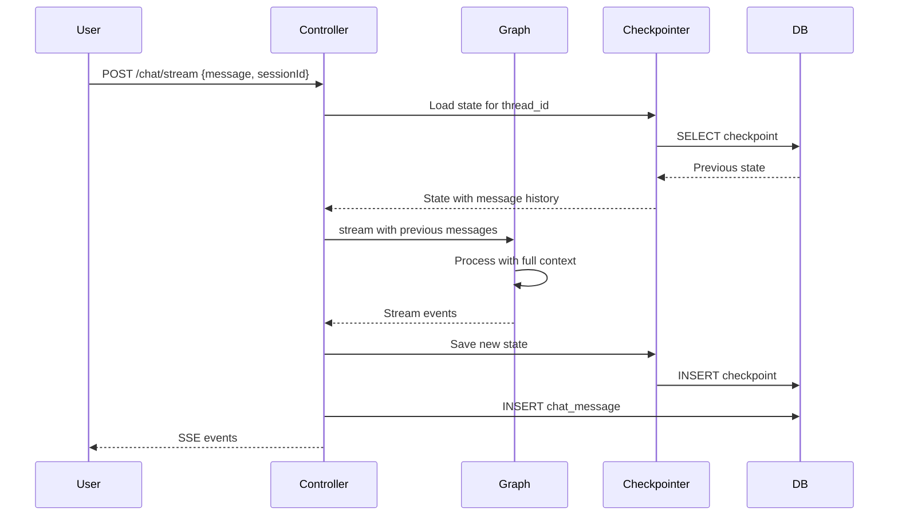

# Chat Graph Streaming Architecture Plan

**Status:** Implementation plan (streaming may be partial or in progress; see chat graph and controller for current behavior).

## Overview

This document outlines the architecture for implementing SSE (Server-Sent Events) streaming for the Chat Graph, enabling realtime AI messaging with conversation persistence and message memory. The implementation integrates with the frontend's existing SSE streaming pattern.

## Current State Analysis

### Frontend Pattern (Reference: `/Users/aposto/Projects/index/frontend`)
- Uses Fetch API + ReadableStream for SSE consumption
- Processes `data: {JSON}` events from stream response
- Event types: `status`, `progress`, `result`, `error`, `done`

### Backend Chat Graph (Current Implementation)

```
Current Flow:
START → load_context → router → [subgraph] → generate_response → END
```

**Key Files:**
- [`src/lib/protocol/graphs/chat/chat.graph.ts`](src/lib/protocol/graphs/chat/chat.graph.ts:1): Main graph factory
- [`src/lib/protocol/graphs/chat/chat.graph.state.ts`](src/lib/protocol/graphs/chat/chat.graph.state.ts:1): State annotation
- [`src/controllers/chat.controller.ts`](src/controllers/chat.controller.ts:1): HTTP controller
- [`src/lib/langchain/langchain.ts`](src/lib/langchain/langchain.ts:1): LLM configuration

**Current Limitations:**
1. Uses `invoke()` not `stream()`/`streamEvents()`
2. `streaming: false` in [`langchain.ts:124`](src/lib/langchain/langchain.ts:124)
3. No conversation persistence between requests
4. No session management
5. Response generated as single blob, not streamed

---

## 1. SSE Event Protocol Design

### Event Types

```typescript
// Event type enumeration for Chat Graph SSE
type ChatSSEEventType = 
  | 'status'          // Graph node transitions
  | 'routing'         // Router decision made
  | 'subgraph_start'  // Subgraph processing begins
  | 'subgraph_result' // Subgraph processing complete
  | 'token'           // LLM token streamed
  | 'tool_call'       // Tool invocation (future)
  | 'done'            // Stream complete
  | 'error';          // Error occurred
```

### Event Payload Structures

```typescript
// Base event structure
interface ChatSSEEvent {
  type: ChatSSEEventType;
  timestamp: string;  // ISO 8601
  sessionId: string;  // Thread identifier
}

// Status event - node transitions
interface StatusEvent extends ChatSSEEvent {
  type: 'status';
  node: string;       // Current node name
  status: 'started' | 'completed';
}

// Routing event - router decision
interface RoutingEvent extends ChatSSEEvent {
  type: 'routing';
  target: RouteTarget;
  confidence: number;
  reasoning: string;
}

// Subgraph events
interface SubgraphStartEvent extends ChatSSEEvent {
  type: 'subgraph_start';
  subgraph: 'intent' | 'profile' | 'opportunity';
}

interface SubgraphResultEvent extends ChatSSEEvent {
  type: 'subgraph_result';
  subgraph: 'intent' | 'profile' | 'opportunity';
  summary: string;              // Human-readable summary
  data: Record<string, any>;   // Structured result data
}

// Token event - streamed LLM output
interface TokenEvent extends ChatSSEEvent {
  type: 'token';
  content: string;    // Token text
  index: number;      // Token position
}

// Done event - stream complete
interface DoneEvent extends ChatSSEEvent {
  type: 'done';
  response: string;           // Full response text
  suggestedActions?: string[];
  messageId: string;          // Persisted message ID
}

// Error event
interface ErrorEvent extends ChatSSEEvent {
  type: 'error';
  code: string;       // Error code (e.g., 'ROUTING_FAILED')
  message: string;    // Human-readable error
  recoverable: boolean;
}
```

### SSE Wire Format

```
data: {"type":"status","node":"load_context","status":"started","timestamp":"2026-01-29T20:00:00.000Z","sessionId":"abc123"}

data: {"type":"status","node":"load_context","status":"completed","timestamp":"2026-01-29T20:00:00.100Z","sessionId":"abc123"}

data: {"type":"status","node":"router","status":"started","timestamp":"2026-01-29T20:00:00.110Z","sessionId":"abc123"}

data: {"type":"routing","target":"opportunity_subgraph","confidence":0.92,"reasoning":"User is looking for connections","timestamp":"2026-01-29T20:00:00.500Z","sessionId":"abc123"}

data: {"type":"subgraph_start","subgraph":"opportunity","timestamp":"2026-01-29T20:00:00.510Z","sessionId":"abc123"}

data: {"type":"subgraph_result","subgraph":"opportunity","summary":"Found 3 potential connections","data":{"count":3},"timestamp":"2026-01-29T20:00:01.200Z","sessionId":"abc123"}

data: {"type":"token","content":"I found","index":0,"timestamp":"2026-01-29T20:00:01.300Z","sessionId":"abc123"}

data: {"type":"token","content":" some great","index":1,"timestamp":"2026-01-29T20:00:01.320Z","sessionId":"abc123"}

data: {"type":"done","response":"I found some great connections for you...","messageId":"msg_xyz789","timestamp":"2026-01-29T20:00:02.000Z","sessionId":"abc123"}

```

### Error Handling Conventions

| Error Code | Description | Recoverable |
|------------|-------------|-------------|
| `CONTEXT_LOAD_FAILED` | Failed to load user context | Yes |
| `ROUTING_FAILED` | Router decision failed | Yes |
| `SUBGRAPH_FAILED` | Subgraph processing error | Yes |
| `LLM_TIMEOUT` | LLM response timeout | Yes |
| `LLM_ERROR` | LLM API error | Yes |
| `PERSISTENCE_FAILED` | Failed to save message | Yes |
| `SESSION_INVALID` | Invalid session ID | No |
| `AUTH_FAILED` | Authentication error | No |

---

## 2. Backend Streaming Implementation

### 2.1 Enable Streaming in LangChain

**File:** [`src/lib/langchain/langchain.ts`](src/lib/langchain/langchain.ts:110-136)

```typescript
// Add streaming option to AgentModelOptions
export interface AgentModelOptions {
  // ... existing options
  
  /** Enable streaming mode for token-by-token output */
  streaming?: boolean;
}

// Update createBaseOpenRouterModel
function createBaseOpenRouterModel(preset: string | undefined, options: AgentModelOptions = {}): ChatOpenAI {
  const { model, temperature, maxTokens, topP, timeout, maxRetries, reasoning, modelKwargs, streaming } = options;

  // ... existing code

  return new ChatOpenAI({
    model: modelName,
    streaming: streaming ?? false,  // Default false, opt-in for streaming
    apiKey: process.env.OPENROUTER_API_KEY!,
    configuration: {
      baseURL: process.env.OPENROUTER_BASE_URL || 'https://openrouter.ai/api/v1',
    },
    // ... rest of config
  });
}
```

### 2.2 LangGraph Streaming with streamEvents

**Key Change:** Use `graph.streamEvents()` instead of `graph.invoke()`

```typescript
// Example streaming usage in ChatController
const eventStream = graph.streamEvents(
  { userId, messages: [new HumanMessage(messageContent)] },
  { 
    version: "v2",
    configurable: { thread_id: sessionId }
  }
);

for await (const event of eventStream) {
  // Process events and emit SSE
}
```

### 2.3 SSE Endpoint Design

**File:** [`src/controllers/chat.controller.ts`](src/controllers/chat.controller.ts:284-345)

```typescript
import { Controller, Post, UseGuards } from '../lib/router/router.decorators';
import { AuthGuard } from '../guards/auth.guard';
import type { AuthenticatedUser } from '../guards/auth.guard';
import { PostgresSaver } from '@langchain/langgraph-checkpoint-postgres';
import { HumanMessage, AIMessage, isAIMessageChunk } from '@langchain/core/messages';

@Controller('/chat')
export class ChatController {
  private db: ChatGraphCompositeDatabase;
  private embedder: Embedder;
  private scraper: Scraper;
  private checkpointer: PostgresSaver;
  
  constructor() {
    this.db = new ChatDatabaseAdapter();
    this.embedder = new IndexEmbedder();
    this.scraper = new ParallelScraperAdapter();
    
    // Initialize PostgreSQL checkpointer for persistence
    this.checkpointer = PostgresSaver.fromConnString(process.env.DATABASE_URL!);
  }

  /**
   * SSE streaming endpoint for chat messages.
   * Streams graph execution events and LLM tokens in real-time.
   */
  @Post('/stream')
  @UseGuards(AuthGuard)
  async stream(req: Request, user: AuthenticatedUser) {
    // 1. Parse request
    const body = await req.json() as { 
      message: string; 
      sessionId?: string;  // Optional - creates new if not provided
    };
    
    if (!body.message?.trim()) {
      return Response.json({ error: 'Message required' }, { status: 400 });
    }

    // 2. Generate or validate session ID
    const sessionId = body.sessionId || crypto.randomUUID();
    
    // 3. Create streaming response
    const encoder = new TextEncoder();
    
    const stream = new ReadableStream({
      async start(controller) {
        const sendEvent = (event: ChatSSEEvent) => {
          controller.enqueue(
            encoder.encode(`data: ${JSON.stringify(event)}\n\n`)
          );
        };

        try {
          // 4. Create graph with checkpointer
          const factory = new ChatGraphFactory(this.db, this.embedder, this.scraper);
          const graph = factory.createGraphWithCheckpointer(this.checkpointer);

          // 5. Stream events
          const eventStream = graph.streamEvents(
            { 
              userId: user.id, 
              messages: [new HumanMessage(body.message)] 
            },
            { 
              version: "v2",
              configurable: { thread_id: sessionId }
            }
          );

          let fullResponse = '';
          let tokenIndex = 0;

          for await (const event of eventStream) {
            const timestamp = new Date().toISOString();

            // Node start/end events
            if (event.event === 'on_chain_start') {
              sendEvent({
                type: 'status',
                node: event.name,
                status: 'started',
                timestamp,
                sessionId
              });
            }
            
            if (event.event === 'on_chain_end') {
              sendEvent({
                type: 'status',
                node: event.name,
                status: 'completed',
                timestamp,
                sessionId
              });
            }

            // LLM token streaming
            if (event.event === 'on_chat_model_stream' && isAIMessageChunk(event.data.chunk)) {
              const content = event.data.chunk.content;
              if (typeof content === 'string' && content) {
                fullResponse += content;
                sendEvent({
                  type: 'token',
                  content,
                  index: tokenIndex++,
                  timestamp,
                  sessionId
                });
              }
            }
          }

          // 6. Persist message and send done event
          const messageId = await this.persistMessage(user.id, sessionId, body.message, fullResponse);
          
          sendEvent({
            type: 'done',
            response: fullResponse,
            messageId,
            timestamp: new Date().toISOString(),
            sessionId
          });

        } catch (error) {
          sendEvent({
            type: 'error',
            code: 'STREAM_ERROR',
            message: error instanceof Error ? error.message : 'Unknown error',
            recoverable: true,
            timestamp: new Date().toISOString(),
            sessionId
          });
        } finally {
          controller.close();
        }
      }
    });

    return new Response(stream, {
      headers: {
        'Content-Type': 'text/event-stream',
        'Cache-Control': 'no-cache',
        'Connection': 'keep-alive',
        'X-Session-Id': sessionId
      }
    });
  }
  
  // ... existing message() method remains for backward compatibility
}
```

### 2.4 ChatGraphFactory Updates

**File:** [`src/lib/protocol/graphs/chat/chat.graph.ts`](src/lib/protocol/graphs/chat/chat.graph.ts:26-52)

```typescript
import { PostgresSaver } from '@langchain/langgraph-checkpoint-postgres';
import { MemorySaver } from '@langchain/langgraph';

export class ChatGraphFactory {
  constructor(
    private database: ChatGraphCompositeDatabase,
    private embedder: Embedder,
    private scraper: Scraper
  ) {}

  /**
   * Creates graph without persistence (existing behavior).
   */
  public createGraph() {
    return this.buildGraph().compile();
  }
  
  /**
   * Creates graph with PostgreSQL checkpointer for persistence.
   * Enables multi-turn conversations with memory.
   */
  public createGraphWithCheckpointer(checkpointer: PostgresSaver | MemorySaver) {
    return this.buildGraph().compile({ checkpointer });
  }

  /**
   * Internal method to build the graph structure.
   */
  private buildGraph() {
    // ... existing node definitions

    return new StateGraph(ChatGraphState)
      .addNode("load_context", loadContextNode)
      .addNode("router", routerNode)
      .addNode("intent_subgraph", intentSubgraphNode)
      .addNode("profile_subgraph", profileSubgraphNode)
      .addNode("opportunity_subgraph", opportunitySubgraphNode)
      .addNode("respond_direct", respondDirectNode)
      .addNode("clarify", clarifyNode)
      .addNode("generate_response", generateResponseNode)
      // ... edges
  }
}
```

### 2.5 Enable Streaming in Response Generator

**File:** [`src/lib/protocol/agents/chat/response.generator.ts`](src/lib/protocol/agents/chat/response.generator.ts:13-19)

The ResponseGeneratorAgent needs to use a streaming-enabled model:

```typescript
const model = new ChatOpenAI({
  model: 'google/gemini-3-flash-preview',
  streaming: true,  // Enable streaming
  configuration: { 
    baseURL: process.env.OPENROUTER_BASE_URL, 
    apiKey: process.env.OPENROUTER_API_KEY 
  }
});
```

---

## 3. Conversation Persistence Design

### 3.1 Database Schema

Add new tables for chat sessions and messages:

```sql
-- Chat sessions (conversations)
CREATE TABLE chat_sessions (
  id UUID PRIMARY KEY DEFAULT gen_random_uuid(),
  user_id UUID NOT NULL REFERENCES users(id) ON DELETE CASCADE,
  title TEXT,                              -- Auto-generated from first message
  created_at TIMESTAMP DEFAULT NOW() NOT NULL,
  updated_at TIMESTAMP DEFAULT NOW() NOT NULL,
  archived_at TIMESTAMP,                   -- Soft delete
  metadata JSONB DEFAULT '{}'              -- Extensible metadata
);

CREATE INDEX chat_sessions_user_id_idx ON chat_sessions(user_id);
CREATE INDEX chat_sessions_updated_at_idx ON chat_sessions(updated_at DESC);

-- Chat messages
CREATE TABLE chat_messages (
  id UUID PRIMARY KEY DEFAULT gen_random_uuid(),
  session_id UUID NOT NULL REFERENCES chat_sessions(id) ON DELETE CASCADE,
  role TEXT NOT NULL CHECK (role IN ('user', 'assistant', 'system')),
  content TEXT NOT NULL,
  routing_decision JSONB,                  -- Store routing metadata
  subgraph_results JSONB,                  -- Store subgraph outputs
  token_count INTEGER,                     -- For context management
  created_at TIMESTAMP DEFAULT NOW() NOT NULL
);

CREATE INDEX chat_messages_session_id_idx ON chat_messages(session_id);
CREATE INDEX chat_messages_created_at_idx ON chat_messages(session_id, created_at);
```

### 3.2 Drizzle Schema Definitions

**File:** `src/lib/schema.ts` (additions)

```typescript
// Chat sessions table
export const chatSessions = pgTable('chat_sessions', {
  id: uuid('id').primaryKey().defaultRandom(),
  userId: uuid('user_id').notNull().references(() => users.id, { onDelete: 'cascade' }),
  title: text('title'),
  createdAt: timestamp('created_at').defaultNow().notNull(),
  updatedAt: timestamp('updated_at').defaultNow().notNull(),
  archivedAt: timestamp('archived_at'),
  metadata: json('metadata').$type<Record<string, any>>().default({}),
}, (table) => ({
  userIdIdx: index('chat_sessions_user_id_idx').on(table.userId),
  updatedAtIdx: index('chat_sessions_updated_at_idx').on(table.updatedAt),
}));

// Chat messages table
export const chatMessages = pgTable('chat_messages', {
  id: uuid('id').primaryKey().defaultRandom(),
  sessionId: uuid('session_id').notNull().references(() => chatSessions.id, { onDelete: 'cascade' }),
  role: text('role').notNull(), // 'user' | 'assistant' | 'system'
  content: text('content').notNull(),
  routingDecision: json('routing_decision').$type<RoutingDecision | null>(),
  subgraphResults: json('subgraph_results').$type<SubgraphResults | null>(),
  tokenCount: integer('token_count'),
  createdAt: timestamp('created_at').defaultNow().notNull(),
}, (table) => ({
  sessionIdIdx: index('chat_messages_session_id_idx').on(table.sessionId),
  createdAtIdx: index('chat_messages_created_at_idx').on(table.sessionId, table.createdAt),
}));

// Relations
export const chatSessionsRelations = relations(chatSessions, ({ one, many }) => ({
  user: one(users, {
    fields: [chatSessions.userId],
    references: [users.id],
  }),
  messages: many(chatMessages),
}));

export const chatMessagesRelations = relations(chatMessages, ({ one }) => ({
  session: one(chatSessions, {
    fields: [chatMessages.sessionId],
    references: [chatSessions.id],
  }),
}));

// Type exports
export type ChatSession = typeof chatSessions.$inferSelect;
export type NewChatSession = typeof chatSessions.$inferInsert;
export type ChatMessage = typeof chatMessages.$inferSelect;
export type NewChatMessage = typeof chatMessages.$inferInsert;
```

### 3.3 LangGraph Checkpointer Options

| Option | Pros | Cons | Recommendation |
|--------|------|------|----------------|
| **PostgresSaver** | Durable, production-ready, uses existing DB | Additional tables, setup required | ✅ **Recommended** |
| **MemorySaver** | Simple, no setup | Ephemeral, lost on restart | Testing only |
| **Custom Adapter** | Full control | Maintenance burden | Not needed |

**Implementation:**

```typescript
import { PostgresSaver } from '@langchain/langgraph-checkpoint-postgres';

// Initialize once at startup
const checkpointer = PostgresSaver.fromConnString(process.env.DATABASE_URL!);
await checkpointer.setup();  // Creates LangGraph checkpoint tables

// Use with graph
const graph = factory.createGraphWithCheckpointer(checkpointer);
```

LangGraph's PostgresSaver creates its own tables:
- `checkpoint` - Stores graph state snapshots
- `checkpoint_writes` - Stores intermediate writes
- `checkpoint_metadata` - Stores checkpoint metadata

These are separate from our `chat_sessions`/`chat_messages` tables which store the human-readable conversation history.

### 3.4 Session ID Generation and Management

```typescript
// Session ID format: UUID v4
const sessionId = crypto.randomUUID();
// Example: "a1b2c3d4-e5f6-7890-abcd-ef1234567890"

// Session lookup/creation logic
async function getOrCreateSession(userId: string, sessionId?: string) {
  if (sessionId) {
    // Validate existing session belongs to user
    const existing = await db.select()
      .from(chatSessions)
      .where(and(
        eq(chatSessions.id, sessionId),
        eq(chatSessions.userId, userId),
        isNull(chatSessions.archivedAt)
      ))
      .limit(1);
    
    if (existing.length > 0) {
      return existing[0];
    }
    // Return null to indicate invalid session
    return null;
  }
  
  // Create new session
  const [newSession] = await db.insert(chatSessions)
    .values({ userId })
    .returning();
  
  return newSession;
}
```

### 3.5 Message History Retrieval

```typescript
interface MessageHistoryOptions {
  sessionId: string;
  limit?: number;      // Default: 50
  beforeId?: string;   // For pagination
}

async function getMessageHistory(options: MessageHistoryOptions): Promise<ChatMessage[]> {
  const { sessionId, limit = 50, beforeId } = options;
  
  let query = db.select()
    .from(chatMessages)
    .where(eq(chatMessages.sessionId, sessionId))
    .orderBy(desc(chatMessages.createdAt))
    .limit(limit);
  
  if (beforeId) {
    const beforeMessage = await db.select()
      .from(chatMessages)
      .where(eq(chatMessages.id, beforeId))
      .limit(1);
    
    if (beforeMessage[0]) {
      query = query.where(
        lt(chatMessages.createdAt, beforeMessage[0].createdAt)
      );
    }
  }
  
  const messages = await query;
  return messages.reverse();  // Return in chronological order
}

// Convert to LangChain messages
function toLangChainMessages(messages: ChatMessage[]): BaseMessage[] {
  return messages.map(m => {
    if (m.role === 'user') return new HumanMessage(m.content);
    if (m.role === 'assistant') return new AIMessage(m.content);
    return new SystemMessage(m.content);
  });
}
```

---

## 4. State Management

### 4.1 Multi-Turn Conversation Handling

The LangGraph checkpointer handles state persistence automatically. Each conversation turn:



### 4.2 Context Window Management

```typescript
const MAX_CONTEXT_TOKENS = 8000;  // Leave room for response
const RESERVE_TOKENS = 2000;     // For system prompt + response

interface ContextWindowConfig {
  maxTokens: number;
  reserveTokens: number;
  truncationStrategy: 'oldest_first' | 'summarize';
}

async function prepareContextWindow(
  sessionId: string,
  config: ContextWindowConfig = {
    maxTokens: MAX_CONTEXT_TOKENS,
    reserveTokens: RESERVE_TOKENS,
    truncationStrategy: 'oldest_first'
  }
): Promise<BaseMessage[]> {
  const availableTokens = config.maxTokens - config.reserveTokens;
  
  // Load recent messages
  const messages = await getMessageHistory({ sessionId, limit: 100 });
  
  // Count tokens (simplified - use tiktoken for accuracy)
  let tokenCount = 0;
  const includedMessages: ChatMessage[] = [];
  
  // Work backwards from most recent
  for (let i = messages.length - 1; i >= 0; i--) {
    const msg = messages[i];
    const msgTokens = estimateTokens(msg.content);
    
    if (tokenCount + msgTokens > availableTokens) {
      break;
    }
    
    tokenCount += msgTokens;
    includedMessages.unshift(msg);
  }
  
  return toLangChainMessages(includedMessages);
}

function estimateTokens(text: string): number {
  // Rough estimate: 1 token ≈ 4 characters for English
  return Math.ceil(text.length / 4);
}
```

### 4.3 State Load/Save Points

| Point | Action | Data |
|-------|--------|------|
| Request Start | Load | Previous messages from checkpointer |
| After Router | Emit | Routing decision event |
| After Subgraph | Emit | Subgraph result event |
| LLM Streaming | Emit | Token events |
| Request End | Save | Full state to checkpointer + message to DB |

### 4.4 Updated ChatGraphState

**File:** [`src/lib/protocol/graphs/chat/chat.graph.state.ts`](src/lib/protocol/graphs/chat/chat.graph.state.ts:43-117)

```typescript
export const ChatGraphState = Annotation.Root({
  // Messages with proper reducer for multi-turn
  messages: Annotation<BaseMessage[]>({
    reducer: messagesStateReducer,  // Handles appending correctly
    default: () => [],
  }),

  // Session identifier for persistence
  sessionId: Annotation<string | undefined>({
    reducer: (curr, next) => next ?? curr,
    default: () => undefined,
  }),

  // User context (existing)
  userId: Annotation<string>,
  userProfile: Annotation<ProfileDocument | undefined>({
    reducer: (curr, next) => next ?? curr,
    default: () => undefined,
  }),
  activeIntents: Annotation<string>({
    reducer: (curr, next) => next ?? curr,
    default: () => "",
  }),

  // Routing (existing)
  routingDecision: Annotation<RoutingDecision | undefined>({
    reducer: (curr, next) => next,
    default: () => undefined,
  }),

  // Subgraph results (existing)
  subgraphResults: Annotation<SubgraphResults>({
    reducer: (curr, next) => ({ ...curr, ...next }),
    default: () => ({}),
  }),

  // Response (existing)
  responseText: Annotation<string | undefined>({
    reducer: (curr, next) => next,
    default: () => undefined,
  }),

  // Error (existing)
  error: Annotation<string | undefined>({
    reducer: (curr, next) => next,
    default: () => undefined,
  }),
});
```

---

## 5. Implementation Order

### Phase 1: Foundation (Prerequisites)

- [ ] **1.1** Add `@langchain/langgraph-checkpoint-postgres` package
  ```bash
  bun add @langchain/langgraph-checkpoint-postgres
  ```
  
- [ ] **1.2** Create database migration for chat tables
  - Add `chat_sessions` table
  - Add `chat_messages` table
  - Run migration

- [ ] **1.3** Add Drizzle schema definitions
  - Update [`src/lib/schema.ts`](src/lib/schema.ts) with new tables
  - Add relations and type exports

### Phase 2: Streaming Infrastructure

- [ ] **2.1** Update [`langchain.ts`](src/lib/langchain/langchain.ts) to support streaming option
  - Add `streaming` to `AgentModelOptions`
  - Update `createBaseOpenRouterModel` to accept streaming flag

- [ ] **2.2** Update [`response.generator.ts`](src/lib/protocol/agents/chat/response.generator.ts) for streaming
  - Enable `streaming: true` on model
  - Ensure structured output still works with streaming

- [ ] **2.3** Update [`ChatGraphFactory`](src/lib/protocol/graphs/chat/chat.graph.ts) 
  - Add `createGraphWithCheckpointer()` method
  - Refactor to use internal `buildGraph()` method

### Phase 3: SSE Endpoint

- [ ] **3.1** Create SSE event types
  - Add types file: `src/types/chat-sse.ts`
  - Define all event interfaces

- [ ] **3.2** Implement streaming endpoint in [`ChatController`](src/controllers/chat.controller.ts)
  - Add `POST /chat/stream` endpoint
  - Implement SSE response formatting
  - Handle `graph.streamEvents()` iteration

- [ ] **3.3** Add session management helpers
  - `getOrCreateSession()` function
  - Session validation logic

### Phase 4: Persistence Layer

- [ ] **4.1** Initialize PostgresSaver checkpointer
  - Setup at application startup
  - Handle connection pooling

- [ ] **4.2** Implement message persistence
  - Save user messages before processing
  - Save assistant messages after streaming complete
  - Store routing decision and subgraph results

- [ ] **4.3** Implement message history retrieval
  - Add `GET /chat/sessions` endpoint
  - Add `GET /chat/sessions/:id/messages` endpoint
  - Implement pagination

### Phase 5: Context Management

- [ ] **5.1** Implement context window management
  - Token counting utility
  - Message truncation logic
  - History loading with limits

- [ ] **5.2** Update graph to use loaded history
  - Prepend historical messages to state
  - Ensure checkpointer integration works

### Phase 6: Testing & Documentation

- [ ] **6.1** Unit tests for SSE event formatting
- [ ] **6.2** Integration tests for streaming endpoint
- [ ] **6.3** Test multi-turn conversations
- [ ] **6.4** Test context window truncation
- [ ] **6.5** Update API documentation

---

## Testing Strategy

### Unit Tests

```typescript
// Test SSE event formatting
describe('ChatSSEEvents', () => {
  it('should format status event correctly', () => {
    const event = formatStatusEvent('router', 'started', 'session-123');
    expect(event).toMatch(/^data: \{.*"type":"status".*\}\n\n$/);
  });

  it('should format token event correctly', () => {
    const event = formatTokenEvent('Hello', 0, 'session-123');
    const parsed = JSON.parse(event.replace('data: ', '').trim());
    expect(parsed.content).toBe('Hello');
  });
});
```

### Integration Tests

```typescript
// Test streaming endpoint
describe('POST /chat/stream', () => {
  it('should return SSE stream', async () => {
    const response = await fetch('/chat/stream', {
      method: 'POST',
      headers: { 
        'Authorization': `Bearer ${token}`,
        'Content-Type': 'application/json'
      },
      body: JSON.stringify({ message: 'Hello' })
    });
    
    expect(response.headers.get('Content-Type')).toBe('text/event-stream');
    
    const reader = response.body.getReader();
    const events: string[] = [];
    
    while (true) {
      const { done, value } = await reader.read();
      if (done) break;
      events.push(new TextDecoder().decode(value));
    }
    
    expect(events.some(e => e.includes('"type":"done"'))).toBe(true);
  });

  it('should maintain conversation context', async () => {
    // First message
    const res1 = await streamMessage('My name is Alice', undefined);
    const sessionId = res1.headers.get('X-Session-Id');
    
    // Second message with same session
    const res2 = await streamMessage('What is my name?', sessionId);
    const events = await collectEvents(res2);
    
    const doneEvent = events.find(e => e.type === 'done');
    expect(doneEvent.response).toContain('Alice');
  });
});
```

---

## Summary

### Key Design Decisions

1. **SSE over WebSockets**: SSE is simpler, works with existing HTTP infrastructure, and is sufficient for server-to-client streaming.

2. **Dual Persistence Strategy**: 
   - LangGraph PostgresSaver for graph state checkpoints
   - Custom `chat_messages` table for human-readable history and audit

3. **Session-Based Threading**: Use UUID session IDs as LangGraph `thread_id` for seamless state management.

4. **Backwards Compatibility**: Keep existing `POST /chat/message` endpoint working alongside new streaming endpoint.

5. **Event-Driven Progress**: Emit status events for each graph node to provide real-time progress feedback.

### Files to Modify

| File | Changes |
|------|---------|
| `src/lib/schema.ts` | Add `chatSessions`, `chatMessages` tables |
| `src/lib/langchain/langchain.ts` | Add `streaming` option support |
| `src/lib/protocol/graphs/chat/chat.graph.ts` | Add `createGraphWithCheckpointer()` |
| `src/lib/protocol/graphs/chat/chat.graph.state.ts` | Add `sessionId` to state |
| `src/lib/protocol/agents/chat/response.generator.ts` | Enable streaming on model |
| `src/controllers/chat.controller.ts` | Add SSE streaming endpoint |

### New Files to Create

| File | Purpose |
|------|---------|
| `src/types/chat-sse.ts` | SSE event type definitions |
| `drizzle/XXXX_add_chat_sessions.sql` | Migration for chat tables |

### Package Dependencies

```bash
bun add @langchain/langgraph-checkpoint-postgres
```

---

## Appendix: Frontend Integration Example

```typescript
// Frontend SSE consumption (for reference)
async function streamChat(message: string, sessionId?: string) {
  const response = await fetch('/api/chat/stream', {
    method: 'POST',
    headers: {
      'Content-Type': 'application/json',
      'Authorization': `Bearer ${token}`
    },
    body: JSON.stringify({ message, sessionId })
  });

  const reader = response.body.getReader();
  const decoder = new TextDecoder();
  
  let fullResponse = '';
  
  while (true) {
    const { done, value } = await reader.read();
    if (done) break;
    
    const chunk = decoder.decode(value);
    const lines = chunk.split('\n');
    
    for (const line of lines) {
      if (line.startsWith('data: ')) {
        const event = JSON.parse(line.slice(6));
        
        switch (event.type) {
          case 'token':
            fullResponse += event.content;
            onToken(event.content);
            break;
          case 'status':
            onStatus(event.node, event.status);
            break;
          case 'routing':
            onRouting(event.target);
            break;
          case 'done':
            onComplete(event.response, event.sessionId);
            break;
          case 'error':
            onError(event.message);
            break;
        }
      }
    }
  }
}
```
