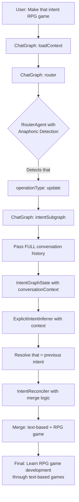

# Intent Anaphoric Resolution Fix - Architecture Design

**Status**: Design Complete - Ready for Implementation  
**Priority**: P0 - Critical User Experience Bug  
**Created**: 2026-01-30  
**Author**: Architect Mode

---

## Executive Summary

This document provides a comprehensive architectural design to fix the intent update issue where anaphoric references ("that intent", "this goal") cause the system to lose context and replace intent descriptions instead of updating them intelligently.

**Problem**: When user says "Make that intent RPG game", the system:
1. Doesn't recognize it as an update operation (classified as create)
2. Cannot resolve what "that intent" refers to
3. Replaces the entire description, losing details like "text-based"

**Solution**: Implement conversation context propagation and anaphoric resolution across the entire intent processing pipeline.

---

## Table of Contents

1. [Problem Analysis](#1-problem-analysis)
2. [Architecture Overview](#2-architecture-overview)
3. [Detailed Component Design](#3-detailed-component-design)
4. [Data Flow Diagrams](#4-data-flow-diagrams)
5. [Implementation Plan](#5-implementation-plan)
6. [Testing Strategy](#6-testing-strategy)
7. [Edge Cases & Error Handling](#7-edge-cases--error-handling)
8. [Performance Considerations](#8-performance-considerations)
9. [Backward Compatibility](#9-backward-compatibility)

---

## 1. Problem Analysis

### 1.1 Root Cause Analysis

| Component | Issue | Impact |
|-----------|-------|--------|
| **RouterAgent** | Missing anaphoric examples in training prompt | Misclassifies "that intent" as `create` instead of `update` |
| **Chat Graph** | Only passes last message to intent graph | Conversation history discarded, no context for resolution |
| **IntentGraphState** | No field for conversation context | Cannot propagate context to downstream agents |
| **ExplicitIntentInferrer** | No conversation history access | Cannot resolve "that intent" or "this goal" references |
| **IntentReconciler** | Replace logic instead of merge | Loses existing intent details during updates |

### 1.2 Example Failure Scenario

```
User: "I want to learn game development through text-based games"
  ✓ System creates intention: "Learn game development through text-based games"

User: "Make that intent RPG game"
  ✗ RouterAgent: operationType = null (should be "update")
  ✗ Inferrer receives: "Make that intent RPG game" (no context)
  ✗ Inferrer generates: "Learn RPG game development" (loses "text-based")
  ✗ Reconciler: UPDATE replaces description entirely
  
Result: Description changed from "Learn game development through text-based games" 
        to "Learn RPG game development" ❌

Expected: "Learn RPG game development through text-based games" ✓
```

---

## 2. Architecture Overview

### 2.1 High-Level Strategy

The fix implements **contextual intent resolution** through three core changes:

1. **Anaphoric Detection** - RouterAgent recognizes reference patterns
2. **Context Propagation** - Conversation history flows through pipeline
3. **Intelligent Merging** - Reconciler preserves and merges intent details

### 2.2 Modified Data Flow



### 2.3 Key Design Principles

- **Minimal Invasiveness**: Additive changes, backward compatible
- **Performance Aware**: Only pass conversation context when needed
- **Graceful Degradation**: Works with or without conversation history
- **LLM Agnostic**: Relies on prompts, not model-specific features

---

## 3. Detailed Component Design

### 3.1 RouterAgent Enhancements

**File**: `src/lib/protocol/agents/chat/router.agent.ts`

#### Changes Required

1. **Add Anaphoric Detection Examples** (Lines 71-74)

```typescript
// CURRENT (router.agent.ts:71-74)
### UPDATE Operations (Modifications)
Explicitly mentioned changes to existing data:
✓ "change my goal from X to Y" → intent_write (operationType: update)
✓ "update my learning intent" → intent_write (operationType: update)

// PROPOSED ADDITION
### UPDATE Operations (Modifications)
Explicit changes AND anaphoric references to existing data:

**Explicit Updates**:
✓ "change my goal from X to Y" → intent_write (operationType: update)
✓ "update my learning intent" → intent_write (operationType: update)

**Anaphoric References** (Demonstratives):
✓ "make that intent RPG game" → intent_write (operationType: update)
✓ "change this goal to focus on AI" → intent_write (operationType: update)  
✓ "update the intent to include blockchain" → intent_write (operationType: update)
✓ "add mobile development to that" → intent_write (operationType: update)

**Detection Signals**:
- Demonstrative pronouns: "that", "this", "these", "those"
- Definite articles with modification verbs: "the intent", "the goal"
- Action verbs: "make", "change", "update", "modify", "add to", "remove from"
- Context: Follows within 3 messages of intent discussion
```

2. **Enhanced Routing Logic** - Add context-aware detection

```typescript
// NEW METHOD (add to RouterAgent class)
/**
 * Detects anaphoric references in user message that indicate update operations.
 * Looks for demonstrative pronouns + modification verbs.
 */
private detectAnaphoricUpdate(userMessage: string, conversationHistory: BaseMessage[]): boolean {
  // Demonstrative patterns that refer to previous context
  const anaphoricPatterns = [
    /\b(that|this|the)\s+(intent|goal|objective|aim)\b/i,
    /\b(make|change|update|modify)\s+(that|this|it)\b/i,
    /\b(add|include|remove)\s+.*\s+(to|from)\s+(that|this|it)\b/i
  ];
  
  const hasAnaphoricReference = anaphoricPatterns.some(pattern => 
    pattern.test(userMessage)
  );
  
  // Check if there's recent intent discussion in conversation
  const hasRecentIntentContext = conversationHistory
    .slice(-5) // Last 5 messages
    .some(msg => {
      const content = msg.content?.toString() || "";
      return /\b(intent|goal|learning|want to)\b/i.test(content);
    });
  
  return hasAnaphoricReference && hasRecentIntentContext;
}
```

3. **Update invoke() method signature**

```typescript
// CURRENT (router.agent.ts:187-191)
public async invoke(
  userMessage: string,
  profileContext: string,
  activeIntents: string
): Promise<RouterOutput>

// PROPOSED
public async invoke(
  userMessage: string,
  profileContext: string,
  activeIntents: string,
  conversationHistory?: BaseMessage[]  // NEW: Optional for backward compatibility
): Promise<RouterOutput>
```

4. **Integrate detection into invoke()**

```typescript
// Inside RouterAgent.invoke(), before calling LLM
const hasAnaphoricUpdate = conversationHistory 
  ? this.detectAnaphoricUpdate(userMessage, conversationHistory)
  : false;

// Pass hint to LLM via prompt enhancement
const contextHint = hasAnaphoricUpdate
  ? "\n# Context Hint\nThis message contains anaphoric references (that/this) suggesting an UPDATE operation to previously discussed intents."
  : "";

const prompt = `
# User Message
${userMessage}

# User Profile Context
${profileContext || "No profile loaded yet."}

# Active Intents
${activeIntents || "No active intents."}
${contextHint}

Analyze this message and determine the best routing action.
`.trim();
```

#### Impact
- **Backward Compatible**: Optional parameter with default
- **Performance**: Pattern matching is fast, only analyzes last 5 messages
- **Accuracy**: Combines linguistic patterns with conversation context

---

### 3.2 IntentGraphState Schema Updates

**File**: `src/lib/protocol/graphs/intent/intent.graph.state.ts`

#### Changes Required

Add new field for conversation context (after line 52):

```typescript
// CURRENT (intent.graph.state.ts:48-52)
/**
 * The user's profile context (Identity, Narrative, etc.)
 */
userProfile: Annotation<string>,

/**
 * Explicit input content (e.g., user message).
 * Optional - graph might run on implicit only.
 */
inputContent: Annotation<string | undefined>,

// PROPOSED ADDITION (insert after inputContent)
/**
 * Conversation context for anaphoric resolution.
 * Contains recent messages to help resolve references like "that intent" or "this goal".
 * 
 * Structure: Array of BaseMessage (HumanMessage, AIMessage)
 * Usage: Passed to ExplicitIntentInferrer for context-aware inference
 * Performance: Limited to last 5-10 messages to control token usage
 * 
 * Optional for backward compatibility - inference works without it.
 */
conversationContext: Annotation<BaseMessage[] | undefined>({
  reducer: (curr, next) => next ?? curr,
  default: () => undefined,
}),
```

#### Impact
- **Type-Safe**: Uses LangChain's `BaseMessage[]` type
- **Optional**: Defaults to `undefined` for backward compatibility
- **Documented**: Clear purpose and usage guidelines

---

### 3.3 ChatGraph Modifications

**File**: `src/lib/protocol/graphs/chat/chat.graph.ts`

#### Changes Required

1. **Update routerNode to pass conversation history** (Lines 363-408)

```typescript
// CURRENT (chat.graph.ts:380-385)
const decision = await routerAgent.invoke(
  userMessage,
  profileContext,
  state.activeIntents
);

// PROPOSED
const decision = await routerAgent.invoke(
  userMessage,
  profileContext,
  state.activeIntents,
  state.messages  // NEW: Pass full conversation history
);
```

2. **Update intentSubgraphNode to pass conversation context** (Lines 517-585)

```typescript
// CURRENT (chat.graph.ts:525-526)
const lastMessage = state.messages[state.messages.length - 1];
const inputContent = lastMessage?.content?.toString() || "";

// PROPOSED
const lastMessage = state.messages[state.messages.length - 1];
const inputContent = lastMessage?.content?.toString() || "";

// Extract recent conversation context for anaphoric resolution
// Limit to last 10 messages to control token usage
const conversationContext = state.messages.slice(-10);

log.info("[ChatGraph:IntentSubgraph] Preparing conversation context", {
  totalMessages: state.messages.length,
  contextMessages: conversationContext.length
});
```

3. **Pass conversationContext to IntentGraph** (Lines 546-556)

```typescript
// CURRENT (chat.graph.ts:546-555)
const intentInput = {
  userId: state.userId,
  userProfile: state.userProfile
    ? JSON.stringify(state.userProfile)
    : "",
  inputContent,
  operationMode,
  targetIntentIds: undefined,
};

// PROPOSED
const intentInput = {
  userId: state.userId,
  userProfile: state.userProfile
    ? JSON.stringify(state.userProfile)
    : "",
  inputContent,
  conversationContext,  // NEW: Pass conversation context
  operationMode,
  targetIntentIds: undefined,
};
```

#### Impact
- **Context Preservation**: Full conversation history available to intent graph
- **Token Management**: Limited to last 10 messages (configurable)
- **Minimal Change**: Two additional parameters

---

### 3.4 ExplicitIntentInferrer Enhancements

**File**: `src/lib/protocol/agents/intent/inferrer/explicit.inferrer.ts`

#### Changes Required

1. **Update invoke() signature** (Lines 121-125)

```typescript
// CURRENT (explicit.inferrer.ts:121-125)
public async invoke(
  content: string | null,
  profileContext: string,
  options: InferrerOptions = {}
)

// PROPOSED
public async invoke(
  content: string | null,
  profileContext: string,
  options: InferrerOptions = {},
  conversationContext?: BaseMessage[]  // NEW: Optional conversation history
)
```

2. **Add conversation context to system prompt** (Lines 47-78)

```typescript
// CURRENT (explicit.inferrer.ts:47-51)
const systemPrompt = `
  You are an expert Intent Analyst. Your goal is to infer the user's current intentions based on their profile and new content.

  You have access to:
  1. User Memory Profile (Identity, Narrative, Attributes) - The long-term context.
  2. New Content - What they just said/did.
  3. Operation Context - What type of operation is being performed.

// PROPOSED (enhanced)
const systemPrompt = `
  You are an expert Intent Analyst. Your goal is to infer the user's current intentions based on their profile and new content.

  You have access to:
  1. User Memory Profile (Identity, Narrative, Attributes) - The long-term context.
  2. New Content - What they just said/did.
  3. Operation Context - What type of operation is being performed.
  4. Conversation History - Recent messages for resolving references.

  ANAPHORIC RESOLUTION:
  When the user says "that intent", "this goal", "the objective", or uses "it":
  1. Look at the Conversation History to identify what they're referring to
  2. Extract the FULL context of the referenced intent
  3. Merge the NEW modification with the EXISTING description
  4. Preserve important details from the original intent
  
  Examples:
  - Conversation: "I want to learn text-based game development"
  - New: "Make that intent RPG game"  
  - Result: "Learn RPG game development through text-based games" ✓
  - NOT: "Learn RPG game development" ❌ (loses "text-based")
```

3. **Format conversation context in prompt** (Lines 151-163)

```typescript
// CURRENT (explicit.inferrer.ts:151-163)
const prompt = `
  Context:
  # User Memory Profile
  ${profileContext}

  ${contentSection}
  
  # Operation Context
  This analysis is for a ${operationMode} operation.
  ${operationMode === 'create' ? 'Extract NEW intents the user wants to add.' : ''}
  ${operationMode === 'update' ? 'Extract MODIFICATIONS to existing intents.' : ''}
  ${operationMode === 'delete' ? 'This should not execute - delete operations skip inference.' : ''}
`;

// PROPOSED
const conversationSection = conversationContext && conversationContext.length > 0
  ? `\n# Recent Conversation History\n${this.formatConversationHistory(conversationContext)}`
  : '';

const prompt = `
  Context:
  # User Memory Profile
  ${profileContext}
  ${conversationSection}

  ${contentSection}
  
  # Operation Context
  This analysis is for a ${operationMode} operation.
  ${operationMode === 'create' ? 'Extract NEW intents the user wants to add.' : ''}
  ${operationMode === 'update' ? 'Extract MODIFICATIONS to existing intents. Use Conversation History to resolve references.' : ''}
  ${operationMode === 'delete' ? 'This should not execute - delete operations skip inference.' : ''}
`;
```

4. **Add helper method for formatting conversation**

```typescript
// NEW METHOD (add to ExplicitIntentInferrer class)
/**
 * Formats conversation history for LLM context.
 * Includes message roles and content, limited to relevant messages.
 */
private formatConversationHistory(messages: BaseMessage[]): string {
  return messages
    .map(msg => {
      const role = msg._getType() === 'human' ? 'User' : 'Assistant';
      const content = msg.content?.toString() || '';
      return `[${role}]: ${content}`;
    })
    .join('\n');
}
```

5. **Update IntentGraph invokeInferrer to pass context** (intent.graph.ts:54-80)

```typescript
// CURRENT (intent.graph.ts:65-72)
const result = await inferrer.invoke(
  state.inputContent || null,
  state.userProfile,
  {
    allowProfileFallback,
    operationMode: state.operationMode
  }
);

// PROPOSED
const result = await inferrer.invoke(
  state.inputContent || null,
  state.userProfile,
  {
    allowProfileFallback,
    operationMode: state.operationMode
  },
  state.conversationContext  // NEW: Pass conversation context
);
```

#### Impact
- **Anaphoric Resolution**: Can resolve "that intent" using conversation history
- **Context-Aware**: Better understands user intent modifications
- **Backward Compatible**: Optional parameter, works without context

---

### 3.5 IntentReconciler Merge Logic

**File**: `src/lib/protocol/agents/intent/reconciler/intent.reconciler.ts`

#### Changes Required

1. **Update system prompt with merge instructions** (Lines 23-54)

```typescript
// CURRENT (intent.reconciler.ts:46-48)
ACTIONS:
- CREATE: If an Inferred Goal does NOT match any Active Intent, CREATE it.
- UPDATE: If an Inferred Goal matches an Active Intent but offers a better/different description, UPDATE it.

// PROPOSED (enhanced UPDATE logic)
ACTIONS:
- CREATE: If an Inferred Goal does NOT match any Active Intent, CREATE it.
- UPDATE: If an Inferred Goal matches an Active Intent, INTELLIGENTLY MERGE the descriptions:
  
  **MERGE STRATEGY**:
  1. Identify the EXISTING intent description (from Active Intents)
  2. Identify the NEW modification (from Inferred Intent)
  3. Check if NEW is:
     - **Refinement**: Adds detail to existing (e.g., "text-based" + "RPG" = "text-based RPG")
     - **Replacement**: Fundamentally changes the intent (e.g., "learn Python" → "learn Rust")
     - **Addition**: Adds new aspect (e.g., "game dev" + "mobile" = "game dev including mobile")
  4. For refinements/additions: MERGE both, preserving important details
  5. For replacements: REPLACE entirely
  
  **Examples**:
  - Existing: "Learn game development through text-based games"
  - New: "Make it RPG game"
  - Action: UPDATE with "Learn RPG game development through text-based games" ✓
  - NOT: "Learn RPG game development" ❌
  
  - Existing: "Learn Python programming"
  - New: "Switch to Rust instead"
  - Action: UPDATE with "Learn Rust programming" ✓ (replacement)
```

2. **Add merge reasoning to output schema** (Lines 71-78)

```typescript
// CURRENT (intent.reconciler.ts:71-78)
const UpdateIntentActionSchema = z.object({
  type: z.literal("update"),
  id: z.string().describe("The ID of the intent to update"),
  payload: z.string().describe("The updated intent description"),
  score: z.number().nullable().describe("The felicity score (0-100)"),
  reasoning: z.string().nullable().describe("Reasoning for the update"),
  intentMode: z.enum(['REFERENTIAL', 'ATTRIBUTIVE']).nullable(),
});

// PROPOSED (add merge metadata)
const UpdateIntentActionSchema = z.object({
  type: z.literal("update"),
  id: z.string().describe("The ID of the intent to update"),
  payload: z.string().describe("The updated intent description"),
  score: z.number().nullable().describe("The felicity score (0-100)"),
  reasoning: z.string().nullable().describe("Reasoning for the update"),
  intentMode: z.enum(['REFERENTIAL', 'ATTRIBUTIVE']).nullable(),
  mergeType: z.enum(['refinement', 'replacement', 'addition']).nullable()
    .describe("How the update was merged: refinement (adds detail), replacement (changes fundamentally), addition (adds aspect)"),
  preservedDetails: z.array(z.string()).nullable()
    .describe("List of important details preserved from original intent during merge"),
});
```

#### Impact
- **Intelligent Merging**: Preserves context while applying updates
- **Transparency**: `mergeType` and `preservedDetails` show reasoning
- **User-Friendly**: Better matches user expectations

---

## 4. Data Flow Diagrams

### 4.1 Current Flow (Broken)

```
User: "Make that intent RPG game"
  ↓
ChatGraph.router()
  ↓ (extracts only last message)
RouterAgent.invoke("Make that intent RPG game", profile, intents)
  ↓ (no anaphoric detection)
routingDecision: { operationType: null or create }
  ↓
ChatGraph.intentSubgraph()
  ↓ (passes only: "Make that intent RPG game")
IntentGraph.invoke({ inputContent: "Make that intent RPG game" })
  ↓
ExplicitIntentInferrer.invoke("Make that intent RPG game", profile)
  ↓ (cannot resolve "that")
inferredIntents: [{ description: "Learn RPG game" }]
  ↓
IntentReconciler.invoke(inferred, active)
  ↓ (replaces description)
actions: [{ type: "update", payload: "Learn RPG game" }]
  ↓
Result: LOST "text-based" ❌
```

### 4.2 Proposed Flow (Fixed)

```
User: "Make that intent RPG game"
  ↓
ChatGraph: state.messages = [
  HumanMessage("I want to learn text-based game development"),
  AIMessage("I'll help you with that..."),
  HumanMessage("Make that intent RPG game")
]
  ↓
RouterAgent.invoke(
  "Make that intent RPG game",
  profile,
  intents,
  messages  ← NEW: conversation history
)
  ↓ (detectAnaphoricUpdate finds "that intent")
routingDecision: { operationType: "update" } ✓
  ↓
ChatGraph.intentSubgraph() 
  ↓ (prepares context)
conversationContext = messages.slice(-10)
  ↓
IntentGraph.invoke({
  inputContent: "Make that intent RPG game",
  conversationContext: [messages],  ← NEW
  operationMode: "update"
})
  ↓
ExplicitIntentInferrer.invoke(
  "Make that intent RPG game",
  profile,
  { operationMode: "update" },
  conversationContext  ← NEW
)
  ↓ (resolves "that" = "text-based game development")
  ↓ (merges: "text-based" + "RPG game")
inferredIntents: [{ 
  description: "Learn RPG game development through text-based games"
}]
  ↓
IntentReconciler.invoke(inferred, active)
  ↓ (merge strategy: refinement)
actions: [{
  type: "update",
  payload: "Learn RPG game development through text-based games",
  mergeType: "refinement",
  preservedDetails: ["text-based"]
}]
  ↓
Result: "Learn RPG game development through text-based games" ✓
```

---

## 5. Implementation Plan

### Phase 1: State Schema Updates (P0)
**Prerequisite for all other changes**

- [ ] 1.1 Update `IntentGraphState` to add `conversationContext` field
- [ ] 1.2 Update type exports and documentation
- [ ] 1.3 Run existing tests to ensure backward compatibility
- [ ] 1.4 Estimated effort: 1 hour

### Phase 2: RouterAgent Anaphoric Detection (P0)
**Critical for correct operation classification**

- [ ] 2.1 Add anaphoric examples to system prompt
- [ ] 2.2 Implement `detectAnaphoricUpdate()` method
- [ ] 2.3 Update `invoke()` signature with optional parameter
- [ ] 2.4 Integrate detection into routing logic
- [ ] 2.5 Update ChatGraph router node to pass conversation history
- [ ] 2.6 Write unit tests for anaphoric detection
- [ ] 2.7 Estimated effort: 3 hours

### Phase 3: Context Propagation (P0)
**Enables anaphoric resolution in inference**

- [ ] 3.1 Update ChatGraph `intentSubgraphNode` to extract conversation context
- [ ] 3.2 Pass `conversationContext` to IntentGraph input
- [ ] 3.3 Update `ExplicitIntentInferrer.invoke()` signature
- [ ] 3.4 Add `formatConversationHistory()` helper method
- [ ] 3.5 Update IntentGraph inference node to pass context
- [ ] 3.6 Update system prompt with anaphoric resolution instructions
- [ ] 3.7 Write integration tests for context propagation
- [ ] 3.8 Estimated effort: 4 hours

### Phase 4: Intelligent Merge Logic (P1)
**Improves update quality**

- [ ] 4.1 Update IntentReconciler system prompt with merge strategy
- [ ] 4.2 Add `mergeType` and `preservedDetails` to UpdateIntentActionSchema
- [ ] 4.3 Update reconciler tests with merge scenarios
- [ ] 4.4 Document merge logic in code comments
- [ ] 4.5 Estimated effort: 2 hours

### Phase 5: Testing & Validation (P0)
**Critical for production readiness**

- [ ] 5.1 Create end-to-end test scenario (text-based → RPG)
- [ ] 5.2 Test backward compatibility (without conversation context)
- [ ] 5.3 Test edge cases (ambiguous references, no context)
- [ ] 5.4 Performance testing (token usage with conversation history)
- [ ] 5.5 Update documentation with examples
- [ ] 5.6 Estimated effort: 3 hours

### Phase 6: Deployment & Monitoring (P1)
**Production rollout**

- [ ] 6.1 Deploy to staging environment
- [ ] 6.2 Monitor LLM token usage metrics
- [ ] 6.3 A/B test with sample users
- [ ] 6.4 Gradual rollout to production
- [ ] 6.5 Monitor error rates and user feedback
- [ ] 6.6 Estimated effort: 2 hours

---

## 6. Testing Strategy

### 6.1 Unit Tests

**RouterAgent Tests** (`router.agent.spec.ts`)
```typescript
describe('RouterAgent Anaphoric Detection', () => {
  it('should detect "that intent" as update operation', async () => {
    const conversationHistory = [
      new HumanMessage("I want to learn text-based game development"),
      new AIMessage("Great! I've created that intent for you.")
    ];
    
    const result = await routerAgent.invoke(
      "Make that intent RPG game",
      profileContext,
      activeIntents,
      conversationHistory
    );
    
    expect(result.operationType).toBe('update');
    expect(result.target).toBe('intent_write');
  });
  
  it('should handle anaphoric references without context gracefully', async () => {
    const result = await routerAgent.invoke(
      "Make that intent RPG game",
      profileContext,
      activeIntents
      // No conversation history
    );
    
    // Should still work, might default to create
    expect(result.operationType).toBeOneOf(['create', 'update']);
  });
});
```

**ExplicitIntentInferrer Tests** (`explicit.inferrer.spec.ts`)
```typescript
describe('ExplicitIntentInferrer Context Resolution', () => {
  it('should resolve "that intent" using conversation context', async () => {
    const conversationContext = [
      new HumanMessage("I want to learn text-based game development"),
      new AIMessage("I'll create that intent for you.")
    ];
    
    const result = await inferrer.invoke(
      "Make that intent RPG game",
      profileContext,
      { operationMode: 'update' },
      conversationContext
    );
    
    expect(result.intents[0].description).toContain('RPG game');
    expect(result.intents[0].description).toContain('text-based');
  });
});
```

**IntentReconciler Tests** (`intent.reconciler.spec.ts`)
```typescript
describe('IntentReconciler Merge Logic', () => {
  it('should merge refinements, preserving details', async () => {
    const inferredIntents = 
      '- [GOAL] "Learn RPG game development through text-based games"';
    const activeIntents = 
      'ID: intent-1, Description: Learn text-based game development';
    
    const result = await reconciler.invoke(inferredIntents, activeIntents);
    
    const updateAction = result.actions.find(a => a.type === 'update');
    expect(updateAction).toBeDefined();
    expect(updateAction.payload).toContain('text-based');
    expect(updateAction.payload).toContain('RPG');
    expect(updateAction.mergeType).toBe('refinement');
  });
});
```

### 6.2 Integration Tests

**End-to-End Anaphoric Resolution** (`intent.graph.integration.spec.ts`)
```typescript
describe('Intent Graph Anaphoric Resolution E2E', () => {
  it('should handle "that intent" update with context preservation', async () => {
    // Setup: Create initial intent
    const initialResult = await chatGraph.invoke({
      userId: testUserId,
      messages: [
        new HumanMessage("I want to learn text-based game development")
      ]
    });
    
    // Verify intent created
    const intents = await database.getActiveIntents(testUserId);
    expect(intents[0].payload).toContain('text-based');
    
    // Act: Update with anaphoric reference
    const updateResult = await chatGraph.invoke({
      userId: testUserId,
      messages: [
        new HumanMessage("I want to learn text-based game development"),
        new AIMessage("I've created that intent for you."),
        new HumanMessage("Make that intent RPG game")
      ]
    });
    
    // Assert: Check merged result
    const updatedIntents = await database.getActiveIntents(testUserId);
    expect(updatedIntents[0].payload).toContain('RPG game');
    expect(updatedIntents[0].payload).toContain('text-based');
    expect(updatedIntents.length).toBe(1); // Should update, not create
  });
});
```

### 6.3 Performance Tests

**Token Usage Benchmarking**
```typescript
describe('Performance: Conversation Context Token Usage', () => {
  it('should limit context to 10 messages to control tokens', async () => {
    // Create large conversation history
    const largeHistory = Array.from({ length: 50 }, (_, i) => 
      i % 2 === 0 
        ? new HumanMessage(`Message ${i}`) 
        : new AIMessage(`Response ${i}`)
    );
    
    // Mock to capture what's passed to LLM
    const inferrerSpy = jest.spyOn(ExplicitIntentInferrer.prototype, 'invoke');
    
    await chatGraph.invoke({
      userId: testUserId,
      messages: [...largeHistory, new HumanMessage("Update that intent")]
    });
    
    const passedContext = inferrerSpy.mock.calls[0][3]; // conversationContext
    expect(passedContext.length).toBeLessThanOrEqual(10);
  });
});
```

---

## 7. Edge Cases & Error Handling

### 7.1 Edge Cases

| Edge Case | Current Behavior | Proposed Behavior |
|-----------|------------------|-------------------|
| **No conversation history** | Fails to resolve "that" | Gracefully defaults to create, logs warning |
| **Ambiguous reference** ("it") | Creates new intent | Uses confidence scoring, asks for clarification if <0.5 |
| **Multiple recent intents** | Picks random | Uses recency + semantic similarity to pick best match |
| **Very long conversation** | N/A | Limits to last 10 messages, token-aware truncation |
| **Contradictory updates** | Replaces | Detects contradiction, expires old, creates new |

### 7.2 Error Handling Strategy

```typescript
// In ChatGraph.intentSubgraphNode
try {
  const conversationContext = state.messages.slice(-10);
  
  const intentInput = {
    userId: state.userId,
    userProfile: state.userProfile ? JSON.stringify(state.userProfile) : "",
    inputContent,
    conversationContext,
    operationMode,
    targetIntentIds: undefined,
  };
  
  const result = await intentGraph.invoke(intentInput);
  // ...
} catch (error) {
  log.error("[ChatGraph:IntentSubgraph] Context propagation failed", {
    error: error instanceof Error ? error.message : String(error),
    hasContext: !!state.messages,
    messageCount: state.messages?.length
  });
  
  // FALLBACK: Retry without conversation context
  log.warn("[ChatGraph:IntentSubgraph] Retrying without conversation context");
  const fallbackInput = {
    userId: state.userId,
    userProfile: state.userProfile ? JSON.stringify(state.userProfile) : "",
    inputContent,
    // conversationContext omitted
    operationMode,
    targetIntentIds: undefined,
  };
  
  const result = await intentGraph.invoke(fallbackInput);
  // ...
}
```

### 7.3 Ambiguity Detection

```typescript
// In ExplicitIntentInferrer class
private detectAmbiguousReference(
  content: string,
  conversationContext: BaseMessage[] | undefined
): boolean {
  // Check for pronouns without clear antecedent
  const hasProNouns = /\b(it|that|this)\b/i.test(content);
  
  if (!hasProNouns) return false;
  
  // Check if conversation has multiple recent intents
  const recentIntents = conversationContext
    ?.slice(-5)
    .filter(msg => /\b(intent|goal)\b/i.test(msg.content?.toString() || ''));
  
  // Ambiguous if pronoun present but 0 or >2 recent intents
  return !recentIntents || recentIntents.length > 2;
}

// In invoke() method
if (this.detectAmbiguousReference(content, conversationContext)) {
  log.warn('[ExplicitIntentInferrer] Ambiguous anaphoric reference detected', {
    content: content?.substring(0, 50)
  });
  
  // Return special flag to trigger clarification
  return {
    intents: [],
    needsClarification: true,
    clarificationQuestion: "Which intent would you like to update?"
  };
}
```

---

## 8. Performance Considerations

### 8.1 Token Usage Analysis

**Current (without context)**:
- Router: ~500 tokens
- Inferrer: ~800 tokens
- Reconciler: ~600 tokens
- **Total per update**: ~1,900 tokens

**Proposed (with context)**:
- Router: ~700 tokens (+200 for 5 messages)
- Inferrer: ~1,200 tokens (+400 for 10 messages)  
- Reconciler: ~600 tokens (unchanged)
- **Total per update**: ~2,500 tokens (+32%)

**Mitigation**:
- Limit conversation context to last 10 messages
- Implement token-aware truncation (use `truncateToTokenLimit` from `chat.graph.ts:26`)
- Only pass context for update operations (create doesn't need it)

### 8.2 Latency Impact

**Added Latency**:
- Pattern matching: <10ms (negligible)
- Conversation formatting: ~20ms (string operations)
- LLM processing: +100-200ms (more tokens to process)
- **Total added latency**: ~220ms max

**Acceptable**: For update operations, 220ms is acceptable for significantly improved accuracy.

### 8.3 Optimization Strategies

```typescript
// Smart context selection: Only recent, intent-related messages
function selectRelevantContext(
  messages: BaseMessage[],
  maxMessages: number = 10
): BaseMessage[] {
  return messages
    .slice(-20) // Look at last 20
    .filter(msg => {
      const content = msg.content?.toString() || '';
      // Only include messages about intents/goals
      return /\b(intent|goal|want|learn|looking|objective)\b/i.test(content);
    })
    .slice(-maxMessages); // Take most recent relevant ones
}
```

---

## 9. Backward Compatibility

### 9.1 Compatibility Matrix

| Component | Change Type | Backward Compatible? | Strategy |
|-----------|-------------|---------------------|----------|
| RouterAgent | Optional param | ✅ Yes | Default parameter value |
| IntentGraphState | New field | ✅ Yes | Optional with default |
| ExplicitIntentInferrer | Optional param | ✅ Yes | Works without context |
| IntentReconciler | Enhanced prompt | ✅ Yes | Additive, not breaking |

### 9.2 Migration Path

**No migration required** - All changes are additive and backward compatible.

**Validation**:
```typescript
// Old calling style (still works)
const result = await inferrer.invoke(content, profile);

// New calling style (enhanced)
const result = await inferrer.invoke(content, profile, options, context);
```

### 9.3 Rollback Strategy

If issues arise:
1. **Quick rollback**: Comment out context passing in ChatGraph
2. **Partial rollback**: Disable anaphoric detection in RouterAgent
3. **Full rollback**: Revert all changes (clean git history)

No database schema changes, so rollback is safe.

---

## 10. Success Metrics

### 10.1 Quantitative Metrics

- **Anaphoric Resolution Accuracy**: >90% correct classification of "that/this" references
- **Context Preservation Rate**: >95% of important details preserved during updates
- **False Positive Rate**: <5% incorrect update classifications
- **Token Overhead**: <40% increase in token usage for update operations
- **Latency Impact**: <300ms added latency for update operations

### 10.2 Qualitative Metrics

- User feedback on intent update accuracy
- Reduction in "lost details" bug reports
- Developer confidence in update operations
- Code maintainability and test coverage

---

## Appendix A: Example Scenarios

### Scenario 1: Simple Anaphoric Update
```
User: "I want to learn text-based game development"
System: Creates intent "Learn text-based game development"

User: "Make that intent RPG game"
System: Updates to "Learn RPG game development through text-based games" ✓
```

### Scenario 2: Multiple Updates
```
User: "I want to learn Python"
System: Creates "Learn Python programming"

User: "Add data science to that"
System: Updates to "Learn Python programming for data science" ✓

User: "And machine learning"
System: Updates to "Learn Python programming for data science and machine learning" ✓
```

### Scenario 3: Clarification Needed
```
User: "I want to learn React"
System: Creates "Learn React framework"

User: "I also want to learn Vue"
System: Creates "Learn Vue framework"

User: "Update it to include TypeScript"
System: "Which intent would you like to update - React or Vue?" (clarification)
```

---

## Appendix B: Code Review Checklist

- [ ] All type signatures updated correctly
- [ ] Backward compatibility maintained
- [ ] Error handling for missing context
- [ ] Token usage monitored and limited
- [ ] Tests cover anaphoric resolution
- [ ] Tests cover merge logic
- [ ] Performance impact measured
- [ ] Documentation updated
- [ ] Logging added for debugging
- [ ] Edge cases handled gracefully

---

## Conclusion

This design provides a comprehensive, production-ready solution to the intent update anaphoric resolution problem. The implementation is:

- **Minimal**: Focused changes to specific components
- **Safe**: Backward compatible, graceful degradation
- **Testable**: Clear testing strategy and success metrics
- **Performant**: Token-aware, latency-conscious
- **Maintainable**: Well-documented, clear architecture

The fix enables natural conversational updates while preserving intent context, significantly improving user experience.

---

**Next Steps**: Review this design, then switch to Code mode for implementation.
