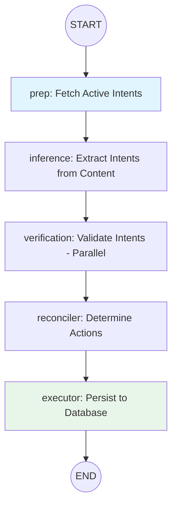

# Intent Graph Database Integration Design

## Overview

This document specifies how database operations should be integrated into the Intent Graph (`src/lib/protocol/graphs/intent/intent.graph.ts`). The design follows the established pattern from Profile Graph while addressing the specific needs of intent lifecycle management.

## Current State

### Existing Graph Structure
```
START → inference → verification → reconciler → END
```

- **inference**: Extracts intents from raw content via `ExplicitIntentInferrer`
- **verification**: Validates intents via `SemanticVerifierAgent` (parallel execution)
- **reconciler**: Decides actions (create/update/expire) via `IntentReconcilerAgent`

### Problem
The reconciler outputs an `actions` array but these actions are **not executed**. The caller must handle action execution externally.

### Gap Analysis
| Step | Current | Required |
|------|---------|----------|
| Pre-Graph | Manual formatting of activeIntents | Node to fetch & format active intents |
| Post-Graph | Actions returned but not executed | Executor node to persist changes |

---

## Database Interface Design

### Option A: Create Narrowed Type (Recommended)

Create a specific `IntentGraphDatabase` type that includes only the methods needed:

```typescript
// In database.interface.ts

/**
 * Database interface narrowed for Intent Graph operations.
 * - Pre-graph: Fetch active intents for reconciliation context
 * - Post-graph: Execute CRUD actions from reconciler output
 */
export type IntentGraphDatabase = Pick<
  Database,
  | 'getActiveIntents'   // Pre-graph: state population
  | 'createIntent'       // Execute CREATE actions
  | 'updateIntent'       // Execute UPDATE actions
  | 'archiveIntent'      // Execute EXPIRE actions
>;
```

### Option B: Use Existing IntentExecutorDatabase

The existing `IntentExecutorDatabase` includes all needed methods plus extras (vector search, ownership checks). Could be used if additional operations are anticipated.

**Recommendation**: Use Option A (`IntentGraphDatabase`) for cleaner interface segregation. The graph should have minimal surface area.

---

## Constructor Changes

### Before
```typescript
export class IntentGraphFactory {
  constructor() { }
  public createGraph() { ... }
}
```

### After
```typescript
import { IntentGraphDatabase } from "../../interfaces/database.interface";

export class IntentGraphFactory {
  constructor(private database: IntentGraphDatabase) { }
  
  public createGraph() {
    // Now has access to this.database
  }
}
```

This follows the exact pattern from [`ProfileGraphFactory`](src/lib/protocol/graphs/profile/profile.graph.ts:13-18).

---

## State Changes

### Current State Definition
```typescript
export const IntentGraphState = Annotation.Root({
  // Inputs
  userProfile: Annotation<string>,
  activeIntents: Annotation<string>,      // Pre-formatted string
  inputContent: Annotation<string | undefined>,
  
  // Intermediate
  inferredIntents: Annotation<InferredIntent[]>({...}),
  verifiedIntents: Annotation<VerifiedIntent[]>({...}),
  
  // Output
  actions: Annotation<IntentReconcilerOutput['actions']>({...}),
});
```

### Proposed State Definition
```typescript
import { CreatedIntent, ArchiveResult } from "../../interfaces/database.interface";

/**
 * Result of a single action execution.
 */
export type ExecutionResult = 
  | { type: 'create'; success: true; intent: CreatedIntent }
  | { type: 'create'; success: false; error: string; payload: string }
  | { type: 'update'; success: true; intent: CreatedIntent }
  | { type: 'update'; success: false; error: string; intentId: string }
  | { type: 'expire'; success: true; intentId: string }
  | { type: 'expire'; success: false; error: string; intentId: string };

export const IntentGraphState = Annotation.Root({
  // ─────────────────────────────────────────────────────────────
  // INPUTS (Required at graph invocation)
  // ─────────────────────────────────────────────────────────────
  
  /**
   * The unique identifier of the user whose intents are being processed.
   * Required for database operations.
   */
  userId: Annotation<string>,
  
  /**
   * The user's profile context (Identity, Narrative, etc.)
   * Used by inference and verification nodes.
   */
  userProfile: Annotation<string>,

  /**
   * Explicit input content (e.g., user message from discovery form).
   * Optional - graph might run on implicit sources.
   */
  inputContent: Annotation<string | undefined>,

  // ─────────────────────────────────────────────────────────────
  // POPULATED BY GRAPH (Prep Node)
  // ─────────────────────────────────────────────────────────────
  
  /**
   * The formatted string of currently active intents.
   * Populated by prepNode from database.getActiveIntents().
   */
  activeIntents: Annotation<string>({
    reducer: (curr, next) => next,
    default: () => "",
  }),

  // ─────────────────────────────────────────────────────────────
  // INTERMEDIATE STATE
  // ─────────────────────────────────────────────────────────────
  
  /**
   * List of raw intents extracted from text.
   */
  inferredIntents: Annotation<InferredIntent[]>({
    reducer: (curr, next) => next,
    default: () => [],
  }),

  /**
   * List of intents that have passed semantic verification.
   */
  verifiedIntents: Annotation<VerifiedIntent[]>({
    reducer: (curr, next) => next,
    default: () => [],
  }),

  // ─────────────────────────────────────────────────────────────
  // OUTPUT STATE
  // ─────────────────────────────────────────────────────────────
  
  /**
   * Actions determined by reconciler (Before execution).
   */
  actions: Annotation<IntentReconcilerOutput['actions']>({
    reducer: (curr, next) => next,
    default: () => [],
  }),

  /**
   * Results of executing actions against the database.
   * Populated by executorNode after actions are persisted.
   */
  executionResults: Annotation<ExecutionResult[]>({
    reducer: (curr, next) => next,
    default: () => [],
  }),
});
```

### Key State Changes

| Field | Change | Reason |
|-------|--------|--------|
| `userId` | **Added** | Required for `createIntent` and fetching active intents |
| `activeIntents` | Now has reducer/default | Populated by prepNode, not required as input |
| `executionResults` | **Added** | Captures success/failure of each action execution |

---

## New Node Definitions

### Node 1: Prep Node (NEW)

Fetches active intents from database and formats them for reconciliation context.

```typescript
/**
 * Node: Prep
 * Fetches user's active intents from database and formats for reconciler.
 */
const prepNode = async (state: typeof IntentGraphState.State) => {
  if (!state.userId) {
    throw new Error("userId is required");
  }

  log.info("[Graph:Prep] Fetching active intents...", { userId: state.userId });
  
  const activeIntents = await this.database.getActiveIntents(state.userId);
  
  // Format for reconciler context (matches existing pattern from intent.service.ts)
  const formattedIntents = activeIntents.length > 0
    ? activeIntents
        .map(i => `ID: ${i.id}, Description: ${i.payload}, Summary: ${i.summary || 'N/A'}`)
        .join('\n')
    : "No active intents.";
  
  log.info(`[Graph:Prep] Found ${activeIntents.length} active intents.`);
  
  return { activeIntents: formattedIntents };
};
```

### Node 2: Executor Node (NEW)

Executes reconciler actions against the database.

```typescript
/**
 * Node: Executor
 * Executes reconciler actions (create/update/expire) against the database.
 */
const executorNode = async (state: typeof IntentGraphState.State) => {
  const { actions, userId } = state;
  
  if (actions.length === 0) {
    log.info("[Graph:Executor] No actions to execute.");
    return { executionResults: [] };
  }

  log.info(`[Graph:Executor] Executing ${actions.length} actions...`);
  
  const results: ExecutionResult[] = [];

  for (const action of actions) {
    try {
      switch (action.type) {
        case 'create': {
          const newIntent = await this.database.createIntent({
            userId,
            payload: action.payload,
            confidence: action.score ? action.score / 100 : 1.0, // Convert 0-100 to 0-1
            inferenceType: 'explicit',
            sourceType: 'discovery_form',
          });
          
          results.push({
            type: 'create',
            success: true,
            intent: newIntent,
          });
          
          log.info(`[Graph:Executor] Created intent: ${newIntent.id}`);
          break;
        }
        
        case 'update': {
          const updated = await this.database.updateIntent(action.id, {
            payload: action.payload,
          });
          
          if (updated) {
            results.push({
              type: 'update',
              success: true,
              intent: updated,
            });
            log.info(`[Graph:Executor] Updated intent: ${action.id}`);
          } else {
            results.push({
              type: 'update',
              success: false,
              error: 'Intent not found',
              intentId: action.id,
            });
            log.warn(`[Graph:Executor] Intent not found for update: ${action.id}`);
          }
          break;
        }
        
        case 'expire': {
          const archiveResult = await this.database.archiveIntent(action.id);
          
          if (archiveResult.success) {
            results.push({
              type: 'expire',
              success: true,
              intentId: action.id,
            });
            log.info(`[Graph:Executor] Expired intent: ${action.id}`);
          } else {
            results.push({
              type: 'expire',
              success: false,
              error: archiveResult.error || 'Unknown error',
              intentId: action.id,
            });
            log.warn(`[Graph:Executor] Failed to expire: ${action.id}`, { error: archiveResult.error });
          }
          break;
        }
      }
    } catch (error) {
      const errorMessage = error instanceof Error ? error.message : 'Unknown error';
      log.error(`[Graph:Executor] Error executing ${action.type}:`, { error });
      
      // Record failure but continue processing other actions
      if (action.type === 'create') {
        results.push({
          type: 'create',
          success: false,
          error: errorMessage,
          payload: action.payload,
        });
      } else if (action.type === 'update') {
        results.push({
          type: 'update',
          success: false,
          error: errorMessage,
          intentId: action.id,
        });
      } else {
        results.push({
          type: 'expire',
          success: false,
          error: errorMessage,
          intentId: action.id,
        });
      }
    }
  }

  const successCount = results.filter(r => r.success).length;
  log.info(`[Graph:Executor] Completed: ${successCount}/${actions.length} actions succeeded.`);
  
  return { executionResults: results };
};
```

---

## Complete Node Flow

### Flow Diagram



### Graph Assembly Code

```typescript
// --- GRAPH ASSEMBLY ---

const workflow = new StateGraph(IntentGraphState)
  // Nodes
  .addNode("prep", prepNode)              // NEW: Fetch active intents
  .addNode("inference", inferenceNode)
  .addNode("verification", verificationNode)
  .addNode("reconciler", reconciliationNode)
  .addNode("executor", executorNode)      // NEW: Execute actions

  // Edges
  .addEdge(START, "prep")
  .addEdge("prep", "inference")
  .addEdge("inference", "verification")
  .addEdge("verification", "reconciler")
  .addEdge("reconciler", "executor")
  .addEdge("executor", END);

return workflow.compile();
```

---

## Example Usage

### Controller Integration

```typescript
// In a controller (e.g., intent.controller.ts)

import { IntentGraphFactory } from '../lib/protocol/graphs/intent/intent.graph';
import { IntentGraphDatabase } from '../lib/protocol/interfaces/database.interface';

export class IntentController {
  private intentGraph: ReturnType<IntentGraphFactory['createGraph']>;
  
  constructor(private database: IntentGraphDatabase) {
    const factory = new IntentGraphFactory(database);
    this.intentGraph = factory.createGraph();
  }
  
  async processDiscoveryForm(
    userId: string,
    content: string,
    userProfile: string
  ) {
    // Invoke graph - only content inputs required
    const result = await this.intentGraph.invoke({
      userId,
      inputContent: content,
      userProfile,
    });
    
    // Result includes execution results
    const { executionResults, actions } = result;
    
    // Extract created intents for response
    const createdIntents = executionResults
      .filter((r): r is Extract<ExecutionResult, { type: 'create'; success: true }> => 
        r.type === 'create' && r.success
      )
      .map(r => r.intent);
    
    // Check for failures
    const failures = executionResults.filter(r => !r.success);
    if (failures.length > 0) {
      console.warn('Some actions failed:', failures);
    }
    
    return {
      actions,
      executionResults,
      createdIntents,
    };
  }
}
```

### Database Adapter Implementation

```typescript
// Example adapter implementing IntentGraphDatabase

import db from '../lib/drizzle/drizzle';
import { intents, intentIndexes } from '../lib/schema';
import { IntentGraphDatabase, ActiveIntent, CreateIntentData, CreatedIntent, UpdateIntentData, ArchiveResult } from '../lib/protocol/interfaces/database.interface';

export class DrizzleIntentGraphAdapter implements IntentGraphDatabase {
  
  async getActiveIntents(userId: string): Promise<ActiveIntent[]> {
    return await db.select({
      id: intents.id,
      payload: intents.payload,
      summary: intents.summary,
      createdAt: intents.createdAt,
    })
    .from(intents)
    .where(and(
      eq(intents.userId, userId),
      isNull(intents.archivedAt)
    ));
  }

  async createIntent(data: CreateIntentData): Promise<CreatedIntent> {
    // Implementation: summarize, embed, insert, associate with indexes
    // ... (see intent.service.ts for full implementation)
  }

  async updateIntent(intentId: string, data: UpdateIntentData): Promise<CreatedIntent | null> {
    // Implementation: update payload, re-summarize if needed
    // ...
  }

  async archiveIntent(intentId: string): Promise<ArchiveResult> {
    // Implementation: set archivedAt timestamp
    // ...
  }
}
```

---

## Summary of Changes

### Files to Modify

| File | Changes |
|------|---------|
| `database.interface.ts` | Add `IntentGraphDatabase` type definition |
| `intent.graph.state.ts` | Add `userId`, `executionResults`; update `activeIntents` to have default |
| `intent.graph.ts` | Add constructor with database injection; add `prepNode` and `executorNode` |

### New Type Definitions

1. `IntentGraphDatabase` - Narrowed database interface
2. `ExecutionResult` - Union type for action execution results

### New Nodes

1. `prepNode` - Fetches and formats active intents
2. `executorNode` - Persists reconciler actions to database

### Updated Flow

```
Before:  START → inference → verification → reconciler → END
After:   START → prep → inference → verification → reconciler → executor → END
```

---

## Design Decisions

### Why Prep Node Instead of External Fetch?

1. **Encapsulation**: Graph handles its own data requirements
2. **Consistency**: Matches Profile Graph pattern (check_state node)
3. **Testability**: Can mock database at factory level

### Why Continue on Action Failure?

1. **Partial Success**: Some actions may succeed even if others fail
2. **Observability**: All results captured for debugging/audit
3. **Existing Pattern**: Matches `intent.service.ts` behavior

### Why Not Include Embedding in Executor?

The `createIntent` database method should handle embedding generation internally (as shown in existing `IntentService.createIntent`). This keeps the executor node simple and delegates embedding concerns to the database adapter.

---

## Open Questions

1. **Events**: Should the executor node trigger `IntentEvents.onCreated`, etc.? Currently, the database adapter would handle this.

2. **Index Association**: Should the graph accept optional `indexIds`? Or should this be handled by the database adapter via dynamic scoping?

3. **Inference Type**: Currently hardcoded to `explicit`. Should this be configurable via state input?
