# Opportunity System Redesign Plan

> **Status**: DRAFT - Discussion Only  
> **Author**: AI Assistant  
> **Date**: 2026-02-02

## Executive Summary

This document outlines a redesign of the Opportunity system to:
1. **Retire `intent_stakes`** - Replace with a unified `opportunities` table
2. **Support dual opportunity types**: Intent-to-Intent (I2I) and Intent-to-Profile (I2P)
3. **Integrate HyDE strategy** with multiple hypothetical document types (Mirror, Reciprocal)
4. **Simplify architecture** by removing the deprecated `SemanticRelevancyBroker`

---

## 1. Current State Analysis

### 1.1 Existing Tables

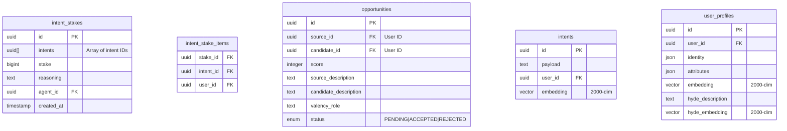

### 1.2 Current Issues

| Issue | Description |
|-------|-------------|
| **Dual Systems** | `intent_stakes` and `opportunities` serve overlapping purposes |
| **Complex Broker** | `SemanticRelevancyBroker` is deprecated but still active |
| **Single HyDE Type** | Only "Mirror" HyDE exists; missing "Reciprocal" for intent matching |
| **No Intent Vectors** | Intents have embeddings but no HyDE vectors for complementary matching |
| **Implicit Confusion** | `implicit_intents` stored on profiles, unclear lifecycle |

---

## 2. Target Architecture

### 2.1 Unified Opportunities Table

Replace `intent_stakes` with an enhanced `opportunities` table that supports both I2I and I2P matching.

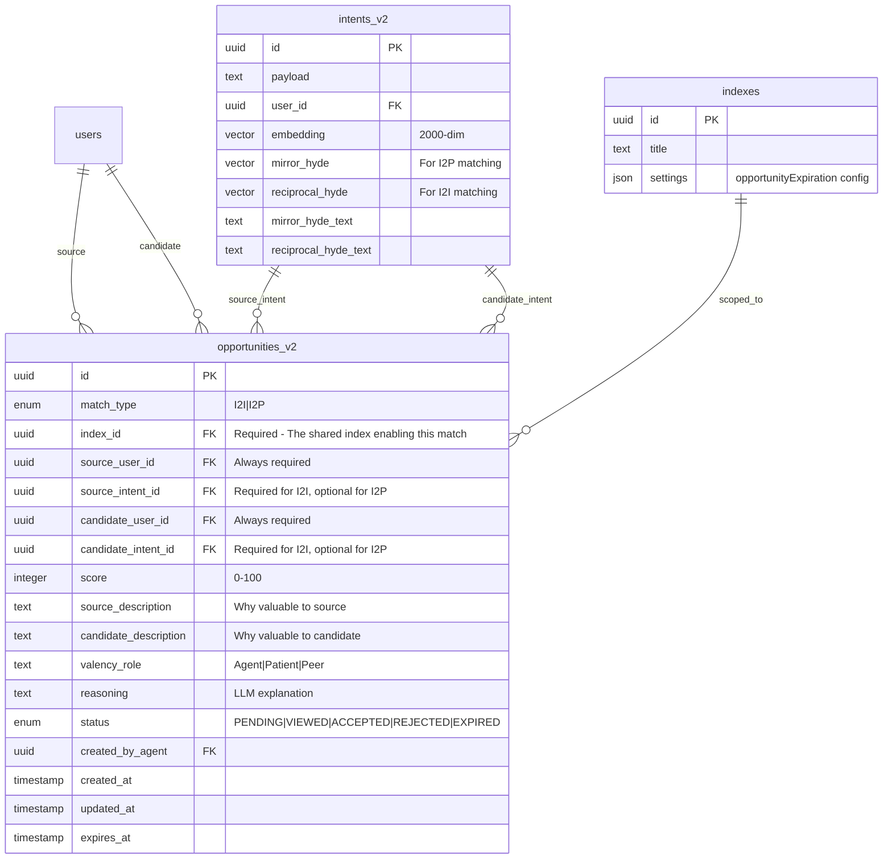

### 2.2 Opportunity Types

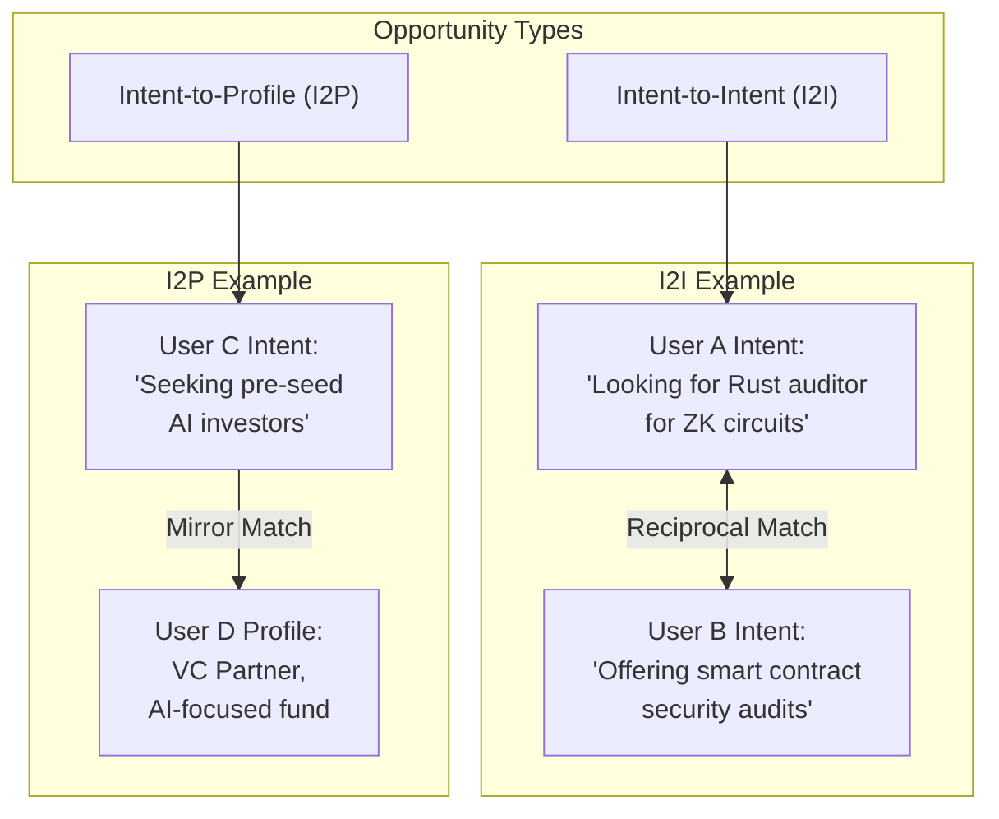

### 2.3 Match Type Terminology

#### Mirror Match (Used in I2P)

A **Mirror Match** finds candidates whose **attributes/skills satisfy** the source intent's requirements.

**Concept**: The source intent acts as a "verb" with unfilled slots (valency). The Mirror HyDE document hallucinates what a person who fills those slots would look like—their biography, skills, and background. We then search for real profiles that "mirror" this hypothetical person.

```
Source Intent: "I need a Rust auditor for ZK-circuits"
                    ↓
         [Mirror HyDE Generator]
                    ↓
Hypothetical Profile: "Senior Security Engineer specializing in 
                      Zero-Knowledge proofs. Audited 15 Circom-based 
                      protocols. Expert in formal verification..."
                    ↓
         [Embed & Search user_profiles]
                    ↓
Real Match: User D's profile (actual ZK security expert)
```

**Key Insight**: Mirror matching is **unidirectional**. The source has a need; the candidate has the capability. The candidate may not have explicitly stated they want this work—we infer it from their profile.

---

#### Reciprocal Match (Used in I2I)

A **Reciprocal Match** finds candidates whose **intent complements** the source intent through semantic inversion.

**Concept**: Based on **Meaning Postulates**—standard inference rules like "If A wants to buy, infer there exists B who wants to sell." The Reciprocal HyDE document hallucinates what the "other side" of the transaction would be seeking.

```
Source Intent: "I want to invest in early-stage DePIN projects"
                    ↓
         [Reciprocal HyDE Generator]
                    ↓
Hypothetical Intent: "Raising seed round for decentralized GPU 
                     orchestration network, seeking crypto-native investors"
                    ↓
         [Embed & Search intents.embedding]
                    ↓
Real Match: User B's intent (founder raising for DePIN startup)
```

**Key Insight**: Reciprocal matching is **bidirectional**. Both parties have explicitly stated complementary goals. This creates higher-confidence matches because both users have declared intent.

---

#### Comparison Table

| Aspect | Mirror Match (I2P) | Reciprocal Match (I2I) |
|--------|-------------------|------------------------|
| **Source** | Intent | Intent |
| **Target** | Profile (attributes) | Intent (explicit goal) |
| **Search Vector** | `mirror_hyde_embedding` | `reciprocal_hyde_embedding` |
| **Search Index** | `user_profiles.hyde_embedding` | `intents.embedding` |
| **Directionality** | Unidirectional (need → capability) | Bidirectional (goal ↔ goal) |
| **Confidence** | Medium (inferred interest) | High (explicit mutual interest) |
| **Example** | "Hiring React dev" → Dev's profile | "Hiring" ↔ "Looking for job" |

---

### 2.4 Valency Role

**Valency** is a linguistic concept from syntax that describes how many "arguments" a verb requires. For example:
- "sleep" has valency 1 (someone sleeps)
- "hire" has valency 2 (someone hires someone)
- "introduce" has valency 3 (someone introduces someone to someone)

In the opportunity system, we use **Valency Role** to describe the semantic relationship between the source and candidate:

#### Valency Roles Defined

| Role | Description | Source Intent Pattern | Candidate Role |
|------|-------------|----------------------|----------------|
| **Agent** | The candidate CAN DO something for the source | "I need X done" | The doer/provider |
| **Patient** | The candidate NEEDS something from the source | "I can provide X" | The receiver/beneficiary |
| **Peer** | Symmetric collaboration, neither dominant | "Looking to collaborate on X" | Co-equal partner |

#### How Valency Role is Determined

The `OpportunityEvaluator` LLM agent analyzes both parties and assigns the role:

```typescript
// From opportunity.evaluator.ts (simplified)
const systemPrompt = `
  1. **Valency Analysis**:
     - Determine the semantic role of the Candidate relative to the Source's goal.
     - "Agent": The Candidate CAN DO something for the Source 
       (e.g., Source needs a dev, Candidate IS a dev).
     - "Patient": The Candidate NEEDS something from the Source 
       (e.g., Source is a mentor, Candidate needs mentoring).
     - "Peer": Symmetric collaboration.
`;
```

#### Valency Role by Match Type

| Match Type | Typical Valency Role | Example |
|------------|---------------------|---------|
| **I2P (Mirror)** | Usually **Agent** | Source: "Need designer" → Candidate profile: Designer → Agent |
| **I2I (Reciprocal)** | **Agent** or **Peer** | Source: "Investing in AI" ↔ Candidate: "Raising for AI startup" → Agent (investor acts) |
| **I2I (Peer)** | **Peer** | Source: "Co-founder for fintech" ↔ Candidate: "Co-founder for fintech" → Peer |

#### How Valency Role is Utilized

1. **Description Generation**: The LLM uses valency to write appropriate descriptions:
   - Agent: "Alice can build your MVP" (candidate does for source)
   - Patient: "Bob is looking for exactly what you offer" (source does for candidate)
   - Peer: "You and Carol have complementary skills for collaboration"

2. **UI Presentation**: Frontend can style opportunities differently:
   - Agent matches: "Someone who can help you"
   - Patient matches: "Someone you can help"
   - Peer matches: "Potential collaborator"

3. **Notification Framing**: Email/notification copy adapts to role:
   - Agent: "We found someone who matches your requirements"
   - Patient: "Someone is looking for your expertise"

4. **Analytics**: Track which valency roles lead to higher acceptance rates.

---

### 2.5 Profile-to-Intent (P2I) Analysis

**Question**: Can a user's **profile** match against another user's **intent**? (The inverse of I2P)

#### Current Architecture Assessment

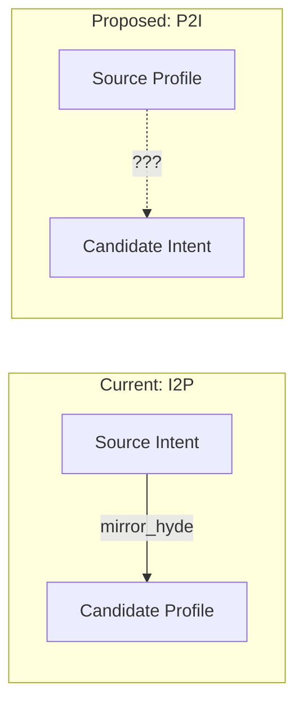

**Current limitation**: The system is **intent-triggered**. The OpportunityGraph runs when an intent is created/updated. Profiles don't have a trigger mechanism.

#### P2I Is Architecturally Possible

Yes, P2I can work under this architecture with modifications:

**Mechanism**: Use the **profile's HyDE embedding** (`user_profiles.hyde_embedding`) to search against `intents.embedding`.

```
Source Profile: "VC Partner at AI-focused fund, 10 years experience,
                looking to meet founders"
                    ↓
         [Profile already has hyde_embedding]
                    ↓
         [Search intents.embedding]
                    ↓
Real Match: User's intent "Raising seed round for AI startup"
```

#### Implementation Requirements for P2I

| Requirement | Status | Notes |
|-------------|--------|-------|
| Profile HyDE embedding | ✅ Exists | `user_profiles.hyde_embedding` already generated |
| Intent embeddings | ✅ Exists | `intents.embedding` already exists |
| Trigger mechanism | ❌ Missing | Need a way to trigger P2I discovery |
| Match type enum | ❌ Missing | Add `P2I` to `match_type` enum |

#### P2I Trigger Options

| Trigger | Description | Pros | Cons |
|---------|-------------|------|------|
| **Profile update** | Run P2I when profile is updated | Natural lifecycle | Frequent, expensive |
| **New intent in index** | When ANY new intent is created, check against all profiles | Catches passive users | N×M complexity |
| **Scheduled cron** | Daily P2I scan for all profiles | Controlled load | Delayed discovery |
| **User-initiated** | "Find opportunities for me" button | User control | Requires action |

#### Recommended P2I Design

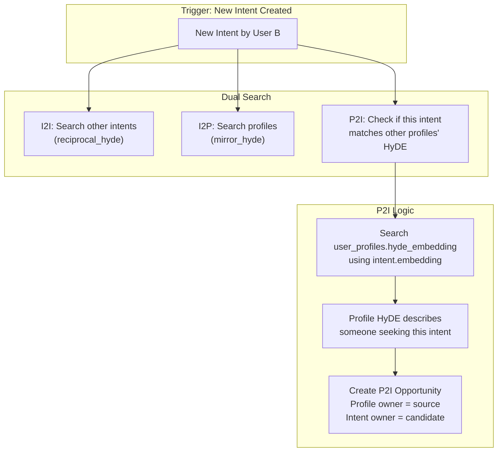

**P2I Opportunity Structure**:
```typescript
{
  matchType: 'P2I',
  sourceUserId: profileOwner.id,
  sourceIntentId: null,  // No intent, profile-based
  candidateUserId: intentOwner.id,
  candidateIntentId: newIntent.id,
  // ...
}
```

#### P2I vs I2P Comparison

| Aspect | I2P | P2I |
|--------|-----|-----|
| **Source** | User with intent | User with profile (no intent) |
| **Candidate** | User with matching profile | User with matching intent |
| **Trigger** | Source creates intent | Candidate creates intent |
| **Source has explicit goal?** | Yes (intent) | No (passive profile) |
| **Use case** | Active seeker finds passive expert | Passive expert notified of relevant opportunity |

#### Recommendation

**Add P2I as a future enhancement**, not MVP:

1. **MVP**: I2I + I2P (intent-triggered only)
2. **V2**: Add P2I triggered when new intents are created
3. **V3**: Add P2P if there's demand

**Rationale**: P2I benefits "passive" users who haven't declared intents. This is valuable for:
- Experts who are open to opportunities but haven't stated goals
- Investors who want deal flow without active searching
- Mentors available but not actively seeking mentees

---

## 3. HyDE Strategy Implementation

### 3.1 Dual HyDE Document Types

Based on the [HyDE Strategies document](../src/lib/protocol/docs/HyDE%20Strategies%20for%20Explicit%20Intent%20Matching%20and%20Retrieval.md):

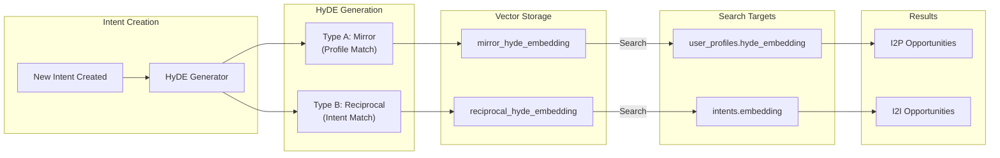

### 3.2 HyDE Document Prompts

| Type | Purpose | Prompt Template | Search Target |
|------|---------|-----------------|---------------|
| **Mirror** | Find profiles that satisfy the intent | "Write a professional biography for the perfect candidate who satisfies this goal: `{intent}`" | `user_profiles.hyde_embedding` |
| **Reciprocal** | Find complementary intents | "Write a goal for someone who is looking for exactly what this user offers/needs: `{intent}`" | `intents.embedding` |

### 3.3 Intent HyDE Generator Agent

```typescript
// New agent: intent.hyde.generator.ts

interface IntentHydeOutput {
  mirror: {
    text: string;
    embedding: number[];
  };
  reciprocal: {
    text: string;
    embedding: number[];
  };
}

class IntentHydeGenerator extends BaseLangChainAgent {
  async generate(intent: string): Promise<IntentHydeOutput>;
}
```

---

## 4. Opportunity Graph Redesign

### 4.1 Graph Architecture

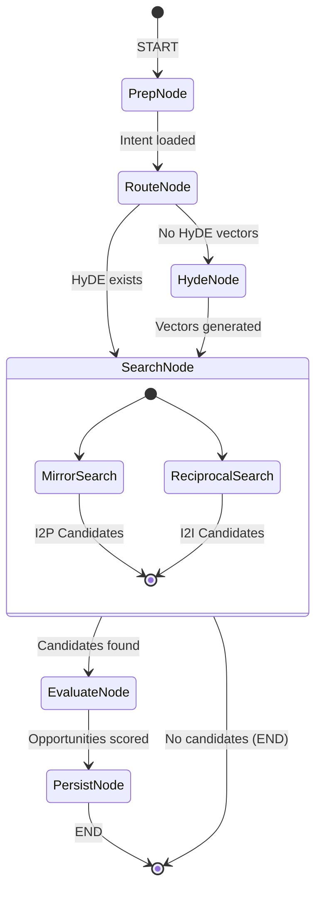

### 4.2 Node Responsibilities

| Node | Purpose | Input | Output |
|------|---------|-------|--------|
| **PrepNode** | Load intent, user's index memberships, check existing opportunities | `intentId` | Intent data, `userIndexIds`, existing opportunities |
| **RouteNode** | Conditional: HyDE exists? | Intent state | Route decision |
| **HydeNode** | Generate Mirror & Reciprocal HyDE | Intent payload | HyDE vectors |
| **SearchNode** | Parallel vector search (index-scoped) | HyDE vectors, `userIndexIds` | Candidate lists |
| **EvaluateNode** | LLM scoring of candidates | Candidates | Scored opportunities |
| **PersistNode** | Save to `opportunities` table with `indexId` | Opportunities | Confirmation |

### 4.2.1 Index-Scoped Search Flow

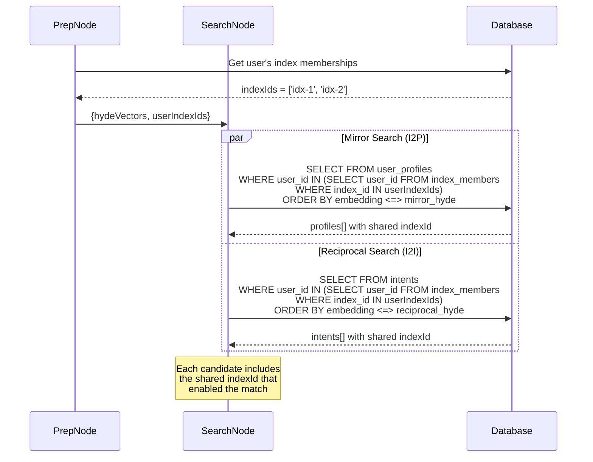

### 4.3 Graph State Definition

```typescript
// opportunity.graph.state.ts

export const OpportunityGraphState = Annotation.Root({
  // Input
  intentId: Annotation<string>,
  userId: Annotation<string>,
  
  // Control
  operationMode: Annotation<'create' | 'refresh'>({
    default: () => 'create',
  }),
  
  // Intermediate - Intent Data
  intent: Annotation<Intent | null>({
    default: () => null,
  }),
  hydeVectors: Annotation<{
    mirror: number[] | null;
    reciprocal: number[] | null;
  }>({
    default: () => ({ mirror: null, reciprocal: null }),
  }),
  
  // Community Scope - indexes the user belongs to
  userIndexIds: Annotation<string[]>({
    default: () => [],
  }),
  
  // Intermediate - Candidates (filtered by shared index membership)
  i2pCandidates: Annotation<CandidateProfile[]>({
    reducer: (curr, next) => next ?? curr,
    default: () => [],
  }),
  i2iCandidates: Annotation<CandidateIntent[]>({
    reducer: (curr, next) => next ?? curr,
    default: () => [],
  }),
  
  // Output - each opportunity includes indexId
  opportunities: Annotation<Opportunity[]>({
    reducer: (curr, next) => next,
    default: () => [],
  }),
  
  // Deduplication context
  existingOpportunities: Annotation<string>({
    default: () => '',
  }),
});

// Opportunity includes the index that enabled the match
interface Opportunity {
  matchType: 'I2I' | 'I2P';
  indexId: string;  // Required: the shared index
  sourceUserId: string;
  sourceIntentId?: string;
  candidateUserId: string;
  candidateIntentId?: string;
  score: number;
  sourceDescription: string;
  candidateDescription: string;
  valencyRole: 'Agent' | 'Patient' | 'Peer';
  reasoning: string;
}
```

---

## 5. Database Schema Changes

### 5.1 New/Modified Tables

```sql
-- 1. Add HyDE columns to intents table
ALTER TABLE intents
ADD COLUMN mirror_hyde_text TEXT,
ADD COLUMN mirror_hyde_embedding vector(2000),
ADD COLUMN reciprocal_hyde_text TEXT,
ADD COLUMN reciprocal_hyde_embedding vector(2000);

-- 2. Add indexes for fast similarity search
CREATE INDEX intents_mirror_hyde_idx 
ON intents USING hnsw (mirror_hyde_embedding vector_cosine_ops);

CREATE INDEX intents_reciprocal_hyde_idx 
ON intents USING hnsw (reciprocal_hyde_embedding vector_cosine_ops);

-- 3. Add settings column to indexes table (for expiration config)
ALTER TABLE indexes
ADD COLUMN settings JSONB DEFAULT '{}';

-- Example settings structure:
-- {
--   "opportunityExpiration": {
--     "i2iDays": 14,
--     "i2pDays": 30
--   }
-- }

-- 4. Enhance opportunities table
-- Note: P2I can be added to match_type enum in V2
ALTER TABLE opportunities
ADD COLUMN match_type TEXT CHECK (match_type IN ('I2I', 'I2P')) DEFAULT 'I2P',  -- Add 'P2I' in V2
ADD COLUMN index_id UUID NOT NULL REFERENCES indexes(id),  -- Required: community scope
ADD COLUMN source_intent_id UUID REFERENCES intents(id),
ADD COLUMN candidate_intent_id UUID REFERENCES intents(id),
ADD COLUMN reasoning TEXT,
ADD COLUMN created_by_agent UUID REFERENCES agents(id),
ADD COLUMN expires_at TIMESTAMP;

-- 5. Rename source_id/candidate_id for clarity
ALTER TABLE opportunities 
RENAME COLUMN source_id TO source_user_id;

ALTER TABLE opportunities 
RENAME COLUMN candidate_id TO candidate_user_id;

-- 6. Add indexes for opportunity queries
CREATE INDEX opportunities_source_user_idx ON opportunities(source_user_id);
CREATE INDEX opportunities_candidate_user_idx ON opportunities(candidate_user_id);
CREATE INDEX opportunities_index_idx ON opportunities(index_id);  -- For community-scoped queries
CREATE INDEX opportunities_match_type_idx ON opportunities(match_type);
CREATE INDEX opportunities_status_idx ON opportunities(status);

-- 7. Composite index for common query pattern (user's opportunities within an index)
CREATE INDEX opportunities_user_index_idx ON opportunities(source_user_id, index_id);
```

### 5.2 Migration Plan

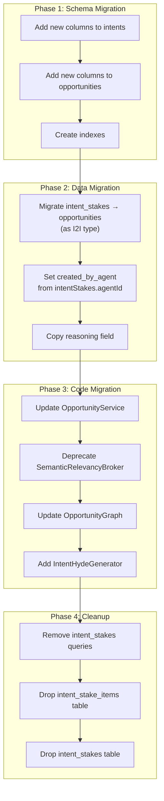

---

## 6. Service Layer Changes

### 6.1 OpportunityService Refactoring

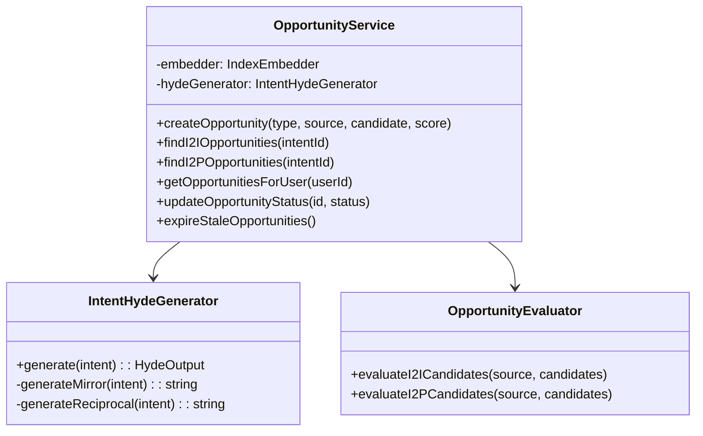

### 6.2 Intent Lifecycle Integration

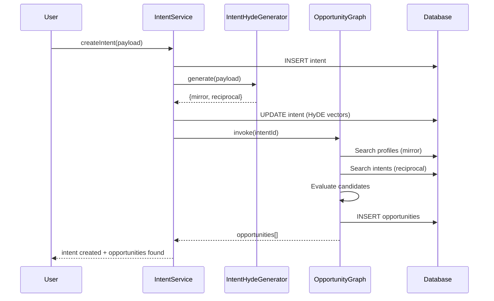

---

## 7. API Changes

### 7.1 New Endpoints

| Method | Endpoint | Description |
|--------|----------|-------------|
| `GET` | `/api/opportunities` | List opportunities for authenticated user |
| `GET` | `/api/opportunities/:id` | Get single opportunity details |
| `PATCH` | `/api/opportunities/:id/status` | Update status (accept/reject) |
| `GET` | `/api/intents/:id/opportunities` | Get opportunities for specific intent |
| `POST` | `/api/opportunities/discover` | Trigger discovery for user/intent |

### 7.2 Response Schema

```typescript
interface OpportunityResponse {
  id: string;
  matchType: 'I2I' | 'I2P';
  score: number;
  status: 'PENDING' | 'VIEWED' | 'ACCEPTED' | 'REJECTED' | 'EXPIRED';
  
  // Community context - the index that enabled this match
  index: {
    id: string;
    title: string;
  };
  
  // Source side (authenticated user's perspective)
  sourceDescription: string;
  sourceIntent?: {
    id: string;
    payload: string;
    summary: string;
  };
  
  // Candidate side
  candidateDescription: string;
  candidateUser: {
    id: string;
    name: string;
    avatar?: string;
  };
  candidateIntent?: {  // Only for I2I
    id: string;
    payload: string;
    summary: string;
  };
  
  valencyRole: 'Agent' | 'Patient' | 'Peer';
  reasoning: string;
  
  createdAt: string;
  expiresAt?: string;  // Calculated from index.settings.opportunityExpiration
}
```

---

## 8. Side Effects & Notifications

### 8.1 Graph-Based Side Effects (No Separate Events File)

All side effects are handled **directly within the graphs** rather than through a separate events system. This keeps logic colocated and reduces indirection.

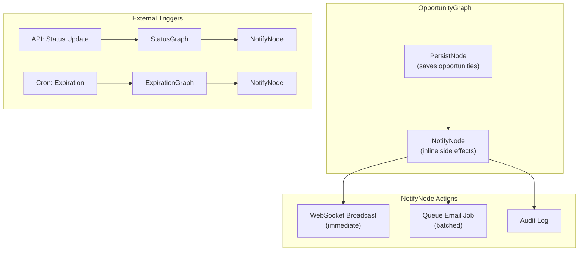

### 8.2 Side Effects by Trigger

| Trigger | Graph | Side Effects |
|---------|-------|--------------|
| Intent created | `OpportunityGraph` | Create opportunities → WebSocket notify both users → Queue email digest |
| Intent updated | `OpportunityGraph` | Refresh opportunities → Notify if new matches |
| Intent archived | `IntentGraph` | Expire related opportunities (inline) |
| Opportunity status changed | `OpportunityStatusGraph` | Notify other party → Create connection if mutual accept |
| Member removed from index | `IndexMemberGraph` | Expire user's opportunities in that index |
| Opportunity TTL expired | `ExpirationCronJob` | Batch update status → No notification needed |

### 8.3 Notification Implementation in PersistNode

```typescript
// opportunity.graph.ts - PersistNode

const persistNode = async (state: typeof OpportunityGraphState.State) => {
  const { opportunities, userId } = state;
  
  // 1. Persist to database
  const savedOpportunities = await db.insert(opportunitiesTable)
    .values(opportunities)
    .returning();
  
  // 2. WebSocket notification (immediate, inline)
  for (const opp of savedOpportunities) {
    // Notify source user
    await websocketService.broadcast(opp.sourceUserId, {
      type: 'opportunity_created',
      opportunityId: opp.id,
      matchType: opp.matchType,
    });
    
    // Notify candidate user
    await websocketService.broadcast(opp.candidateUserId, {
      type: 'opportunity_created', 
      opportunityId: opp.id,
      matchType: opp.matchType,
    });
  }
  
  // 3. Queue email digest (batched, via job queue)
  // Check if either user has reached 10 unviewed opportunities
  await opportunityQueue.add('check_digest_threshold', {
    userIds: [
      ...new Set(savedOpportunities.flatMap(o => [o.sourceUserId, o.candidateUserId]))
    ]
  });
  
  // 4. Audit log
  log.info('[OpportunityGraph:Persist] Created opportunities', {
    count: savedOpportunities.length,
    sourceUserId: userId,
  });
  
  return { savedOpportunities };
};
```

### 8.4 Connection Creation on Mutual Accept

Handled in `OpportunityStatusGraph`, not via events:

```typescript
// opportunity.status.graph.ts

const updateStatusNode = async (state: typeof StatusGraphState.State) => {
  const { opportunityId, newStatus, actingUserId } = state;
  
  // Update status
  const [updated] = await db.update(opportunities)
    .set({ status: newStatus, updatedAt: new Date() })
    .where(eq(opportunities.id, opportunityId))
    .returning();
  
  if (newStatus === 'ACCEPTED') {
    // Check if BOTH users have now accepted
    // (This is a single shared opportunity, so check if this is second accept)
    const bothAccepted = await checkMutualAcceptance(opportunityId);
    
    if (bothAccepted) {
      // Create connection directly (no event)
      await db.insert(userConnectionEvents).values({
        initiatorUserId: updated.sourceUserId,
        receiverUserId: updated.candidateUserId,
        eventType: 'ACCEPT',
      });
      
      // Notify both users of connection
      await websocketService.broadcast(updated.sourceUserId, {
        type: 'connection_created',
        connectionUserId: updated.candidateUserId,
      });
      await websocketService.broadcast(updated.candidateUserId, {
        type: 'connection_created',
        connectionUserId: updated.sourceUserId,
      });
    } else {
      // First accept - notify the other party
      const otherUserId = actingUserId === updated.sourceUserId 
        ? updated.candidateUserId 
        : updated.sourceUserId;
      
      await websocketService.broadcast(otherUserId, {
        type: 'opportunity_accepted_by_other',
        opportunityId,
      });
    }
  }
  
  return { updated };
};
```

### 8.5 Benefits of Graph-Based Side Effects

| Benefit | Description |
|---------|-------------|
| **Colocated logic** | Side effects live next to the code that triggers them |
| **Testable** | Graph nodes can be unit tested with mocked services |
| **Traceable** | Langfuse traces capture the full flow including side effects |
| **No event soup** | No debugging "which handler fired?" issues |
| **Transactional** | Can wrap persist + notify in same error boundary |

---

## 9. Migration Strategy

### 9.1 Phases

| Phase | Duration | Tasks | Rollback |
|-------|----------|-------|----------|
| **1. Schema** | 1 sprint | Add columns, create indexes | DROP columns |
| **2. Dual-Write** | 1 sprint | Write to both `intent_stakes` and `opportunities` | Disable dual-write |
| **3. Read Migration** | 1 sprint | Read from `opportunities`, fallback to `intent_stakes` | Revert read logic |
| **4. Cleanup** | 1 sprint | Drop `intent_stakes`, remove fallback code | N/A (backup data) |

### 9.2 Data Migration Script

```typescript
// cli/migrate-stakes-to-opportunities.ts

async function migrateStakesToOpportunities() {
  const stakes = await db.select().from(intentStakes);
  
  for (const stake of stakes) {
    const [intentA, intentB] = stake.intents;
    
    // Resolve user IDs from intents
    const userA = await getIntentUser(intentA);
    const userB = await getIntentUser(intentB);
    
    // Find shared index between the two users
    // Prefer the index where intentA is assigned, fallback to any shared index
    const sharedIndexId = await findSharedIndex(userA, userB, intentA);
    
    if (!sharedIndexId) {
      console.warn(`No shared index for stake ${stake.id}, skipping migration`);
      continue;
    }
    
    await db.insert(opportunities).values({
      matchType: 'I2I',
      indexId: sharedIndexId,  // Required: community scope
      sourceUserId: userA,
      sourceIntentId: intentA,
      candidateUserId: userB,
      candidateIntentId: intentB,
      score: Number(stake.stake),
      reasoning: stake.reasoning,
      status: 'PENDING',
      createdByAgent: stake.agentId,
      createdAt: stake.createdAt,
    });
  }
}

async function findSharedIndex(userA: string, userB: string, preferIntentId?: string): Promise<string | null> {
  // 1. Try to find the index where the intent is assigned
  if (preferIntentId) {
    const intentIndex = await db.select({ indexId: intentIndexes.indexId })
      .from(intentIndexes)
      .innerJoin(indexMembers, eq(indexMembers.indexId, intentIndexes.indexId))
      .where(and(
        eq(intentIndexes.intentId, preferIntentId),
        eq(indexMembers.userId, userB)  // Ensure userB is also in this index
      ))
      .limit(1);
    
    if (intentIndex[0]) return intentIndex[0].indexId;
  }
  
  // 2. Fallback: find any shared index
  const shared = await db.select({ indexId: indexMembers.indexId })
    .from(indexMembers)
    .where(eq(indexMembers.userId, userA))
    .intersect(
      db.select({ indexId: indexMembers.indexId })
        .from(indexMembers)
        .where(eq(indexMembers.userId, userB))
    )
    .limit(1);
  
  return shared[0]?.indexId || null;
}
```

---

## 10. Testing Strategy

### 10.1 Test Cases

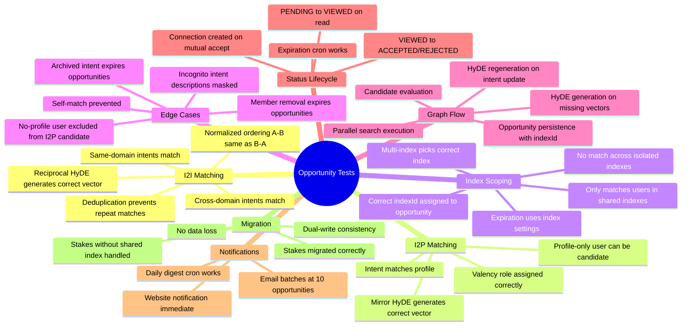

### 10.2 Integration Tests

```typescript
describe('OpportunityGraph', () => {
  it('should create I2I opportunities for complementary intents in same index', async () => {
    // Setup: Both users in same index
    const index = await createIndex('Tech Founders');
    const userA = await createUser();
    const userB = await createUser();
    await addMember(index.id, userA.id);
    await addMember(index.id, userB.id);
    
    const intentA = await createIntent(userA.id, 'Looking for React developer');
    const intentB = await createIntent(userB.id, 'Available for React contract work');
    
    // Trigger
    await opportunityGraph.invoke({ intentId: intentA.id });
    
    // Verify
    const opportunities = await getOpportunitiesForUser(intentA.userId);
    expect(opportunities).toHaveLength(1);
    expect(opportunities[0].matchType).toBe('I2I');
    expect(opportunities[0].indexId).toBe(index.id);  // Index captured
    expect(opportunities[0].candidateIntentId).toBe(intentB.id);
  });
  
  it('should NOT create opportunities for users in different indexes', async () => {
    // Setup: Users in separate indexes (no shared membership)
    const indexA = await createIndex('Index A');
    const indexB = await createIndex('Index B');
    const userA = await createUser();
    const userB = await createUser();
    await addMember(indexA.id, userA.id);
    await addMember(indexB.id, userB.id);  // Different index!
    
    const intentA = await createIntent(userA.id, 'Looking for React developer');
    const intentB = await createIntent(userB.id, 'Available for React contract work');
    
    // Trigger
    await opportunityGraph.invoke({ intentId: intentA.id });
    
    // Verify: No match because no shared index
    const opportunities = await getOpportunitiesForUser(intentA.userId);
    expect(opportunities).toHaveLength(0);
  });
  
  it('should create I2P opportunities when profile matches intent', async () => {
    // Setup: Same index membership
    const index = await createIndex('Investor Network');
    const userA = await createUser();
    const userB = await createUser();
    await addMember(index.id, userA.id);
    await addMember(index.id, userB.id);
    
    const intentA = await createIntent(userA.id, 'Seeking AI investors');
    const profileB = await createProfile(userB.id, { 
      bio: 'VC Partner at AI-focused fund',
      attributes: { interests: ['AI', 'investing'] }
    });
    
    // Trigger
    await opportunityGraph.invoke({ intentId: intentA.id });
    
    // Verify
    const opportunities = await getOpportunitiesForUser(intentA.userId);
    expect(opportunities.some(o => o.matchType === 'I2P')).toBe(true);
    expect(opportunities[0].indexId).toBe(index.id);
  });
  
  it('should use index settings for expiration', async () => {
    // Setup: Index with custom expiration
    const index = await createIndex('Job Board', {
      settings: { opportunityExpiration: { i2iDays: 7, i2pDays: 14 } }
    });
    // ... create users and intents ...
    
    await opportunityGraph.invoke({ intentId: intentA.id });
    
    const opportunity = (await getOpportunitiesForUser(userA.id))[0];
    const expectedExpiry = new Date(opportunity.createdAt);
    expectedExpiry.setDate(expectedExpiry.getDate() + 7);  // I2I uses 7 days
    
    expect(opportunity.expiresAt).toEqual(expectedExpiry);
  });
});
```

---

## 11. Metrics & Monitoring

### 11.1 Key Metrics

| Metric | Description | Target |
|--------|-------------|--------|
| **Opportunity Creation Rate** | New opportunities per hour | > 100/hr |
| **Match Acceptance Rate** | % of opportunities accepted | > 30% |
| **HyDE Generation Time** | P95 latency for HyDE generation | < 2s |
| **Search Latency** | P95 for vector search | < 100ms |
| **Graph Execution Time** | P95 for full graph run | < 5s |

### 11.2 Langfuse Traces

```typescript
// Trace structure for opportunity graph
{
  name: "opportunity_graph",
  metadata: {
    intentId: string,
    userId: string,
    matchType: 'I2I' | 'I2P' | 'both',
  },
  spans: [
    { name: "hyde_generation", duration_ms: number },
    { name: "mirror_search", duration_ms: number },
    { name: "reciprocal_search", duration_ms: number },
    { name: "candidate_evaluation", duration_ms: number },
    { name: "persistence", duration_ms: number },
  ],
  output: {
    i2p_count: number,
    i2i_count: number,
    total_opportunities: number,
  }
}
```

---

## 12. Design Decisions

### 12.1 Expiration Policy

**Decision**: Configurable per index settings.

Each index can define its own `opportunityExpirationDays` in `indexes.permissions` or a new `indexes.settings` JSON field:

```typescript
// indexes.settings schema
interface IndexSettings {
  opportunityExpiration?: {
    i2iDays?: number;  // Default: 14
    i2pDays?: number;  // Default: 30
  };
}
```

This allows community admins to tune expiration based on their use case (e.g., job boards need shorter expiration than mentorship networks).

---

### 12.2 Single Shared Opportunity (Confirmed)

**Decision**: One shared opportunity record with dual descriptions.

Each opportunity has:
- `sourceDescription`: Why this is valuable to the source user
- `candidateDescription`: Why this is valuable to the candidate user

The same record appears in both users' opportunity feeds, with the appropriate description shown based on viewer perspective.

**Rationale**: Simpler data model, easier deduplication, single source of truth for status.

---

### 12.3 Index Scoping (Community Boundaries)

**Decision**: Opportunities respect community boundaries. Users can only match through shared index memberships.

**Schema Change**: Add `indexId` to opportunities table (required field).

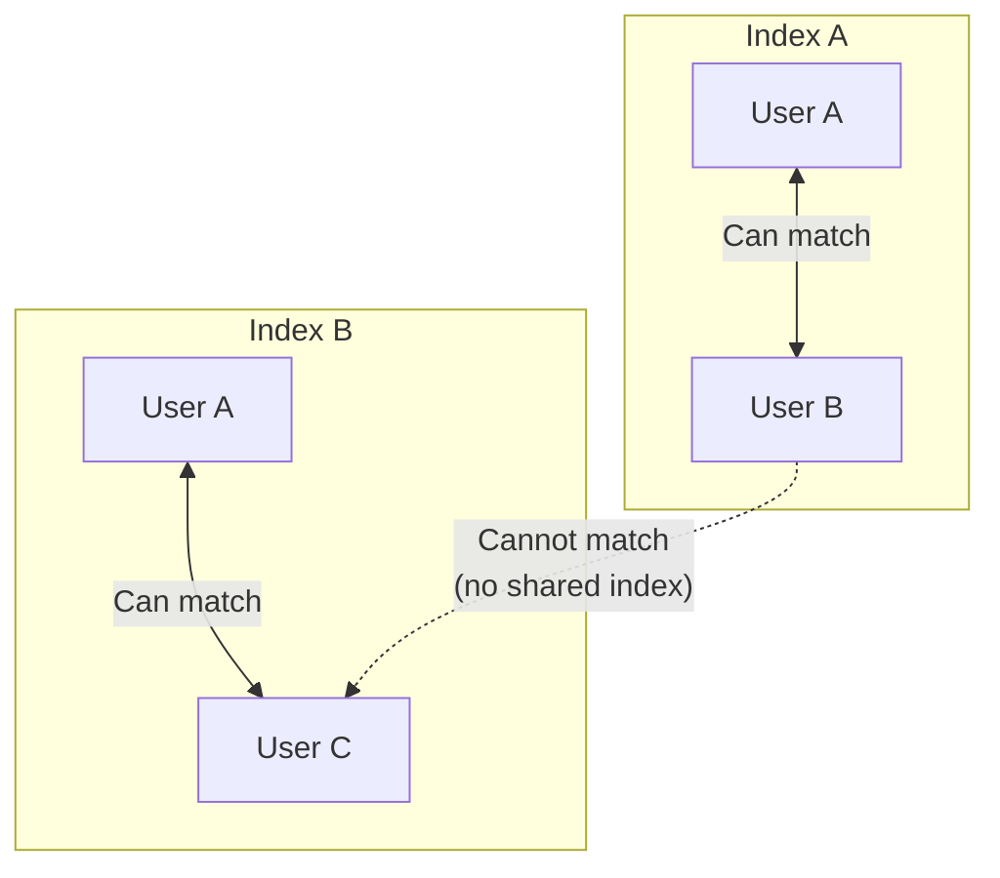

**Matching Logic**:
1. When searching for candidates, filter to users who share at least one index with the source user
2. Store the `indexId` that enabled the match (use the most relevant shared index)
3. If users share multiple indexes, prefer the index where the source intent is assigned

**Benefits**:
- Privacy: Users only see matches within their communities
- Relevance: Index context improves match quality
- Admin Control: Index owners can see opportunities within their community

---

### 12.4 Notification Strategy

**Decision**: Different strategies for different channels.

| Channel | Strategy | Trigger |
|---------|----------|---------|
| **Website/In-App** | Immediate | `onOpportunityCreated` event |
| **Email** | Batched | Daily digest OR when reaching 10 unviewed opportunities (whichever comes first) |

**Email Batching Logic**:

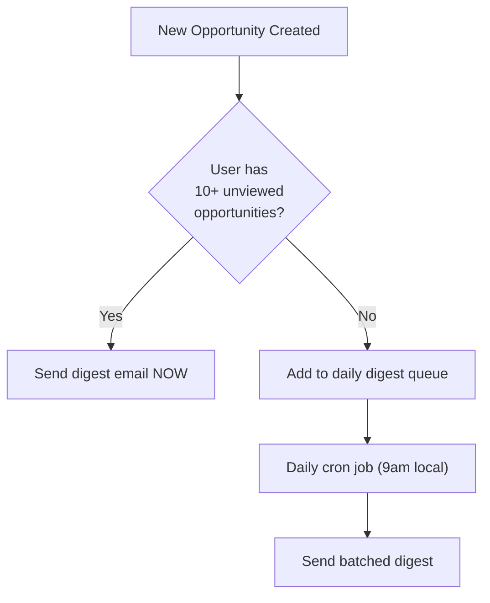

**Configuration**: Users can override in notification settings:
- `emailFrequency`: 'immediate' | 'daily' | 'weekly' | 'never'
- Dynamic threshold (10) could also be configurable per user

---

### 12.5 Rate Limiting (Open)

**Status**: Still open for discussion.

Options:
1. **Hard cap**: Max N opportunities created per user per day (e.g., 50)
2. **Score threshold**: Only persist opportunities above a minimum score (e.g., 70)
3. **Diminishing returns**: Reduce search limit after N opportunities found
4. **No limit**: Let the system find all matches, rely on UI pagination

**Recommendation**: Start with option 2 (score threshold of 70) + option 1 (hard cap of 100/day) as a safeguard.

---

## 13. Edge Cases & Missing Considerations

### 13.1 Multi-Index Matching

**Scenario**: User A and User B share multiple indexes (e.g., "AI Founders" and "NYC Tech").

**Decision**: **Option A** — Create ONE opportunity, pick the "most relevant" index.

~~Option B: Create MULTIPLE opportunities, one per shared index~~ (rejected to avoid duplication)

**Index Selection Priority**:
1. Index where source intent is explicitly assigned (`intent_indexes`)
2. Oldest shared index (deterministic fallback)

```typescript
// Index selection priority
function selectIndexForOpportunity(
  sourceIntentId: string,
  sharedIndexIds: string[]
): string {
  // 1. Check if intent is assigned to any shared index
  const intentIndex = getIntentIndexAssignment(sourceIntentId, sharedIndexIds);
  if (intentIndex) return intentIndex;
  
  // 2. Fallback: first shared index (deterministic by sorting)
  return sharedIndexIds.sort()[0];
}
```

**Rationale**: One opportunity per user pair avoids inbox clutter and simplifies deduplication. The `indexId` reflects the context that enabled the match, not ownership.

---

### 13.2 Self-Matching Prevention

**Scenario**: User's intent could theoretically match their own profile.

**Rule**: Always exclude `source_user_id === candidate_user_id`.

```sql
-- Search filter
WHERE user_id != :sourceUserId
```

---

### 13.3 Duplicate Opportunity Prevention

**Scenarios**:
1. Same user pair matched through different intents
2. Same user pair matched at different times (refresh cycle)
3. Reciprocal: A→B and B→A created separately

**Deduplication Rules**:

| Scenario | Rule |
|----------|------|
| Same intent pair | Check `(source_intent_id, candidate_intent_id)` uniqueness |
| Same user pair, different intents | Allow multiple opportunities (different value propositions) |
| A→B vs B→A (I2I) | Prevent via functional unique index, but **preserve actual source/candidate** |
| Refresh/update | Update existing opportunity instead of creating new |

**Important**: Source/candidate semantics are preserved:
- **Source** = User whose intent triggered the graph run
- **Candidate** = User who was found as a match

We do NOT normalize the stored values. The unique index uses `LEAST/GREATEST` only for the uniqueness check, while the actual columns retain their semantic meaning.

**Unique Constraint (Functional Index)**:
```sql
-- For I2I: unique on user pair + index (order-independent for dedup only)
-- This prevents A→B if B→A already exists, but stores actual source/candidate
CREATE UNIQUE INDEX opportunities_i2i_unique 
ON opportunities (
  LEAST(source_user_id, candidate_user_id),
  GREATEST(source_user_id, candidate_user_id),
  index_id
) WHERE match_type = 'I2I';

-- For I2P: unique on intent + candidate + index
CREATE UNIQUE INDEX opportunities_i2p_unique 
ON opportunities (source_intent_id, candidate_user_id, index_id)
WHERE match_type = 'I2P';
```

**Insert Logic**:
```typescript
// Store with ACTUAL source/candidate - do NOT normalize
async function createOpportunity(opp: NewOpportunity) {
  try {
    // Insert with real source (who triggered) and candidate (who was found)
    await db.insert(opportunities).values({
      sourceUserId: opp.triggeringUserId,      // Actual source
      candidateUserId: opp.matchedUserId,      // Actual candidate
      sourceIntentId: opp.triggeringIntentId,
      candidateIntentId: opp.matchedIntentId,
      // ... other fields
    });
  } catch (e) {
    if (isUniqueViolation(e)) {
      // A→B blocked because B→A exists (or vice versa)
      // The existing opportunity already covers this pair
      log.info('Duplicate opportunity prevented', { 
        pair: [opp.triggeringUserId, opp.matchedUserId] 
      });
      return null;
    }
    throw e;
  }
}
```

**Why this matters**:
- `sourceDescription` is written FOR the source user (who triggered)
- `candidateDescription` is written FOR the candidate user (who was found)
- Swapping these would show the wrong description to each user

---

### 13.4 Incognito Intent Handling

**Current behavior**: Intents can be marked `isIncognito = true`.

**Rules for opportunities**:

| Source Intent | Candidate Intent | Behavior |
|---------------|------------------|----------|
| Incognito | Any | Create opportunity BUT mask source intent details in `candidateDescription` |
| Any | Incognito | Create opportunity BUT mask candidate intent details in `sourceDescription` |
| Incognito | Incognito | Create opportunity, both descriptions are masked |

**Masked description example**:
- Full: "Alice is looking for a React developer for her fintech startup"
- Masked: "A member is looking for technical collaboration"

---

### 13.5 Archived/Expired Intent Handling

**Rules**:

| Event | Action |
|-------|--------|
| Intent archived | Expire all opportunities where `source_intent_id` or `candidate_intent_id` = archived intent |
| Intent updated | Regenerate HyDE vectors, refresh opportunities |
| Intent expired (status=EXPIRED) | Same as archived |

**Exclusion in search**:
```sql
WHERE intents.archived_at IS NULL
  AND intents.status != 'EXPIRED'
```

---

### 13.6 Index Lifecycle Events

| Event | Action on Opportunities |
|-------|-------------------------|
| **Index deleted** | Expire all opportunities with `index_id` = deleted index |
| **Index soft-deleted** (`deleted_at` set) | Same as above |
| **User removed from index** | Expire opportunities where user is source OR candidate AND `index_id` = that index |
| **User added to index** | Trigger opportunity discovery for user's active intents in that index scope |

**Implementation**:
```typescript
// index_members delete trigger
async function onMemberRemoved(indexId: string, userId: string) {
  await db.update(opportunities)
    .set({ status: 'EXPIRED', updatedAt: new Date() })
    .where(and(
      eq(opportunities.indexId, indexId),
      or(
        eq(opportunities.sourceUserId, userId),
        eq(opportunities.candidateUserId, userId)
      ),
      ne(opportunities.status, 'EXPIRED')
    ));
}
```

---

### 13.7 Profile-Only Users (No Intents)

**Scenario**: User has a profile but no active intents.

**Behavior**:
- Can be **candidate** for I2P opportunities (others match to their profile)
- Cannot be **source** of opportunities (no intent to trigger matching)
- Their profile HyDE is still used for matching

**Data flow**:
```
User A (has intent) → Mirror HyDE → searches profiles → finds User B (profile only) → I2P opportunity
```

---

### 13.8 No-Profile Users

**Scenario**: User has intents but no profile (or profile without embedding).

**Behavior**:
- Can be **source** of I2I opportunities (intent-to-intent matching)
- Cannot be **candidate** for I2P opportunities (no profile to match)
- Can be **source** of I2P opportunities if searching for profiles

**Validation**: Skip I2P candidate search if user has no profile embedding.

---

### 13.9 Bidirectional I2I Symmetry

**Scenario**: User A's intent "Looking for investors" matches User B's intent "Looking to invest".

**Question**: Is this 1 or 2 opportunities?

**Decision**: **ONE opportunity** with symmetric descriptions.

The "source" is whoever triggered the graph run. Both users see the opportunity in their feed with their respective description:
- User A sees: "User B is looking to invest and aligns with your fundraising goal"
- User B sees: "User A is raising funds and matches your investment thesis"

**No reverse opportunity needed** because the same record serves both.

---

### 13.10 HyDE Regeneration Triggers

| Event | Regenerate HyDE? |
|-------|------------------|
| Intent created | Yes (initial generation) |
| Intent payload updated | Yes |
| Intent status changed | No |
| Intent archived | No (exclude from search instead) |
| Periodic refresh (cron) | Optional: regenerate if > 30 days old |

---

### 13.11 Status State Machine

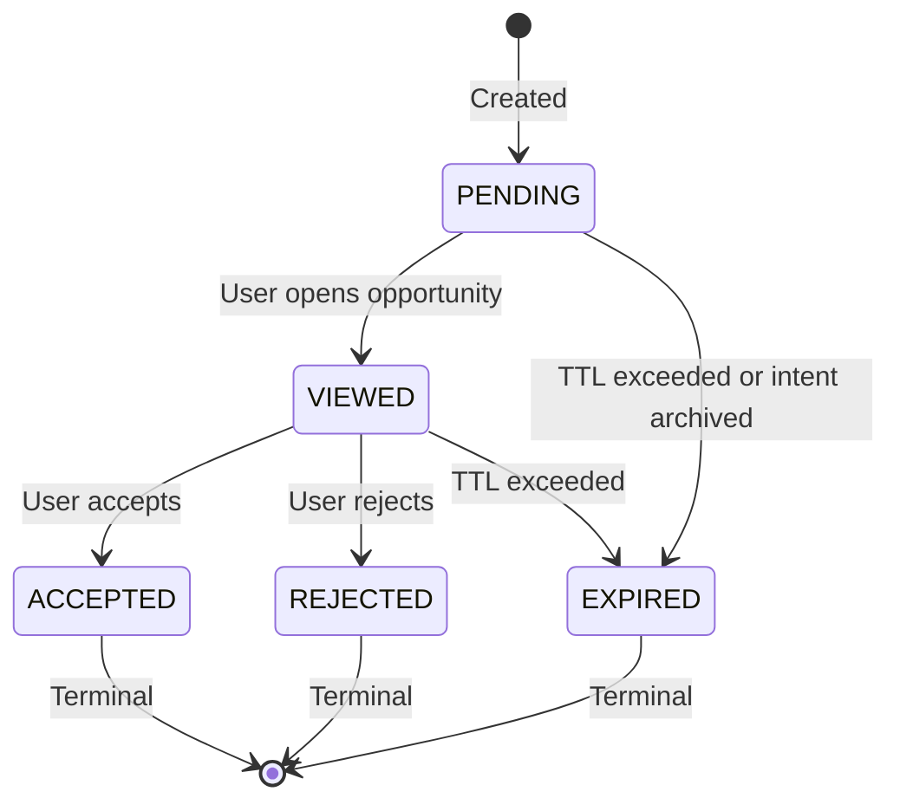

**Status Transitions**:

| From | To | Trigger |
|------|-----|---------|
| PENDING | VIEWED | `GET /opportunities/:id` by either user |
| PENDING | EXPIRED | Cron job or intent lifecycle |
| VIEWED | ACCEPTED | `PATCH /opportunities/:id/status` with `status=ACCEPTED` |
| VIEWED | REJECTED | `PATCH /opportunities/:id/status` with `status=REJECTED` |
| VIEWED | EXPIRED | Cron job |

---

### 13.12 Connection Flow Integration

**Question**: Does accepting an opportunity create a connection?

**Recommendation**: Yes, with nuance:

| Scenario | Action |
|----------|--------|
| Both users accept | Auto-create mutual connection |
| One user accepts | Create one-way connection request (like current `REQUEST` event) |
| One user rejects | No connection, opportunity closed |

**Integration point**:
```typescript
async function onOpportunityAccepted(opportunityId: string, acceptingUserId: string) {
  const opp = await getOpportunity(opportunityId);
  const otherUserId = opp.sourceUserId === acceptingUserId 
    ? opp.candidateUserId 
    : opp.sourceUserId;
  
  // Check if other user also accepted
  if (opp.status === 'ACCEPTED') {
    // Both accepted - create mutual connection
    await createMutualConnection(opp.sourceUserId, opp.candidateUserId, {
      source: 'opportunity',
      opportunityId
    });
  }
}
```

---

### 13.13 API Access Control

| Endpoint | Access Rule |
|----------|-------------|
| `GET /opportunities` | User sees opportunities where they are source OR candidate |
| `GET /opportunities/:id` | Only if user is source OR candidate |
| `PATCH /opportunities/:id/status` | Only if user is source OR candidate |
| `GET /indexes/:id/opportunities` | Index admin only |
| `DELETE /opportunities/:id` | Admin only (soft delete via EXPIRED) |

---

### 13.14 Privacy in Descriptions

**LLM Prompt Guidelines**:

```
PRIVACY RULES:
1. Do NOT include specific project names, company names, or deal terms unless public
2. Do NOT reveal exact funding amounts or salary ranges
3. Do NOT expose personal contact information
4. For incognito intents: Use generic language ("A member is seeking...")
5. Focus on the VALUE of connection, not private details
```

---

### 13.15 Performance Indexes

```sql
-- Essential indexes for index-scoped queries
CREATE INDEX idx_members_user_index ON index_members(user_id, index_id);
CREATE INDEX idx_members_index_user ON index_members(index_id, user_id);

-- For vector search with index filter (partial index)
CREATE INDEX intents_embedding_active_idx 
ON intents USING hnsw (embedding vector_cosine_ops)
WHERE archived_at IS NULL;

-- For opportunity queries
CREATE INDEX opportunities_users_status_idx 
ON opportunities(source_user_id, candidate_user_id, status);
```

---

### 13.16 Cron Jobs Required

| Job | Frequency | Action |
|-----|-----------|--------|
| `expire_opportunities` | Hourly | Set `status=EXPIRED` where `expires_at < NOW()` |
| `send_opportunity_digests` | Daily (9am local) | Batch email for users with unviewed opportunities |
| `cleanup_old_opportunities` | Weekly | Hard delete EXPIRED opportunities older than 90 days |
| `refresh_stale_hyde` | Weekly | Regenerate HyDE for intents not updated in 30+ days |

---

### 13.17 Match Type Roadmap

#### Current MVP: I2I + I2P

| Type | Source | Candidate | Trigger |
|------|--------|-----------|---------|
| **I2I** | Intent | Intent | Intent created |
| **I2P** | Intent | Profile | Intent created |

#### V2: Add P2I (Profile-to-Intent)

| Type | Source | Candidate | Trigger |
|------|--------|-----------|---------|
| **P2I** | Profile | Intent | Intent created (reverse lookup) |

P2I enables **passive discovery**—users with profiles but no intents can still receive opportunities when someone else's intent matches their profile HyDE.

See **Section 2.5** for full P2I analysis.

#### V3 (Maybe): P2P (Profile-to-Profile)

**Question**: Should we support P2P matching (profile matches profile without intents)?

**Current Decision**: No. Deprioritize.

**Rationale**:
- Intents provide **explicit signal** of what the user wants
- Profile-to-profile matching is too vague ("you both like AI" is low signal)
- No clear trigger mechanism (would need to be cron-based)
- The existing profile HyDE on `user_profiles.hyde_embedding` describes who the user wants to MEET, not who they ARE

**If needed later**: Could add `P2P` where both users' profile HyDEs are compared against each other's profile embeddings. But this is lowest priority.

---

### 13.18 Source Intent Required for I2P

**Clarification**: For I2P opportunities, `source_intent_id` IS required.

The "optional" note in the schema was misleading. Corrected understanding:

| Match Type | `source_intent_id` | `candidate_intent_id` |
|------------|--------------------|-----------------------|
| I2I | Required | Required |
| I2P | Required | NULL (candidate has profile, not intent) |

The **source** always has an intent. The **candidate** may or may not.

---

### 13.19 Intent Assigned to Multiple Indexes

**Scenario**: Intent is in `intent_indexes` for both Index A and Index B. Candidate user is in both.

**Rule**: Same as multi-index user scenario - pick one index, don't duplicate.

**Priority**:
1. Use the first shared index where the intent is assigned
2. If intent not explicitly assigned, use user membership priority

---

### 13.20 Batch Processing on User Join

**Scenario**: New user joins an index with 10 existing intents. Should we run opportunity discovery for all?

**Recommendation**: Yes, but with rate limiting:
- Queue opportunity discovery jobs for each intent
- Process with concurrency limit (e.g., 3 at a time)
- Add `last_opportunity_scan_at` to intents to track freshness

```typescript
async function onMemberAdded(indexId: string, userId: string) {
  const userIntents = await getUserActiveIntents(userId);
  
  for (const intent of userIntents) {
    await opportunityQueue.add('discover', {
      intentId: intent.id,
      triggerReason: 'member_added',
      scopeIndexId: indexId  // Only search within this new index
    }, {
      priority: 10,  // Lower priority than user-initiated actions
      delay: 1000 * userIntents.indexOf(intent)  // Stagger
    });
  }
}
```

---

### 13.21 Opportunity Refresh & Score Decay

**Question**: Do opportunity scores decay over time? Should we re-evaluate?

**Options**:
1. **No decay**: Score is fixed at creation time
2. **Soft decay**: Display score adjusted by age (frontend only)
3. **Re-evaluation**: Periodic re-run of evaluator on existing opportunities

**Recommendation**: Option 1 (no decay) for MVP. Expiration handles staleness.

**Future consideration**: Add `refreshed_at` and allow users to "refresh" an opportunity to re-evaluate with updated context.

---

### 13.22 Unanswered Design Questions

| Question | Status | Notes |
|----------|--------|-------|
| Max opportunities per user per day? | Open | Suggest: 50 (configurable per index) |
| Should opportunity acceptance notify the other party? | Likely yes | Via email and in-app |
| Can users "hide" opportunities without rejecting? | Open | Maybe add `DISMISSED` status |
| Should admins be able to manually create opportunities? | Open | Useful for curation |
| Opportunity analytics dashboard? | Future | Track acceptance rates, time-to-action |

---

## 14. Implementation Checklist

### Phase 1: Foundation
- [ ] Add HyDE columns to `intents` table (migration)
- [ ] Add `settings` JSONB column to `indexes` table (migration)
- [ ] Enhance `opportunities` table with `index_id`, `match_type`, etc. (migration)
- [ ] Add unique constraints for deduplication (I2I and I2P)
- [ ] Add performance indexes for index-scoped queries
- [ ] Create `IntentHydeGenerator` agent
- [ ] Update Drizzle schema types

### Phase 2: Core Logic
- [ ] Refactor `OpportunityGraph` with new state (including `userIndexIds`)
- [ ] Implement index-scoped candidate filtering
- [ ] Implement self-match prevention (`source_user_id !== candidate_user_id`)
- [ ] Implement normalized ordering for I2I deduplication
- [ ] Implement dual search (Mirror + Reciprocal)
- [ ] Update `OpportunityEvaluator` for I2I support
- [ ] Add incognito intent handling (masked descriptions)
- [ ] Integrate HyDE generation into intent creation flow
- [ ] Add HyDE regeneration on intent update
- [ ] Add expiration calculation from `index.settings`

### Phase 3: Lifecycle Handlers
- [ ] Implement `onIntentArchived` → expire related opportunities
- [ ] Implement `onMemberRemoved` → expire opportunities for that user+index
- [ ] Implement `onIndexDeleted` → expire all opportunities in index
- [ ] Implement `onMemberAdded` → trigger opportunity discovery
- [ ] Add status state machine validation

### Phase 4: Migration
- [ ] Build stake-to-opportunity migration script (resolve `indexId` from intent assignments)
- [ ] Handle stakes without shared index (log and skip or assign default)
- [ ] Implement dual-write mode
- [ ] Add read fallback logic
- [ ] Run migration in staging

### Phase 5: API & Notifications
- [ ] Add opportunity CRUD endpoints (with `indexId` in response)
- [ ] Add access control (user must be source or candidate)
- [ ] Add index admin endpoint for viewing all index opportunities
- [ ] Add `NotifyNode` to `OpportunityGraph` (WebSocket + queue email job)
- [ ] Add `OpportunityStatusGraph` for status updates with inline notifications
- [ ] Add email digest queue job (`check_digest_threshold`)
- [ ] Integrate connection creation in `OpportunityStatusGraph` (mutual accept)

### Phase 6: Cron Jobs
- [ ] `expire_opportunities` - hourly TTL enforcement
- [ ] `send_opportunity_digests` - daily email batch
- [ ] `cleanup_old_opportunities` - weekly hard delete (90+ days)
- [ ] `refresh_stale_hyde` - weekly HyDE regeneration

### Phase 7: Cleanup
- [ ] Remove `SemanticRelevancyBroker` references
- [ ] Drop `intent_stakes` table
- [ ] Drop `intent_stake_items` table
- [ ] Update documentation

---

## Appendix A: HyDE Prompt Templates

### Mirror HyDE (Profile Match)

```
You are a Profile Profiler.

Given a user's intent, imagine a **Hypothetical User Profile** that would be the perfect match to satisfy this intent.

Write a profile biography in **Third Person** for this ideal candidate.

The description should include:
1. **Role**: Their professional role/background
2. **Skills**: What they excel at that complements the intent
3. **Goals**: What they are pursuing that aligns with helping

**CRITICAL - COMPLEMENTARY MATCHING:**
- If the intent seeks a **Hire**, describe an **Ideal Candidate**
- If the intent seeks **Investment**, describe an **Investor**
- If the intent seeks **Mentorship**, describe a **Mentor**

Do NOT include:
- Names (use "The candidate", "They")
- Locations
- The original intent-holder's details

INTENT: {intent}
```

### Reciprocal HyDE (Intent Match)

```
You are an Intent Analyst.

Given a user's intent, write a **Complementary Intent** that represents what someone on the "other side" of this transaction would be seeking.

The output should be a natural language goal statement.

**CRITICAL - INVERSE MATCHING:**
- If the intent is "Looking for a designer" → "Seeking design projects/clients"
- If the intent is "Raising a seed round" → "Looking to invest in early-stage startups"
- If the intent is "Want to learn AI" → "Teaching/mentoring AI fundamentals"

Write a single, concise intent statement (1-2 sentences) for the complementary party.

INTENT: {intent}
```

---

## Appendix B: References

1. [HyDE Strategies Document](../src/lib/protocol/docs/HyDE%20Strategies%20for%20Explicit%20Intent%20Matching%20and%20Retrieval.md)
2. [LangChain HyDE Retriever](https://docs.langchain.com/oss/javascript/integrations/providers/all_providers) (Retrievers section)
3. [Current OpportunityGraph](../src/lib/protocol/graphs/opportunity/opportunity.graph.ts)
4. [SemanticRelevancyBroker](../src/agents/context_brokers/semantic_relevancy/index.ts) (Deprecated)
5. [LangGraph Patterns](../.cursor/rules/langgraph-patterns.mdc)
