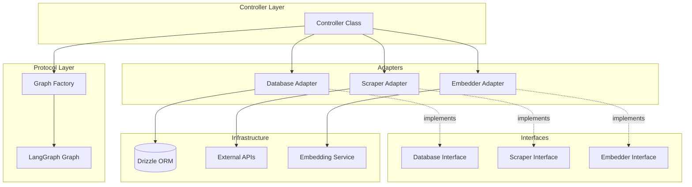

# Controller Template Guide

This document provides comprehensive guidelines for writing controller files in this project, based on patterns established in [`ProfileController`](profile.controller.ts).

## Table of Contents

1. [Architecture Overview](#architecture-overview)
2. [File Structure Conventions](#file-structure-conventions)
3. [Adapter Pattern Guidelines](#adapter-pattern-guidelines)
4. [Decorator Usage](#decorator-usage)
5. [Dependency Injection Patterns](#dependency-injection-patterns)
6. [Testing Guidelines](#testing-guidelines)
7. [Best Practices](#best-practices)

---

## Architecture Overview

Controllers in this project follow a layered architecture that separates concerns:



### Key Architectural Principles

1. **Interface-based Dependencies**: Controllers depend on interfaces, not concrete implementations
2. **Adapter Pattern**: Concrete implementations are wrapped in adapters that implement interfaces
3. **Factory Pattern**: Graph creation is delegated to factory classes
4. **Decorator-based Routing**: Routes and guards are defined via TypeScript decorators

---

## File Structure Conventions

### Naming Convention

Controller files follow the pattern: `{feature}.controller.ts`

- `profile.controller.ts` - Profile management controller
- `intent.controller.ts` - Intent handling controller
- `opportunity.controller.ts` - Opportunity management controller

### Internal File Organization

```typescript
// 1. External imports (drizzle, libraries)
import { eq } from 'drizzle-orm';
import * as schema from '../schemas/database.schema';
import db from '../lib/drizzle/drizzle';

// 2. Protocol imports (interfaces, factories, types)
import { Database } from '../lib/protocol/interfaces/database.interface';
import { Scraper } from '../lib/protocol/interfaces/scraper.interface';
import { Embedder } from '../lib/protocol/interfaces/embedder.interface';
import { SomeGraphFactory } from '../lib/protocol/graphs/some/some.graph';

// 3. --- Adapters Section ---
// Adapter implementations go here (before controller)

export class SomeDatabaseAdapter implements Database {
  // ...implementation
}

export class SomeExternalAdapter implements Scraper {
  // ...implementation
}

// 4. --- Controller Section ---
// Decorator imports
import { Controller, Post, Get, UseGuards } from '../lib/router/router.decorators';
import { AuthGuard } from '../guards/auth.guard';
import type { AuthenticatedUser } from '../guards/auth.guard';

// Controller class
@Controller('/resource-path')
export class SomeController {
  // ...implementation
}
```

---

## Adapter Pattern Guidelines

Adapters bridge the gap between external dependencies and protocol interfaces. They should be defined in the same controller file, above the controller class.

### Database Adapter Example

```typescript
import { Database } from '../lib/protocol/interfaces/database.interface';

export class DrizzleDatabaseAdapter implements Database {
  
  async getProfile(userId: string): Promise<ProfileDocument | null> {
    const result = await db.select()
      .from(schema.userProfiles)
      .where(eq(schema.userProfiles.userId, userId))
      .limit(1);

    return (result[0] as unknown as ProfileDocument) || null;
  }

  async saveProfile(userId: string, profile: ProfileDocument): Promise<void> {
    const data = {
      userId,
      identity: profile.identity,
      narrative: profile.narrative,
      attributes: profile.attributes,
      embedding: Array.isArray(profile.embedding[0]) 
        ? (profile.embedding as number[][])[0] 
        : (profile.embedding as number[]),
      updatedAt: new Date()
    };

    await db.insert(schema.userProfiles)
      .values(data)
      .onConflictDoUpdate({
        target: schema.userProfiles.userId,
        set: data
      });
  }

  async getUser(userId: string): Promise<User | null> {
    const result = await db.select()
      .from(schema.users)
      .where(eq(schema.users.id, userId))
      .limit(1);

    return result[0] || null;
  }
}
```

### External Service Adapter Example

```typescript
import { Scraper } from '../lib/protocol/interfaces/scraper.interface';
import { searchUser } from '../lib/parallel/parallel';

export class ParallelScraperAdapter implements Scraper {
  async scrape(objective: string): Promise<string> {
    try {
      const response = await searchUser({ objective });

      const formattedResults = response.results.map(r => {
        return `Title: ${r.title}\nURL: ${r.url}\nExcerpts:\n${r.excerpts.join('\n')}`;
      }).join('\n\n');

      if (!formattedResults) {
        return `No information found for objective: ${objective}`;
      }

      return `Objective: ${objective}\n\nSearch Results:\n${formattedResults}`;
    } catch (error: any) {
      console.error("ParallelScraperAdapter error:", error);
      // Graceful degradation - return partial info so flow continues
      return `Objective: ${objective}\n\n(Search failed: ${error.message})`;
    }
  }
}
```

### Adapter Best Practices

1. **Error Handling**: Always wrap external calls in try-catch and provide graceful fallbacks
2. **Type Safety**: Use type assertions carefully, preferring explicit type guards when possible
3. **Single Responsibility**: Each adapter should wrap one external dependency
4. **Export Adapters**: Export adapters for potential reuse or testing

---

## Decorator Usage

The project uses custom decorators from [`router.decorators.ts`](../lib/router/router.decorators.ts) for routing and guards.

### Available Decorators

| Decorator | Purpose | Example |
|-----------|---------|---------|
| `@Controller(path)` | Class decorator defining base route path | `@Controller('/profiles')` |
| `@Get(path)` | GET endpoint | `@Get('/:id')` |
| `@Post(path)` | POST endpoint | `@Post('/sync')` |
| `@Put(path)` | PUT endpoint | `@Put('/:id')` |
| `@Delete(path)` | DELETE endpoint | `@Delete('/:id')` |
| `@UseGuards(...guards)` | Apply authentication/validation guards | `@UseGuards(AuthGuard)` |

### Decorator Application Order

Decorators are applied bottom-up, so place them in this order:

```typescript
@Controller('/profiles')
export class ProfileController {
  
  @Post('/sync')           // 1. Route definition
  @UseGuards(AuthGuard)    // 2. Guards (applied first at runtime)
  async sync(req: Request, user: AuthenticatedUser) {
    // Method implementation
  }
}
```

### Controller Class Structure

```typescript
@Controller('/resource-name')
export class ResourceController {
  // Private dependency fields
  private db: Database;
  private embedder: Embedder;
  private scraper: Scraper;
  private factory: SomeGraphFactory;

  // Constructor initializes adapters and factory
  constructor() {
    this.db = new DrizzleDatabaseAdapter();
    this.embedder = new IndexEmbedder();
    this.scraper = new ParallelScraperAdapter();
    this.factory = new SomeGraphFactory(this.db, this.embedder, this.scraper);
  }

  /**
   * JSDoc describing the endpoint purpose
   */
  @Post('/action')
  @UseGuards(AuthGuard)
  async action(req: Request, user: AuthenticatedUser) {
    const graph = this.factory.createGraph();
    const result = await graph.invoke({ userId: user.id });
    return Response.json(result);
  }
}
```

---

## Dependency Injection Patterns

### Interface Definitions

Interfaces are defined in [`src/lib/protocol/interfaces/`](../lib/protocol/interfaces/):

```typescript
// database.interface.ts - Full interface with all possible methods
export interface Database {
  getProfile(userId: string): Promise<ProfileDocument | null>;
  saveProfile(userId: string, profile: ProfileDocument): Promise<void>;
  saveHydeProfile(userId: string, description: string, embedding: number[]): Promise<void>;
  getUser(userId: string): Promise<User | null>;
  // ... other methods for different features
}

// scraper.interface.ts
export interface Scraper {
  scrape(url: string): Promise<string>;
}

// embedder.interface.ts
export interface Embedder extends EmbeddingGenerator, VectorStore { }
```

### Interface Narrowing with Pick

**Important**: Graphs should not depend on the full `Database` interface. Instead, they should use TypeScript's `Pick` utility to require only the specific methods they need. This ensures:

1. **Minimal coupling** - Graphs only depend on what they actually use
2. **Easier testing** - Mocks only need to implement required methods
3. **Clear contracts** - Self-documenting which database operations a graph needs

#### Graph Factory Example

```typescript
// In profile.graph.ts - Define narrow interface for this specific graph
type ProfileGraphDatabase = Pick<Database, 'getProfile' | 'saveProfile' | 'getUser'>;

export class ProfileGraphFactory {
  constructor(
    private db: ProfileGraphDatabase,  // Only requires 3 methods
    private embedder: Embedder,
    private scraper: Scraper
  ) {}
  
  createGraph() {
    // Graph implementation uses only getProfile, saveProfile, getUser
  }
}
```

```typescript
// Another graph might need different methods
type HydeGraphDatabase = Pick<Database, 'getProfile' | 'saveHydeProfile'>;

export class HydeGraphFactory {
  constructor(
    private db: HydeGraphDatabase  // Only requires 2 methods
  ) {}
}
```

#### Controller Adapter Implementation

Controllers implement only the methods required by their graph factories:

```typescript
// Controller adapter - implements what the graph needs
export class DrizzleDatabaseAdapter implements Pick<Database, 'getProfile' | 'saveProfile' | 'getUser'> {
  
  async getProfile(userId: string): Promise<ProfileDocument | null> {
    // Implementation
  }

  async saveProfile(userId: string, profile: ProfileDocument): Promise<void> {
    // Implementation
  }

  async getUser(userId: string): Promise<User | null> {
    // Implementation
  }
  
  // Note: saveHydeProfile is NOT implemented here because this graph doesn't need it
}
```

### Full Interface vs Picked Interface

| Approach | Use Case |
|----------|----------|
| `Database` full interface | Shared utility classes that need all methods |
| `Pick<Database, 'method1' \| 'method2'>` | Graph factories with specific needs |
| Adapter implementing `Pick<...>` | Controllers providing minimal implementation |

### Constructor Injection Pattern

```typescript
export class ProfileController {
  private db: Pick<Database, 'getProfile' | 'saveProfile' | 'getUser'>;
  private embedder: Embedder;
  private scraper: Scraper;
  private factory: ProfileGraphFactory;

  constructor() {
    // Instantiate concrete adapters implementing only required methods
    this.db = new DrizzleDatabaseAdapter();
    this.embedder = new IndexEmbedder();
    this.scraper = new ParallelScraperAdapter();
    
    // Pass dependencies to factory
    this.factory = new ProfileGraphFactory(this.db, this.embedder, this.scraper);
  }
}
```

### Graph Factory Pattern

Factories receive dependencies and create configured graph instances:

```typescript
// In controller method
const graph = this.factory.createGraph();
const result = await graph.invoke({ userId: user.id });
```

---

## Testing Guidelines

Test files follow the pattern: `{feature}.controller.spec.ts`

### Test File Structure

```typescript
import { describe, test, expect, beforeAll, afterAll } from "bun:test";

import { config } from "dotenv";
config({ path: '.env.development', override: true });

import { SomeController } from "./some.controller";
import type { AuthenticatedUser } from "../guards/auth.guard";
import db, { closeDb } from '../lib/drizzle/drizzle';
import * as schema from '../schemas/database.schema';
import { eq } from 'drizzle-orm';

describe("SomeController Integration", () => {
  let controller: SomeController;
  let testUserId: string;

  beforeAll(async () => {
    // Setup: Create test data
  });

  afterAll(async () => {
    // Cleanup: Remove test data
    await closeDb();
  });

  test("should do something", async () => {
    // Test implementation
  }, 60000); // Timeout for long-running tests
});
```

### Setup and Teardown Pattern

```typescript
beforeAll(async () => {
  // 1. Define unique test identifiers
  const email = "test-controller@example.com";

  // 2. Clean up any existing test data (idempotent setup)
  const existingUser = await db.select()
    .from(schema.users)
    .where(eq(schema.users.email, email))
    .limit(1);

  if (existingUser.length > 0) {
    await db.delete(schema.users)
      .where(eq(schema.users.email, email));
  }

  // 3. Create fresh test data
  const [user] = await db.insert(schema.users).values({
    email: email,
    name: "Test User",
    privyId: `privy:${Date.now()}`, // Unique ID
    intro: "Test intro",
    location: "Test Location",
    socials: { x: "https://x.com/test" }
  }).returning();

  testUserId = user.id;

  // 4. Initialize controller
  controller = new SomeController();
});

afterAll(async () => {
  // Clean up test data
  if (testUserId) {
    await db.delete(schema.users)
      .where(eq(schema.users.id, testUserId));
  }
  await closeDb();
});
```

### Test Case Pattern

```typescript
test("sync should generate a profile for a new user", async () => {
  // 1. Arrange - Create mock request and user
  const mockRequest = {} as Request;
  const mockUser: AuthenticatedUser = {
    id: testUserId,
    privyId: `privy:${Date.now()}`,
    email: "test@example.com",
    name: "Test User"
  };

  // 2. Act - Execute controller method
  const result = await controller.sync(mockRequest, mockUser);

  // 3. Assert - Verify database state
  const profile = await db.select()
    .from(schema.userProfiles)
    .where(eq(schema.userProfiles.userId, testUserId));

  expect(profile.length).toBe(1);
  expect(profile[0].identity?.name).toBeDefined();
  expect(profile[0].embedding).not.toBeNull();
}, 120000); // Extended timeout for LLM/external calls
```

### Testing Idempotency

```typescript
test("sync should be idempotent (second run should just verify)", async () => {
  const mockRequest = {} as Request;
  const mockUser: AuthenticatedUser = {
    id: testUserId,
    privyId: `privy:${Date.now()}`,
    email: "test@example.com",
    name: "Test User"
  };

  const start = Date.now();
  await controller.sync(mockRequest, mockUser);
  const duration = Date.now() - start;

  // Verify state remains consistent
  const profile = await db.select()
    .from(schema.userProfiles)
    .where(eq(schema.userProfiles.userId, testUserId));
  
  expect(profile.length).toBe(1);
}, 60000);
```

### Test Timeouts

| Scenario | Recommended Timeout |
|----------|---------------------|
| Simple DB operations | Default (5000ms) |
| Single LLM call | 30000ms |
| Graph with multiple LLM calls | 60000-120000ms |
| External API integration | 60000ms |

---

## Best Practices

### 1. Response Handling

Always return proper `Response` objects:

```typescript
// Good
return Response.json(result);
return Response.json({ success: true, data: result });

// With status codes
return new Response(JSON.stringify({ error: 'Not found' }), { status: 404 });
```

### 2. Error Handling in Adapters

```typescript
async scrape(objective: string): Promise<string> {
  try {
    const response = await externalService.call(objective);
    return formatResponse(response);
  } catch (error: any) {
    console.error("Adapter error:", error);
    // Return graceful fallback - don't crash the flow
    return `Fallback response: ${error.message}`;
  }
}
```

### 3. Type Safety

```typescript
// Use explicit type imports
import type { AuthenticatedUser } from "../guards/auth.guard";

// Type guard for safe casting
function isProfileDocument(obj: unknown): obj is ProfileDocument {
  return obj !== null && typeof obj === 'object' && 'identity' in obj;
}

// Use type assertions sparingly with comments
return (result[0] as unknown as ProfileDocument) || null;
```

### 4. JSDoc Documentation

```typescript
/**
 * Syncs/Generates a profile for the given user.
 * This is the main entry point to trigger the profile graph.
 * 
 * @param req - The HTTP request object
 * @param user - The authenticated user from AuthGuard
 * @returns JSON response with graph execution result
 */
@Post('/sync')
@UseGuards(AuthGuard)
async sync(req: Request, user: AuthenticatedUser) {
  // Implementation
}
```

### 5. Guard Usage

```typescript
// AuthGuard provides AuthenticatedUser as second parameter
@UseGuards(AuthGuard)
async protectedMethod(req: Request, user: AuthenticatedUser) {
  // user is guaranteed to be authenticated
  const userId = user.id;
}
```

### 6. Graph Integration

```typescript
// Create graph instance per request
const graph = this.factory.createGraph();

// Invoke with initial state
const result = await graph.invoke({ userId: user.id });

// Return result
return Response.json(result);
```

---

## Quick Reference: Creating a New Controller

1. **Create file**: `src/controllers/{feature}.controller.ts`
2. **Define adapters** for each external dependency
3. **Import interfaces** from `src/lib/protocol/interfaces/`
4. **Create controller class** with `@Controller` decorator
5. **Define methods** with route decorators and guards
6. **Initialize factory** in constructor with adapters
7. **Create test file**: `src/controllers/{feature}.controller.spec.ts`
8. **Write integration tests** with proper setup/teardown

### Minimal Controller Template

```typescript
import { eq } from 'drizzle-orm';
import * as schema from '../schemas/database.schema';
import db from '../lib/drizzle/drizzle';
import { Database } from '../lib/protocol/interfaces/database.interface';
import { SomeGraphFactory } from '../lib/protocol/graphs/some/some.graph';

// --- Adapters ---

export class DrizzleDatabaseAdapter implements Database {
  // Implement interface methods
}

// --- Controller ---

import { Controller, Post, UseGuards } from '../lib/router/router.decorators';
import { AuthGuard } from '../guards/auth.guard';
import type { AuthenticatedUser } from '../guards/auth.guard';

@Controller('/features')
export class FeatureController {
  private db: Database;
  private factory: SomeGraphFactory;

  constructor() {
    this.db = new DrizzleDatabaseAdapter();
    this.factory = new SomeGraphFactory(this.db);
  }

  @Post('/action')
  @UseGuards(AuthGuard)
  async action(req: Request, user: AuthenticatedUser) {
    const graph = this.factory.createGraph();
    const result = await graph.invoke({ userId: user.id });
    return Response.json(result);
  }
}
```
