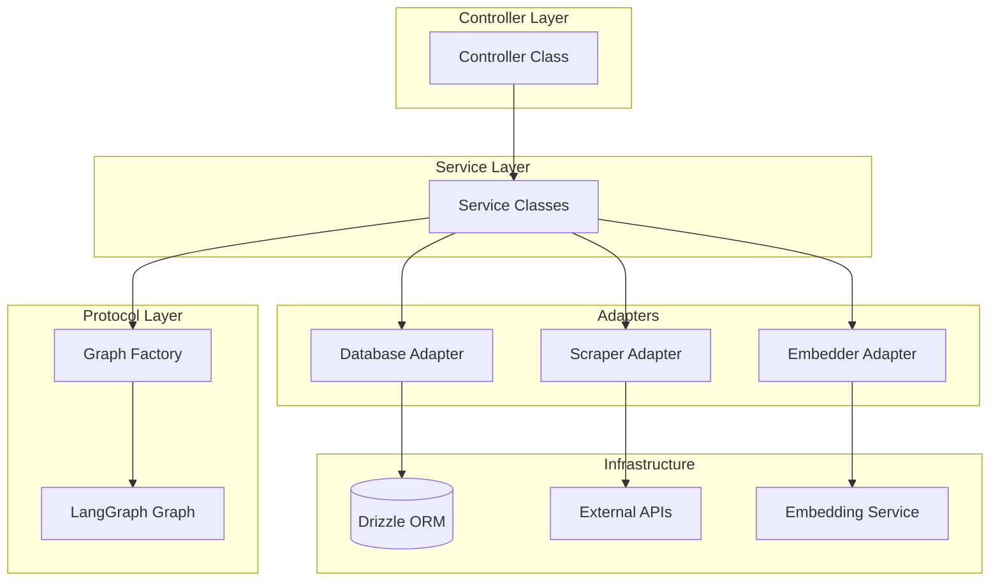

# Controller Template Guide

This document provides comprehensive guidelines for writing controller files in this project, based on patterns established in [`ProfileController`](profile.controller.ts).

## Table of Contents

1. [Architecture Overview](#architecture-overview)
2. [File Structure Conventions](#file-structure-conventions)
3. [Adapter Pattern Guidelines](#adapter-pattern-guidelines)
4. [Decorator Usage](#decorator-usage)
5. [Dependency Injection Patterns](#dependency-injection-patterns)
6. [Testing Guidelines](#testing-guidelines)
7. [Best Practices](#best-practices)

---

## Architecture Overview

Controllers in this project follow a layered architecture that separates concerns:



### Key Architectural Principles

1. **Controllers use services only**: Controllers MUST use services for all data and orchestration; they MUST NOT import adapters or `db`/schema.
2. **Services use adapters**: Services are the only layer that import and use adapters (and thus access the database or external APIs via adapters).
3. **Tests use services only**: Controller spec files MUST use services for setup, teardown, and assertions; they MUST NOT import adapters or `db`/schema.
4. **Adapter pattern**: Adapters live in `src/adapters/`, implement protocol interfaces, and are used only inside services (and optionally passed through to graph factories by services).
5. **No direct DB in controllers or tests**: Neither controllers nor their tests import `db`, schema, or Drizzle operators.
6. **Decorator-based routing**: Routes and guards are defined via TypeScript decorators.

### Layering Summary

| Layer        | Imports / uses                    | Must NOT import        |
|-------------|------------------------------------|-------------------------|
| Controllers | Services, decorators, guards, log | Adapters, `db`, schema  |
| Services    | Adapters, protocol factories       | (nothing forbidden)     |
| Tests       | Services, controller under test   | Adapters, `db`, schema  |

**Example (controller using only services):**
```typescript
// Controller uses only services (no adapter imports)
export class ChatController {
  constructor() {
    // No adapters here; services are used directly
  }

  async getSessions(req: Request, user: AuthenticatedUser) {
    const sessions = await chatSessionService.getUserSessions(user.id);
    return Response.json({ sessions });
  }

  async processMessage(req: Request, user: AuthenticatedUser) {
    // Service runs the graph internally (service uses adapters + factory)
    const result = await chatService.processMessage(user.id, body);
    return Response.json(result);
  }
}
```

Services internally instantiate adapters and graph factories and perform all DB/external access.

---

## File Structure Conventions

### Naming Convention

Controller files follow the pattern: `{feature}.controller.ts`

- `profile.controller.ts` - Profile management controller
- `intent.controller.ts` - Intent handling controller
- `opportunity.controller.ts` - Opportunity management controller

### Internal File Organization

```typescript
// 1. Service imports (controllers use only services)
import { userService } from '../services/user.service';
import { fileService } from '../services/file.service';
import { someFeatureService } from '../services/some-feature.service';

// 2. Decorator imports
import { Controller, Post, Get, UseGuards } from '../lib/router/router.decorators';
import { AuthGuard } from '../guards/auth.guard';
import type { AuthenticatedUser } from '../guards/auth.guard';

// 3. Logging
import { log } from '../lib/log';
const logger = log.controller.from('feature');

// 4. Controller class (no adapter or db/schema imports)
@Controller('/resource-path')
export class SomeController {
  @Get('/:id')
  @UseGuards(AuthGuard)
  async getData(req: Request, user: AuthenticatedUser, params?: RouteParams) {
    const data = await userService.findById(params?.id);
    return Response.json(data);
  }

  @Post('/process')
  @UseGuards(AuthGuard)
  async process(req: Request, user: AuthenticatedUser) {
    const result = await someFeatureService.process(user.id, body);
    return Response.json(result);
  }
}
```

### CRITICAL RULES

**Controllers MUST NOT:**
- Import `db` from `../lib/drizzle/drizzle`
- Import adapters from `../adapters/`
- Import Drizzle operators (`eq`, `and`, `desc`, etc.)
- Import schema directly (`../schemas/database.schema`)
- Perform direct database queries

**Controllers MUST:**
- Use **services** for all data operations and for any logic that involves graphs/adapters
- Handle HTTP concerns (parsing, validation, response formatting)
- Delegate all business logic to services

**Controller spec files** must follow the same principle: use **services** for setup, teardown, and assertions (not adapters or `db`/schema). See [Testing Guidelines](#testing-guidelines).

**Services** are the only layer that import and use adapters (and thus access the database or external systems).

If some controllers or specs still import adapters directly, treat that as technical debt: the target state is controllers and tests using services only, with adapters confined to services.

---

## Adapter Pattern Guidelines (for Services)

Adapters bridge the gap between external dependencies and protocol interfaces. They are defined in `src/adapters/` and are **imported and used only by services** (never by controllers or by controller tests).

### Who Uses Adapters

- **Services** import adapters, instantiate them, and use them for all database and external API access. Services may also pass adapters to graph factories when orchestrating protocol-layer flows.
- **Controllers** do not import or use adapters; they call services only.
- **Controller tests** do not import or use adapters; they use services for setup, teardown, and assertions.

### When to Create New Adapters

Create adapters in `src/adapters/` when:
- A new protocol interface needs implementation
- A graph requires a different database interface subset
- Integrating a new external service (scraper, embedder, cache)

### Using Adapters in Services

Services import and use adapters; controllers do not:

```typescript
// In a service (e.g. profile.service.ts)
import { UserDatabaseAdapter, ProfileDatabaseAdapter } from '../adapters/database.adapter';
import { ProfileGraphFactory } from '../lib/protocol/graphs/profile/profile.graph';

const userAdapter = new UserDatabaseAdapter();
const profileAdapter = new ProfileDatabaseAdapter();

export async function syncProfile(userId: string) {
  const factory = new ProfileGraphFactory(profileAdapter, embedderAdapter, scraperAdapter);
  const graph = factory.createGraph();
  return graph.invoke({ userId });
}
```

### Available Adapters

| Adapter | Interface | Purpose |
|---------|-----------|---------|
| `ChatDatabaseAdapter` | `ChatGraphCompositeDatabase` | Chat graph database operations |
| `IntentDatabaseAdapter` | `IntentGraphDatabase` | Intent graph database operations |
| `UserDatabaseAdapter` | — | User CRUD, findByEmail, create, deleteById |
| `ProfileDatabaseAdapter` | — | Profile CRUD, getProfileRow |
| `FileDatabaseAdapter` | — | File CRUD, deleteByUserId, getByIdUnscoped |
| `EmbedderAdapter` | `Embedder` | Vector embeddings generation and search |
| `ScraperAdapter` | `Scraper` | Web scraping and data extraction |
| `RedisCacheAdapter` | `HydeCache` | Redis-backed caching for HyDE |

### Adapter Best Practices

1. **Only services import adapters**: Controllers and tests depend on services, not adapters.
2. **Reuse existing adapters**: Check `src/adapters/` before creating new ones.
3. **Services expose what tests need**: For controller tests to use services only, services must expose the operations needed for setup/teardown/assertions (e.g. create user, delete by email, get profile row).

---

## Decorator Usage

The project uses custom decorators from [`router.decorators.ts`](../lib/router/router.decorators.ts) for routing and guards.

### Available Decorators

| Decorator | Purpose | Example |
|-----------|---------|---------|
| `@Controller(path)` | Class decorator defining base route path | `@Controller('/profiles')` |
| `@Get(path)` | GET endpoint | `@Get('/:id')` |
| `@Post(path)` | POST endpoint | `@Post('/sync')` |
| `@Put(path)` | PUT endpoint | `@Put('/:id')` |
| `@Delete(path)` | DELETE endpoint | `@Delete('/:id')` |
| `@UseGuards(...guards)` | Apply authentication/validation guards | `@UseGuards(AuthGuard)` |

### Decorator Application Order

Decorators are applied bottom-up, so place them in this order:

```typescript
@Controller('/profiles')
export class ProfileController {
  
  @Post('/sync')           // 1. Route definition
  @UseGuards(AuthGuard)    // 2. Guards (applied first at runtime)
  async sync(req: Request, user: AuthenticatedUser) {
    // Method implementation
  }
}
```

### Controller Class Structure

```typescript
@Controller('/resource-name')
export class ResourceController {
  // Private dependency fields
  private db: Database;
  private embedder: Embedder;
  private scraper: Scraper;
  private factory: SomeGraphFactory;

  // Constructor initializes adapters and factory
  constructor() {
    this.db = new DrizzleDatabaseAdapter();
    this.embedder = new IndexEmbedder();
    this.scraper = new ParallelScraperAdapter();
    this.factory = new SomeGraphFactory(this.db, this.embedder, this.scraper);
  }

  /**
   * JSDoc describing the endpoint purpose
   */
  @Post('/action')
  @UseGuards(AuthGuard)
  async action(req: Request, user: AuthenticatedUser) {
    const graph = this.factory.createGraph();
    const result = await graph.invoke({ userId: user.id });
    return Response.json(result);
  }
}
```

---

## Dependency Injection Patterns

### Interface Definitions

Interfaces are defined in [`src/lib/protocol/interfaces/`](../lib/protocol/interfaces/):

```typescript
// database.interface.ts - Full interface with all possible methods
export interface Database {
  getProfile(userId: string): Promise<ProfileDocument | null>;
  saveProfile(userId: string, profile: ProfileDocument): Promise<void>;
  saveHydeProfile(userId: string, description: string, embedding: number[]): Promise<void>;
  getUser(userId: string): Promise<User | null>;
  // ... other methods for different features
}

// scraper.interface.ts
export interface Scraper {
  scrape(url: string): Promise<string>;
}

// embedder.interface.ts
export interface Embedder extends EmbeddingGenerator, VectorStore { }
```

### Interface Narrowing with Pick

**Important**: Graphs should not depend on the full `Database` interface. Instead, they should use TypeScript's `Pick` utility to require only the specific methods they need. This ensures:

1. **Minimal coupling** - Graphs only depend on what they actually use
2. **Easier testing** - Mocks only need to implement required methods
3. **Clear contracts** - Self-documenting which database operations a graph needs

#### Graph Factory Example

```typescript
// In profile.graph.ts - Define narrow interface for this specific graph
type ProfileGraphDatabase = Pick<Database, 'getProfile' | 'saveProfile' | 'getUser'>;

export class ProfileGraphFactory {
  constructor(
    private db: ProfileGraphDatabase,  // Only requires 3 methods
    private embedder: Embedder,
    private scraper: Scraper
  ) {}
  
  createGraph() {
    // Graph implementation uses only getProfile, saveProfile, getUser
  }
}
```

```typescript
// Another graph might need different methods
type HydeGraphDatabase = Pick<Database, 'getProfile' | 'saveHydeProfile'>;

export class HydeGraphFactory {
  constructor(
    private db: HydeGraphDatabase  // Only requires 2 methods
  ) {}
}
```

#### Adapter Implementation (used by services)

Adapters in `src/adapters/` implement protocol interfaces. Services instantiate and use them; controllers do not.

```typescript
// In src/adapters/database.adapter.ts - implements what the graph needs
export class ProfileDatabaseAdapter implements Pick<Database, 'getProfile' | 'saveProfile' | 'getUser'> {
  async getProfile(userId: string): Promise<ProfileDocument | null> { /* ... */ }
  async saveProfile(userId: string, profile: ProfileDocument): Promise<void> { /* ... */ }
  async getUser(userId: string): Promise<User | null> { /* ... */ }
}
```

### Full Interface vs Picked Interface

| Approach | Use Case |
|----------|----------|
| `Database` full interface | Shared utility classes that need all methods |
| `Pick<Database, 'method1' \| 'method2'>` | Graph factories with specific needs |
| Adapter implementing `Pick<...>` | Used by services; never imported by controllers |

### Controller Uses Services Only

Controllers do not inject or instantiate adapters. They call services, which own adapter and factory usage:

```typescript
export class ProfileController {
  @Post('/sync')
  @UseGuards(AuthGuard)
  async sync(req: Request, user: AuthenticatedUser) {
    const result = await profileService.sync(user.id);
    return Response.json(result);
  }
}

// profile.service.ts (not the controller) instantiates adapters and factory
export async function sync(userId: string) {
  const db = new ProfileDatabaseAdapter();
  const factory = new ProfileGraphFactory(db, embedder, scraper);
  const graph = factory.createGraph();
  return graph.invoke({ userId });
}
```

### Graph Factory Pattern

Factories receive dependencies and create configured graph instances:

```typescript
// In controller method
const graph = this.factory.createGraph();
const result = await graph.invoke({ userId: user.id });
```

---

## Testing Guidelines

Test files follow the pattern: `{feature}.controller.spec.ts`.

### CRITICAL: Specs Use Services Only

**Controller spec files MUST NOT:**
- Import `db` from `../lib/drizzle/drizzle`
- Import `schema` from `../schemas/database.schema`
- Import **adapters** from `../adapters/`
- Import Drizzle operators (`eq`, `and`, `desc`, etc.)
- Call `closeDb()` in `afterAll` (multiple spec files run in the same process and share the connection)

**Controller spec files MUST:**
- Use **services** for all setup, teardown, and assertions (same as controllers: no direct adapter or db access)
- Rely on service APIs that expose the operations tests need (e.g. create test user, delete by email, get profile for assertion)

**Services** are the only layer that import adapters; they must expose whatever controller tests need for test data and assertions (e.g. `userService.findByEmail`, `userService.createTestUser`, `profileService.getProfileRow`, cleanup helpers). This keeps controllers and their tests aligned: both use only services.

### Test File Structure

```typescript
import { describe, test, expect, beforeAll, afterAll } from "bun:test";

import { config } from "dotenv";
config({ path: '.env.test' });

import { SomeController } from "./some.controller";
import type { AuthenticatedUser } from "../guards/auth.guard";
import { userService } from "../services/user.service";
import { profileService } from "../services/profile.service";

describe("SomeController Integration", () => {
  let controller: SomeController;
  let testUserId: string;

  beforeAll(async () => {
    // Setup via services (see pattern below)
  });

  afterAll(async () => {
    // Cleanup via services; do NOT call closeDb()
  });

  test("should do something", async () => {
    // Test implementation
  }, 60000);
});
```

### Setup and Teardown Pattern (Services)

Services must expose the operations tests need (e.g. for test users and profiles). Then specs use only those services:

```typescript
beforeAll(async () => {
  const email = "test-controller@example.com";

  const existingUser = await userService.findByEmail(email);
  if (existingUser) {
    await profileService.deleteByUserId(existingUser.id);
    await userService.deleteByEmail(email);
  }

  const user = await userService.createTestUser({
    email,
    name: "Test User",
    privyId: `privy:${Date.now()}`,
    intro: "Test intro",
    location: "Test Location",
    socials: { x: "https://x.com/test" },
  });
  testUserId = user.id;

  controller = new SomeController();
});

afterAll(async () => {
  if (testUserId) {
    await profileService.deleteByUserId(testUserId);
    await userService.deleteById(testUserId);
  }
  // Do not close db: other integration specs may run in the same process.
});
```

### Test Case Pattern (Assert via Services)

```typescript
test("sync should generate a profile for a new user", async () => {
  const mockRequest = {} as Request;
  const mockUser: AuthenticatedUser = {
    id: testUserId,
    privyId: `privy:${Date.now()}`,
    email: "test@example.com",
    name: "Test User"
  };

  const result = await controller.sync(mockRequest, mockUser);

  const profile = await profileService.getProfileRow(testUserId);
  expect(profile).not.toBeNull();
  expect(profile!.identity?.name).toBeDefined();
  expect(profile!.embedding).not.toBeNull();
  expect(profile!.hydeDescription).not.toBeNull();
}, 120000);
```

### Services Used in Specs

Tests call the same services the controller uses, plus any helpers services expose for test data (e.g. `createTestUser`, `findByEmail`, `deleteByEmail`, `getProfileRow`, `deleteByUserId`). Those helpers are implemented inside the service using adapters. Controllers and specs never import adapters.

### Testing Idempotency

```typescript
test("sync should be idempotent (second run should just verify)", async () => {
  const mockUser: AuthenticatedUser = { id: testUserId, privyId: `privy:${Date.now()}`, email: "test@example.com", name: "Test User" };

  await controller.sync({} as Request, mockUser);
  await controller.sync({} as Request, mockUser);

  const profile = await profileService.getProfileRow(testUserId);
  expect(profile).not.toBeNull();
}, 60000);
```

### Test Timeouts

| Scenario | Recommended Timeout |
|----------|---------------------|
| Simple DB operations | Default (5000ms) |
| Single LLM call | 30000ms |
| Graph with multiple LLM calls | 60000-120000ms |
| External API integration | 60000ms |

---

## Best Practices

### 1. Response Handling

Always return proper `Response` objects:

```typescript
// Good
return Response.json(result);
return Response.json({ success: true, data: result });

// With status codes
return new Response(JSON.stringify({ error: 'Not found' }), { status: 404 });
```

### 2. Error Handling in Adapters

```typescript
async scrape(objective: string): Promise<string> {
  try {
    const response = await externalService.call(objective);
    return formatResponse(response);
  } catch (error: any) {
    console.error("Adapter error:", error);
    // Return graceful fallback - don't crash the flow
    return `Fallback response: ${error.message}`;
  }
}
```

### 3. Type Safety

```typescript
// Use explicit type imports
import type { AuthenticatedUser } from "../guards/auth.guard";

// Type guard for safe casting
function isProfileDocument(obj: unknown): obj is ProfileDocument {
  return obj !== null && typeof obj === 'object' && 'identity' in obj;
}

// Use type assertions sparingly with comments
return (result[0] as unknown as ProfileDocument) || null;
```

### 4. JSDoc Documentation

```typescript
/**
 * Syncs/Generates a profile for the given user.
 * This is the main entry point to trigger the profile graph.
 * 
 * @param req - The HTTP request object
 * @param user - The authenticated user from AuthGuard
 * @returns JSON response with graph execution result
 */
@Post('/sync')
@UseGuards(AuthGuard)
async sync(req: Request, user: AuthenticatedUser) {
  // Implementation
}
```

### 5. Guard Usage

```typescript
// AuthGuard provides AuthenticatedUser as second parameter
@UseGuards(AuthGuard)
async protectedMethod(req: Request, user: AuthenticatedUser) {
  // user is guaranteed to be authenticated
  const userId = user.id;
}
```

### 6. Graph Integration

```typescript
// Create graph instance per request
const graph = this.factory.createGraph();

// Invoke with initial state
const result = await graph.invoke({ userId: user.id });

// Return result
return Response.json(result);
```

---

## Quick Reference: Creating a New Controller

1. **Create file**: `src/controllers/{feature}.controller.ts`
2. **Use services only** in the controller (no adapter or `db`/schema imports)
3. **Ensure services** for this feature exist and import/use adapters internally
4. **Create controller class** with `@Controller` decorator
5. **Define methods** with route decorators and guards; call services for all logic
6. **Create test file**: `src/controllers/{feature}.controller.spec.ts`
7. **Write integration tests** using **services only** (no adapters, no `db`/schema); services must expose any helpers tests need for setup, teardown, and assertions

### Minimal Controller Template

```typescript
// Service imports only (no adapters, no db/schema)
import { userService } from '../services/user.service';
import { featureService } from '../services/feature.service';

// Routing imports
import { Controller, Get, Post, UseGuards } from '../lib/router/router.decorators';
import { AuthGuard } from '../guards/auth.guard';
import type { AuthenticatedUser } from '../guards/auth.guard';

// Logging
import { log } from '../lib/log';
const logger = log.controller.from('feature');

@Controller('/features')
export class FeatureController {
  @Get('/:id')
  @UseGuards(AuthGuard)
  async get(req: Request, user: AuthenticatedUser, params?: RouteParams) {
    const feature = await featureService.getById(params?.id);
    if (!feature) {
      return new Response(JSON.stringify({ error: 'Not found' }), { status: 404 });
    }
    return Response.json(feature);
  }

  @Post('/process')
  @UseGuards(AuthGuard)
  async process(req: Request, user: AuthenticatedUser) {
    logger.info('Processing feature', { userId: user.id });
    const result = await featureService.process(user.id, body);
    return Response.json(result);
  }
}
```

The corresponding **service** (e.g. `feature.service.ts`) imports adapters and graph factories and implements `getById`, `process`, etc.
