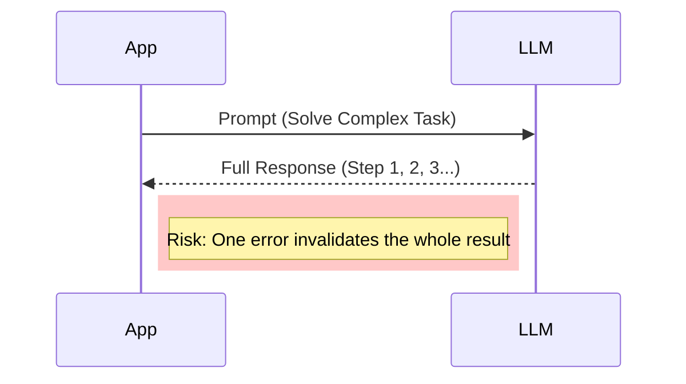
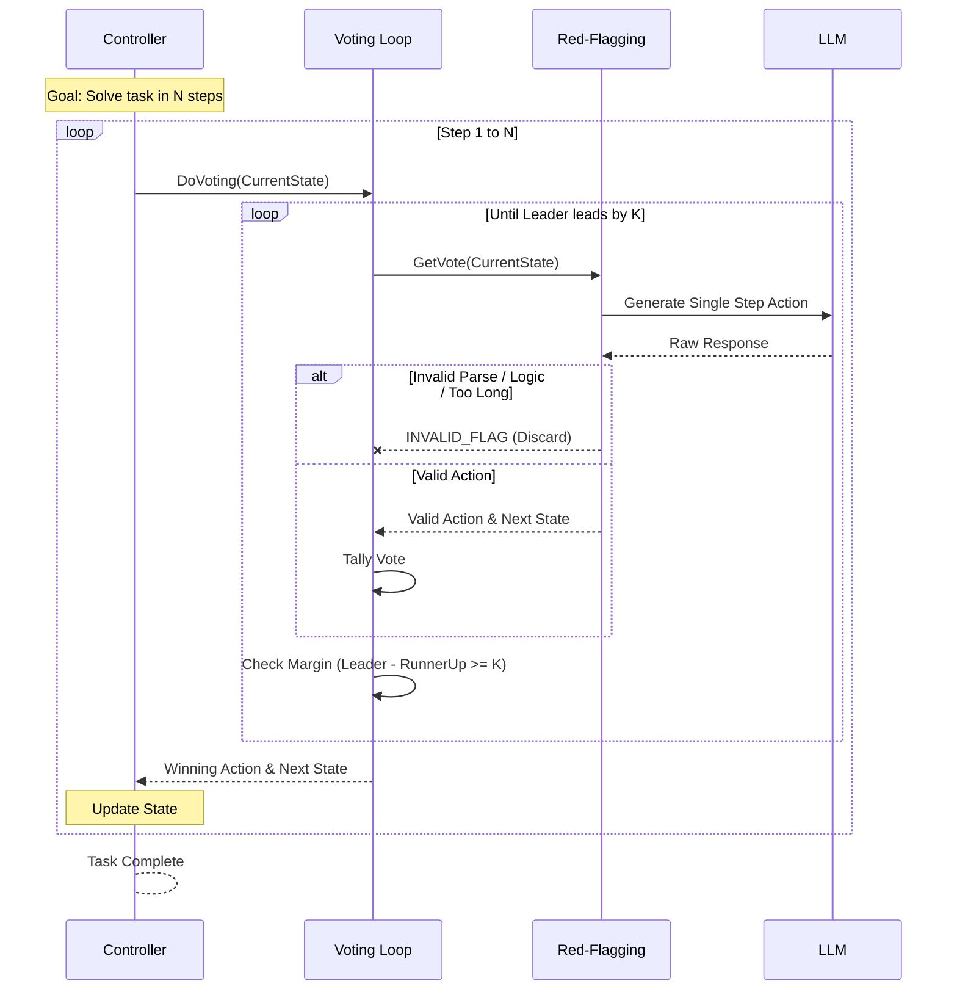

# MAKER Framework Explanation

This document explains the MAKER (Maximal Agentic decomposition, first-to-ahead-by-K Error correction, and Red-flagging) framework and compares it with standard direct LLM calls.

## Standard Direct LLM Call

In a standard approach, a complex task is often sent to an LLM in a single prompt or a simple chain. If the model hallucinates or makes a logic error early on, the entire process can fail or compound the error.



## MAKER Framework

The MAKER framework breaks the task into atomic steps (`Maximal Agentic Decomposition`). For *each* step, it uses a robust voting mechanism (`First-to-ahead-by-K`) and strict validation (`Red-Flagging`) to ensure accuracy before moving to the next step.

### Key Components

1.  **Red-Flagging**: Immediate rejection of "bad" samples (parse errors, invalid logic, too verbose).
2.  **Voting**: Repeated sampling until one action leads the runner-up by margin $k$.
3.  **Decomposition**: The "Controller" manages the state and executes one step at a time.

### Sequence Diagram



## Comparison

| Feature | Direct LLM Call | MAKER Framework |
| :--- | :--- | :--- |
| **Granularity** | Single prompt for whole task (or large chunks) | Atomic single-step prompts |
| **Error Handling** | Post-processing fixes or retry whole request | Discards individual bad samples (Red-Flagging) |
| **Reliability** | Variable; prone to compounding errors | High; statistical guarantee via Voting |
| **Cost/Latency** | Low (1 call) | High (Multiple calls per step until consensus) |
| **Use Case** | Summaries, creative writing, simple QA | Long-horizon tasks, precise logic, code generation |
| **Use Case** | Summaries, creative writing, simple QA | Long-horizon tasks, precise logic, code generation |

## Strategic Usage in Protocol Agents

The agents in `src/agents` (e.g., `intent_freshness_auditor`, `intent_indexer`) often perform autonomous actions that modify system state or database records. MAKER should be deployed in these high-stakes contexts to prevent "hallucination-induced" data corruption.

### Why use it here?

1.  **Critical State Decisions (`intent_freshness_auditor`)**:
    *   **Problem**: If a standard LLM call hallucinates that a valid intent is "expired", we effectively delete user data.
    *   **MAKER Solution**: Use **Voting** (`k_margin=1` or `2`). We only archive an intent if multiple independent generations *agree* it is expired. This reduces false positives to near zero.

2.  **Complex Data Extraction (`intent_indexer`, `intent_tag_suggester`)**:
    *   **Problem**: Extracting tags or indexing data often fails when the model outputs invalid JSON or misses the schema.
    *   **MAKER Solution**: Use **Red-Flagging**. If the output is invalid JSON or misses required fields, MAKER immediately discards it and retries, ensuring the downstream code receives strictly valid data.

3.  **Step-by-Step Reasoning (`intent_inferrer`)**:
    *   **Problem**: Inferring complex user needs might require "thinking" steps (Context -> Analysis -> Suggestion). A single prompt often conflates these, leading to shallow suggestions.
    *   **MAKER Solution**: Use **Decomposition**. Process `Analysis` as Step 1, validation of analysis as Step 2, and `Suggestion` as Step 3.

### How to Apply

**Don't** use MAKER for simple chat responses or low-latency UI features (it's too slow).
**Do** use MAKER for background workers, cron jobs, and asynchronous processing.

### Case Study: High-Reliability Intent Freshness Auditing

The `IntentFreshnessAuditor` agent (in `src/agents/core/intent_freshness_auditor`) is responsible for archiving expired user intents. This is a destructive action: false positives mean deleting valid user data.

#### The Problem: Single-Shot Vulnerability

Currently, the auditor makes a single `traceableStructuredLlm` call:
```typescript
// Current risk: Single point of failure
const result = await freshnessCall(...);
if (result.isExpired && result.confidence > 70) {
  await archiveIntent(); // <--- Destructive action based on one roll of the dice
}
```
If the model hallucinates a date (e.g., thinking "December 2025" is in the past) or misinterprets "looking for work" as "hired", valid intents are permanently hidden.

#### The Solution: MAKER Integration

We can wrap this logic in MAKER to require **consensus** before destruction.

**1. Define the Protocol:**
   - **State**: The intent data + current vote tally.
   - **Action**: `VOTE_EXPIRED` or `VOTE_ACTIVE`.
   - **Voting**: Continue asking the model until one verdict leads by `k=2`.

**2. Configuration:**
```typescript
const freshnessConfig: MakerConfig<AuditState, VoteAction> = {
  modelPreset: 'openai/gpt-4o',
  k_margin: 2, // Vital: We need 2 MORE votes for 'expired' than 'active' to proceed.
               // e.g., 2-0 (consensus) or 3-1 (strong majority). 1-0 is NOT enough.
  
  createPrompt: (state) => {
    // We send the SAME prompt each time. 
    // We rely on the non-zero temperature (handled by MAKER) to sample the distribution.
    return `Analyze expiration for: "${state.intentPayload}"...`;
  },
  
  parseOutput: (res) => {
    // Simple parsing logic...
    return { action: res.verdict, nextState: state };
  },
  
  isValidLogic: (action) => true
};
```

**3. The Result:**
   - If the model is unsure (sometimes says Active, sometimes Expired), the margin `k=2` will effectively **stall** or require many votes to settle.
   - We can interpret "failure to converge" as "keep the intent active" (safe default).
   - We ONLY archive when the model is consistently, repeatedly sure that the intent is expired.

#### Cost Optimization: The Small Model Strategy

Because MAKER relies on **consensus** rather than individual brilliance, it may be possible to downgrade the model (e.g., from GPT-4o to GPT-4o-mini or Haiku) without losing reliability. The voting mechanism helps filter out the "noise" of cheaper models, potentially allowing us to achieve high safety at a fraction of the cost.

#### Theoretical Impact Analysis

| Metric | Single Call (Big Model) | MAKER (Big Model) | MAKER (Small Model) |
| :--- | :--- | :--- | :--- |
| **Model** | GPT-4o / Sonnet | GPT-4o / Sonnet | GPT-4o-mini / Haiku |
| **Est. False Positive Rate** | ~3-5% (Random errors) | < 0.01% (Max Safety) | < 0.5% (High Safety) |
| **Est. Cost** | 100% (Baseline) | ~250% | **~5-10% (Dirt Cheap)** |
| **Est. Latency** | ~2s | ~6s | **~2-3s (Fast)** |
| **Outcome** | Risky for critical data | Overkill for some tasks | **Sweet Spot for Agents** |

*Note: These figures are theoretical estimates. Actual performance depends on the specific task complexity and the quality of the smaller model's reasoning in the domain.*

## Implementation Example

1. **Import the module**:
   ```typescript
   import { makerSolve, MakerConfig } from '../../lib/maker'; // Adjust relative path as needed
   ```

2. **Define State and Action**:
   Define the domain-specific atomic steps.
   ```typescript
   interface MyAgentState {
     context: string;
     accumulatedData: string[];
   }
   
   interface MyAgentAction {
     type: 'QUERY_DB' | 'PROCESS_DATA' | 'FINALIZE';
     payload: string;
   }
   ```

3. **Configure and Solve**:
   Wrap the solver in your agent function.
   ```typescript
   export async function runComplexTask(initialContext: string) {
     const config: MakerConfig<MyAgentState, MyAgentAction> = {
       modelPreset: 'openai/gpt-4o',
       k_margin: 2, // higher = more reliable, slower
       max_tokens: 1000,
       total_steps_needed: 5, // decomposition depth
       
       createPrompt: (state) => {
          // Construct prompt seeing ONLY current state
          return `Context: ${state.context}. History: ${state.accumulatedData.join(', ')}. What is the next single step?`;
       },
       
       parseOutput: (res) => {
         // Parse LLM JSON response
         const parsed = JSON.parse(res);
         return { 
           action: parsed.action, 
           nextState: { ...parsed.nextState } 
         };
       },
       
       isValidLogic: (action, state) => {
         // E.g., ensure database queries are valid syntax
         return action.payload.length > 0;
       }
     };

     // Execute
     try {
       const solutionTrajectory = await makerSolve({ 
         context: initialContext, 
         accumulatedData: [] 
       }, config);
       
       return solutionTrajectory[solutionTrajectory.length - 1];
     } catch (e) {
       console.error("MAKER failed to converge", e);
       throw e;
     }
   }
   ```
