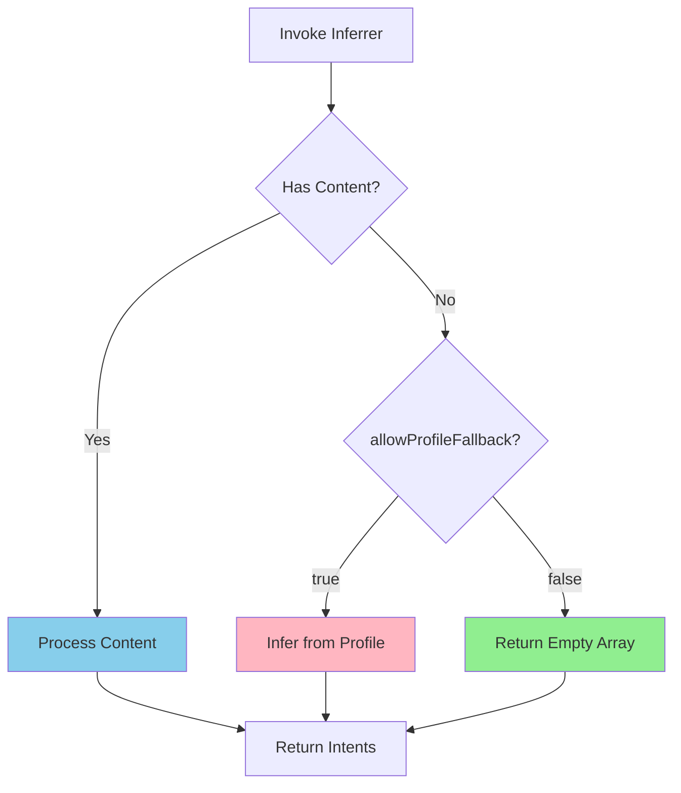

# Phase 3: Inferrer Modifications - Implementation Guide

**Status:** ✅ Complete  
**Date:** 2026-01-30  
**Version:** 1.0

---

## Overview

Phase 3 implements safety controls in the [`ExplicitIntentInferrer`](./explicit.inferrer.ts) to prevent unwanted profile-based intent generation during query operations. This is a critical safety layer in the intent graph read/write separation architecture.

## Problem Solved

**Before Phase 3:**
```typescript
// User asks: "what are my intents?"
// Router extracts: null content (correctly)
// Inferrer receives: null content
// Inferrer behavior: "No content? Let me infer from your profile!"
// Result: Creates 6 NEW intents from profile ❌
```

**After Phase 3:**
```typescript
// User asks: "what are my intents?"
// Inferrer receives: null content + { allowProfileFallback: false }
// Inferrer behavior: "No content and fallback disabled? Return empty array"
// Result: Returns [] (correct for query operation) ✅
```

---

## Changes Made

### 1. InferrerOptions Interface

Added new interface to control inferrer behavior:

```typescript
export interface InferrerOptions {
  /**
   * Whether to fallback to profile inference when content is empty.
   * - TRUE: For create operations without explicit content
   * - FALSE: For query operations (prevents auto-generation)
   * Default: true (backward compatible)
   */
  allowProfileFallback?: boolean;
  
  /**
   * The operation mode for context.
   * Helps inferrer understand the user's intent.
   */
  operationMode?: 'create' | 'update' | 'delete';
}
```

### 2. Updated Invoke Signature

```typescript
// Before
public async invoke(content: string | null, profileContext: string)

// After
public async invoke(
  content: string | null, 
  profileContext: string,
  options: InferrerOptions = {}  // Optional, defaults provided
)
```

### 3. Conditional Fallback Logic

```typescript
// Early exit when fallback is disabled and no content
if (!content && !allowProfileFallback) {
  log.info('[ExplicitIntentInferrer.invoke] No content and fallback disabled, returning empty');
  return { intents: [] };
}

// Build prompt based on fallback setting
const contentSection = content 
  ? `## New Content\n\n${content}`
  : allowProfileFallback
    ? '(No content provided. Please infer intents from Profile Narrative and Aspirations)'
    : '(No content to analyze. Return empty intents list.)';
```

### 4. Enhanced System Prompt

Updated prompt with:
- Clear rules about when to use profile vs when to return empty
- Operation context awareness
- Explicit instructions to not infer from profile for queries

### 5. Enhanced Logging

```typescript
log.info('[ExplicitIntentInferrer.invoke] Received input', { 
  contentPreview: content?.substring(0, 50),
  allowProfileFallback,
  operationMode
});

log.info(`[ExplicitIntentInferrer.invoke] Found ${output.intents.length} intents.`, {
  operationMode,
  allowedFallback: allowProfileFallback,
  usedFallback: !content && allowProfileFallback
});
```

### 6. Intent Graph Integration

Updated [`intent.graph.ts`](../../graphs/intent/intent.graph.ts) inference node:

```typescript
const inferenceNode = async (state: typeof IntentGraphState.State) => {
  const result = await inferrer.invoke(
    state.inputContent || null, 
    state.userProfile,
    {
      // Phase 3: Control profile fallback
      allowProfileFallback: !state.inputContent,
      operationMode: 'create'  // Default for backward compatibility
    }
  );
  
  return { inferredIntents: result.intents };
};
```

---

## Usage Examples

### Example 1: Query Operation (No Profile Fallback)

```typescript
const inferrer = new ExplicitIntentInferrer();

// User asks: "what are my intents?"
const result = await inferrer.invoke(
  null,  // No content extracted
  profileContext,
  {
    allowProfileFallback: false,  // Don't auto-generate from profile
    operationMode: 'create'
  }
);

// Result: { intents: [] }
```

### Example 2: Create Operation (With Profile Fallback)

```typescript
// User says: "I want to learn Rust"
const result = await inferrer.invoke(
  'I want to learn Rust programming',
  profileContext,
  {
    allowProfileFallback: true,  // Can fallback if needed
    operationMode: 'create'
  }
);

// Result: { intents: [{ type: 'goal', description: 'Learn Rust programming', ... }] }
```

### Example 3: Backward Compatible (Default Behavior)

```typescript
// No options provided - maintains existing behavior
const result = await inferrer.invoke(null, profileContext);

// Defaults to: { allowProfileFallback: true, operationMode: 'create' }
// Result: Infers from profile (backward compatible)
```

### Example 4: Update Operation

```typescript
// User says: "Change my ML goal to focus on NLP"
const result = await inferrer.invoke(
  'Change my ML goal to focus on NLP',
  profileContext,
  {
    allowProfileFallback: false,
    operationMode: 'update'
  }
);

// Result: Extracts modification intents from content
```

---

## Testing

### Running Tests

```bash
# Navigate to protocol directory
cd protocol

# Run Phase 3 tests
bun run src/lib/protocol/agents/intent/inferrer/test-inferrer-phase3.ts
```

### Test Coverage

The test file [`test-inferrer-phase3.ts`](./test-inferrer-phase3.ts) includes:

1. ✅ No content + fallback disabled → empty array
2. ✅ No content + fallback enabled → profile inference
3. ✅ Explicit content + fallback disabled → content inference
4. ✅ No options (backward compatibility)
5. ✅ Update operation mode
6. ✅ Phatic communication handling

---

## Backward Compatibility

### ✅ Fully Backward Compatible

All existing code continues working without modifications:

```typescript
// Old code (still works)
await inferrer.invoke(content, profile);

// New code (enhanced)
await inferrer.invoke(content, profile, { allowProfileFallback: false });
```

**Default Values:**
- `allowProfileFallback`: `true` (maintains current behavior)
- `operationMode`: `'create'` (safest default)

---

## How It Works

### Flow Diagram



### Decision Logic

```typescript
if (!content && !allowProfileFallback) {
  // Query operation: Don't create intents from profile
  return { intents: [] };
}

if (!content && allowProfileFallback) {
  // Create operation: Can infer from profile if no explicit content
  // Prompt LLM with: "infer from Profile Narrative"
}

if (content) {
  // Has explicit content: Process it regardless of fallback setting
  // Prompt LLM with: content
}
```

---

## Integration with Overall Architecture

### Phase 1: Router ✅
Router detects read vs write operations

### Phase 2: Chat Graph ✅
Fast paths bypass intent graph for queries

### Phase 3: Inferrer (Current) ✅
Prevents auto-generation from profile when inappropriate

### Phase 4: Intent Graph (Next)
Conditional flow based on operation mode

---

## Logging & Debugging

### Log Messages

**When fallback is disabled:**
```
[ExplicitIntentInferrer.invoke] No content and fallback disabled, returning empty
```

**Normal inference:**
```
[ExplicitIntentInferrer.invoke] Found 2 intents. {
  operationMode: 'create',
  allowedFallback: true,
  usedFallback: false
}
```

### Debugging Tips

1. **Check fallback setting:**
   ```typescript
   // Look for this in logs
   allowProfileFallback: false  // Should be false for queries
   ```

2. **Verify content presence:**
   ```typescript
   contentPreview: 'I want to learn...'  // Should have content for assertions
   ```

3. **Monitor operation mode:**
   ```typescript
   operationMode: 'create'  // Should match intent type
   ```

---

## Best Practices

### ✅ Do's

1. **Query Operations:** Always set `allowProfileFallback: false`
   ```typescript
   { allowProfileFallback: false, operationMode: 'create' }
   ```

2. **Create Operations:** Allow fallback when appropriate
   ```typescript
   { allowProfileFallback: true, operationMode: 'create' }
   ```

3. **Update Operations:** Disable fallback (need explicit content)
   ```typescript
   { allowProfileFallback: false, operationMode: 'update' }
   ```

### ❌ Don'ts

1. **Don't:** Enable fallback for query operations
2. **Don't:** Assume content will always be present
3. **Don't:** Mix operation modes (e.g., create with delete context)

---

## Known Limitations

### Current Scope (Phase 3)

- ✅ Inferrer respects `allowProfileFallback` flag
- ✅ System prompt includes operation context
- ✅ Backward compatible with existing code
- ⏳ Intent graph doesn't yet conditionally route based on mode (Phase 4)
- ⏳ Full operation mode integration pending (Phase 4)

### Future Enhancements (Phase 4)

- Add `operationMode` to intent graph state
- Conditional graph edges based on operation type
- Skip verification for existing intents
- Skip inference for delete operations

---

## Success Metrics

✅ **Achieved:**
- Empty content + fallback disabled → returns `[]`
- Empty content + fallback enabled → infers from profile
- Explicit content → always processes content
- Backward compatible (defaults maintain current behavior)
- Comprehensive logging for debugging

📊 **Expected Impact:**
- Prevents accidental intent creation during queries
- Maintains full functionality for create operations
- Adds safety layer before Phase 4 optimizations

---

## Related Files

- [`explicit.inferrer.ts`](./explicit.inferrer.ts) - Main implementation
- [`test-inferrer-phase3.ts`](./test-inferrer-phase3.ts) - Test suite
- [`intent.graph.ts`](../../graphs/intent/intent.graph.ts) - Integration point
- [`intent-graph-read-write-separation-architecture.md`](../../../../../plans/intent-graph-read-write-separation-architecture.md) - Overall architecture

---

## Changelog

### v1.0 (2026-01-30)
- ✅ Added `InferrerOptions` interface
- ✅ Updated `invoke` method with options parameter
- ✅ Implemented conditional fallback logic
- ✅ Enhanced system prompt with operation context
- ✅ Added comprehensive logging
- ✅ Updated intent graph integration
- ✅ Created test suite and documentation

---

## Support

For questions or issues:
1. Check test file for usage examples
2. Review architecture plan for context
3. Check logs for debugging information
4. Verify options are being passed correctly

**Status:** Phase 3 implementation complete and ready for Phase 4 integration.
