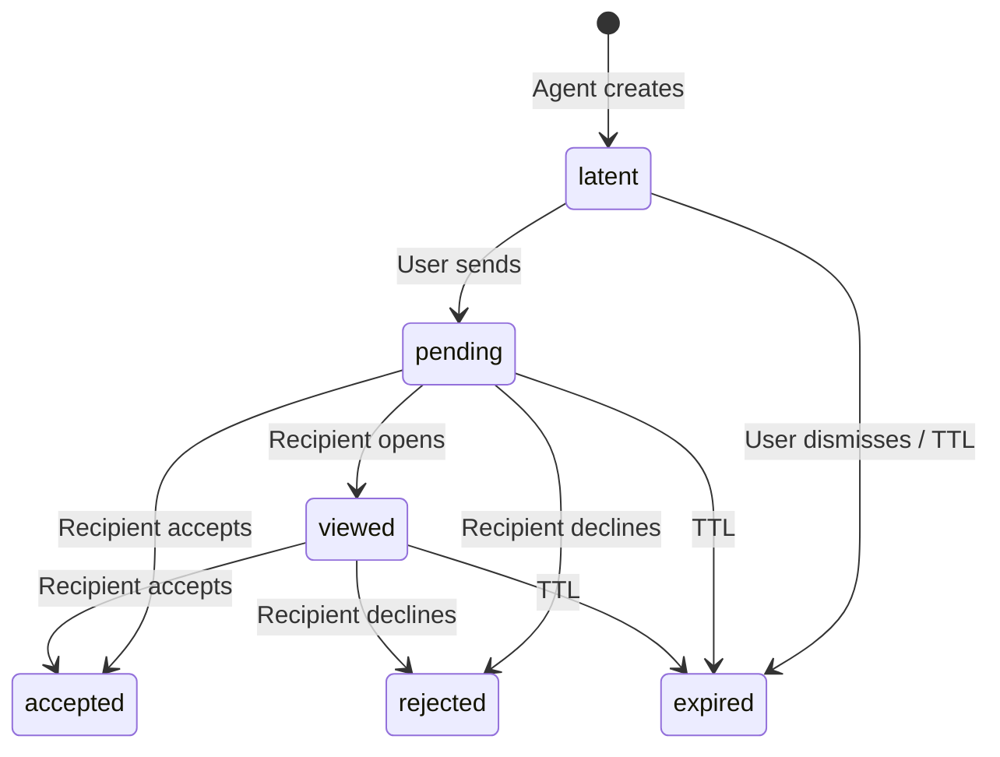
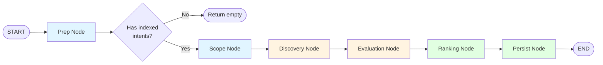
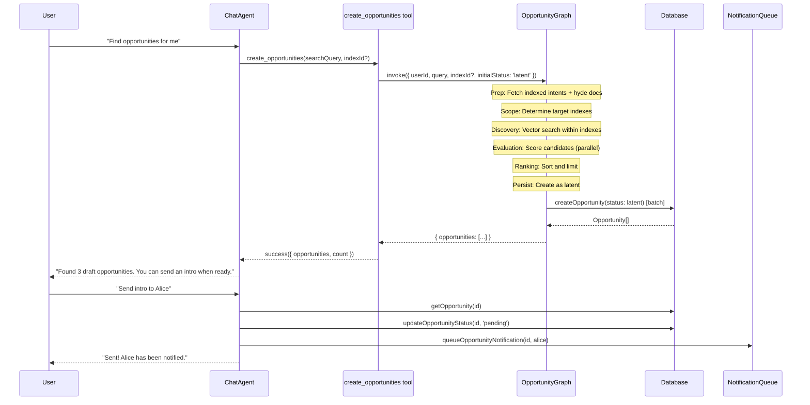
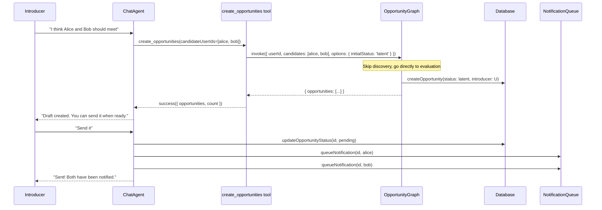

# Latent Opportunity Lifecycle

> **Status**: Design  
> **Related**: [Opportunity Graph README](../graphs/opportunity/README.md), [Chat Graph README](../graphs/chat/README.md), [Intent Graph](../graphs/intent/intent.graph.ts)

## Motivation

Users should not create opportunities directly. Instead, the agent discovers, evaluates, and presents opportunities — and the user chooses to act on them (send, dismiss, or explore). This requires a new lifecycle state where opportunities exist but have not yet been shared with the other party.

### Target Experience

```
User:  "Hey agent, find opportunities for me"
Agent: "Sure, let me look..."
       [Opportunity graph executes multi-step workflow]
       - Fetching your indexed intents with hyde documents
       - Determining which indexes to search within
       - Finding semantically similar intents from other members
       - Evaluating quality and relevance of each match
       - Ranking opportunities by confidence
       "Here are 3 draft opportunities. You can send an intro when ready."

User sees draft opportunities → chooses to send or dismiss.
```

## Concept: Latent State

A **latent** opportunity is one that has been created by the agent but not yet shared with the other party. It is only visible to the source user (the one who asked for discovery) or the introducer (the one who suggested two people should meet).

### Key Constraint: Index-Scoped Discovery

**Opportunities only exist between intents that share the same index.** Non-indexed intents cannot participate in opportunity discovery. This ensures:
- Privacy: Users control which indexes they join and what they share
- Relevance: Opportunities are contextually appropriate (index prompts guide matching)
- Scalability: Search space is bounded by index membership

### Lifecycle



| Status | Visible to source? | Visible to candidate? | Notifications? |
|--------|--------------------|-----------------------|----------------|
| latent | Yes | No | None |
| pending | Yes | Yes | Sent on transition from latent |
| viewed | Yes | Yes | None (already notified) |
| accepted | Yes | Yes | Confirmation to both |
| rejected | Yes | Yes | To source only |
| expired | Archive | Archive | None |

### Key Rules

1. **Agent creates, user sends.** The `create_opportunities` tool and `create_opportunity_between_members` tool both create opportunities in `latent` state. No notifications are sent at creation time.
2. **Explicit send.** A new `send_opportunity` tool (or UI action) promotes `latent` → `pending` and triggers notifications to the other party.
3. **No silent sharing.** An opportunity never reaches the candidate until the source/introducer explicitly sends it.

## Opportunity Graph Architecture

### Graph Structure (Linear Multi-Step Workflow)

Following the intent graph pattern, the opportunity graph performs a linear sequence of tasks:



**Linear Flow:**
```
Prep → Scope → Discovery → Evaluation → Ranking → Persist → END
```

**Node Responsibilities:**

1. **Prep Node**
   - Fetches user's active indexed intents with hyde documents
   - Retrieves user's index memberships
   - Validates that user has at least one indexed intent (requirement)
   - Returns empty result if no indexed intents (non-indexed intents cannot find opportunities)

2. **Scope Node**
   - Determines which indexes to search within
   - If `indexId` provided: searches only that index
   - Otherwise: searches all user's indexes
   - Builds list of target indexes with member counts

3. **Discovery Node**
   - For each target index, queries semantically similar intents using hyde documents
   - Uses vector similarity search on hyde embeddings (2000-dim)
   - Filters out user's own intents
   - Returns candidate pairs: (user intent, candidate intent, index)

4. **Evaluation Node** (Parallel Processing)
   - For each candidate pair, evaluates match quality
   - Uses OpportunityEvaluator agent (LLM-based scoring)
   - Considers: semantic relevance, complementarity, timing signals
   - Returns scored candidates with reasoning

5. **Ranking Node**
   - Sorts opportunities by confidence score
   - Applies limit (default: top 10)
   - Deduplicates by (sourceUser, candidateUser, index) tuple

6. **Persist Node**
   - Creates opportunities in database with `status: 'latent'`
   - No notifications sent (draft state)
   - Returns created opportunity IDs

### Conditional Routing

Unlike the intent graph, the opportunity graph has simpler routing:
- **All nodes execute sequentially** for discovery operations
- **Early termination** if prep finds no indexed intents (empty result, no error)
- Future: could add fast paths for "list existing opportunities" vs. "find new opportunities"

## Data Flow

### Discovery Flow (agent-driven)



### Future: Curator Flow (explicit member selection)

**Note**: The separate `create_opportunity_between_members` tool has been removed in favor of a unified approach. When curator mode is needed, it will be handled by extending `create_opportunities` with optional `candidateUserIds` parameter.



## Changes to Existing Components

### Opportunity Status Enum

Add `latent` as the first value in `opportunityStatusEnum`:

```typescript
export const opportunityStatusEnum = pgEnum('opportunity_status', [
  'latent', 'pending', 'viewed', 'accepted', 'rejected', 'expired'
]);
```

### Opportunity Graph

The `persistOpportunitiesNode` accepts an `initialStatus` option (defaults to `'pending'` for backward compatibility). When invoked from discovery, callers pass `initialStatus: 'latent'`.

### Chat Tools (CRUD Only)

**Design Principle**: Chat tools are simple CRUD operations. Complex multi-step logic lives in graphs. The chat agent's system prompt and tool descriptions guide the agent to handle complex user requests using these simple tools.

| Tool | Behavior | When Agent Uses It |
|------|----------|-------------------|
| `create_opportunities` | Invokes opportunity graph with user query and optional indexId. Graph handles all complexity (discovery or explicit candidates). Returns draft opportunities. | User says "find opportunities", "find me a mentor", "who needs help with X". Future: curator says "Alice and Bob should meet" (with candidate IDs) |
| `send_opportunity` | Promotes opportunity from `latent` → `pending`. Queues notifications to other party. Simple status update + notification. | User says "send intro to [name]", "send that opportunity", "notify Alice" |
| `list_my_opportunities` | Queries opportunities for user (all statuses). Simple read operation. | User says "show my opportunities", "what intros are pending" |

### Agent System Prompt Guidance

The chat agent's system prompt includes:

1. **Tool Usage Patterns**
   - "Use `create_opportunities` when user wants to find connections. Pass their query as `searchQuery` and optional `indexId`."
   - "After `create_opportunities`, tell user how many drafts were created and that they can send intros when ready."
   - "Use `send_opportunity` when user wants to notify someone. Requires `opportunityId` from prior listing."

2. **Explaining Constraints**
   - "Opportunities are only found between intents that share an index. If user has no indexed intents, explain they need to join an index first."
   - "Draft opportunities are only visible to the user who requested them until they send."

3. **Handling Complex Requests**
   - User: "Find me a React developer in the AI index"
     Agent: *Calls `create_opportunities(searchQuery="React developer", indexId="<ai-index-id>")`*
   - User: "Who can help me with fundraising?"
     Agent: *Calls `create_opportunities(searchQuery="help with fundraising")`* (searches all user's indexes)
   - User: "Send intro to Alice"
     Agent: *First calls `list_my_opportunities()` to find Alice's opportunity, then `send_opportunity(opportunityId=...)`*
   - Future - User: "I think Alice and Bob should meet"
     Agent: *Calls `create_opportunities(candidateUserIds=["<alice-id>", "<bob-id>"])`* (direct creation, skips discovery)

## Hyde Documents and Semantic Search

### Why Hyde?

Every intent has an associated **hyde document** (Hypothetical Document Embedding) that enriches the intent's semantic representation. Hyde documents are generated by the `HydeGenerator` agent and stored with 2000-dimensional embeddings.

**Benefits for Opportunity Discovery:**
1. **Richer semantic matching**: Hyde expands on the intent's core payload with contextual details
2. **Better cross-domain matching**: Finds complementary intents even with different vocabulary
3. **Query-driven search**: User's search query is also converted to hyde for more relevant results

### Index-Scoped Search

The discovery node performs vector similarity search with these constraints:

```sql
-- Conceptual query (actual implementation uses joins)
SELECT 
  candidate_intents.*,
  similarity(user_hyde_embedding, candidate_hyde_embedding) as score
FROM intents candidate_intents
JOIN intent_indexes ON candidate_intents.id = intent_indexes.intent_id
WHERE 
  intent_indexes.index_id IN (user's indexes)
  AND candidate_intents.user_id != requesting_user_id
  AND candidate_intents.hyde_document_id IS NOT NULL  -- Must have hyde
  AND similarity(user_hyde_embedding, candidate_hyde_embedding) > threshold
ORDER BY score DESC
LIMIT 50
```

**Key points:**
- Only searches within indexes the user has joined
- Requires both user intent and candidate intent to have hyde documents
- Uses vector similarity on hyde embeddings (not raw intent embeddings)

## Future Extensions

- **Timing signals**: Add temporal awareness to the evaluator (e.g. "this person just posted about looking for a co-founder").
- **Vouch checking**: Before presenting an opportunity, check if anyone in the index vouches for the candidate.
- **Batch send**: Allow sending multiple draft opportunities at once.
- **Auto-expire latent**: Cron job to expire latent opportunities after N days if not sent.
- **UI integration**: Frontend card view for draft opportunities with send/dismiss actions.
- **Fast path routing**: Add conditional routing to skip discovery if user only wants to list existing opportunities.
