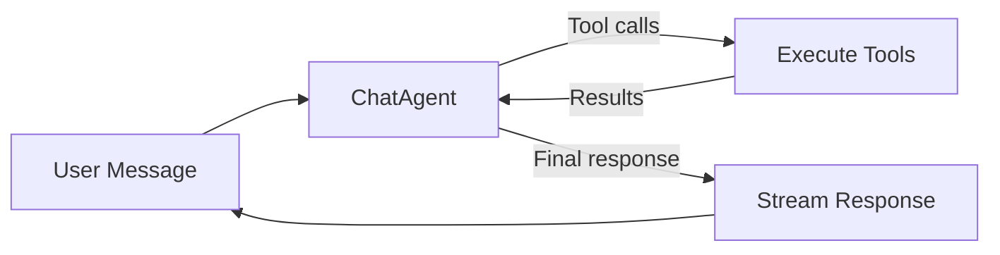
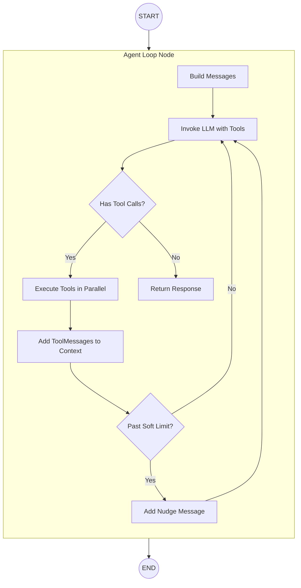
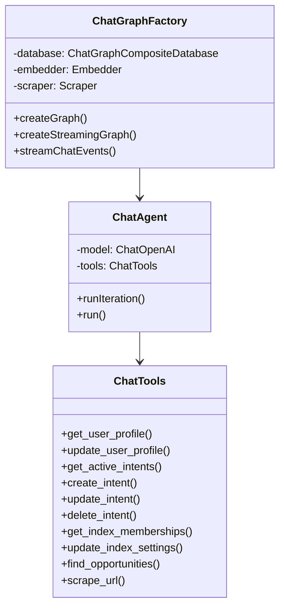
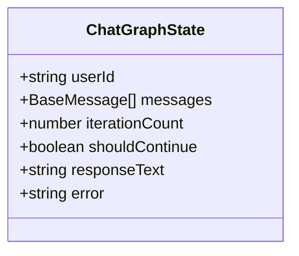
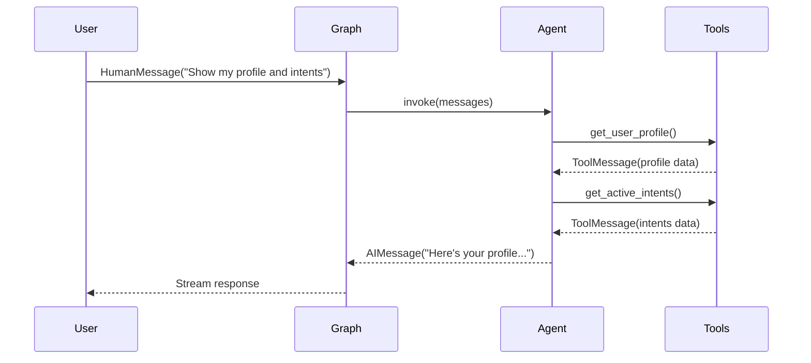
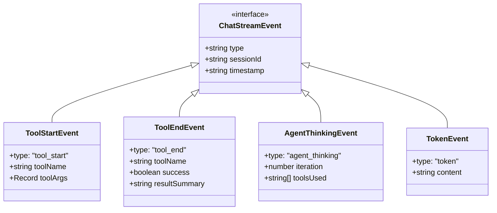

# Chat Graph Architecture

The Chat Graph is the primary orchestration layer for user conversations in the Index Network protocol. It uses a ReAct-style agent loop where an LLM calls tools iteratively until it decides to respond.

## Table of Contents

- [Overview](#overview)
- [Architecture](#architecture)
- [Agent Loop](#agent-loop)
- [Tools](#tools)
- [State Management](#state-management)
- [Streaming](#streaming)
- [File Structure](#file-structure)
- [Configuration](#configuration)
- [Migration from v1](#migration-from-v1)

---

## Overview

The Chat Graph implements a **ReAct-style agent loop**:

1. **Agent receives message**: User message plus conversation history
2. **Agent decides**: Call tools OR respond to user
3. **If tools called**: Execute tools, add results to context, loop back
4. **If response**: Stream final response to user



This replaces the previous 17-node conditional routing architecture with a flexible, LLM-driven approach that handles multi-step reasoning and self-correction naturally.

---

## Architecture

### High-Level Flow



### Key Components



---

## Agent Loop

### How It Works

The `ChatAgent` class implements the core loop:

```typescript
// Simplified flow
while (iterationCount < HARD_LIMIT) {
  const response = await model.invoke(messages);
  
  if (response.tool_calls?.length > 0) {
    // Execute tools, add results, continue loop
    const results = await executeTools(response.tool_calls);
    messages.push(response, ...results);
    iterationCount++;
  } else {
    // LLM chose to respond - we're done
    return response.content;
  }
}
```

### Iteration Limits

| Limit | Value | Behavior |
|-------|-------|----------|
| Soft Limit | 8 | Inject nudge message: "Please wrap up your response" |
| Hard Limit | 12 | Force exit with summary of what was accomplished |

### System Prompt

The agent receives a comprehensive system prompt that includes:
- Platform context (what Index Network does)
- Available tools and when to use them
- Guidelines for accuracy and efficiency
- Response formatting instructions
- Iteration awareness

---

## Tools

The agent has access to 10 tools, organized by domain:

### Profile Tools

| Tool | Purpose | When to Use |
|------|---------|-------------|
| `get_user_profile` | Fetch user's profile | "Show my profile", "What skills do I have?" |
| `update_user_profile` | Create/update profile | "Add Python to my skills", "Create my profile" |

### Intent Tools

| Tool | Purpose | When to Use |
|------|---------|-------------|
| `get_active_intents` | List user's goals/wants | "What are my intents?", "Show my goals" |
| `create_intent` | Create new intent | "I want to learn Rust", "Looking for a co-founder" |
| `update_intent` | Modify existing intent | "Change that goal to...", "Update my coding intent" |
| `delete_intent` | Remove an intent | "Delete that goal", "Remove my learning intent" |

### Index Tools

| Tool | Purpose | When to Use |
|------|---------|-------------|
| `get_index_memberships` | List communities | "What indexes am I in?", "Show my communities" |
| `update_index_settings` | Modify index (owner-only) | "Make my index private", "Update index description" |

### Discovery Tools

| Tool | Purpose | When to Use |
|------|---------|-------------|
| `find_opportunities` | Search for connections | "Find people interested in AI", "Who can help with ML?" |

### Utility Tools

| Tool | Purpose | When to Use |
|------|---------|-------------|
| `scrape_url` | Extract web content | "Read my LinkedIn", "Check this GitHub profile" |

### Tool Result Format

All tools return JSON with consistent structure:

```typescript
// Success
{ "success": true, "data": { ... } }

// Failure  
{ "success": false, "error": "Error message" }
```

---

## State Management

### ChatGraphState

The state is minimal compared to the previous architecture:



| Field | Type | Purpose |
|-------|------|---------|
| `userId` | string | Required for all operations |
| `messages` | BaseMessage[] | Conversation history including tool calls/results |
| `iterationCount` | number | Tracks loop progress for limits |
| `shouldContinue` | boolean | Control flag for loop exit |
| `responseText` | string | Final response when complete |
| `error` | string | Error message if something fails |

### Message Flow



---

## Streaming

### Event Types



### Event Flow Example

```
[status] Processing your message...
[tool_start] get_user_profile {}
[thinking] Checking your profile...
[tool_end] get_user_profile success "Profile: John Doe"
[tool_start] get_active_intents {}
[thinking] Fetching your intents...
[tool_end] get_active_intents success "3 intent(s) found"
[agent_thinking] iteration=1, tools=["get_user_profile", "get_active_intents"]
[status] Generating response...
[token] Here
[token] 's
[token]  your
[token]  profile
...
```

---

## File Structure

```
graphs/chat/
├── chat.graph.ts           # Factory class, single agent_loop node
├── chat.graph.state.ts     # Simplified state annotation
├── chat.agent.ts           # ChatAgent class with ReAct loop
├── chat.tools.ts           # 10 tool definitions
├── chat.utils.ts           # Token counting & truncation
├── chat.checkpointer.ts    # PostgreSQL state persistence
├── README.md               # This file
│
├── streaming/
│   ├── index.ts            # Barrel export
│   └── chat.streaming.ts   # Streaming service with tool events
│
├── nodes/                  # [DEPRECATED] Old node definitions
├── conditions/             # [DEPRECATED] Old routing conditions
└── REFACTORING_SUMMARY.md  # Migration notes
```

---

## Configuration

### Environment Variables

```bash
OPENROUTER_API_KEY=your-key
OPENROUTER_BASE_URL=https://openrouter.ai/api/v1
```

### Model Configuration

The agent uses `google/gemini-2.5-flash` via OpenRouter. To change:

```typescript
// In chat.agent.ts
this.model = new ChatOpenAI({
  model: 'your-preferred-model',
  configuration: {
    baseURL: process.env.OPENROUTER_BASE_URL,
    apiKey: process.env.OPENROUTER_API_KEY
  }
});
```

### Iteration Limits

```typescript
// In chat.agent.ts
export const SOFT_ITERATION_LIMIT = 8;
export const HARD_ITERATION_LIMIT = 12;
```

---

## Migration from v1

### What Changed

| v1 (Conditional Routing) | v2 (Agent Loop) |
|--------------------------|-----------------|
| 17 nodes with hardcoded conditions | 1 agent_loop node |
| Router decides once upfront | LLM decides iteratively |
| Fixed paths for each operation | Flexible multi-step reasoning |
| Prerequisites gate blocks requests | LLM handles missing data naturally |
| Orchestrator for chaining | Implicit chaining via tool calls |

### Deprecated Files

The following files are kept for reference but no longer used:

- `nodes/*.nodes.ts` - Old node definitions
- `conditions/chat.conditions.ts` - Old routing conditions

### Breaking Changes

1. **State shape changed**: `routingDecision`, `subgraphResults`, etc. removed
2. **Streaming events changed**: `routing`, `subgraph_start`, `subgraph_result` replaced with `tool_start`, `tool_end`, `agent_thinking`
3. **No fast paths**: All requests go through agent loop (by design)

---

## Usage Example

```typescript
import { ChatGraphFactory } from "./chat.graph";
import { PostgresSaver } from "@langchain/langgraph-checkpoint-postgres";

// Initialize
const chatGraph = new ChatGraphFactory(database, embedder, scraper);

// Stream with context
const checkpointer = PostgresSaver.fromConnString(process.env.DATABASE_URL);
await checkpointer.setup();

for await (const event of chatGraph.streamChatEventsWithContext(
  {
    userId: "user-123",
    message: "Show my profile and create an intent to learn Rust",
    sessionId: "session-456",
    maxContextMessages: 20
  },
  checkpointer
)) {
  switch (event.type) {
    case "tool_start":
      console.log(`Starting: ${event.toolName}`);
      break;
    case "tool_end":
      console.log(`Completed: ${event.toolName} (${event.success ? 'ok' : 'failed'})`);
      break;
    case "token":
      process.stdout.write(event.content);
      break;
    case "error":
      console.error(`Error: ${event.message}`);
      break;
  }
}
```

---

## Design Decisions

### Why Agent Loop?

1. **Flexibility**: LLM can handle any combination of requests without hardcoded paths
2. **Self-correction**: If something fails, LLM can retry or try alternatives
3. **Multi-step reasoning**: Natural support for "do X, then Y, then tell me Z"
4. **Simpler code**: 1 node vs 17 nodes, no conditional routing logic

### Why Soft + Hard Limits?

- **Soft limit (8)**: Nudges LLM to wrap up, but allows it to continue if needed
- **Hard limit (12)**: Prevents infinite loops or runaway costs, forces graceful exit

### Why No Fast Paths?

Previous architecture had fast paths for simple queries (e.g., "show my profile" bypassed LLM). We removed these because:

1. **Trust the LLM**: Modern LLMs are fast enough for simple queries
2. **Consistency**: All requests flow through the same path
3. **Flexibility**: LLM can decide to fetch multiple things if useful

### Safety Rails

Safety is enforced at the **tool level**, not the graph level:

- `update_index_settings` checks ownership before executing
- `delete_intent` validates the intent exists
- All tools return errors gracefully instead of throwing

---

## Related Documentation

- [Intent Graph Architecture](../intent/README.md)
- [Profile Graph Architecture](../profile/README.md)
- [Chat Streaming Types](../../../../types/chat-streaming.ts)
