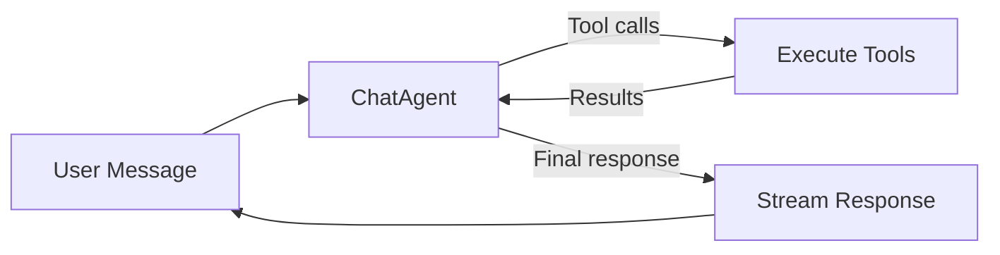
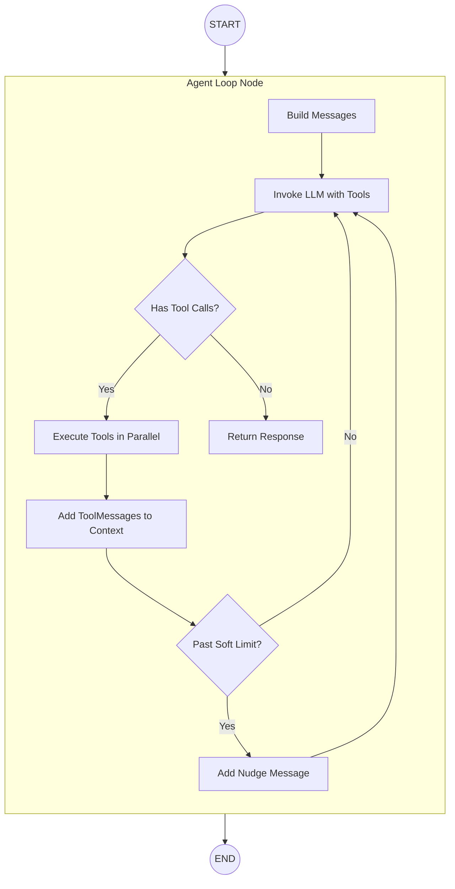
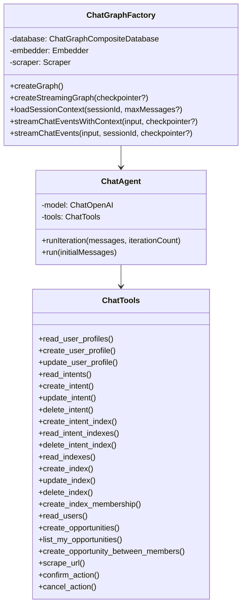
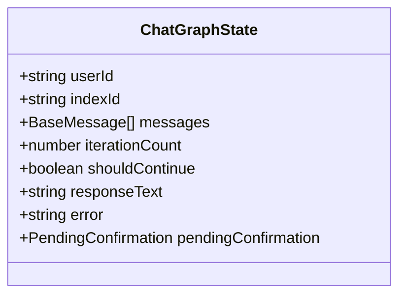
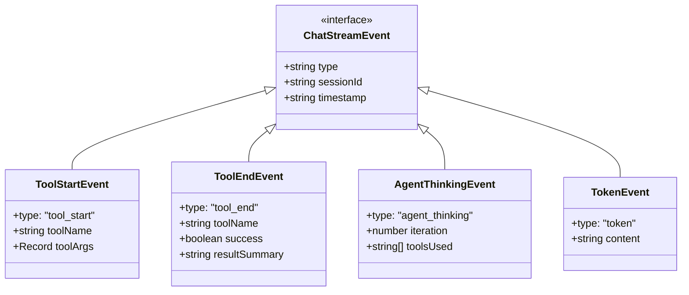

# Chat Graph Architecture

The Chat Graph is the primary orchestration layer for user conversations in the Index Network protocol. It uses a ReAct-style agent loop where an LLM calls tools iteratively until it decides to respond.

## Table of Contents

- [Overview](#overview)
- [Architecture](#architecture)
- [Agent Loop](#agent-loop)
- [Tools](#tools)
- [State Management](#state-management)
- [Streaming](#streaming)
- [File Structure](#file-structure)
- [Configuration](#configuration)
- [Migration from v1](#migration-from-v1)

---

## Overview

The Chat Graph implements a **ReAct-style agent loop**:

1. **Agent receives message**: User message plus conversation history
2. **Agent decides**: Call tools OR respond to user
3. **If tools called**: Execute tools, add results to context, loop back
4. **If response**: Stream final response to user



This replaces the previous 17-node conditional routing architecture with a flexible, LLM-driven approach that handles multi-step reasoning and self-correction naturally.

### Quick start: input and output

**Input** (when streaming with context):

| Field | Type | Description |
|-------|------|-------------|
| `userId` | string | Authenticated user ID (required) |
| `message` | string | User message (e.g. "Show my profile and create an intent to learn Rust") |
| `sessionId` | string | Chat session ID for loading history |
| `maxContextMessages?` | number | Max messages to load (default: 20) |
| `indexId?` | string | Optional index (community) ID to scope the conversation; persisted on the session and used as default for index-aware tools (Phase 3). |

**Output**: Async iterator of stream events: `tool_start`, `tool_end`, `agent_thinking`, `token`, `error`, `status`.

**Alternative** (invoke with raw messages, no session context):

- **Input**: `{ userId: string; messages: BaseMessage[] }` plus `sessionId` and optional checkpointer.
- **Output**: Same event stream; final response is in the streamed tokens.

---

## Architecture

### High-Level Flow



### Key Components



---

## Agent Loop

### How It Works

The `ChatAgent` class implements the core loop:

```typescript
// Simplified flow
while (iterationCount < HARD_LIMIT) {
  const response = await model.invoke(messages);
  
  if (response.tool_calls?.length > 0) {
    // Execute tools, add results, continue loop
    const results = await executeTools(response.tool_calls);
    messages.push(response, ...results);
    iterationCount++;
  } else {
    // LLM chose to respond - we're done
    return response.content;
  }
}
```

### Iteration Limits

| Limit | Value | Behavior |
|-------|-------|----------|
| Soft Limit | 8 | Inject nudge message: "Please wrap up your response" |
| Hard Limit | 12 | Force exit with summary of what was accomplished |

### System Prompt

The agent receives a comprehensive system prompt that includes:
- Platform context (what Index Network does)
- Available tools and when to use them
- Guidelines for accuracy and efficiency
- Response formatting instructions
- Iteration awareness

---

## Tools

The agent has access to 21 tools, organized by domain using CRUD naming. All index parameters use **`indexId` (UUID only)** — no name resolution. When the chat is **index-scoped** (initialized with `indexId` or loaded from a session with an index), index-aware tools use that index as the default when the agent omits the index argument (see [Index-Scoped Chat](#index-scoped-chat-phase-3)).

### Profile Tools

| Tool | Purpose | When to Use |
|------|---------|-------------|
| `read_user_profiles` | Fetch user's profile (includes `id` field) | "Show my profile", "What skills do I have?" |
| `create_user_profile` | Create a new profile (fails if one exists) | "Create my profile" |
| `update_user_profile` | Update an existing profile (requires `profileId` from `read_user_profiles`) | "Add Python to my skills" |

### Intent Tools

| Tool | Purpose | When to Use |
|------|---------|-------------|
| `read_intents` | List intents. Optional `indexId` (UUID) and `userId`. | "What are my intents?", "Show intents in this community". When user asks for "my intents" or "owner's intents", MUST pass `userId` (current user's id). When user asks for "all intents", omit `userId` (owner only). When index-scoped, omitting `indexId` uses the current index. Use for display (names, descriptions). |
| `create_intent` | Create new intent | "I want to learn Rust". Optional `indexId`; when index-scoped, omitting it uses the current index. |
| `update_intent` / `delete_intent` | Modify or remove an intent | When index-scoped, only intents in that index can be updated/deleted. Use exact `id` from `read_intents`. |

### Intent–Index Tools

These tools manage the intent–index junction (which intents are in which index). They work with IDs only; use `read_intents` and `read_indexes` to show intent and index names/descriptions. They respect index-scoped and user context.

| Tool | Purpose | When to Use |
|------|---------|-------------|
| `create_intent_index` | Save (link) an intent to an index | "Add this intent to Open Mock Network". Requires `intentId` from `read_intents` and `indexId` from `read_indexes`. |
| `read_intent_indexes` | List intent–index links in three modes | **(1) By index**: pass `indexId` (optional when index-scoped). Index **owner**: to list "my intents" or "owner's intents", MUST pass `userId` (current user); to list "all intents in the index", omit `userId`. **Member**: lists that user's intents in the index. **(2) By intent**: pass `intentId` to list all indexes that intent is in (caller must own the intent). **(3)** Index scope: when chat is index-scoped, `indexId` defaults to the current index. Use `read_indexes` and `read_intents` to display. |
| `delete_intent_index` | Remove an intent from an index | "Remove this intent from that community". Requires `intentId` and `indexId`. Does not delete the intent. |

### Index Tools

| Tool | Purpose | When to Use |
|------|---------|-------------|
| `read_indexes` | List the user's index memberships and owned indexes | When index-scoped, returns only the current index unless `showAll: true`. |
| `create_index` | Create a new index (community) | "Create a community for ML researchers" |
| `update_index` | Modify index settings (owner-only, confirmation required) | "Rename my community" |
| `delete_index` | Soft-delete an index (owner-only, confirmation required) | "Delete my community" |
| `create_index_membership` | Join an index or add a user to an index | "Join this community". Respects join policy. |
| `read_users` | List members of an index with userId, name, permissions, intentCount (requires `indexId` UUID) | "Who's in this community?" Returns userId for use in create_opportunity_between_members. |

### Discovery Tools

| Tool | Purpose | When to Use |
|------|---------|-------------|
| `create_opportunities` | Create draft opportunities by searching for connections | Results saved as drafts (latent); use send_opportunity to notify. When index-scoped, search is limited to that index. Optional `indexId` (UUID). |
| `list_my_opportunities` | List user's opportunities | When index-scoped, omit `indexId` to list only opportunities in that index. |
| `create_opportunity_between_members` | Create opportunity between two members | Requires `indexId` (UUID). |

### Confirmation Tools

| Tool | Purpose | When to Use |
|------|---------|-------------|
| `confirm_action` | Execute a pending update or delete after the user confirms | Called by the agent when the user confirms (e.g. "yes, delete it"). Requires `confirmationId` from the prior `needsConfirmation` response. |
| `cancel_action` | Cancel a pending update or delete | Called when the user declines (e.g. "no, keep it"). Requires `confirmationId`. |

Update and delete tools (`update_intent`, `delete_intent`, `update_user_profile`, `update_index`, `delete_index`) do **not** perform the action immediately. They set a **pending confirmation** in state and return `needsConfirmation`; the agent asks the user, then calls `confirm_action` or `cancel_action`.

### Utility Tools

| Tool | Purpose | When to Use |
|------|---------|-------------|
| `scrape_url` | Extract web content (optionally objective-aware) | "Read my LinkedIn", "Check this GitHub profile", "Create an intent from this repo link" |

**scrape_url** accepts an optional `objective` parameter. When the downstream use is known, pass it so the returned content is tailored:
- For **profile** (LinkedIn, GitHub, etc.): `objective: "User wants to update their profile from this page."`
- For **intent** (project/repo link to turn into an intent): `objective: "User wants to create an intent from this link (project/repo or similar)."`
- Omit for general research. The agent is prompted to use the appropriate objective when the user's goal is clear (see chat-revision Phase 1).

### Tool Result Format

All tools return JSON with consistent structure:

```typescript
// Success
{ "success": true, "data": { ... } }

// Failure
{ "success": false, "error": "Error message" }

// Confirmation required (update/delete tools)
{ "success": true, "needsConfirmation": true, "confirmationId": "...", "action": "update" | "delete", "resource": "...", "summary": "..." }

// Clarification required (create tools when required fields missing)
{ "success": false, "needsClarification": true, "missingFields": [...], "message": "..." }
```

### Index-Scoped Chat (Phase 3)

When the chat is started with an optional **`indexId`** (e.g. from an index/community page), that index is:

- Stored in **graph state** and passed to the agent as **tool context** (`context.indexId`).
- **Persisted on the chat session** so reconnecting to the same session keeps the scope; the request body can override it.
- Used as the **default** for index-aware tools when the agent omits the index argument: `create_intent`, `read_intents`, `create_opportunity_between_members`, `create_opportunities`, `list_my_opportunities`, `update_index`, `delete_index`.

**Tool behavior when index-scoped:**

- **`read_indexes`**: Returns only the current index membership (with a note). Use `showAll: true` when the user asks for "all my indexes".
- **`update_intent` / `delete_intent`**: Only intents that belong to the current index can be updated or deleted; otherwise the tool returns an error.
- **`read_intents`**: Primary tool for listing intents; accepts optional `indexId` (UUID). When user asks for "my intents" or "owner's intents", MUST pass `userId` with current user's id. When user asks for "all intents in the index", omit `userId` (owner only). When omitted and index-scoped, returns intents in the current index.

When no index is passed (and the session has none), behavior is unchanged (global scope).

---

## State Management

### ChatGraphState

The state is minimal compared to the previous architecture:



| Field | Type | Purpose |
|-------|------|---------|
| `userId` | string | Required for all operations |
| `indexId` | string \| undefined | Optional index scope for this run; passed to tools as default (Phase 3). |
| `messages` | BaseMessage[] | Conversation history including tool calls/results |
| `iterationCount` | number | Tracks loop progress for limits |
| `shouldContinue` | boolean | Control flag for loop exit |
| `responseText` | string | Final response when complete |
| `error` | string | Error message if something fails |
| `pendingConfirmation` | PendingConfirmation \| undefined | When set by an update/delete tool, the agent asks the user and then calls `confirm_action` or `cancel_action`; no destructive action runs until confirmation. |

### Message Flow


---

## Streaming

### Event Types



### Event Flow Example

```
[status] Processing your message...
[tool_start] read_user_profiles {}
[thinking] Checking your profile...
[tool_end] read_user_profiles success "Profile: John Doe"
[tool_start] read_intents {}
[thinking] Fetching your intents...
[tool_end] read_intents success "3 intent(s) found"
[agent_thinking] iteration=1, tools=["read_user_profiles", "read_intents"]
[status] Generating response...
[token] Here
[token] 's
[token]  your
[token]  profile
...
```

---

## File Structure

```
graphs/chat/
├── chat.graph.ts           # Factory class, single agent_loop node
├── chat.graph.state.ts     # Simplified state annotation
├── chat.agent.ts           # ChatAgent class with ReAct loop
├── chat.tools.ts           # Tool definitions (incl. confirm_action, cancel_action)
├── chat.utils.ts           # Token counting & truncation
├── chat.checkpointer.ts    # PostgreSQL state persistence
├── README.md               # This file
│
├── streaming/
│   ├── index.ts            # Barrel export
│   └── chat.streaming.ts   # Streaming service with tool events
│
├── nodes/                  # [DEPRECATED] Old node definitions (no longer used)
├── tests/                  # Factory, invoke, streaming specs
└── REFACTORING_SUMMARY.md  # Migration notes
```

### Source files: chat.graph.ts and chat.agent.ts

- **chat.graph.ts** — `ChatGraphFactory`: builds and compiles the chat graph. Constructor takes `ChatGraphCompositeDatabase`, `Embedder`, and `Scraper`. Public API: `createGraph()`, `createStreamingGraph(checkpointer?)`, `loadSessionContext(sessionId, maxMessages?)`, `streamChatEventsWithContext(input, checkpointer?)`, `streamChatEvents(input, sessionId, checkpointer?)`. The graph is a single path: START → `agent_loop` → END. The `agent_loop` node instantiates `ChatAgent` with the current state (`userId`, `indexId`, database, embedder, scraper), calls `agent.run(state.messages)`, and returns updated messages, `responseText`, and `iterationCount`.
- **chat.agent.ts** — `ChatAgent`: ReAct-style LLM agent with tool calling. Constructor takes `ToolContext` (userId, database, embedder, scraper, optional indexId). Uses `ChatOpenAI` (model: `google/gemini-2.5-flash` via OpenRouter) bound to tools from `createChatTools(context)`. Public API: `runIteration(messages, iterationCount)` returns `AgentIterationResult` (shouldContinue, toolCalls, toolResults, responseText, messages); `run(initialMessages)` runs the loop until the agent responds or `HARD_ITERATION_LIMIT` (12). Constants: `SOFT_ITERATION_LIMIT` (8), `HARD_ITERATION_LIMIT` (12), `CHAT_AGENT_SYSTEM_PROMPT`, `ITERATION_NUDGE`. Tool execution is internal (`executeToolCalls`); tools are defined in `chat.tools.ts`.

---

## Configuration

### Environment Variables

```bash
OPENROUTER_API_KEY=your-key
OPENROUTER_BASE_URL=https://openrouter.ai/api/v1
```

### Model Configuration

The agent uses `google/gemini-2.5-flash` via OpenRouter. To change:

```typescript
// In chat.agent.ts
this.model = new ChatOpenAI({
  model: 'your-preferred-model',
  configuration: {
    baseURL: process.env.OPENROUTER_BASE_URL,
    apiKey: process.env.OPENROUTER_API_KEY
  }
});
```

### Iteration Limits

```typescript
// In chat.agent.ts
export const SOFT_ITERATION_LIMIT = 8;
export const HARD_ITERATION_LIMIT = 12;
```

---

## Migration from v1

### What Changed

| v1 (Conditional Routing) | v2 (Agent Loop) |
|--------------------------|-----------------|
| 17 nodes with hardcoded conditions | 1 agent_loop node |
| Router decides once upfront | LLM decides iteratively |
| Fixed paths for each operation | Flexible multi-step reasoning |
| Prerequisites gate blocks requests | LLM handles missing data naturally |
| Orchestrator for chaining | Implicit chaining via tool calls |

### Deprecated Files

The following are kept for reference but no longer used:

- `nodes/*.nodes.ts` - Old node definitions (replaced by single agent_loop + tools)

### Breaking Changes

1. **State shape changed**: `routingDecision`, `subgraphResults`, etc. removed
2. **Streaming events changed**: `routing`, `subgraph_start`, `subgraph_result` replaced with `tool_start`, `tool_end`, `agent_thinking`
3. **No fast paths**: All requests go through agent loop (by design)

---

## Usage Example

```typescript
import { ChatGraphFactory } from "./chat.graph";
import { PostgresSaver } from "@langchain/langgraph-checkpoint-postgres";

// Initialize
const chatGraph = new ChatGraphFactory(database, embedder, scraper);

// Stream with context
const checkpointer = PostgresSaver.fromConnString(process.env.DATABASE_URL);
await checkpointer.setup();

for await (const event of chatGraph.streamChatEventsWithContext(
  {
    userId: "user-123",
    message: "Show my profile and create an intent to learn Rust",
    sessionId: "session-456",
    maxContextMessages: 20
  },
  checkpointer
)) {
  switch (event.type) {
    case "tool_start":
      console.log(`Starting: ${event.toolName}`);
      break;
    case "tool_end":
      console.log(`Completed: ${event.toolName} (${event.success ? 'ok' : 'failed'})`);
      break;
    case "token":
      process.stdout.write(event.content);
      break;
    case "error":
      console.error(`Error: ${event.message}`);
      break;
  }
}
```

---

## Design Decisions

### Why Agent Loop?

1. **Flexibility**: LLM can handle any combination of requests without hardcoded paths
2. **Self-correction**: If something fails, LLM can retry or try alternatives
3. **Multi-step reasoning**: Natural support for "do X, then Y, then tell me Z"
4. **Simpler code**: 1 node vs 17 nodes, no conditional routing logic

### Why Soft + Hard Limits?

- **Soft limit (8)**: Nudges LLM to wrap up, but allows it to continue if needed
- **Hard limit (12)**: Prevents infinite loops or runaway costs, forces graceful exit

### Why No Fast Paths?

Previous architecture had fast paths for simple queries (e.g., "show my profile" bypassed LLM). We removed these because:

1. **Trust the LLM**: Modern LLMs are fast enough for simple queries
2. **Consistency**: All requests flow through the same path
3. **Flexibility**: LLM can decide to fetch multiple things if useful

### Safety Rails

Safety is enforced at the **tool level**, not the graph level:

- **Confirmation**: Update and delete tools (`update_intent`, `delete_intent`, `update_user_profile`, `update_index`, `delete_index`) do not perform the action immediately. They set `pendingConfirmation` and return `needsConfirmation`; the agent asks the user, then the user confirms via `confirm_action` or cancels via `cancel_action`.
- **Clarification**: Create tools return `needsClarification` when required fields are missing so the agent can ask the user for the missing data.
- `update_index` (and other update/delete tools) validate ownership and resource existence before storing a pending confirmation; execution happens only in `confirm_action`.
- All tools return errors gracefully instead of throwing.

---

## Related Documentation

- [Intent Graph Architecture](../intent/README.md)
- [Profile Graph Architecture](../profile/README.md)
- [Chat Streaming Types](../../../../types/chat-streaming.types.ts)
