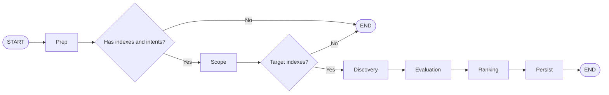

# Opportunity Graph

The Opportunity graph finds and persists **opportunities** (matches between a source user and candidates) using HyDE-based semantic search and an LLM evaluator. It follows a linear multi-step workflow similar to the Intent Graph.

**API:** The graph is built via **OpportunityGraphFactory**. Constructor injects `database`, `embedder`, and `hydeGenerator`. Public method: `createGraph()` returns the compiled runnable.

## Overview

**Flow:** Prep → Scope → Discovery → Evaluation → Ranking → Persist → END, with conditional early exit after Prep (no index memberships or no intents) and after Scope (no target indexes).



**Node responsibilities:**

1. **Prep** – Fetches user's index memberships (`getUserIndexIds`) and active intents (`getActiveIntents`). If the user has no index memberships or no active intents, returns an error and the graph ends early (no HyDE or search).
2. **Scope** – Determines which indexes to search. If `indexId` is provided and the user is a member, searches only that index; otherwise searches all of the user's indexes. Builds `targetIndexes` with title and member count.
3. **Discovery** – Generates HyDE embeddings from the search query (via `hydeGenerator.invoke`), then runs `embedder.searchWithHydeEmbeddings` within the target index scope. Only **intent** matches (not profile-only) are kept. Results become `candidates` (CandidateMatch[]).
4. **Evaluation** – For each candidate, fetches source and candidate profiles, then runs **OpportunityEvaluator** to score and summarize matches. Output is `evaluatedCandidates` (score, descriptions, valency role).
5. **Ranking** – Sorts by score descending, applies `options.limit`, and deduplicates by (sourceUser, candidateUser, index).
6. **Persist** – Creates opportunity records via `database.createOpportunity` with `status` from `options.initialStatus` (default `'pending'`; use `'latent'` for draft opportunities). No notifications are sent at creation time.

## Index-scoped search and HyDE

Opportunities are only found between intents that **share the same index**. Non-indexed intents cannot participate. Discovery uses **HyDE** (Hypothetical Document Embeddings) for semantic search: the user's search query is turned into embeddings, and the embedder finds similar intents within the target indexes. Both the source and candidate sides rely on intent (and hyde) data; the graph does not accept pre-filled candidates as input—it always runs prep → scope → discovery → evaluation → ranking → persist.

For the latent opportunity lifecycle (draft → send → pending), see [Latent Opportunity Lifecycle](../docs/Latent%20Opportunity%20Lifecycle.md).

## Dependencies

- **database**: `OpportunityGraphDatabase` — `getUserIndexIds`, `getActiveIntents`, `getIndex`, `getIndexMemberCount`, `getProfile`, `createOpportunity`, `opportunityExistsBetweenActors`
- **embedder**: `Embedder` with `searchWithHydeEmbeddings(embeddingsMap, options)` (options include `strategies`, `indexScope`, `excludeUserId`, `limit`, `minScore`)
- **hydeGenerator**: Object with `invoke(input: { sourceType: 'query', sourceText, strategies, context? })` returning `Promise<{ hydeEmbeddings: Record<string, number[]> }>`

## Input

Invoke the compiled graph with (see `OpportunityGraphState` in `opportunity.graph.state.ts`):

| Field | Type | Required | Description |
|-------|------|----------|-------------|
| `userId` | string | Yes | User to find opportunities for |
| `searchQuery` | string | No | Ad-hoc query for HyDE and discovery (e.g. "Find a React developer") |
| `indexId` | string | No | If set, search only this index (user must be a member) |
| `options` | object | No | `initialStatus`, `limit`, `minScore`, `strategies`, `hydeDescription` |

If `indexId` is omitted, the graph searches all indexes the user belongs to (from Prep).

## Output

State after `invoke` (same shape with channels updated):

| Field | Type | Description |
|-------|------|-------------|
| `opportunities` | `Opportunity[]` | Persisted opportunities (detection, actors, interpretation, context, status) |
| `error` | string | Set if prep/scope/discovery/evaluation/persist fails or early-exits |
| `candidates` | `CandidateMatch[]` | Candidates from discovery (intent matches) |
| `evaluatedCandidates` | `EvaluatedCandidate[]` | After evaluation node |
| `targetIndexes` | `TargetIndex[]` | After scope node |
| `userIndexes` | `Id<'indexes'>[]` | After prep node |

Each **Opportunity** includes `actors` (source + candidate with roles), `interpretation` (summary, confidence, signals), `context` (indexId, triggeringIntentId), `detection` (source, createdBy, triggeredBy, timestamp), and `status` (e.g. `latent`, `pending`).

## Usage examples

### Discovery from chat (latent drafts)

```typescript
import { OpportunityGraphFactory } from './opportunity.graph';
import { HydeGraphFactory } from '../hyde/hyde.graph';

const compiledHydeGraph = new HydeGraphFactory(hydeDb, embedder, hydeCache, hydeGenerator).createGraph();
const factory = new OpportunityGraphFactory(database, embedder, compiledHydeGraph);
const graph = factory.createGraph();

const result = await graph.invoke({
  userId: currentUserId,
  searchQuery: 'Looking for AI/ML engineers',
  indexId: optionalIndexId,
  options: { initialStatus: 'latent', limit: 5 },
});

// result.opportunities → Opportunity[] (drafts)
// result.error → set if no indexes/intents or failure
```

### Scoped to one index

```typescript
const result = await graph.invoke({
  userId: user.id,
  searchQuery: 'Find a technical co-founder',
  indexId: 'index-uuid-here',
  options: { limit: 10, initialStatus: 'latent' },
});
```

### All user indexes (omit indexId)

```typescript
const result = await graph.invoke({
  userId: user.id,
  searchQuery: 'Who needs help with fundraising?',
  options: { limit: 5 },
});
```

## File structure

```
graphs/opportunity/
├── opportunity.graph.ts        # OpportunityGraphFactory, createGraph(), six nodes
├── opportunity.graph.state.ts  # OpportunityGraphState annotation, types
├── opportunity.utils.ts        # selectStrategies, deriveRolesFromStrategy
├── opportunity.utils.spec.ts
├── opportunity.graph.spec.ts
├── opportunity.state.ts        # Legacy state (other consumers)
├── OPPORTUNITY-GRAPH-LLM-AGENTS.md
└── README.md                   # This file
```

### opportunity.graph.ts

- **OpportunityGraphFactory**: constructor(database, embedder, hydeGenerator, optionalEvaluator?). Public method: `createGraph()` — builds a `StateGraph` with six nodes and conditional edges, returns the compiled graph.
- **Nodes**: `prep`, `scope`, `discovery`, `evaluation`, `ranking`, `persist`.
- **Conditional routing**: After `prep`, if `error` or no `indexedIntents` → END. After `scope`, if `error` or no `targetIndexes` → END. Otherwise linear: discovery → evaluation → ranking → persist → END.

## Related

- [Latent Opportunity Lifecycle](../docs/Latent%20Opportunity%20Lifecycle.md) — lifecycle (latent → pending), constraints, chat tools
- **HyDE graph**: Used to produce query embeddings; see [hyde/README.md](../hyde/README.md).
- **OpportunityEvaluator**: `agents/opportunity/opportunity.evaluator.ts`
- **Opportunity controller**: `src/controllers/opportunity.controller.ts`
